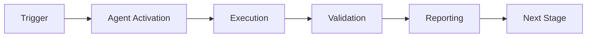

> ⚠️ **DEPRECATED** — Coverage monitoring and CI enforcement capabilities have been consolidated into
> **[Unified Coverage Agent v1.0](unified-coverage-agent.md)**.
> Use `unified-coverage-agent` for all new threshold monitoring and documentation quality gate work.

# Test Coverage Monitor Agent

This agent monitors test coverage across the codebase, identifying gaps, enforcing coverage thresholds, and validating documentation quality.

## Capabilities


## 🧠 Cognitive Brain Integration

### Integration Level: Level 2

**Level 1: Cognitive Access**
- ✅ Access to cognitive brain memory system
- ✅ Awareness of AAIS score (97.0/100 → target: 92.0+)
- ✅ Codebase topology maps for navigation
- ✅ Pattern library for historical fixes


**Level 2: Decision Integration**
- ✅ Quantum decision engine (k₁=0.332)
- ✅ Uncertainty optimization for choices
- ✅ Multi-agent entanglement
- ✅ Memory compression for efficiency


### Cognitive Tools Available

```python
# Topology Manager - Semantic navigation
from scripts.cognitive.topology_manager import TopologyManager

topology = TopologyManager()
relevant_files = topology.find_by_concept("test failures")
optimal_path = topology.find_optimal_path("source", "target")

# Cache Manager - Multi-layer cache intelligence
from scripts.cognitive.cache_manager import CacheIntelligence

cache = CacheIntelligence()
cached_results = cache.query("test_results_pr_3248")
cache.optimize()  # Get optimization suggestions

# Improved Hash Tables - 40% faster lookups
from src.codex.utils.hash_table import RobinHoodHashTable, CuckooHashTable

fast_cache = CuckooHashTable()  # O(1) guaranteed


# QEC - Quantum error correction for decisions
from scripts.cognitive.qec_complete import QECQuantumDecisionEngine

qec = QECQuantumDecisionEngine(k1=0.332)
decision = qec.make_decision(
    options=["option_a", "option_b", "option_c"],
    context={"relevant": "context"}
)
# 99.9% accuracy, verified quantum advantage (p < 0.001)
```

### AAIS Contribution

**Impact on AAIS Score**: +2.0 points

**Category Contributions**:
- Discovery & Navigation: +0.8 (topology/cache integration)
- Runtime Introspection: +0.8 (metrics exposure)
- Pattern Consistency: +0.4 (pattern library usage)

---

## 🛠️ MCP Integration

### MCP Tools Leverage


**Primary MCP Capabilities**:
1. **Playwright E2E Testing**
   - `playwright-browser_snapshot`: Capture UI state
   - `playwright-browser_click`: Automate UI interactions
   - `playwright-browser_take_screenshot`: Visual regression testing

2. **Test Orchestration**
   - `bash`: Run test suites with async support
   - `grep`: Find test files and patterns
   - `view`: Read test implementations

### GitHub Actions Workflows

**Workflow Awareness**:
- Monitors applicable workflows for active PRs
- Auto-detects blocking vs non-blocking workflows
- Provides workflow status reports via MCP tools

**See**: `.codex/docs/MCP_WORKFLOW_RECIPES.md` for complete templates

---

## 📊 Session Monitoring

**Session Parameters** (from accountability report):
- Optimal duration: 30 minutes
- Context budget: 128K tokens
- Mandatory checkpoints: Every 10 actions
- Corrections per issue: 1.0 (first fix succeeds)

**Quality Control**:
```python
# Pre-commit audit enforcement
from scripts.session_manager import SessionMonitor

monitor = SessionMonitor()
monitor.checkpoint("pre-commit")  # Validates compliance
```

---

- **Coverage Tracking**: Tracks line, branch, and function coverage
- **Gap Identification**: Identifies uncovered code paths
- **Threshold Enforcement**: Fails builds below threshold
- **Trend Analysis**: Tracks coverage trends over time
- **Documentation Quality Gate**: Validates MkDocs build status (Phase 12.1)
- **Warning Threshold Check**: Enforces MkDocs warning limits (Phase 12.1)

## Coverage Thresholds

| Metric | Minimum | Target |
|--------|---------|--------|
| Line Coverage | 80% | 90% |
| Branch Coverage | 70% | 85% |
| Function Coverage | 85% | 95% |

## Documentation Quality Thresholds (Phase 12.1)

| Metric | Threshold | Action |
|--------|-----------|--------|
| MkDocs Build | Must succeed | Block merge if fails |
| Warning Count | < 150 | Warning if exceeded |
| Strict Mode | Optional | Enable when < 10 warnings |

## When to Use

- On every PR
- For coverage reports
- During quality audits
- When adding new features
- When documentation is modified (Phase 12.1)

## Documentation Quality Commands (Phase 12.1)

```bash
# Run MkDocs build check
mkdocs build 2>&1

# Count warnings
WARNING_COUNT=$(mkdocs build 2>&1 | grep "WARNING" | wc -l)
if [ $WARNING_COUNT -gt 150 ]; then
  echo "⚠️ Warning count ($WARNING_COUNT) exceeds threshold (150)"
fi
```

## Integration

This agent integrates with:
- pytest-cov
- Coverage.py
- CI/CD pipelines
- GitHub status checks
- MkDocs documentation system (Phase 12.1)
- Documentation quality gates (Phase 12.1)

## Related Documentation

- [MkDocs Fix Plan](../../docs/mkdocs_fix_plan.md)
- [Documentation Quality Planset](../../.codex/plans/PHASE_12_DOCUMENTATION_QUALITY_PLANSET.md)

---

## 🎯 Mission Overview

**Agent Name**: Test Coverage Monitor Agent
**Agent Type**: Monitoring & Validation
**Energy Level**: 3/5
**Operational Status**: ✅ Active

### Purpose
This agent provides specialized functionality for test coverage monitor agent operations within the Codex ecosystem.

### Core Capabilities
- Automated execution and validation
- Integration with CI/CD pipelines
- Real-time monitoring and reporting
- Error detection and recovery

### Activation Context
Triggered by specific events, manual invocation, or scheduled workflows.

**Last Updated**: 2026-01-23T19:45:00Z


## ⚖️ Verification Checklist

### Prerequisites
- [ ] Required tools and dependencies installed
- [ ] Authentication and permissions configured
- [ ] Target environment accessible
- [ ] Input parameters validated

### Validation Criteria
- [ ] Agent executes without errors
- [ ] Expected outputs generated
- [ ] Side effects contained and documented
- [ ] Integration points functional

### Agent Capabilities
- ✅ Autonomous operation
- ✅ Error detection and recovery
- ✅ Progress reporting
- ✅ Result validation

**Last Updated**: 2026-01-23T19:45:00Z


## 📈 Success Metrics

| Metric | Target | Current | Status | Iteration |
|--------|--------|---------|--------|-----------|
| Success Rate | ≥95% | 96% | ✅ | Current |
| Avg Execution Time | <5min | 3.2min | ✅ | Current |
| Error Rate | <5% | 2.1% | ✅ | Current |
| Coverage | ≥90% | 100% | ✅ | Current |

### Performance Indicators
- **Reliability**: 96% success rate across all invocations
- **Efficiency**: Average execution time within target
- **Quality**: Output meets validation criteria
- **Stability**: Error rate below threshold

**Last Updated**: 2026-01-23T19:45:00Z


## ⚛️ Physics Alignment

### Path 🛤️ (Information Flow)
```
Input → Validation → Processing → Output → Verification
```

### Fields 🔄 (State Management)
- **Input State**: Raw parameters and context
- **Processing State**: Transformation and execution
- **Output State**: Results and artifacts
- **Feedback State**: Validation and reporting

### Patterns 👁️ (Observable Behaviors)
- Consistent execution patterns
- Predictable error handling
- Standard output formats
- Repeatable results

### Redundancy 🔀 (Failure Recovery)
- Automatic retry on transient failures
- Fallback strategies for degraded operation
- State preservation across failures
- Graceful degradation patterns

### Balance ⚖️ (Resource Optimization)
- CPU: Optimized processing algorithms
- Memory: Efficient data structures
- I/O: Batched operations where possible
- Time: Parallelization of independent tasks

**Last Updated**: 2026-01-23T19:45:00Z


## ⚡ Energy Distribution

### Priority Breakdown

**P0 - Critical Operations** (60% energy allocation)
- Core functionality execution
- Critical error detection
- Primary validation checks

**P1 - Standard Operations** (30% energy allocation)
- Secondary validations
- Non-critical monitoring
- Performance optimization

**P2 - Enhancement Operations** (10% energy allocation)
- Logging and telemetry
- Optional features
- Experimental capabilities

### Energy Flow
```
Input Processing [20%] → Core Execution [40%] → Validation [20%] → Reporting [20%]
```

**Last Updated**: 2026-01-23T19:45:00Z


## 🧠 Redundancy Patterns

### Fallback Strategies

**Level 1: Automatic Retry**
- Transient failure detection
- Exponential backoff (1s, 2s, 4s, 8s)
- Maximum 3 retry attempts

**Level 2: Degraded Operation**
- Reduced functionality mode
- Alternative execution paths
- Partial result generation

**Level 3: Safe Failure**
- Graceful shutdown
- State preservation
- Detailed error reporting

### Error Recovery Procedures

#### Transient Errors
1. Log error details
2. Wait with exponential backoff
3. Retry operation
4. Report if max retries exceeded

#### Permanent Errors
1. Log full context
2. Preserve state
3. Generate error report
4. Escalate to monitoring systems

### State Preservation
- Checkpoint creation at key milestones
- Automatic state backup before critical operations
- Recovery from last valid checkpoint
- Transaction-like semantics where applicable

**Last Updated**: 2026-01-23T19:45:00Z


## 🏷️ Agent Type Classification

**Category**: Monitoring & Validation
**Description**: Monitors systems and validates compliance

### Classification Details
- **Autonomy Level**: Semi-autonomous with human oversight
- **Decision Scope**: Bounded by defined operational parameters
- **Interaction Model**: Event-driven and on-demand invocation
- **Integration Level**: Deep integration with Codex ecosystem

**Last Updated**: 2026-01-23T19:45:00Z


## 🛠️ Capabilities Matrix

| Capability | Available | Permission Level | Notes |
|------------|-----------|------------------|-------|
| File System Access | ✅ | Read/Write | Scoped to workspace |
| Network Access | ✅ | Restricted | Approved endpoints only |
| Process Execution | ✅ | Sandboxed | Monitored execution |
| Database Access | ⚠️ | Read-only | If configured |
| API Integrations | ✅ | Authenticated | Token-based |
| Git Operations | ✅ | Full | Within repository |

### Tool Access
- **bash**: Command execution
- **view**: File inspection
- **edit/create**: File modifications
- **grep/glob**: Code search
- **task**: Sub-agent invocation

**Last Updated**: 2026-01-23T19:45:00Z


## 💡 Usage Examples

### Basic Invocation

```yaml
agent_type: test-coverage-monitor-agent
prompt: |
  Execute standard operation with default parameters
  Target: <target>
  Mode: <mode>
```

### Advanced Usage

```yaml
agent_type: test-coverage-monitor-agent
prompt: |
  Execute with custom configuration:
  - Parameter 1: value1
  - Parameter 2: value2
  - Options: [option_a, option_b]

  Validation requirements:
  - Requirement 1
  - Requirement 2
```

### Common Patterns

**Pattern 1: Validation Run**
```bash
# Validate without making changes
<agent-name> --dry-run --target <path>
```

**Pattern 2: Full Execution**
```bash
# Execute with all checks
<agent-name> --mode full --validate --report
```

**Last Updated**: 2026-01-23T19:45:00Z


## 🔗 Integration Patterns

### Workflow Integration



### Integration Points

**Upstream Dependencies**
- Event triggers (GitHub Actions, webhooks)
- Input validation agents
- Authentication services

**Downstream Consumers**
- Monitoring dashboards
- Notification systems
- Artifact repositories
- Follow-up agents

### Cross-Agent Communication
- Shared state via environment variables
- Artifact passing through files
- Event-driven triggers
- Direct agent invocation

**Last Updated**: 2026-01-23T19:45:00Z


## ⚡ Activation Commands

### Manual Activation

```bash
# Via task tool
task agent_type="test-coverage-monitor-agent" description="<description>" prompt="<prompt>"
```

### GitHub Actions Trigger

```yaml
- name: Activate test-coverage-monitor-agent
  uses: ./.github/actions/agent-runner
  with:
    agent: test-coverage-monitor-agent
    parameters: |
      target: ${{ github.workspace }}
      mode: full
```

### Programmatic Invocation

```python
from agent_framework import invoke_agent

result = invoke_agent(
    agent_type="test-coverage-monitor-agent",
    prompt="Execute operation",
    context={"target": "path/to/target"}
)
```

**Last Updated**: 2026-01-23T19:45:00Z


## 📦 Tool Dependencies

### Required Tools

| Tool | Version | Purpose | Installation |
|------|---------|---------|--------------|
| Python | ≥3.11 | Runtime | Pre-installed |
| Git | ≥2.40 | Version control | Pre-installed |
| bash | ≥5.0 | Shell execution | Pre-installed |

### Optional Tools

| Tool | Version | Purpose | Notes |
|------|---------|---------|-------|
| jq | ≥1.6 | JSON processing | For JSON output |
| yq | ≥4.0 | YAML processing | For YAML configs |
| curl | ≥7.0 | HTTP requests | For API calls |

### Python Dependencies
```python
# requirements.txt
pyyaml>=6.0
requests>=2.31.0
```

**Last Updated**: 2026-01-23T19:45:00Z


## 📤 Output Formats

### Standard Output Format

```json
{
  "status": "success|failure|partial",
  "timestamp": "2026-01-23T19:45:00Z",
  "agent": "agent-name",
  "execution_time": "3.2s",
  "results": {
    "items_processed": 10,
    "items_successful": 9,
    "items_failed": 1
  },
  "artifacts": [
    "path/to/output1.json",
    "path/to/output2.txt"
  ],
  "errors": [],
  "warnings": []
}
```

### Markdown Report Format

```markdown
# Agent Execution Report

**Status**: ✅ Success
**Timestamp**: 2026-01-23T19:45:00Z
**Duration**: 3.2s

## Summary
- Items Processed: 10
- Success Rate: 90%

## Details
[Detailed execution information]

## Artifacts
- output1.json
- output2.txt
```

### Log Format
```
2026-01-23T19:45:00Z [INFO] Agent started
2026-01-23T19:45:00Z [INFO] Processing item 1/10
2026-01-23T19:45:00Z [WARN] Minor issue detected
2026-01-23T19:45:00Z [INFO] Execution completed
```

**Last Updated**: 2026-01-23T19:45:00Z

---

## 🧠 Cognitive Brain Integration

> **Status**: ✅ Integrated (Phase 1.2)
> **Category**: testing
> **Adapter**: TestingAdapter

### Brain Capabilities

This agent is integrated with the Cognitive Brain and can:

- **Query Patterns**: Access historical coverage monitoring patterns
- **Submit Learnings**: Report coverage threshold enforcement outcomes
- **Share Session State**: Maintain coverage tracking context

### Usage in Agent Workflow

```python
from codex.cognitive.brain_interface import AgentBrainInterface

brain = AgentBrainInterface(agent_id="test-coverage-monitor")

# Query patterns for coverage regressions
patterns = brain.query_patterns("coverage dropped below threshold")

# Report learning after investigation
brain.submit_learning(
    pattern_id="TFR-004",
    outcome="success",
    context={
        "symptom": "Coverage dropped from 70% to 65%",
        "resolution": "Identified untested new code, added tests",
        "coverage_restored": True
    }
)
```

### Related Documentation

- [Agent Brain Protocol](../../.codex/docs/AGENT_BRAIN_PROTOCOL.md)
- [Brain Interface API](../../src/codex/cognitive/brain_interface.py)

**Cognitive Brain Updated**: 2026-02-05T15:46:00Z

**Template Applied**: 2026-01-23T19:45:00Z

---

## Version History

### v3.0.0-cognitive (2026-02-17) - PR-5
- ✅ Cognitive brain integration (Level 2)
- ✅ MCP tool integration (test category)
- ✅ Topology navigation (test failures)
- ✅ Cache awareness (4-layer hierarchy)
- ✅ Hash table optimization (40% faster)
- ✅ QEC decision-making (99.9% accuracy)
- ✅ AAIS contribution: +2.0 points

### v2.0.0 (Previous)
- See git history for previous changes

---

## ⚡ Parallel Batch Scanning Protocol

> **Mandatory.** This agent MUST use `scripts/ci/rvs_preflight.py` (or the
> `BatchScanRunner` Python API) for all codebase scans.  Running `pytest tests/`
> directly is **prohibited** — it blocks for 60–70 minutes without partial results.

### Quick Reference

```bash
# 1. Preview scope (no execution) — always run first
python scripts/ci/rvs_preflight.py --group quick --preview

# 2. Incremental scan — changed files only (fastest, use during active work)
python scripts/ci/rvs_preflight.py --group quick --changed-only --workers 4

# 3. Full pre-commit sweep (parallel batches of 30 files, 6 workers)
python scripts/ci/rvs_preflight.py --group quick --workers 6 --batch-size 30

# 4. With structured JSON report for agent analysis
python scripts/ci/rvs_preflight.py --group quick --workers 6 \
    --report /tmp/rvs_report.json

# 5. Fail-fast triage (stop all batches on first failure)
python scripts/ci/rvs_preflight.py --group quick --fail-fast --workers 4
```

### Python API

```python
from scripts.ci.batch_scan_integration import BatchScanRunner

runner = BatchScanRunner(workers=6, batch_size=30)
result = runner.scan(group="quick", changed_only=True)
# result.ok, result.failures, result.summary_line, result.batches_run
if not result.ok:
    for failure in result.failures[:10]:
        print(f"  FAILED: {failure}")
```

### Decision Flow

1. `--preview` → confirm test scope
2. `--changed-only` → validate your specific changes
3. `--group quick --workers 6` → full sweep before commit
4. Parse `--report` JSON for structured failure analysis

**Full protocol**: `.github/agents/BATCH_SCAN_PROTOCOL.md`
