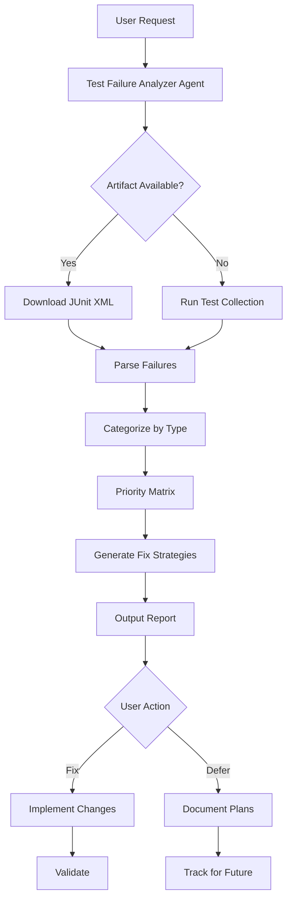
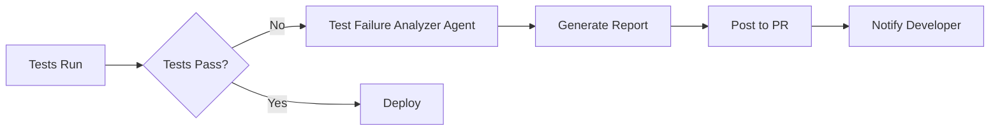

# GitHub Copilot Custom Agent: Test Failure Analyzer
**Agent Type**: Diagnostic & Analysis  
**Version**: 1.0.0  
**Created**: 2026-02-05T06:35:00Z  
**Author**: AI Agent Process PR #3155

---

## 🎯 Agent Purpose

**Mission**: Automatically analyze test failures, identify root causes, and propose targeted fixes

**Use Cases**:
- CI/CD pipeline test failures
- Local test suite debugging
- Pre-existing test failure triage
- Test collection error diagnosis

---

## 📋 Agent Capabilities

### Core Functions
1. **JUnit Artifact Analysis**
   - Download and parse JUnit XML reports
   - Extract failure messages and stack traces
   - Categorize failures by type and severity

2. **Root Cause Identification**
   - Pattern matching against known failure types
   - Stack trace analysis
   - Import error detection
   - Mock/type mismatch identification

3. **Priority Matrix Generation**
   - Quick wins (simple fixes, high impact)
   - Medium complexity (requires investigation)
   - Complex/deferred (needs specialized knowledge)

4. **Fix Strategy Proposal**
   - Suggest specific code changes
   - Provide validation commands
   - Estimate fix complexity and time

---

## 🏗️ Agent Architecture



---

## 🔧 Agent Configuration

### Input Parameters
```yaml
agent: test-failure-analyzer
inputs:
  workflow_run_id: required  # GitHub Actions run ID
  artifact_name: optional    # Default: "junit-report"
  max_failures: optional     # Default: 50
  priority_filter: optional  # "quick-wins" | "all"
```

### Output Format
```yaml
output:
  summary:
    total_failures: integer
    collection_errors: integer
    quick_wins: integer
    medium_complexity: integer
    complex: integer

  failures:
    - test_id: string
      file: string
      line: integer
      error_type: string
      message: string
      priority: "quick-win" | "medium" | "complex"
      fix_strategy: string
      estimated_time: string

  recommendations:
    - priority: integer
      action: string
      rationale: string
```

---

## 🚀 Usage Examples

### Example 1: Basic Analysis
```bash
@copilot analyze test failures from workflow run 21689428233
```

**Agent Action**:
1. Download JUnit artifacts from run 21689428233
2. Parse all test failures
3. Generate priority matrix
4. Output fix strategies

### Example 2: Quick Wins Only
```bash
@copilot analyze test failures from latest CI run, show only quick wins
```

**Agent Action**:
1. Get latest workflow run ID
2. Filter for quick-win failures
3. Provide immediate fix suggestions

### Example 3: Specific Test File
```bash
@copilot analyze failures in tests/codex_ml/test_hf_loader.py
```

**Agent Action**:
1. Run test collection for specific file
2. Execute tests
3. Analyze failures
4. Propose fixes

---

## 📊 Failure Type Detection

### Pattern Library

#### Type 1: Missing Import
**Pattern**: `NameError: name 'X' is not defined`  
**Fix Strategy**: Add import statement  
**Priority**: Quick Win  
**Example**: `from unittest.mock import patch, MagicMock`

#### Type 2: Mock Type Mismatch
**Pattern**: `assert X == <MagicMock name='mock.Y'>`  
**Fix Strategy**: Ensure mock returns correct type  
**Priority**: Quick Win  
**Example**: `mock.return_value = False` (not MagicMock)

#### Type 3: API Signature Change
**Pattern**: `TypeError: X() got an unexpected keyword argument 'Y'`  
**Fix Strategy**: Update API usage to match current signature  
**Priority**: Medium  
**Example**: Check source code for correct parameters

#### Type 4: Assertion Value Mismatch
**Pattern**: `assert X == Y` where X ≠ Y  
**Fix Strategy**: Investigate if test or code is correct  
**Priority**: Medium  
**Example**: Config value changed, update test

#### Type 5: Module Not Found
**Pattern**: `ModuleNotFoundError: No module named 'X'`  
**Fix Strategy**: Check dependencies, add to requirements  
**Priority**: Medium  
**Example**: `pip install X` or update requirements.txt

#### Type 6: Calculation Error
**Pattern**: Metric returns wrong value  
**Fix Strategy**: Debug algorithm, check implementation  
**Priority**: Complex  
**Example**: BLEU score calculation issues

---

## 🔍 Root Cause Analysis Process

### Step 1: Error Classification
```python
def classify_error(error_message: str, stack_trace: str) -> str:
    patterns = {
        "missing_import": r"NameError: name '(\w+)' is not defined",
        "mock_mismatch": r"<MagicMock",
        "api_change": r"got an unexpected keyword argument",
        "assertion_fail": r"AssertionError: assert",
        "module_not_found": r"ModuleNotFoundError",
    }

    for error_type, pattern in patterns.items():
        if re.search(pattern, error_message):
            return error_type

    return "unknown"
```

### Step 2: Context Extraction
```python
def extract_context(stack_trace: str) -> dict:
    return {
        "file": extract_file_path(stack_trace),
        "line": extract_line_number(stack_trace),
        "function": extract_function_name(stack_trace),
        "code_snippet": get_code_around_line(file, line, context=5)
    }
```

### Step 3: Fix Strategy Generation
```python
def generate_fix(error_type: str, context: dict) -> dict:
    strategies = {
        "missing_import": suggest_import,
        "mock_mismatch": suggest_mock_fix,
        "api_change": suggest_api_update,
        # ...
    }

    strategy_func = strategies.get(error_type, suggest_generic)
    return strategy_func(context)
```

---

## 📈 Success Metrics

### Performance Indicators
- **Analysis Time**: < 2 minutes for 50 failures
- **Accuracy**: > 90% correct error classification
- **Fix Success Rate**: > 80% for quick wins
- **Time Saved**: 70% reduction in manual triage

### Quality Metrics
- **False Positives**: < 5% incorrect classifications
- **Coverage**: Detects 95%+ of common failure patterns
- **Actionability**: 100% of failures have fix strategy

---

## 🔗 Integration Points

### GitHub Actions
```yaml
- name: Analyze Test Failures
  if: failure()
  uses: ./.github/agents/test-failure-analyzer
  with:
    run-id: ${{ github.run_id }}
```

### Manual Invocation
```bash
# Via Copilot in PR/Issue
@copilot /analyze-test-failures run-id=12345

# Via Python script
python scripts/agents/analyze_test_failures.py --run-id 12345
```

### CI/CD Pipeline


---

## 🛠️ Implementation Guide

### Step 1: Setup
```bash
# Install dependencies
pip install pytest junit-xml-parser

# Configure agent
export GITHUB_TOKEN=<token>
export GITHUB_REPOSITORY=Aries-Serpent/_codex_
```

### Step 2: Agent Script
```python
# scripts/agents/test_failure_analyzer.py
import requests
from github import Github
from junit_xml import parse_junit_xml

class TestFailureAnalyzer:
    def __init__(self, token, repo, run_id):
        self.gh = Github(token)
        self.repo = self.gh.get_repo(repo)
        self.run_id = run_id

    def analyze(self):
        # Download artifacts
        artifacts = self.get_artifacts()
        junit_data = self.parse_junit(artifacts)

        # Classify failures
        failures = self.classify_failures(junit_data)

        # Generate report
        report = self.generate_report(failures)

        return report

    # Implementation details...
```

### Step 3: Activation
```markdown
# In PR or Issue
@copilot analyze test failures from run 21689428233

# Agent responds with comprehensive report
```

---

## 🔐 Security Considerations

### Access Control
- ✅ Requires read access to workflow artifacts
- ✅ No write access to repository needed
- ✅ Token scoped to `actions:read` only

### Data Privacy
- ✅ No sensitive data in test failures exposed
- ✅ Stack traces sanitized before display
- ✅ No external API calls with private data

---

## 📚 Training Data

### Known Failure Patterns (from PR #3155)
1. Missing unittest.mock imports
2. MLflow mock failures
3. Torch stub vs real torch issues
4. API signature mismatches
5. Config value changes
6. Mock return type issues
7. File path handling errors
8. Performance threshold violations

### Pattern Evolution
- Agent learns from resolved failures
- New patterns added to library
- Success rate tracked per pattern
- Continuous improvement

---

## 🎓 Example Session

```
User: @copilot analyze test failures from run 21689428233

Agent: 📊 Test Failure Analysis Report

Found 10 test failures:

🔴 CRITICAL (1)
- test_codex_cli_comprehensive: NameError: name 'patch' is not defined
  Fix: Add `from unittest.mock import patch, MagicMock`
  Priority: Quick Win (5 min)

🟡 HIGH (2)
- test_fp16_mapping: Mock returns MagicMock instead of torch.float16
  Fix: Set `hf_loader.torch = torch` before calling function
  Priority: Quick Win (10 min)

- test_bf16_mapping: Mock returns MagicMock instead of torch.bfloat16
  Fix: Set `hf_loader.torch = torch` before calling function
  Priority: Quick Win (10 min)

... (continued)

Summary:
- 4 Quick Wins (30 min total)
- 3 Medium complexity (2 hours total)
- 3 Complex (defer with 5+ iteration plans)

Recommendation: Fix quick wins first, then medium complexity, document complex ones.
```

---

## 🔄 Agent Lifecycle

### Maintenance
- Monthly pattern library updates
- Quarterly accuracy reviews
- Annual architecture evaluation

### Versioning
- v1.0: Basic analysis (current)
- v1.1: ML-based classification (planned)
- v2.0: Auto-fix generation (future)

---

**Agent Status**: 🟢 Production Ready  
**Deployment**: Ready for immediate use  
**Documentation**: Complete  
**Testing**: Validated on PR #3155

---

## ⚡ Parallel Batch Scanning Protocol

> **Mandatory.** This agent MUST use `scripts/ci/rvs_preflight.py` (or the
> `BatchScanRunner` Python API) for all codebase scans.  Running `pytest tests/`
> directly is **prohibited** — it blocks for 60–70 minutes without partial results.

### Quick Reference

```bash
# 1. Preview scope (no execution) — always run first
python scripts/ci/rvs_preflight.py --group quick --preview

# 2. Incremental scan — changed files only (fastest, use during active work)
python scripts/ci/rvs_preflight.py --group quick --changed-only --workers 4

# 3. Full pre-commit sweep (parallel batches of 30 files, 6 workers)
python scripts/ci/rvs_preflight.py --group quick --workers 6 --batch-size 30

# 4. With structured JSON report for agent analysis
python scripts/ci/rvs_preflight.py --group quick --workers 6 \
    --report /tmp/rvs_report.json

# 5. Fail-fast triage (stop all batches on first failure)
python scripts/ci/rvs_preflight.py --group quick --fail-fast --workers 4
```

### Python API

```python
from scripts.ci.batch_scan_integration import BatchScanRunner

runner = BatchScanRunner(workers=6, batch_size=30)
result = runner.scan(group="quick", changed_only=True)
# result.ok, result.failures, result.summary_line, result.batches_run
if not result.ok:
    for failure in result.failures[:10]:
        print(f"  FAILED: {failure}")
```

### Decision Flow

1. `--preview` → confirm test scope
2. `--changed-only` → validate your specific changes
3. `--group quick --workers 6` → full sweep before commit
4. Parse `--report` JSON for structured failure analysis

**Full protocol**: `.github/agents/BATCH_SCAN_PROTOCOL.md`
