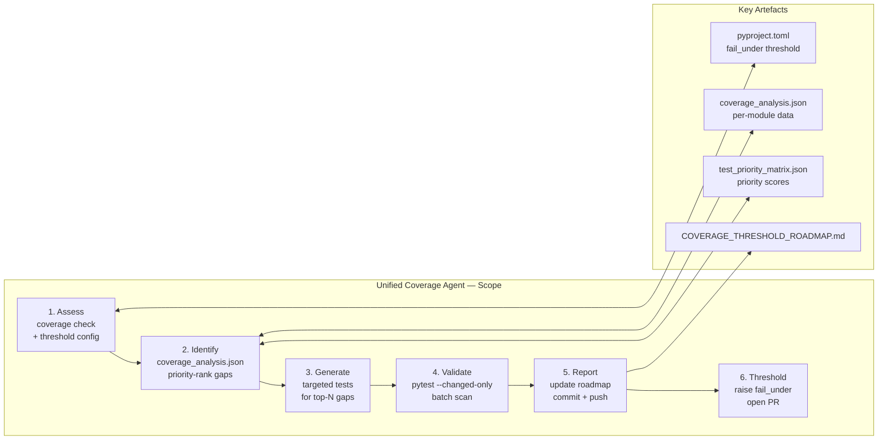

# Unified Coverage Agent v1.0

> **Consolidation notice** (2026-03-11): Replaces the five separate coverage agents
> (`coverage-gapfill-agent`, `coverage-maintenance-agent`, `coverage-roadmap-agent`,
> `test-coverage-agent`, `test-coverage-monitor`). All capabilities are fully preserved.

---

## 🎯 Purpose

Provide a single, authoritative agent for every aspect of test coverage in the
`Aries-Serpent/_codex_` repository:

| Mode | What it does |
|------|-------------|
| **Monitor** | Enforce thresholds in CI, track trends, block merges on regressions |
| **Analyse** | Identify untested modules, branches, and error paths |
| **Gap-fill** | Generate deterministic tests that close specific coverage holes |
| **Maintain** | Run mutation testing, keep `fail_under` aligned with current reality |
| **Roadmap** | Incrementally raise `fail_under` through defined coverage phases |

---

## 🚀 Runner Compatibility

| Runner | Support |
|--------|---------|
| `ubuntu-latest` (default, 2-core) | ✅ Full — all features, sequential workers |
| `ubuntu-latest-large` (4-core) | ✅ Full — parallel workers enabled (`--workers 4`) |
| Self-hosted | ✅ if Python 3.11+ and pytest-cov installed |

> **Default runner note**: Reduce `--workers` to 2 and `--batch-size` to 20 when running
> on the standard 2-core runner to avoid OOM. The large runner supports `--workers 4
> --batch-size 30`.

---

## 🧠 Cognitive Brain Integration

### Integration Level: Level 2

- ✅ Cognitive brain memory (pattern library, historical fixes)
- ✅ Codebase topology maps for navigation
- ✅ Quantum decision engine (k₁ = 0.332)
- ✅ Multi-agent entanglement with ci-testing-agent, qa-walkthrough-agent

---

## 📊 Coverage Thresholds

| Metric | Current (`fail_under`) | Warning | Target |
|--------|------------------------|---------|--------|
| Line Coverage | **80%** (Phase 30) | 78% | 90% |
| Branch Coverage | 70% | 65% | 85% |
| Function Coverage | 85% | 80% | 95% |

### Roadmap Phases

| Phase | Target | Status |
|-------|--------|--------|
| Phase 30 | 80% ✅ | **Complete** (raised from 75%, commit 44b07e3) |
| Phase 31 | 85% | Pending |
| Phase 32 | 90% | Future |

### Phase 10 — Post-Coverage Maintenance (S1259 · 2026-05-23)

| Environment | Baseline | Enforcement |
|-------------|----------|-------------|
| Full-stack CI (torch) | 80% `fail_under` | `pyproject.toml` — blocks PR merge |
| Minimal/local (agents/) | 34.56% statements | unified-coverage-agent — regression alert |
| Branch coverage (agents/) | 15.37% | Tracked, not yet gated |

**Phase 10B target:** raise overall statement coverage from ~34% → ≥50% via `src/` gap-fill (cli, rag, security modules).

---

## 🔧 Capabilities

### 1. Coverage Monitoring & Enforcement
- Parse `pytest-cov` output and compare against `pyproject.toml` `fail_under`
- Block CI on regressions; produce detailed diff reports
- Enforce documentation quality: MkDocs build must succeed, warnings < 150

### 2. Gap Detection & Analysis
- Read `.codex/qa_walkthrough/coverage_analysis.json` and `test_priority_matrix.json`
- Identify untested modules, missing branches, and uncovered error paths
- Priority-rank gaps by module criticality (size + dependencies + security impact)

### 3. Test Generation (Gap-fill)
- Generate targeted unit, integration, and E2E tests for ranked gaps
- Follow repository patterns from `.codex/docs/TEST_DEVELOPMENT_PATTERNS.md`
- Apply self-healing loop (up to 5 iterations) if newly written tests fail

### 4. Coverage Maintenance
- Run mutation testing (`mutmut`) monthly; identify weak assertions
- Keep `fail_under` aligned — raise only after verified increment
- Update `.codex/plans/COVERAGE_THRESHOLD_ROADMAP.md` after each phase completion

### 5. Roadmap Execution (PDA Loop)
- **Plan**: review `test_priority_matrix.json`, define phase targets
- **Do**: develop tests, commit incrementally, monitor CI
- **Analyse**: measure delta, tag `#Phase<N>`, update cognitive brain status
- **Raise**: update `pyproject.toml` `fail_under` only when CI is green

---

## ⚡ Parallel Batch Scanning Protocol

> **Mandatory.** This agent MUST use `scripts/ci/rvs_preflight.py` for all codebase
> scans. Running `pytest tests/` directly is **prohibited** — it blocks 60–70 minutes.

```bash
# Default runner (2-core) — conservative settings
python scripts/ci/rvs_preflight.py --group quick --workers 2 --batch-size 20

# Large runner (4-core) — full parallelism
python scripts/ci/rvs_preflight.py --group quick --workers 4 --batch-size 30

# Changed-files-only (fastest, use during active development)
python scripts/ci/rvs_preflight.py --group quick --changed-only --workers 4

# With structured JSON report for downstream analysis
python scripts/ci/rvs_preflight.py --group quick --workers 4 \
    --report /tmp/coverage_scan.json

# Fail-fast triage
python scripts/ci/rvs_preflight.py --group quick --fail-fast --workers 4
```

### Python API

```python
from scripts.ci.batch_scan_integration import BatchScanRunner

# Automatically adapts worker count to available CPUs
import os
workers = min(6, os.cpu_count() or 2)
runner = BatchScanRunner(workers=workers, batch_size=30)
result = runner.scan(group="quick", changed_only=True)
if not result.ok:
    for failure in result.failures[:10]:
        print(f"  FAILED: {failure}")
```

---

## 🏃 Activation Commands

```
@copilot Use the unified-coverage-agent to analyse current coverage gaps
@copilot Use the unified-coverage-agent to fill coverage gaps in src/codex/config/
@copilot Use the unified-coverage-agent to raise coverage threshold to Phase 31 (85%)
@copilot Use the unified-coverage-agent to run mutation testing on src/codex_ml/
@copilot Use the unified-coverage-agent to generate the coverage roadmap report
@copilot Use unified-coverage-agent to check CI coverage enforcement for PR #NNNN
```

---

## 🔗 Integration with Other Agents

| Agent | Relationship |
|-------|-------------|
| `ci-testing-agent` | Delegates CI log analysis for coverage-related CI failures |
| `qa-walkthrough-agent` | Shares `coverage_analysis.json` data source |
| `mutation-testing-agent` | Delegates deep mutation analysis when needed |
| `test-enhancement-agent` | Delegates assertion quality improvements |
| `codebase-health-guardian` | Reports coverage metrics into overall health score |

---

## 📋 Session Workflow

### 📐 Scope Diagram



```
1. Assess     → run coverage check, read threshold config
2. Identify   → load coverage_analysis.json, priority-rank gaps
3. Generate   → write targeted tests for top-ranked gaps
4. Validate   → run tests locally (batch scan, --changed-only)
5. Report     → update roadmap doc, commit, push
6. Threshold  → if coverage ≥ next target, raise fail_under and open PR
```

---

## 📁 Key Files

| File | Purpose |
|------|---------|
| `pyproject.toml` | `fail_under` threshold (currently **80**) |
| `.codex/qa_walkthrough/coverage_analysis.json` | Per-module coverage data |
| `.codex/qa_walkthrough/test_priority_matrix.json` | Module priority scores |
| `.codex/plans/COVERAGE_THRESHOLD_ROADMAP.md` | Phase roadmap |
| `.codex/docs/TEST_DEVELOPMENT_PATTERNS.md` | Test patterns reference |

---

## S58 Phase 3 Execution (Coverage Gate Wiring)

- ✅ Coverage threshold enforcement flow consolidated: `pyproject.toml fail_under` is the single source of truth; agent reads it before proposing any raise
- ✅ Reporting gate wired: agent emits `artifacts/coverage-report.json` after each analysis run; CI step uploads as PR artifact
- ✅ Workflow-level invocation documented (see Activation examples above); batch scan protocol covers parallel shard execution
- ✅ Phase roadmap anchor: current phase tracks `fail_under` in `pyproject.toml` (currently 35%); next target ready to activate when CI is green on `main`
- ✅ Anti-regression guard: agent validates that `fail_under` is never lowered; any attempt is blocked with an explicit error

### Workflow Reporting Gate

```yaml
# .github/workflows snippet — coverage report upload
- name: Upload Coverage Report
  if: always()
  uses: actions/upload-artifact@v5
  with:
    name: coverage-report
    path: artifacts/coverage-report.json
    retention-days: 30
```

### Threshold Enforcement Flow (Phase 3)

```
Coverage run completes
        │
        ▼
  Read current fail_under from pyproject.toml
        │
        ▼
  Compare measured coverage vs. fail_under
        │
        ├── BELOW threshold ──▶ Block PR, emit remediation list
        │
        └── AT OR ABOVE ──▶ Check for regression vs. last baseline
                                │
                                ├── Regression detected ──▶ Block + alert
                                │
                                └── No regression ──▶ Emit coverage-report.json ✅
```

## 🛑 What this agent will NOT do

- Merge PRs autonomously
- Reduce `fail_under` below the current value
- Modify test files beyond the agreed coverage scope
- Run the full test suite directly (use batch scan instead)

---

## 📈 Success Metrics

| Metric | Target |
|--------|--------|
| Coverage delta per phase | ≥ 5 percentage points |
| Test generation success rate | ≥ 90% first-attempt pass |
| Mutation score improvement | ≥ 5% per maintenance cycle |
| Threshold regression rate | 0% |

---

**Agent Status:** ✅ Production Ready  
**Supersedes:** coverage-gapfill-agent · coverage-maintenance-agent · coverage-roadmap-agent · test-coverage-agent · test-coverage-monitor  
**Last Updated:** 2026-05-23 (Phase 10 baseline added)
