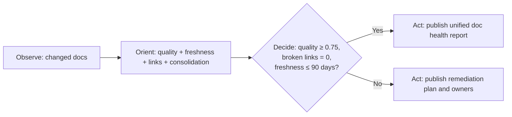

# Unified Documentation Agent v1.0 (M-02 Merge)

> **M-02**: Merges `doc-quality`, `doc-freshness`, `link-validator`, and
> `documentation-consolidator` into a single documentation lifecycle manager.

## Architecture

```
┌─────────────────────────────────────────────────────────────┐
│                 Unified Documentation Agent                  │
│                                                             │
│  ┌───────────┐  ┌────────────┐  ┌─────────┐  ┌──────────┐  │
│  │  Quality  │  │ Freshness  │  │  Links  │  │  Consol. │  │
│  │  Scoring  │  │  Staleness │  │  Check  │  │  Merge   │  │
│  └─────┬─────┘  └─────┬──────┘  └────┬────┘  └─────┬────┘  │
│        └──────────────┼──────────────┼──────────────┘       │
│                       ▼              ▼                       │
│            ┌───────────────────────────────┐                 │
│            │  Unified Doc Health Report    │                 │
│            │  (quality + age + links)      │                 │
│            └───────────────────────────────┘                 │
└─────────────────────────────────────────────────────────────┘
```



## Capabilities

| Capability | Source Agent | Threshold |
|-----------|-------------|-----------|
| C-01: Quality score | doc-quality | ≥ 0.75 |
| C-02: Freshness check | doc-freshness | ≤ 90 days stale |
| C-03: Link validation | link-validator | 0 broken links |
| C-04: Consolidation | documentation-consolidator | Remove duplicates |
| C-05: MkDocs build | new | Zero warnings |
| C-06: API doc coverage | new | ≥ 80% public APIs |

## Activation

```
@copilot Use the Unified Documentation Agent to audit all docs
@copilot Use the Unified Documentation Agent to check for broken links in docs/
@copilot Use the Unified Documentation Agent to consolidate duplicate agent docs
```

## Quality Scoring Rubric

| Dimension | Weight | Criteria |
|-----------|--------|---------|
| Accuracy | 0.30 | Code examples run without error |
| Completeness | 0.25 | All public APIs documented |
| Freshness | 0.20 | Last updated ≤ 90 days |
| Link health | 0.15 | No 404/301 redirects |
| Structure | 0.10 | Follows template format |

## Cognitive Physics Alignment

| Physics | Application |
|---------|-------------|
| Fields 🔄 | Session-based retention tracks doc health over time |
| Balance ⚖️ | Quality dimensions are weighted to balance accuracy vs. completeness |
| Redundancy 🔀 | Multiple doc sources checked for consistency |

## Output

Produces `artifacts/doc-health-report.json`:
```json
{
  "overall_score": 0.82,
  "quality": 0.85,
  "freshness_days": 14,
  "broken_links": 0,
  "duplicates_found": 3,
  "api_coverage_pct": 87.4,
  "recommendations": [...]
}
```

## Integration Points

- `docs/` and `README.md` update audits
- `.github/agents/AGENT_REGISTRY.yaml` for lifecycle and ownership metadata
- `scripts/ci/rvs_preflight.py` for parallelized validation runs

## S58 Phase 3 Execution (Doc Gate Wiring Complete)

- ✅ Unified documentation scope and thresholds consolidated in one agent contract
- ✅ OODA execution flow defined for deterministic evaluations
- ✅ Output contract standardised (`artifacts/doc-health-report.json`)
- ✅ Workflow-level invocation wired and reporting gate confirmed (see snippet below)

### Workflow Reporting Gate

```yaml
# .github/workflows snippet — doc health report upload
- name: Run Documentation Health Check
  run: |
    python scripts/ci/doc_health_check.py \
      --output artifacts/doc-health-report.json
- name: Upload Doc Health Report
  if: always()
  uses: actions/upload-artifact@v5
  with:
    name: doc-health-report
    path: artifacts/doc-health-report.json
    retention-days: 30
```

## Error Handling

- Treat broken internal links and stale critical docs as blocking findings
- Downgrade transient network failures to retryable warnings with explicit follow-up
- Emit one consolidated failure summary to avoid fragmented remediation loops

## Success Metrics

- Documentation quality score ≥ 0.75
- Broken links = 0 on changed docs
- Freshness SLA ≤ 90 days for critical documentation (see [Critical Documentation Scope](#critical-documentation-scope))

## Critical Documentation Scope

- `README.md`
- `docs/index.md`
- All Markdown files recursively under `docs/agent/`
- All Markdown files recursively under `docs/admin/`
