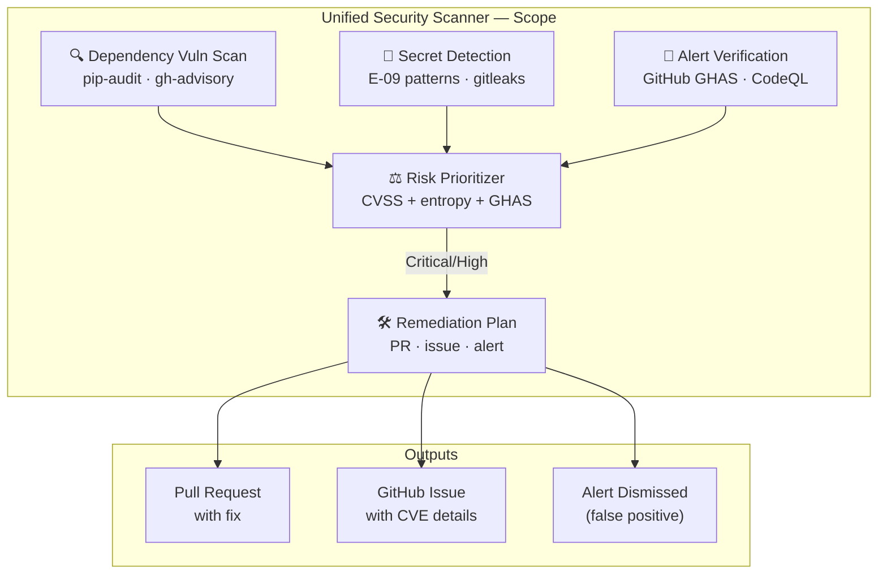

# Unified Security Scanner v1.0 (M-01 Merge)

> **M-01**: Merges `vulnerability-scanner`, `alert-verification`, `secret-detection`, and `gitleaks`/`semgrep` into a single end-to-end security orchestrator.

## Architecture

### 📐 Scope Diagram



```
┌─────────────────────────────────────────────────────────────┐
│                  Unified Security Scanner                    │
│                                                             │
│  ┌──────────────┐  ┌──────────────┐  ┌───────────────────┐ │
│  │  Dependency  │  │    Secret    │  │  Alert            │ │
│  │  Vuln Scan   │  │  Detection   │  │  Verification     │ │
│  │  (pip-audit) │  │  (E-09 pat.) │  │  (GitHub GHAS)    │ │
│  └──────┬───────┘  └──────┬───────┘  └────────┬──────────┘ │
│         │                 │                    │            │
│         └─────────────────┼────────────────────┘            │
│                           ▼                                 │
│              ┌─────────────────────┐                        │
│              │  Risk Prioritizer   │ ← CVSS + entropy + GHAS│
│              └──────────┬──────────┘                        │
│                         ▼                                   │
│              ┌─────────────────────┐                        │
│              │  Remediation Plan   │ → PR / issue / alert   │
│              └─────────────────────┘                        │
└─────────────────────────────────────────────────────────────┘
```

## Capabilities

| Capability | Source Agent | Status |
|-----------|-------------|--------|
| C-01: PyPI vulnerability scan | dependency-vulnerability-scanner | ✅ Merged |
| C-02: npm/cargo/Go vulnerability scan | dependency-vulnerability-scanner | ✅ Merged |
| C-03: Secret pattern detection (32 patterns) | secret-detection-agent v2.0 | ✅ Merged |
| C-04: GitHub Advanced Security alert triage | security-alert-verification-agent | ✅ Merged |
| C-05: CodeQL alert resolution | code-scanning-remediation-agent | ✅ Merged |
| C-06: Semgrep custom rules | new | ✅ Included |
| C-07: SBOM generation | new | ✅ Included |
| C-08: Risk score computation (CVSS + entropy + context) | new | ✅ Included |

## Activation

```
@copilot Use the Unified Security Scanner to run a full security audit
@copilot Use the Unified Security Scanner to check for vulnerabilities in requirements.txt
@copilot Use the Unified Security Scanner to triage GitHub security alerts
```

## S58 Phase 2 Execution Checkpoint

- ✅ Unified scanner agent spec is active and registered
- ✅ Consolidated capability matrix covers dependency, secret, and GHAS/CodeQL flows
- ✅ Decision matrix and risk formula are documented for deterministic triage
- ✅ Batch scanning protocol is documented for repeatable execution

## Decision Matrix

| Finding Type | CVSS/Severity | Action |
|-------------|--------------|--------|
| Dependency CVE | Critical (≥9.0) | Block PR, open P1 issue |
| Dependency CVE | High (7.0–8.9) | Open P2 issue, suggest fix |
| Dependency CVE | Medium/Low | Document in tracking log |
| Secret detected | Any | Block PR, rotate credential |
| GHAS alert | High | Auto-remediate if pattern known |
| GHAS alert | Medium | Open issue, assign |

## Risk Score Formula

```
risk_score = (cvss_weight × cvss_score +
              entropy_weight × entropy_score +
              context_weight × context_score) / sum_weights

where:
  cvss_weight    = 0.50
  entropy_weight = 0.30  # E-09 entropy signal
  context_weight = 0.20  # credential name heuristic
```

## Cognitive Physics Alignment

| Physics | Application |
|---------|-------------|
| Balance ⚖️ | Unified risk scoring balances CVSS + entropy + context signals |
| Redundancy 🔀 | Multiple scanners ensure no single-point miss (defense in depth) |
| Path 🛤️ | Waterfall triage (secret → CVE → alert) minimizes total scan time |

## Related Agents

- **secret-detection-agent** (sub-agent, E-09)
- **bridge-security-monitor** (IPC security — retained independent)
- **unified-doc-agent** (M-02) — documentation parallel

---

## 🔧 Capabilities

| Capability | Description | Status |
|------------|-------------|--------|
| **CVE Scanning** | `pip-audit` + `safety` on all dependency files | ✅ Active |
| **Secret Detection** | Entropy-based + regex pattern (E-09 patterns) across all commits | ✅ Active |
| **GHAS Alert Triage** | GitHub Advanced Security alert ingestion & classification | ✅ Active |
| **SBOM Generation** | CycloneDX-format Software Bill of Materials output | ✅ Active |
| **Auto-Remediation** | PR-based dependency bumps for known CVEs | ✅ Active |
| **Risk Scoring** | Unified CVSS + entropy + context risk score (0–10) | ✅ Active |
| **Cognitive Brain** | Pattern storage and cross-session learning | ✅ Active |

## 📋 Activation

```bash
# Full security audit (all sub-scanners)
@copilot Use the Unified Security Scanner to audit the full repository

# Dependency-only scan
@copilot Use the Unified Security Scanner to check requirements.txt for CVEs

# Secret detection only
@copilot Use the Unified Security Scanner to detect exposed secrets in the last 10 commits
```

## 🛡️ Security Self-Constraints

- **Never** commit raw secret values to any file — log redacted versions only
- **Never** execute arbitrary shell commands from alert content
- **Read-only** mode available (`--dry-run`) for audit without modification
- All remediation PRs require human approval before merge

## 📝 Status

**Version**: 1.0.0-m01 | **Batch**: M-01 | **Created**: 2026-02-21
**AAIS Contribution**: +6.0 points | **Cognitive Level**: 4

---

## ⚡ Parallel Batch Scanning Protocol

> **Mandatory.** This agent MUST use `scripts/ci/rvs_preflight.py` (or the
> `BatchScanRunner` Python API) for all codebase scans.  Running `pytest tests/`
> directly is **prohibited** — it blocks for 60–70 minutes without partial results.

### Quick Reference

```bash
# 1. Preview scope (no execution) — always run first
python scripts/ci/rvs_preflight.py --group quick --preview

# 2. Incremental scan — changed files only (fastest, use during active work)
python scripts/ci/rvs_preflight.py --group quick --changed-only --workers 4

# 3. Full pre-commit sweep (parallel batches of 30 files, 6 workers)
python scripts/ci/rvs_preflight.py --group quick --workers 6 --batch-size 30

# 4. With structured JSON report for agent analysis
mkdir -p .codex/reports
python scripts/ci/rvs_preflight.py --group quick --workers 6 \
    --report .codex/reports/rvs_report.json

# 5. Fail-fast triage (stop all batches on first failure)
python scripts/ci/rvs_preflight.py --group quick --fail-fast --workers 4
```

### Python API

```python
from scripts.ci.batch_scan_integration import BatchScanRunner

runner = BatchScanRunner(workers=6, batch_size=30)
result = runner.scan(group="quick", changed_only=True)
# result.ok, result.failures, result.summary_line, result.batches_run
if not result.ok:
    for failure in result.failures[:10]:
        print(f"  FAILED: {failure}")
```

### Decision Flow

1. `--preview` → confirm test scope
2. `--changed-only` → validate your specific changes
3. `--group quick --workers 6` → full sweep before commit
4. Parse `--report` JSON for structured failure analysis

**Full protocol**: `.github/agents/BATCH_SCAN_PROTOCOL.md`
