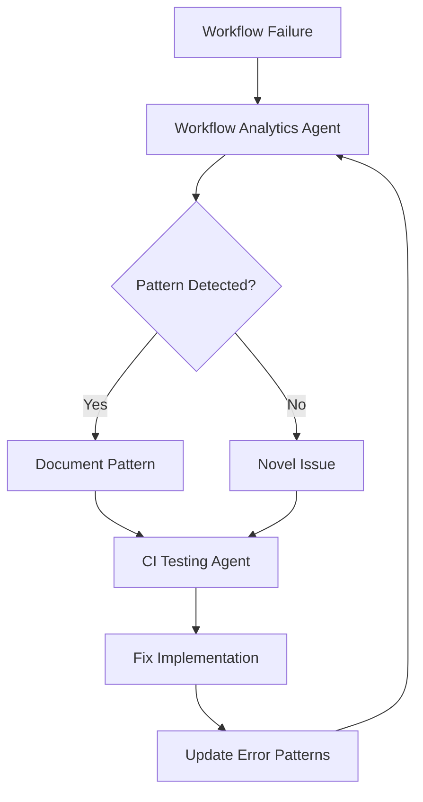

# Workflow Analytics Agent

## Purpose

Access previously ran GitHub Actions workflows, logs, and artifacts to review and investigate patterns in errors. Provides comprehensive CI/CD analytics for debugging, optimization, and pattern detection.

## Responsibilities

1. **Workflow History Access**: Retrieve and analyze past workflow runs
2. **Log Analysis**: Parse workflow logs to identify failures and patterns
3. **Artifact Retrieval**: Download and analyze workflow artifacts
4. **Error Pattern Detection**: Identify recurring error patterns across runs
5. **Trend Analysis**: Track CI/CD health metrics over time

## Activation

```markdown
@copilot Use the Workflow Analytics Agent to analyze recent CI failures and identify error patterns.
```

```markdown
@copilot Use the Workflow Analytics Agent to review workflow logs from the last 10 runs.
```

```markdown
@copilot Use the Workflow Analytics Agent to download artifacts from run #12345 and analyze test results.
```

---

## Workflow Access Methods

### 1. List Recent Workflow Runs

```bash
# List recent runs with status
gh run list --limit 20 --json databaseId,displayTitle,status,conclusion,createdAt,headBranch

# Filter by status (failure, success, cancelled)
gh run list --limit 10 --status failure

# Filter by workflow name
gh run list --workflow="rust_swarm_ci.yml" --limit 10

# Filter by branch
gh run list --branch main --limit 10
```

### 2. Get Workflow Run Details

```bash
# View run summary
gh run view <run-id>

# View specific job logs
gh run view <run-id> --job <job-id>

# View with log output
gh run view <run-id> --log

# Get failed job logs only
gh run view <run-id> --log-failed
```

### 3. Download Artifacts

```bash
# List artifacts from a run
gh run view <run-id> --json artifacts

# Download specific artifact
gh run download <run-id> --name <artifact-name>

# Download all artifacts from a run
gh run download <run-id>

# Download from latest run of specific workflow
gh run download $(gh run list --workflow="test.yml" --limit 1 --json databaseId --jq '.[0].databaseId')
```

### 4. Using GitHub MCP Tools (for Copilot Sessions)

The GitHub MCP server provides these tools for workflow access:

```python
# List workflow runs
github-mcp-server-actions_list(
    method="list_workflow_runs",
    owner="Aries-Serpent",
    repo="_codex_",
    per_page=20
)

# Get workflow run details
github-mcp-server-actions_get(
    method="get_workflow_run",
    owner="Aries-Serpent",
    repo="_codex_",
    resource_id="<run_id>"
)

# Get job logs
github-mcp-server-get_job_logs(
    owner="Aries-Serpent",
    repo="_codex_",
    run_id=<run_id>,
    failed_only=True,
    return_content=True
)

# List workflow run artifacts
github-mcp-server-actions_list(
    method="list_workflow_run_artifacts",
    owner="Aries-Serpent",
    repo="_codex_",
    resource_id="<run_id>"
)
```

---

## Error Pattern Detection

### Common Error Categories

| Category | Pattern | Root Cause | Resolution |
|----------|---------|------------|------------|
| Import Error | `ModuleNotFoundError`, `NameError` | Missing import statement | Add missing import |
| Dependency Conflict | `pip resolver`, `incompatible versions` | Version mismatch | Update version pins |
| Test Timeout | `Timeout`, `TimeoutError` | Slow test or hanging | Increase timeout or optimize |
| Syntax Error | `SyntaxError`, `yaml.scanner.ScannerError` | YAML/Python syntax | Fix syntax issues |
| Permission Error | `Permission denied`, `403` | Missing permissions | Update workflow permissions |
| Network Error | `ConnectionError`, `TimeoutError` | Network/service issues | Retry or mock |

### Error Pattern Analysis Script

```python
"""
Analyze workflow logs for error patterns.
Usage: python analyze_errors.py <log_file>
"""
import re
import json
from collections import Counter, defaultdict
from pathlib import Path

# Common error patterns
ERROR_PATTERNS = {
    "import_error": r"(?:ModuleNotFoundError|ImportError|NameError):\s*(.+)",
    "syntax_error": r"(?:SyntaxError|yaml\.scanner\.ScannerError):\s*(.+)",
    "test_failure": r"(?:FAILED|AssertionError|pytest\.fail):\s*(.+)",
    "timeout": r"(?:TimeoutError|Timeout|timed out):\s*(.+)",
    "permission": r"(?:PermissionError|403|Permission denied):\s*(.+)",
    "dependency": r"(?:pip resolver|incompatible|version conflict):\s*(.+)",
    "type_error": r"(?:TypeError|AttributeError):\s*(.+)",
    "file_not_found": r"(?:FileNotFoundError|No such file):\s*(.+)",
}


def analyze_log(log_content: str) -> dict:
    """Analyze log content for error patterns."""
    results = defaultdict(list)
    
    for category, pattern in ERROR_PATTERNS.items():
        matches = re.findall(pattern, log_content, re.IGNORECASE)
        if matches:
            results[category].extend(matches)
    
    # Count error types
    error_counts = {k: len(v) for k, v in results.items()}
    
    return {
        "errors": dict(results),
        "counts": error_counts,
        "total_errors": sum(error_counts.values()),
    }


def find_recurring_errors(logs: list[str]) -> dict:
    """Find patterns that occur across multiple runs."""
    all_errors = Counter()
    
    for log in logs:
        analysis = analyze_log(log)
        for category, errors in analysis["errors"].items():
            for error in errors:
                all_errors[f"{category}: {error[:100]}"] += 1
    
    # Return errors that occur 2+ times
    recurring = {k: v for k, v in all_errors.items() if v >= 2}
    return dict(sorted(recurring.items(), key=lambda x: -x[1]))


if __name__ == "__main__":
    import sys
    if len(sys.argv) > 1:
        log_path = Path(sys.argv[1])
        if log_path.exists():
            content = log_path.read_text()
            result = analyze_log(content)
            print(json.dumps(result, indent=2))
```

---

## Workflow Health Metrics

### Key Metrics to Track

| Metric | Description | Target |
|--------|-------------|--------|
| Success Rate | % of successful runs | > 95% |
| Mean Time to Failure | Average time before failure | - |
| Flaky Test Rate | Tests that fail intermittently | < 1% |
| Average Duration | Mean workflow run time | < 10 min |
| Failure Categories | Distribution of failure types | - |

### Health Check Script

```bash
#!/bin/bash
# Workflow health check script

echo "=== Workflow Health Report ==="
echo "Generated: $(date -u +"%Y-%m-%dT%H:%M:%SZ")"
echo ""

# Get recent runs
echo "## Recent Run Statistics (Last 50 runs)"
gh run list --limit 50 --json conclusion,status | jq -r '
  group_by(.conclusion) | 
  map({conclusion: .[0].conclusion, count: length}) |
  .[] | "\(.conclusion // "in_progress"): \(.count)"
'

echo ""
echo "## Failed Runs (Last 10)"
gh run list --status failure --limit 10 --json databaseId,displayTitle,createdAt,headBranch | jq -r '
  .[] | "- Run #\(.databaseId): \(.displayTitle) (\(.headBranch)) - \(.createdAt)"
'

echo ""
echo "## Workflow Duration Analysis"
gh run list --limit 20 --status completed --json databaseId,displayTitle,updatedAt,createdAt | jq -r '
  .[] | 
  "Run #\(.databaseId): \(.displayTitle)"
'
```

---

## Artifact Analysis

### Test Result Artifacts

```bash
# Download and analyze test results
gh run download <run-id> --name test-results

# Parse pytest XML results
python << 'EOF'
import xml.etree.ElementTree as ET
from pathlib import Path

for xml_file in Path(".").glob("**/*.xml"):
    tree = ET.parse(xml_file)
    root = tree.getroot()
    
    testsuite = root.find(".//testsuite") or root
    tests = int(testsuite.get("tests", 0))
    failures = int(testsuite.get("failures", 0))
    errors = int(testsuite.get("errors", 0))
    
    print(f"{xml_file.name}: {tests} tests, {failures} failures, {errors} errors")
    
    # Show failed tests
    for failure in root.findall(".//failure"):
        testcase = failure.getparent() if hasattr(failure, 'getparent') else None
        if testcase is not None:
            print(f"  FAILED: {testcase.get('name')}")
            print(f"    {failure.text[:200]}..." if failure.text else "")
EOF
```

### Coverage Artifacts

```bash
# Download coverage report
gh run download <run-id> --name coverage-report

# Analyze coverage
python << 'EOF'
import json
from pathlib import Path

for cov_file in Path(".").glob("**/coverage*.json"):
    data = json.loads(cov_file.read_text())
    
    if "totals" in data:
        totals = data["totals"]
        print(f"Coverage: {totals.get('percent_covered', 0):.1f}%")
        print(f"Lines: {totals.get('covered_lines', 0)}/{totals.get('num_statements', 0)}")
EOF
```

---

## Error Investigation Workflow

### Step 1: Identify Failed Runs

```bash
# List failed runs
gh run list --status failure --limit 5 --json databaseId,displayTitle,conclusion,createdAt

# Get the most recent failure
FAILED_RUN=$(gh run list --status failure --limit 1 --json databaseId --jq '.[0].databaseId')
echo "Investigating run: $FAILED_RUN"
```

### Step 2: Get Failure Logs

```bash
# Get failed job logs
gh run view $FAILED_RUN --log-failed > failed_logs.txt

# Or use MCP tools
github-mcp-server-get_job_logs(
    owner="Aries-Serpent",
    repo="_codex_",
    run_id=$FAILED_RUN,
    failed_only=True,
    return_content=True,
    tail_lines=500
)
```

### Step 3: Analyze Error Patterns

```bash
# Search for common error patterns
grep -E "(Error|Exception|FAILED|FATAL)" failed_logs.txt

# Extract stack traces
grep -A 10 "Traceback" failed_logs.txt

# Find import errors
grep -E "(ModuleNotFoundError|ImportError|NameError)" failed_logs.txt
```

### Step 4: Check for Recurring Issues

```python
# Compare with previous failures
recent_failures = []
for run_id in failure_run_ids[-5:]:
    logs = get_job_logs(run_id, failed_only=True)
    analysis = analyze_log(logs)
    recent_failures.append(analysis)

recurring = find_recurring_errors([f["errors"] for f in recent_failures])
print("Recurring issues:", recurring)
```

---

## Integration with CI Testing Agent

The Workflow Analytics Agent complements the CI Testing Agent:

1. **CI Testing Agent**: Fixes current failures
2. **Workflow Analytics Agent**: Identifies patterns across multiple runs

### Cross-Agent Workflow



---

## Operating Rules

1. **Data Retention**: Workflow logs retained 90 days, artifacts per workflow config
2. **Rate Limits**: GitHub API has rate limits; cache results when possible
3. **Security**: Never expose secrets from logs; sanitize output
4. **Documentation**: Document new error patterns in CI Testing Agent

---

## Artifact Locations Reference

| Artifact Type | Workflow | Location | Format |
|---------------|----------|----------|--------|
| Test Results | test-*.yml | test-results/ | XML/JSON |
| Coverage | coverage.yml | coverage-report/ | JSON/HTML |
| Security | codeql.yml | Security tab | SARIF |
| Code Quality | code-quality.yml | .codex/reports/ | JSON |
| Audit | audit-*.yml | audit_artifacts/ | JSON |
| Logs | All | GitHub API | Text |

---

## Version History

| Version | Date | Changes |
|---------|------|---------|
| 1.0.0 | 2026-01-22 | Initial creation with comprehensive workflow access |

---

**Maintained by**: Cognitive Brain Team  
**Related Agents**: CI Testing Agent, Coverage Gapfill Agent, Dependency Conflict Agent
