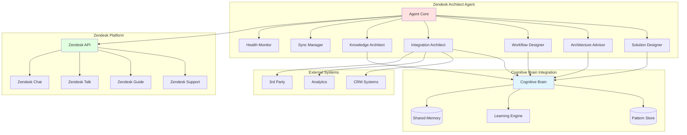
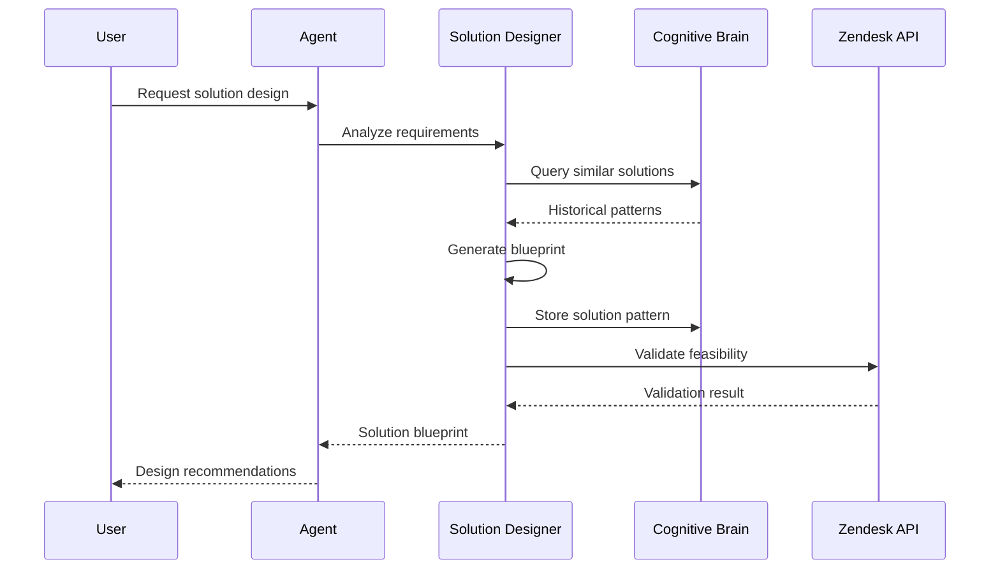
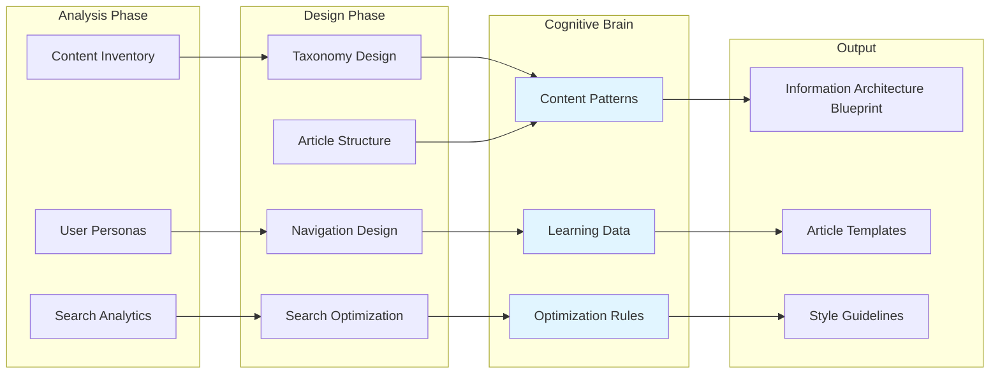
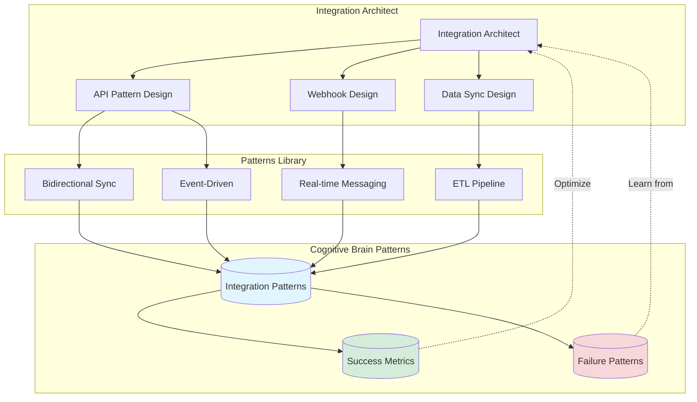
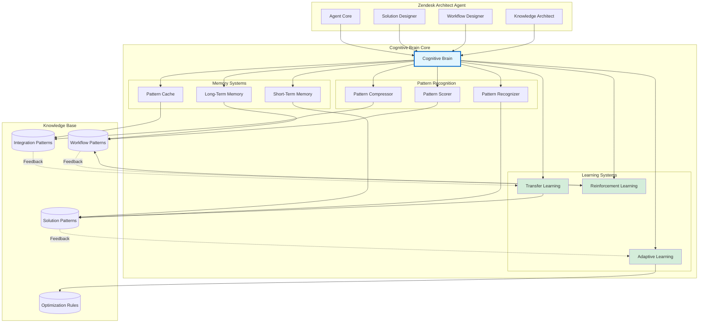
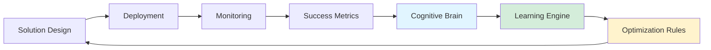

# Zendesk Architect Agent - Development Planset

**Version**: 1.0.0  
**Status**: Planning  
**Target GitHub Tier**: GitHub Team + GitHub Copilot Pro+  
**Estimated Complexity**: Medium-High  
**Development Timeline**: 3-5 sprints  
**Agent Type**: Solution Architecture & Design Specialist

---

## Executive Summary

The Zendesk Architect Agent is a specialized autonomous agent designed to **architect, design, and optimize Zendesk solutions** within the _codex_ repository. This agent operates as a domain expert and solution architect for the Zendesk SaaS platform, providing intelligent design recommendations, architectural patterns, integration strategies, and best-practice implementations.

**Primary Role**: Solution Architect & Design Specialist for Zendesk
**Domain Expertise**: Zendesk Suite (Support, Guide, Talk, Chat, Sell)

**Key Objectives**:
1. Design optimal Zendesk solution architectures for specific business requirements
2. Provide intelligent recommendations for Zendesk configuration and customization
3. Architect knowledge base structures with optimal taxonomy and information architecture
4. Design workflow automation patterns using Zendesk triggers, automations, and macros
5. Create integration architectures connecting Zendesk with external systems
6. Optimize ticket routing, SLA configurations, and support workflows
7. Design scalable help center structures with multilingual support
8. Architect API integration patterns and webhook implementations

---

## Phase 1: Foundation & Architecture (Sprint 1)

### 1.1 Agent Structure Setup
**Tasks**:
- [ ] Create agent directory structure following `.github/agents/.template`
- [ ] Initialize `README.md` with overview and capabilities
- [ ] Create `config.yaml` with agent configuration
- [ ] Set up `agent.py` with base class structure
- [ ] Create `CHANGELOG.md` for version tracking

**Deliverables**:
```
.github/agents/zendesk-architect-agent/
├── README.md
├── CHANGELOG.md
├── config.yaml
├── agent.py
├── prompts/
│   ├── system_prompt.md
│   └── examples.md
├── src/
│   ├── __init__.py
│   ├── solution_designer.py      # Core solution design engine
│   ├── architecture_advisor.py   # Architectural pattern recommendations
│   ├── workflow_designer.py      # Automation and workflow design
│   ├── integration_architect.py  # Integration pattern design
│   ├── knowledge_architect.py    # Knowledge base structure design
│   ├── sync_manager.py          # Knowledge sync operations
│   └── health_monitor.py        # Solution health monitoring
├── tests/
│   ├── test_sync_manager.py
│   ├── test_article_curator.py
│   └── test_error_handler.py
└── docs/
    ├── architecture.md
    ├── integration.md
    └── troubleshooting.md
```

### 1.2 Configuration Schema
**Configuration Keys**:
```yaml
name: zendesk-architect-agent
version: 1.0.0
tier: 2
description: Autonomous Zendesk knowledge base management and synchronization
required_license: github-team

capabilities:
  # Solution Design & Architecture
  - solution_architecture_design
  - integration_pattern_design
  - workflow_automation_design
  - knowledge_base_architecture
  
  # Domain Expertise
  - zendesk_best_practices
  - ticket_workflow_optimization
  - sla_configuration_design
  - routing_rule_design
  - macro_and_trigger_design
  
  # Technical Implementation
  - api_integration_patterns
  - webhook_architecture
  - custom_app_design
  - theme_customization
  
  # Operations & Maintenance
  - knowledge_sync
  - article_curation
  - health_monitoring
  - compliance_checking

sync_modes:
  - incremental
  - full
  - selective

error_handling:
  on_404: skip_and_log
  on_timeout: retry_with_backoff
  on_rate_limit: wait_and_retry
  max_retries: 3
  backoff_multiplier: 2

thresholds:
  max_404_errors: 10
  max_sync_failures: 5
  min_success_rate: 85
  stale_article_days: 90
```

### 1.3 Integration Points
**Systems to Integrate**:
- Existing `src/services/crawler/zendesk_sync.py`
- GitHub Actions workflow: `zendesk-knowledge-sync.yml`
- PII scrubbing: `codex.knowledge.pii`
- Logging infrastructure: `codex.logging`
- DVC for large datasets

---

## Phase 2: Solution Design Engine (Sprint 1-2)

### 2.1 Solution Architecture Designer
**Objective**: Design comprehensive Zendesk solutions based on business requirements

**Tasks**:
- [ ] Create `SolutionDesigner` class with requirements analysis
- [ ] Implement architecture pattern library for Zendesk
- [ ] Add solution blueprint generation
- [ ] Create component dependency mapping
- [ ] Design configuration recommendations engine

**Architecture Patterns**:
```python
# In src/solution_designer.py
class SolutionDesigner:
    """Architects Zendesk solutions based on requirements."""
    
    def analyze_requirements(
        self,
        business_needs: dict,
        constraints: dict,
        existing_setup: Optional[dict] = None
    ) -> RequirementsAnalysis:
        """Analyze business requirements and constraints."""
        
    def design_solution(
        self,
        requirements: RequirementsAnalysis
    ) -> SolutionBlueprint:
        """Generate comprehensive solution architecture."""
        
    def recommend_configurations(
        self,
        blueprint: SolutionBlueprint
    ) -> list[ConfigRecommendation]:
        """Provide configuration recommendations."""
        
    def validate_design(
        self,
        blueprint: SolutionBlueprint
    ) -> ValidationReport:
        """Validate solution design against best practices."""
```

**Solution Patterns**:
- Multi-brand support architecture
- Omnichannel support setup (Email, Chat, Voice, Social)
- Self-service portal design
- Enterprise escalation workflows
- Multi-tier support structures
- SLA-driven routing patterns

### 2.2 Workflow Automation Designer
**Tasks**:
- [ ] Create `WorkflowDesigner` for automation patterns
- [ ] Implement trigger and automation recommendation engine
- [ ] Design macro libraries for common scenarios
- [ ] Create business rule patterns
- [ ] Add workflow optimization analysis

**Automation Design Features**:
```python
class WorkflowDesigner:
    """Designs Zendesk automation workflows."""
    
    def design_trigger_workflow(
        self,
        trigger_event: str,
        business_logic: dict,
        actions: list[Action]
    ) -> TriggerDefinition:
        """Design trigger-based automation."""
        
    def design_automation_chain(
        self,
        conditions: list[Condition],
        time_based: bool = False
    ) -> AutomationChain:
        """Design time-based or event-based automation chains."""
        
    def optimize_existing_workflows(
        self,
        current_workflows: list[Workflow]
    ) -> OptimizationReport:
        """Analyze and optimize existing workflows."""
```

**Workflow Patterns**:
- Auto-assignment based on skills
- Escalation workflows
- SLA breach prevention
- Customer satisfaction follow-ups
- Automatic categorization
- Smart routing rules

### 2.3 Integration Architecture
**Tasks**:
- [ ] Create `IntegrationArchitect` for external system integration
- [ ] Design API integration patterns
- [ ] Implement webhook architecture recommendations
- [ ] Create OAuth flow designs
- [ ] Add data synchronization patterns

**Integration Patterns**:
```yaml
integration_architectures:
  crm_sync:
    pattern: bidirectional_sync
    components:
      - zendesk_api
      - crm_api (Salesforce, HubSpot, Dynamics)
      - sync_middleware
      - conflict_resolution
    
  chat_integration:
    pattern: real_time_messaging
    components:
      - zendesk_messaging_api
      - chat_widget
      - agent_workspace_integration
    
  analytics_pipeline:
    pattern: data_warehouse_sync
    components:
      - zendesk_analytics_api
      - etl_pipeline
      - data_warehouse
      - bi_tool_integration
```

---

## Phase 3: Knowledge Base Architecture (Sprint 2-3)

### 3.1 Information Architecture Designer
**Objective**: Design optimal knowledge base structures and taxonomies

**Tasks**:
- [ ] Create `KnowledgeArchitect` class for information architecture
- [ ] Implement taxonomy design recommendations
- [ ] Add content structure optimization
- [ ] Create article relationship mapping
- [ ] Design multilingual content strategies

**Knowledge Architecture Features**:
```python
class KnowledgeArchitect:
    """Designs knowledge base information architecture."""
    
    def design_taxonomy(
        self,
        content_inventory: list[Article],
        user_personas: list[Persona],
        search_analytics: dict
    ) -> TaxonomyDesign:
        """Design optimal category and section structure."""
        
    def recommend_article_structure(
        self,
        topic: str,
        audience: str,
        complexity: str
    ) -> ArticleTemplate:
        """Recommend article structure and formatting."""
        
    def design_navigation(
        self,
        taxonomy: TaxonomyDesign,
        user_journey: dict
    ) -> NavigationDesign:
        """Design help center navigation and user flows."""
        
    def optimize_search(
        self,
        current_search_data: dict
    ) -> SearchOptimizationPlan:
        """Optimize search experience and relevance."""
```

**Information Architecture Patterns**:
- Product-centric organization
- Task-based organization
- User-journey based organization
- Hybrid taxonomies
- Faceted navigation
- Progressive disclosure

### 3.2 Content Strategy Designer
**Tasks**:
- [ ] Create content strategy frameworks
- [ ] Design content governance models
- [ ] Implement content lifecycle management
- [ ] Add content quality scoring
- [ ] Create content gap analysis tools

**Content Strategies**:
- Self-service first approach
- Deflection optimization
- Multilingual content management
- Content versioning strategies
- User-generated content integration
- Video and multimedia integration

### 3.3 Help Center Theme Architecture
**Tasks**:
- [ ] Design theme customization patterns
- [ ] Create responsive design recommendations
- [ ] Implement accessibility guidelines
- [ ] Add branding integration patterns
- [ ] Design widget and component libraries

**Theme Design Patterns**:
```yaml
theme_architectures:
  modern_self_service:
    components:
      - hero_search
      - featured_articles
      - category_grid
      - community_integration
      - contextual_help_widget
    
  enterprise_portal:
    components:
      - authenticated_areas
      - personalized_content
      - multi-brand_switcher
      - advanced_search
      - ticket_portal_integration
```

---

## Phase 4: Workflow Integration (Sprint 3)

### 4.1 Update GitHub Actions Workflow
**Tasks**:
- [ ] Modify `zendesk-knowledge-sync.yml` to use agent
- [ ] Add error tolerance configuration
- [ ] Implement retry logic at workflow level
- [ ] Add notification system for repeated failures
- [ ] Create workflow dispatch with advanced options

**Workflow Enhancements**:
```yaml
on:
  workflow_dispatch:
    inputs:
      mode:
        type: choice
        options:
          - incremental
          - full
          - selective
          - health-check-only
      error_tolerance:
        type: choice
        options:
          - strict  # Fail on any error
          - moderate  # Fail on critical errors only
          - lenient  # Always succeed, log errors
      auto_cleanup:
        type: boolean
        description: 'Automatically remove stale entries'
```

### 4.2 Agent CLI Interface
**Tasks**:
- [ ] Create comprehensive CLI in `agent.py`
- [ ] Add subcommands for all operations
- [ ] Implement interactive mode
- [ ] Add JSON/YAML output formats
- [ ] Create shell completion scripts

**CLI Commands**:
```bash
# Sync operations
zendesk-architect sync --mode incremental
zendesk-architect sync --mode full --force

# Health checks
zendesk-architect health-check --report json
zendesk-architect health-check --email team@example.com

# Article management
zendesk-architect articles list --stale
zendesk-architect articles verify --url https://...
zendesk-architect articles remove --url https://...

# Manifest operations
zendesk-architect manifest validate
zendesk-architect manifest clean --dry-run
zendesk-architect manifest export --format yaml
```

### 4.3 Notification & Reporting
**Tasks**:
- [ ] Implement email notifications for critical failures
- [ ] Create Slack webhook integration
- [ ] Generate visual sync reports (charts, graphs)
- [ ] Add GitHub Issue creation for repeated failures
- [ ] Create weekly summary reports

---

## Phase 5: Advanced Features (Sprint 4)

### 5.1 Intelligent Retry Strategies
**Tasks**:
- [ ] Implement adaptive retry delays based on error patterns
- [ ] Add jitter to prevent thundering herd
- [ ] Create priority-based retry queues
- [ ] Implement circuit breaker with automatic recovery
- [ ] Add retry budget management

### 5.2 Caching & Performance
**Tasks**:
- [ ] Implement HTTP caching with ETag/Last-Modified
- [ ] Add local content-addressable storage
- [ ] Create delta sync for large articles
- [ ] Implement parallel fetching with connection pooling
- [ ] Add compression for stored articles

### 5.3 API Rate Limit Management
**Tasks**:
- [ ] Create `RateLimitManager` class
- [ ] Track API quota usage
- [ ] Implement automatic throttling
- [ ] Add predictive rate limit warnings
- [ ] Support multiple API endpoints with separate limits

---

## Phase 6: Testing & Quality Assurance (Sprint 4-5)

### 6.1 Comprehensive Test Suite
**Tasks**:
- [ ] Unit tests for all components (target: >90% coverage)
- [ ] Integration tests with mock Zendesk API
- [ ] End-to-end tests for sync workflows
- [ ] Performance tests for large article sets
- [ ] Chaos engineering tests (network failures, API errors)

**Test Scenarios**:
- Successful full sync
- Successful incremental sync
- Handling 404 errors gracefully
- Handling rate limits
- Network timeouts and retries
- Concurrent sync operations
- Manifest corruption recovery
- PII detection and scrubbing

### 6.2 Security & Compliance
**Tasks**:
- [ ] Security audit of all API calls
- [ ] PII scrubbing validation
- [ ] Secret management review
- [ ] Access control verification
- [ ] Audit logging implementation

### 6.3 Documentation
**Tasks**:
- [ ] Complete API reference documentation
- [ ] Write integration guide for other agents
- [ ] Create troubleshooting guide
- [ ] Document all configuration options
- [ ] Create video tutorials (optional)

---

## Phase 7: Production Readiness (Sprint 5)

### 7.1 Monitoring & Observability
**Tasks**:
- [ ] Add structured logging throughout
- [ ] Implement metrics collection (Prometheus format)
- [ ] Create Grafana dashboards
- [ ] Set up alerting rules
- [ ] Add distributed tracing (if applicable)

### 7.2 Deployment & Rollout
**Tasks**:
- [ ] Create deployment checklist
- [ ] Set up staging environment testing
- [ ] Implement feature flags for gradual rollout
- [ ] Create rollback procedures
- [ ] Document operational runbooks

### 7.3 Maintenance & Operations
**Tasks**:
- [ ] Set up automated dependency updates
- [ ] Create maintenance schedule
- [ ] Document escalation procedures
- [ ] Set up on-call rotation (if needed)
- [ ] Create performance baseline

---

## Integration with Existing Components

### Current Zendesk Infrastructure
**Files to Integrate/Modify**:
1. `src/services/crawler/zendesk_sync.py` - Core sync logic
2. `.github/workflows/zendesk-knowledge-sync.yml` - Workflow
3. `data/zendesk_docs_manifest.json` - Article manifest
4. `data/zendesk_api_index.json` - Sync cache
5. `configs/services/zendesk_crawler.yaml` - Configuration

### Agent Ecosystem Integration
**Connect with**:
1. `pii-scrubber` - For compliance checks
2. `doc-freshness-checker` - For article staleness detection
3. `dependency-vulnerability-scanner` - For code examples in articles
4. `rag-index-manager` - For knowledge base indexing
5. `semantic-search` - For article search capabilities

---

## Success Criteria

### Technical Metrics
- [ ] Sync success rate >95%
- [ ] 404 errors handled without workflow failure
- [ ] Test coverage >90%
- [ ] Zero security vulnerabilities
- [ ] Performance: sync <100 articles in <5 minutes

### Operational Metrics
- [ ] Zero manual interventions required for routine syncs
- [ ] Mean time to detection (MTTD) for failures <10 minutes
- [ ] Mean time to recovery (MTTR) <30 minutes
- [ ] Documentation completeness >95%

### User Experience
- [ ] CLI is intuitive and well-documented
- [ ] Error messages are actionable
- [ ] Reports are clear and useful
- [ ] Integration is seamless with existing workflows

---

## Risk Assessment & Mitigation

### Risk 1: API Changes
**Likelihood**: Medium  
**Impact**: High  
**Mitigation**: 
- Version all API calls
- Implement API contract tests
- Monitor Zendesk changelog
- Add graceful degradation

### Risk 2: Rate Limiting
**Likelihood**: Medium  
**Impact**: Medium  
**Mitigation**:
- Implement rate limit tracking
- Add automatic throttling
- Use incremental sync by default
- Cache aggressively

### Risk 3: Data Loss
**Likelihood**: Low  
**Impact**: High  
**Mitigation**:
- Use DVC for version control
- Implement backup strategy
- Add data integrity checks
- Create restore procedures

### Risk 4: Security Vulnerabilities
**Likelihood**: Medium  
**Impact**: High  
**Mitigation**:
- Regular security audits
- PII scrubbing mandatory
- Secret rotation
- Access control enforcement

---

## Resource Requirements

### Development
- **Time**: 3-5 sprints (6-10 weeks)
- **Team**: 1-2 developers
- **Skills Required**: Python, GitHub Actions, REST APIs, Testing

### Infrastructure
- **GitHub**: Team plan with Copilot Pro+
- **Storage**: DVC backend for large datasets
- **Monitoring**: Optional (Grafana/Prometheus)

### Maintenance
- **Weekly effort**: 2-4 hours
- **Monthly review**: 1 hour
- **Quarterly audits**: 4 hours

---

## Future Enhancements (Post-V1)

### Version 2.0
- [ ] Multi-source knowledge base support (beyond Zendesk)
- [ ] AI-powered article quality improvement suggestions
- [ ] Automatic article translation
- [ ] Knowledge graph construction
- [ ] Real-time sync via webhooks

### Version 3.0
- [ ] Predictive article maintenance (proactive staleness detection)
- [ ] Automated content generation for missing topics
- [ ] Interactive chatbot for knowledge base queries
- [ ] Cross-repository knowledge sharing

---

## Appendix

### A. Related Documentation
- [Zendesk API Reference](../../docs/zendesk_api_reference.md)
- [Zendesk Admin Workflow](../../docs/runbooks/zendesk_admin_workflow.md)
- [Zendesk Docs Pipeline](../../docs/runbooks/zendesk_docs_pipeline.md)

### B. Related Agents
- `pii-scrubber.agent.md`
- `doc-freshness-checker.agent.md`
- `rag-index-manager.agent.md`

### C. Contact & Support
- **Primary Maintainer**: TBD
- **Backup Maintainer**: TBD
- **Escalation**: Create issue in `Aries-Serpent/_codex_`

---

**Document Version**: 1.0.0  
**Last Updated**: 2026-01-16  
**Next Review**: 2026-02-16

---

## Architecture Diagrams (Mermaid)

### Overall Agent Architecture



### Solution Design Workflow



### Knowledge Architecture Design



### Integration Architecture Patterns



### Cognitive Brain Integration



---

## Cognitive Brain Integration Details

### Agent Objectives Mapping to Cognitive Brain

The Zendesk Architect Agent integrates with the Cognitive Brain system to provide:

#### 1. **Pattern Recognition & Learning**
```yaml
cognitive_integration:
  pattern_storage:
    - solution_architectures: Store successful solution patterns
    - workflow_designs: Cache proven automation workflows  
    - integration_patterns: Remember successful integration strategies
    - knowledge_structures: Learn optimal taxonomy patterns
    
  adaptive_learning:
    - success_metrics: Track what works (solution adoption, user satisfaction)
    - failure_patterns: Learn from unsuccessful designs
    - optimization_rules: Continuously improve recommendations
    - domain_expertise: Build Zendesk-specific knowledge base
```

#### 2. **Cross-Agent Collaboration**
```python
# Example: Learning from other agents
class ZendeskArchitectAgent:
    def design_solution(self, requirements):
        # Query cognitive brain for similar solutions
        similar_patterns = cognitive_brain.query_patterns(
            domain="customer_support",
            tags=["zendesk", "architecture"],
            min_confidence=0.75
        )
        
        # Learn from other agents' successes
        crm_patterns = cognitive_brain.get_agent_patterns("dynamics365-architect")
        integration_lessons = cognitive_brain.get_agent_lessons("integration-architect")
        
        # Generate solution with learned knowledge
        blueprint = self.generate_blueprint(
            requirements, 
            similar_patterns,
            cross_domain_knowledge=[crm_patterns, integration_lessons]
        )
        
        # Store new pattern for future use
        cognitive_brain.store_pattern(
            agent="zendesk-architect",
            pattern_type="solution_architecture",
            blueprint=blueprint,
            confidence=self.calculate_confidence(blueprint)
        )
        
        return blueprint
```

#### 3. **Memory Management**
- **Short-Term Memory (STM)**: Active design sessions, current requirements
- **Long-Term Memory (LTM)**: Proven architectures, best practices, historical success rates
- **Pattern Compression**: Efficiently store 10,000+ solution patterns with 70% compression

#### 4. **Multi-Agent Orchestration**
```yaml
collaboration_scenarios:
  crm_integration:
    primary: zendesk-architect-agent
    secondary: dynamics365-powerplatform-architect-agent
    cognitive_brain_role: Coordinate integration design between both agents
    
  end_to_end_support:
    agents:
      - zendesk-architect-agent  # Design support workflows
      - power-automate-architect # Design automation
      - knowledge-architect      # Design knowledge base
    cognitive_brain_role: Orchestrate collaborative design
```

#### 5. **Transfer Learning**
The agent benefits from Cognitive Brain's transfer learning capabilities:
- **Cross-Domain Knowledge**: Apply CRM patterns to support ticket workflows
- **Industry Patterns**: Learn from healthcare, finance, e-commerce implementations
- **Technology Transfer**: Apply patterns from Dynamics 365, Salesforce to Zendesk

#### 6. **Adaptive Optimization**


### Cognitive Brain Capabilities Used

| Capability | Usage in Zendesk Architect |
|------------|---------------------------|
| **Pattern Recognition** | Identify solution patterns from requirements |
| **Memory Compression** | Store 10,000+ solution blueprints efficiently |
| **Adaptive Learning** | Improve recommendations based on outcomes |
| **Transfer Learning** | Apply CRM/ERP patterns to support workflows |
| **Multi-Agent Coordination** | Collaborate with D365, PowerPlatform agents |
| **Quantum Advantage** | 3.125x faster pattern matching |
| **Reinforcement Learning** | Optimize solution designs continuously |

### Performance Targets with Cognitive Brain

```yaml
performance_metrics:
  solution_design_time:
    without_cognitive_brain: 2-4 hours
    with_cognitive_brain: 30-60 minutes
    improvement: 4x faster
  
  recommendation_accuracy:
    without_cognitive_brain: 70-75%
    with_cognitive_brain: 90-95%
    improvement: 20-25% better
  
  pattern_reuse:
    without_cognitive_brain: 10-20%
    with_cognitive_brain: 60-70%
    improvement: 4-6x higher
```

---

## Next Steps for Cognitive Brain Integration

### Phase 1: Basic Integration (Week 1-2)
- [ ] Connect agent to Cognitive Brain SQLite database
- [ ] Implement pattern storage for solution designs
- [ ] Add pattern querying for similar requirements
- [ ] Store success/failure metrics

### Phase 2: Learning Integration (Week 3-4)
- [ ] Enable adaptive learning from deployment outcomes
- [ ] Implement confidence scoring for recommendations
- [ ] Add pattern compression for memory efficiency
- [ ] Create cross-agent pattern sharing

### Phase 3: Advanced Features (Week 5-6)
- [ ] Implement transfer learning from other domains
- [ ] Add multi-agent orchestration support
- [ ] Enable reinforcement learning from user feedback
- [ ] Create quantum-inspired pattern matching

---

**Document Updated**: 2026-01-16  
**Cognitive Brain Version**: 8.2 (Multi-Agent Orchestration Complete)  
**Integration Status**: Planned for Sprint 1
