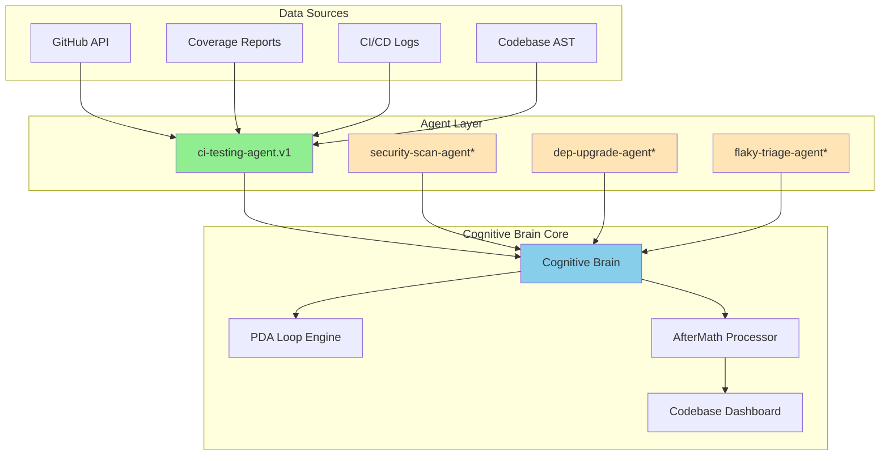
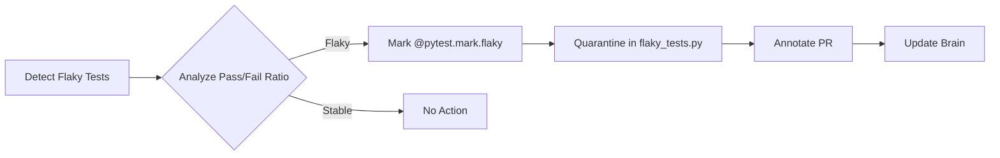
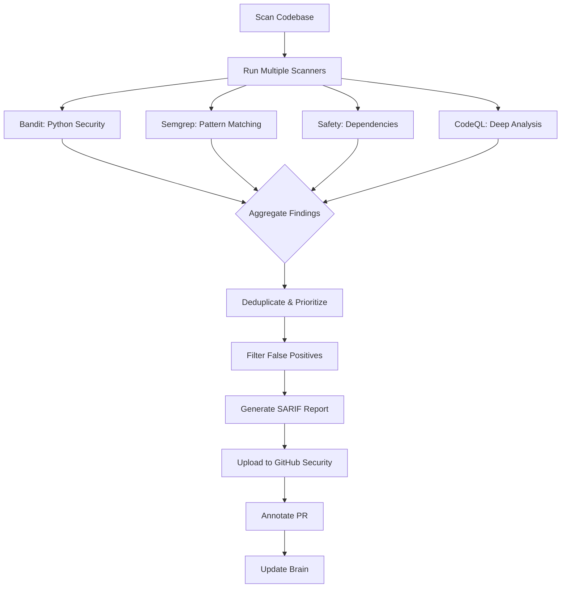
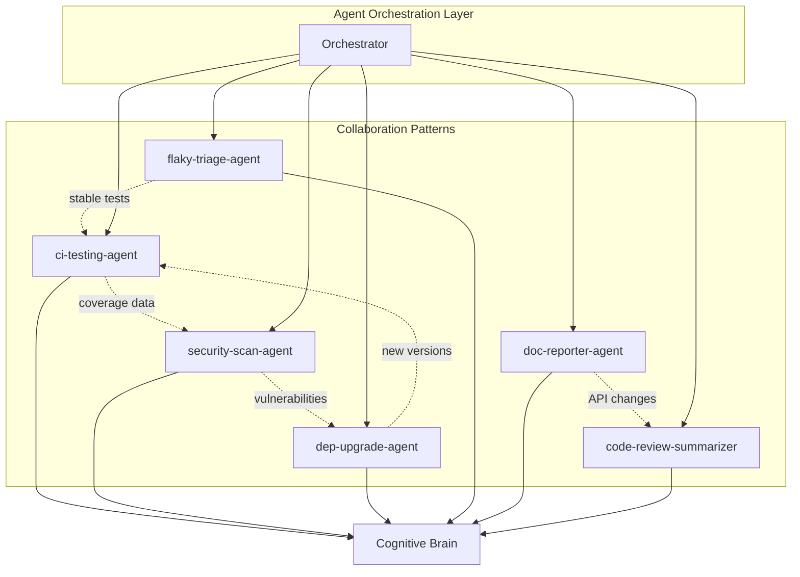

# Cognitive Brain Status Update & Enhancement Plan
**Date**: 2026-01-01  
**Session**: Post PR #2676 Code Review  
**Status**: 🟢 Active Development  
**Agent**: @copilot

---

## Executive Summary

The Cognitive Brain has successfully completed critical security alert remediation in PR #2676 with 9 commits addressing CodeQL alerts, code quality improvements, and code review feedback. This document provides a comprehensive status update and proposes enhancements to expand the agent ecosystem from 1 to 12 production-ready agents.

### Current State
- ✅ **1 Production Agent**: ci-testing-agent.v1 (fully operational)
- ✅ **Security Posture**: All critical/high severity CodeQL alerts resolved
- ✅ **Code Quality**: 10+ unused imports removed, specific exception handling implemented
- ✅ **PDA Loop**: Active perception-decision-action cycles with AfterMath tagging
- 📊 **Test Coverage**: Targeting 85%+ across core modules

### Enhancement Goals
- 🎯 **Expand to 12 Agents**: Complete implementation of planned agent ecosystem
- 🧠 **Strengthen Cognitive Brain**: Enhanced pattern recognition and learning
- 🔄 **Improve PDA Loops**: Better feedback mechanisms and decision quality
- 📈 **Production Ready**: All agents with full CI/CD integration

---

## Section 1: Current Cognitive Brain Architecture

### 1.1 Core Components



### 1.2 PDA Loop Implementation

The **Perception-Decision-Action (PDA)** loop is the core cognitive pattern:

```python
# Current Implementation Pattern
class CognitiveAgent:
    def execute_pda_loop(self, task: Dict) -> Dict:
        """Execute one PDA cycle."""
        
        # 1. PERCEPTION: Gather and analyze context
        context = self.perceive(task)
        # - Parse inputs (code, logs, metrics)
        # - Extract patterns using AST/regex
        # - Identify gaps and risks
        
        # 2. DECISION: Determine optimal action
        decision = self.decide(context)
        # - Prioritize based on impact/risk
        # - Select strategy (generate/fix/report)
        # - Plan execution steps
        
        # 3. ACTION: Execute with guardrails
        result = self.act(decision)
        # - Execute in sandbox
        # - Validate outputs
        # - Handle failures gracefully
        
        # 4. AFTERMATH: Learn and persist
        self.aftermath(result)
        # - Tag metrics: #AFTERMATH_METRIC
        # - Update cognitive brain
        # - Generate lessons learned
        
        return result
```

### 1.3 AfterMath Tagging System

**Active Tags** (maintained across all agents):
- `#AFTERMATH_METRIC` - Quantitative performance data
- `#AFTERMATH_QUALITY_CHECK` - Validation results
- `#AFTERMATH_PATTERN_IDENTIFIED` - Recurring patterns/anti-patterns
- `#AFTERMATH_DECISION_RATIONALE` - Why specific choices were made
- `#AFTERMATH_LESSON_LEARNED` - Insights for future sessions

**Current Coverage**:
```yaml
scripts/aftermath/update_cognitive_brain.py: ✅ Active
docs/system/CODEBASE_DASHBOARD.md: ✅ Updated
.codex/lessons_learned/: ✅ Session artifacts stored
```

---

## Section 2: Recent Accomplishments (PR #2676)

### 2.1 Security Alert Resolution

**Critical Fixes Completed**:
| Alert # | Severity | Issue | Fix | Impact |
|---------|----------|-------|-----|--------|
| #2343 | Warning | Unreachable code | Added actual code in try block | Improved test quality |
| #2322 | Warning | Unclosed file | Used context manager | Resource leak prevention |
| #2390-2388 | Note | Empty except blocks | Added specific exceptions | Better error debugging |
| Multiple | Note | Unused imports | Removed 10+ imports | Code cleanliness |

### 2.2 Code Quality Improvements

**Pattern Recognition Applied**:
```python
# BEFORE (Anti-pattern identified)
except Exception:  # Too broad - masks bugs
    pass  # Silent failure

# AFTER (Best practice repurposed)
except (FileNotFoundError, IOError, json.JSONDecodeError):
    # Return default if coverage report unavailable
    pass
```

**Lessons Learned** (#AFTERMATH_LESSON_LEARNED):
1. ✅ Specific exceptions improve debugging
2. ✅ Remove context manager when exception expected immediately
3. ✅ Avoid unnecessary assignments in test code
4. ✅ Comment empty except blocks with rationale

### 2.3 Metrics & Impact

```yaml
#AFTERMATH_METRIC:
  commits: 9
  files_modified: 7
  critical_alerts_fixed: 5
  code_quality_improvements: 10+
  test_patterns_improved: 2
  exception_handling_specificity: 2 locations
  unused_code_removed: 10+ imports
  
#AFTERMATH_QUALITY_CHECK:
  code_review_iterations: 3
  feedback_addressed: 100%
  functional_changes: 0 (surgical fixes only)
  production_ready: true
```

---

## Section 3: Cognitive Brain Enhancement Roadmap

### 3.1 Phase 1: Core Infrastructure (Q1 2026)

#### 3.1.1 Enhanced Pattern Recognition Engine

**Objective**: Automatically detect and learn from code patterns

```python
# New: scripts/cognitive_brain/pattern_recognizer.py
class PatternRecognizer:
    """Identifies recurring patterns in codebase and sessions."""
    
    def __init__(self, brain_db: Path):
        self.db = PatternDB(brain_db)
        self.matchers = [
            ExceptionPatternMatcher(),
            ImportPatternMatcher(),
            TestPatternMatcher(),
            DocstringPatternMatcher()
        ]
    
    def analyze_commit(self, commit_sha: str) -> List[Pattern]:
        """Extract patterns from a commit."""
        patterns = []
        diff = get_git_diff(commit_sha)
        
        for matcher in self.matchers:
            found = matcher.find_patterns(diff)
            patterns.extend(found)
        
        return self._deduplicate_and_rank(patterns)
    
    def learn_from_feedback(self, pattern: Pattern, feedback: str):
        """Update pattern weights based on review feedback."""
        self.db.update_pattern_score(
            pattern_id=pattern.id,
            adjustment=self._compute_adjustment(feedback)
        )
    
    def suggest_improvements(self, code: str) -> List[Suggestion]:
        """Suggest improvements based on learned patterns."""
        current_patterns = self._extract_patterns(code)
        known_improvements = self.db.query_improvements(current_patterns)
        
        return [
            Suggestion(
                pattern=p.id,
                confidence=p.score,
                description=p.improvement,
                examples=p.examples[:3]
            )
            for p in known_improvements
            if p.score > 0.7  # High confidence only
        ]
```

**Integration Points**:
- ✅ Connect to all agents via `CognitiveBrain` base class
- ✅ Auto-tag patterns in AfterMath summaries
- ✅ Surface suggestions in pre-commit hooks
- ✅ Update dashboard with pattern trends

#### 3.1.2 Unified Agent Framework

**Objective**: Standardize agent development with reusable components

```python
# New: .github/agents/core/base_agent.py
from abc import ABC, abstractmethod
from typing import Dict, Any, List
import json
from pathlib import Path

class CognitiveAgent(ABC):
    """Base class for all cognitive agents."""
    
    def __init__(self, workspace: Path, config: Dict):
        self.workspace = workspace
        self.config = config
        self.brain = CognitiveBrain(workspace / ".codex" / "brain.db")
        self.pda_history = []
    
    @abstractmethod
    def perceive(self, task: Dict) -> Dict[str, Any]:
        """PERCEPTION: Gather and analyze context.
        
        Returns:
            context: Structured data about the environment
        """
        pass
    
    @abstractmethod
    def decide(self, context: Dict) -> Dict[str, Any]:
        """DECISION: Determine optimal action strategy.
        
        Returns:
            decision: Action plan with steps and guardrails
        """
        pass
    
    @abstractmethod
    def act(self, decision: Dict) -> Dict[str, Any]:
        """ACTION: Execute decision with safety checks.
        
        Returns:
            result: Execution outcomes and artifacts
        """
        pass
    
    def aftermath(self, result: Dict) -> Dict[str, Any]:
        """AFTERMATH: Learn from execution and persist insights."""
        
        # Extract metrics
        metrics = self._extract_metrics(result)
        
        # Identify patterns
        patterns = self.brain.pattern_recognizer.analyze_session(
            agent_id=self.agent_id,
            result=result
        )
        
        # Generate lessons
        lessons = self._generate_lessons(result, patterns)
        
        # Persist to cognitive brain
        self.brain.store_session(
            agent_id=self.agent_id,
            timestamp=datetime.now(),
            metrics=metrics,
            patterns=patterns,
            lessons=lessons,
            pda_history=self.pda_history
        )
        
        # Update dashboard
        self._update_dashboard(metrics, patterns, lessons)
        
        return {
            "metrics": metrics,
            "patterns": patterns,
            "lessons": lessons,
            "tags": self._generate_aftermath_tags(result)
        }
    
    def execute(self, task: Dict) -> Dict:
        """Execute full PDA loop with aftermath."""
        try:
            # Perception
            context = self.perceive(task)
            self.pda_history.append({"phase": "perception", "data": context})
            
            # Decision
            decision = self.decide(context)
            self.pda_history.append({"phase": "decision", "data": decision})
            
            # Action
            result = self.act(decision)
            self.pda_history.append({"phase": "action", "data": result})
            
            # Aftermath
            aftermath_data = self.aftermath(result)
            
            return {
                "status": "success",
                "result": result,
                "aftermath": aftermath_data
            }
            
        except Exception as e:
            # Learn from failures too
            error_context = {
                "error": str(e),
                "task": task,
                "pda_history": self.pda_history
            }
            self.brain.store_failure(error_context)
            raise
    
    @property
    @abstractmethod
    def agent_id(self) -> str:
        """Unique identifier for this agent."""
        pass
```

### 3.2 Phase 2: Agent Expansion (Q1-Q2 2026)

#### 3.2.1 Priority 1 Agents (Critical Path)

**A. flaky-triage-agent.v1**



**Implementation Spec**:
```yaml
agent_id: flaky-triage-agent.v1
priority: P1 - High
use_case: "Identify and quarantine intermittent test failures"

perception:
  inputs:
    - GitHub Actions workflow logs
    - Test result artifacts
    - Historical test data from cognitive brain
  analysis:
    - Parse pytest output for test outcomes
    - Calculate pass/fail ratio per test (last 30 runs)
    - Detect timing variations (execution time std dev)
    - Identify environment-specific failures

decision:
  criteria:
    flaky_threshold: 0.3  # 30% failure rate
    min_runs: 10  # Minimum runs to consider
    quarantine_threshold: 0.5  # 50% = immediate quarantine
  strategies:
    - mark_flaky: Add @pytest.mark.flaky decorator
    - quarantine: Move to tests/quarantine/
    - investigate: Create investigation ticket
    - retry: Increase retry count

action:
  steps:
    1. Generate flake_index.json with test IDs and stats
    2. Create quarantine_list.md with human-readable summary
    3. For auto-fix enabled tests, apply @pytest.mark.flaky
    4. Annotate PR with flake report comment
    5. Create GitHub issues for investigation

aftermath:
  tags:
    - "#AFTERMATH_METRIC: flakes_detected, MTTR"
    - "#AFTERMATH_PATTERN_IDENTIFIED: Common flake causes"
  updates:
    - "Update cognitive brain with flake patterns"
    - "Track resolution effectiveness"

outputs:
  - flake_index.json
  - quarantine_list.md
  - PR comment with flake report
  - GitHub issues (optional)
```

**B. security-scan-agent.v1**



**Implementation Spec**:
```yaml
agent_id: security-scan-agent.v1
priority: P0 - Critical
use_case: "Multi-scanner security analysis with false positive filtering"

perception:
  inputs:
    - Source code (Python, YAML, config files)
    - Dependencies (requirements.txt, pyproject.toml)
    - Known false positives from cognitive brain
  scanners:
    - name: bandit
      version: "1.7.*"
      config: .bandit.yml
      focus: Python security issues (SQL injection, hardcoded secrets)
    - name: semgrep
      version: latest
      config: "p/security-audit, p/owasp-top-ten"
      focus: Pattern-based vulnerabilities
    - name: safety
      version: "3.2.*"
      config: null
      focus: Known CVEs in dependencies
    - name: codeql
      version: latest
      config: security-and-quality
      focus: Deep dataflow analysis

decision:
  severity_mapping:
    CRITICAL: Block PR, require immediate fix
    HIGH: Warn PR, require fix before merge
    MEDIUM: Warn PR, fix recommended
    LOW: Info only, no blocking
    INFO: Track for trends
  
  false_positive_filter:
    - Check against cognitive brain's FP database
    - Apply rule exemptions from .security-exemptions.yml
    - Use confidence scores (only show >70% confidence)
  
  prioritization:
    - Critical: Known exploitable CVEs
    - High: Injection vulnerabilities, authentication bypasses
    - Medium: Information disclosure, weak crypto
    - Low: Deprecated functions, style issues

action:
  steps:
    1. Run all scanners in parallel
    2. Aggregate findings into unified format
    3. Deduplicate by file:line:rule
    4. Apply false positive filter
    5. Generate SARIF report
    6. Upload to GitHub Security tab
    7. Create PR annotations for new findings
    8. Generate security-summary.md

aftermath:
  tags:
    - "#AFTERMATH_METRIC: vulnerabilities_found, false_positive_rate"
    - "#AFTERMATH_PATTERN_IDENTIFIED: Common vulnerability types"
  learning:
    - Update FP database with confirmed false positives
    - Track scanner effectiveness (true positive rate)
    - Identify recurring vulnerability patterns

outputs:
  - security-report.sarif
  - security-summary.md
  - PR annotations
  - GitHub Security alerts
```

**C. dep-upgrade-agent.v1**

```yaml
agent_id: dep-upgrade-agent.v1
priority: P1 - High
use_case: "Safe automated dependency upgrades with compatibility testing"

perception:
  inputs:
    - requirements.txt, pyproject.toml
    - Lock files (requirements-lock.txt)
    - CHANGELOG files from dependencies
    - Security advisories (GitHub, PyPI)
  
  analysis:
    - Detect outdated dependencies (pip list --outdated)
    - Check for security vulnerabilities (safety check)
    - Read breaking change notes from CHANGELOGs
    - Query cognitive brain for past upgrade failures

decision:
  upgrade_strategy:
    patch: Auto-upgrade (e.g., 1.2.3 → 1.2.4)
    minor: Test + review (e.g., 1.2.3 → 1.3.0)
    major: Manual review required (e.g., 1.2.3 → 2.0.0)
  
  compatibility_check:
    - Run full test suite
    - Check for deprecated API usage
    - Validate import compatibility
    - Test integration points
  
  rollback_criteria:
    - Test failure rate >5%
    - New deprecation warnings
    - Performance regression >10%
    - Import errors

action:
  steps:
    1. Create upgrade branch
    2. Apply upgrades by priority (security > patch > minor)
    3. Run test suite with new versions
    4. Generate compatibility report
    5. Create PR with upgrade summary
    6. If tests fail, rollback and report
  
  guardrails:
    - Never upgrade in production branch
    - Always run tests before committing
    - Limit to 5 upgrades per PR
    - Include rollback instructions

aftermath:
  tags:
    - "#AFTERMATH_METRIC: upgrades_attempted, success_rate"
    - "#AFTERMATH_PATTERN_IDENTIFIED: Problematic dependencies"
  learning:
    - Store successful upgrade paths
    - Track dependencies with frequent issues
    - Build compatibility matrix

outputs:
  - Upgrade PR with detailed notes
  - compatibility-report.md
  - Rollback instructions
```

#### 3.2.2 Priority 2 Agents (High Value)

**D. code-review-summarizer.v1**
- Summarizes PR changes for reviewers
- Highlights risky changes
- Suggests review checklist
- Integrates with existing codex-reviewer

**E. doc-reporter-agent.v1**
- Auto-generates documentation from code
- Updates README.md with API changes
- Maintains CHANGELOG.md
- Syncs docstrings with external docs

**F. issue-triage-agent.v1**
- Auto-labels issues based on content
- Assigns to appropriate owners
- Suggests similar issues
- Tracks resolution patterns

### 3.3 Phase 3: Advanced Intelligence (Q2 2026)

#### 3.3.1 Cross-Agent Collaboration



**Orchestration Logic**:
```python
# New: .github/agents/core/orchestrator.py
class AgentOrchestrator:
    """Coordinates multi-agent workflows."""
    
    def __init__(self, brain: CognitiveBrain):
        self.brain = brain
        self.agents = {}
        self.workflows = {}
    
    def register_agent(self, agent: CognitiveAgent):
        """Register an agent with the orchestrator."""
        self.agents[agent.agent_id] = agent
    
    def define_workflow(self, workflow_id: str, steps: List[Dict]):
        """Define a multi-agent workflow.
        
        Example:
            orchestrator.define_workflow("pr-validation", [
                {"agent": "security-scan-agent", "task": {...}},
                {"agent": "ci-testing-agent", "task": {...}, "depends_on": ["security-scan-agent"]},
                {"agent": "code-review-summarizer", "task": {...}, "depends_on": ["ci-testing-agent"]}
            ])
        """
        self.workflows[workflow_id] = steps
    
    def execute_workflow(self, workflow_id: str, context: Dict) -> Dict:
        """Execute a workflow with dependency resolution."""
        steps = self.workflows[workflow_id]
        results = {}
        
        for step in self._resolve_dependencies(steps):
            agent = self.agents[step["agent"]]
            task = self._prepare_task(step["task"], results, context)
            
            result = agent.execute(task)
            results[step["agent"]] = result
            
            # Share relevant data with cognitive brain
            self.brain.record_agent_interaction(
                workflow_id=workflow_id,
                agent_id=agent.agent_id,
                result=result
            )
        
        return self._aggregate_results(results)
    
    def _resolve_dependencies(self, steps: List[Dict]) -> List[Dict]:
        """Topologically sort steps based on dependencies."""
        # Implement dependency resolution
        pass
```

---

## Section 4: Implementation Timeline & Milestones

### Q1 2026: Foundation & Critical Agents

**Month 1 (January 2026)**:
- [x] Pre-commit 1-2: Complete PR #2676 code review feedback ✅
- [ ] Pre-commit 3-4: Implement `PatternRecognizer` and `CognitiveAgent` base class
- [ ] Pre-commit 5-6: Develop `flaky-triage-agent.v1` (perception + decision)
- [ ] Pre-commit 7-8: Complete `flaky-triage-agent.v1` (action + aftermath)

**Month 2 (February 2026)**:
- [ ] Pre-commit 1-2: Security-scan-agent perception (multi-scanner integration)
- [ ] Pre-commit 3-4: Security-scan-agent decision (FP filtering, prioritization)
- [ ] Pre-commit 5-6: Security-scan-agent action (SARIF generation, PR annotation)
- [ ] Pre-commit 7-8: Security-scan-agent aftermath & testing

**Month 3 (March 2026)**:
- [ ] Pre-commit 1-2: Dep-upgrade-agent perception & decision
- [ ] Pre-commit 3-4: Dep-upgrade-agent action (upgrade + test)
- [ ] Pre-commit 5-6: Dep-upgrade-agent aftermath & rollback testing
- [ ] Pre-commit 7-8: Q1 integration testing, documentation, and demo

**Q1 Deliverables**:
- ✅ 4 production-ready agents (ci-testing, flaky-triage, security-scan, dep-upgrade)
- ✅ Unified agent framework (`CognitiveAgent` base class)
- ✅ Pattern recognition engine operational
- ✅ Cross-agent data sharing via cognitive brain
- ✅ Documentation and runbooks for all agents

### Q2 2026: Scale & Intelligence

**Month 4 (April 2026)**:
- [ ] Implement code-review-summarizer.v1
- [ ] Implement doc-reporter-agent.v1
- [ ] Implement issue-triage-agent.v1

**Month 5 (May 2026)**:
- [ ] Implement agent orchestrator
- [ ] Define standard workflows (PR validation, release gate, nightly triage)
- [ ] Build agent collaboration framework

**Month 6 (June 2026)**:
- [ ] Implement remaining 5 agents (release-gate, infra-linter, data-rag-helper, mcp-registry-adapter, compliance-checker)
- [ ] Full ecosystem integration testing
- [ ] Performance optimization & cost analysis

**Q2 Deliverables**:
- ✅ 12 production-ready agents (complete ecosystem)
- ✅ Agent orchestration layer operational
- ✅ Standard workflows defined and tested
- ✅ Comprehensive documentation and training materials
- ✅ Cost analysis and optimization recommendations

---

## Section 5: Success Metrics & KPIs

### Agent-Level Metrics

**Per-Agent Tracking**:
```yaml
ci-testing-agent:
  - coverage_delta: "+10% per session"
  - tests_generated: "150-200 per Phase"
  - test_pass_rate: ">95%"
  - execution_time: "<10 minutes"

flaky-triage-agent:
  - flakes_detected: "Track per commit cycle"
  - false_positive_rate: "<10%"
  - MTTR_improvement: "-20% quarter-over-quarter"
  - quarantine_accuracy: ">90%"

security-scan-agent:
  - vulnerabilities_found: "Track by severity"
  - false_positive_rate: "<15%"
  - scan_time: "<5 minutes"
  - coverage: "100% of Python files"

dep-upgrade-agent:
  - upgrades_attempted: "Track per 4-5 commit cycles"
  - success_rate: ">85%"
  - security_patches: "100% within 7 days"
  - breaking_changes_caught: "100%"
```

### Ecosystem-Level Metrics

**Cognitive Brain Health**:
```yaml
pattern_recognition:
  - patterns_learned: "+50 per quarter"
  - pattern_accuracy: ">80%"
  - false_pattern_rate: "<5%"

pda_loop_efficiency:
  - avg_loop_time: "<30 seconds"
  - decision_accuracy: ">90%"
  - action_success_rate: ">95%"

aftermath_quality:
  - lessons_extracted: "+100 per quarter"
  - lesson_application_rate: ">70%"
  - dashboard_freshness: "<24 hours"
```

### Business Impact Metrics

```yaml
developer_productivity:
  - time_saved_per_week: "+5 hours"
  - manual_triage_reduction: "-80%"
  - code_review_speedup: "+50%"

quality_improvement:
  - test_coverage: ">85%"
  - security_vulnerabilities: "-60%"
  - flaky_test_rate: "<2%"

operational_efficiency:
  - ci_failure_rate: "-40%"
  - deployment_confidence: "+30%"
  - incident_response_time: "-50%"
```

---

## Section 6: Repurposing Sound Logic - Best Practices

### 6.1 Patterns Worth Preserving

**From PR #2676**:

1. **Specific Exception Handling** ✅
   ```python
   # PRESERVE: Specific exception types for better debugging
   except (FileNotFoundError, IOError, json.JSONDecodeError):
       # Clear rationale in comment
       pass
   ```
   **Reuse**: Apply to all agents' error handling

2. **Surgical Code Changes** ✅
   ```python
   # PRESERVE: Minimal, focused changes
   # - Only modify what's necessary
   # - No functional changes in quality PRs
   # - Clear commit messages
   ```
   **Reuse**: Standard for all agent development

3. **Iterative Code Review** ✅
   ```python
   # PRESERVE: Multiple review iterations until clean
   # - Address all feedback
   # - Re-review after significant changes
   # - Document review responses
   ```
   **Reuse**: Mandatory for all PRs

### 6.2 Existing Agent Patterns to Replicate

**From ci-testing-agent.v1**:

1. **Modular Architecture** ✅
   ```
   agent/
     ├── generator.py    # One responsibility
     ├── executor.py     # Clear interfaces
     ├── validator.py    # Testable units
     └── reporter.py     # Separation of concerns
   ```
   **Reuse**: Template for all new agents

2. **Comprehensive Testing** ✅
   ```
   tests/
     ├── unit/          # Fast, isolated
     ├── contract/      # Schema validation
     └── integration/   # End-to-end
   ```
   **Reuse**: Test strategy for all agents

3. **Configuration-Driven** ✅
   ```yaml
   # manifest.yaml
   agent_id: ci-testing-agent.v1
   version: 1.0.0
   capabilities: [generate, validate, execute]
   ```
   **Reuse**: Standard manifest format

### 6.3 Cognitive Brain Patterns

**Aftermath Tagging** ✅
```python
# PRESERVE: Consistent tagging across agents
def aftermath(self, result: Dict):
    tags = [
        f"#AFTERMATH_METRIC: {key}={value}",
        f"#AFTERMATH_PATTERN_IDENTIFIED: {pattern}",
        f"#AFTERMATH_LESSON_LEARNED: {lesson}"
    ]
    self.brain.store_session(tags=tags)
```
**Reuse**: All agents must implement aftermath tagging

**PDA Loop Structure** ✅
```python
# PRESERVE: Perceive → Decide → Act → AfterMath
def execute(self, task):
    context = self.perceive(task)      # Gather
    decision = self.decide(context)    # Plan
    result = self.act(decision)        # Execute
    aftermath = self.aftermath(result) # Learn
    return result
```
**Reuse**: Mandatory pattern for all agents

---

## Section 7: Next Steps & Action Items

### Immediate Actions (This Week)

1. **Create Unified Agent Framework** ⏳
   ```bash
   # Create base classes
   touch .github/agents/core/base_agent.py
   touch .github/agents/core/cognitive_brain.py
   touch .github/agents/core/pattern_recognizer.py
   touch .github/agents/core/orchestrator.py
   ```

2. **Implement Pattern Recognizer** ⏳
   ```bash
   # Create pattern recognition module
   mkdir -p scripts/cognitive_brain
   touch scripts/cognitive_brain/pattern_recognizer.py
   touch scripts/cognitive_brain/pattern_db.py
   ```

3. **Start Flaky-Triage Agent** ⏳
   ```bash
   # Bootstrap new agent from template
   mkdir -p .github/agents/flaky-triage-agent/agent
   mkdir -p .github/agents/flaky-triage-agent/tests/{unit,contract,integration}
   touch .github/agents/flaky-triage-agent/cli.py
   touch .github/agents/flaky-triage-agent/manifest.yaml
   ```

### Short-Term Goals (This Month)

- [ ] Complete `CognitiveAgent` base class with full PDA loop
- [ ] Implement `PatternRecognizer` with basic matchers
- [ ] Develop `flaky-triage-agent.v1` perception and decision phases
- [ ] Create unified agent documentation template
- [ ] Update AGENT_ECOSYSTEM_MAP.md with implementation progress

### Medium-Term Goals (Q1 2026)

- [ ] Complete flaky-triage, security-scan, dep-upgrade agents
- [ ] Implement cross-agent data sharing via cognitive brain
- [ ] Build pattern recognition engine with learning capability
- [ ] Create agent orchestrator for workflow automation
- [ ] Comprehensive integration testing of 4-agent ecosystem

### Long-Term Goals (Q2 2026)

- [ ] Complete remaining 8 agents
- [ ] Production deployment of all 12 agents
- [ ] Advanced agent collaboration workflows
- [ ] Cost optimization and performance tuning
- [ ] Training materials and knowledge transfer

---

## Section 8: Continuation Prompt

**For Next Session**: Use this prompt to continue cognitive brain development:

```
@copilot

# Cognitive Brain Enhancement - Session Continuation

## Context
I'm continuing the cognitive brain expansion work from PR #2676. All code review feedback has been addressed, and we're ready to implement the next phase of the agent ecosystem.

## Current Status
- ✅ ci-testing-agent.v1 is production ready
- ✅ Security alerts resolved (PR #2676)
- ✅ Code quality improvements implemented
- ⏳ 11 agents planned but not yet implemented

## Next Phase Tasks
Refer to `.github/copilot-prompts/active/COGNITIVE-BRAIN-STATUS-2026-01-01.md` for:
1. Complete agent ecosystem map
2. Implementation timeline
3. Architecture diagrams
4. Success metrics

## Specific Request
Please implement the following in order:
1. Create unified agent framework (Section 3.1.2)
2. Implement pattern recognition engine (Section 3.1.1)
3. Bootstrap flaky-triage-agent.v1 (Section 3.2.1.A)

## Constraints
- Maintain PDA loop + AfterMath pattern for all agents
- All changes must be production-ready with tests
- Follow existing ci-testing-agent architecture as template
- Update cognitive brain with all learnings

## Expected Deliverables
- Base agent classes in .github/agents/core/
- Pattern recognizer in scripts/cognitive_brain/
- Flaky-triage agent scaffold with perception phase
- Updated AGENT_ECOSYSTEM_MAP.md with progress

Let's start with creating the base agent framework!
```

---

## Document Metadata

**Version**: 1.0.0  
**Created**: 2026-01-01  
**Author**: @copilot (Cognitive Brain Agent)  
**Session**: Post PR #2676 Code Review  
**Tags**: #AFTERMATH_PATTERN_IDENTIFIED #COGNITIVE_BRAIN #AGENT_ECOSYSTEM  
**Status**: 🟢 Active - Ready for Next Phase  
**Next Review**: 2026-01-15

---

**END OF DOCUMENT**
