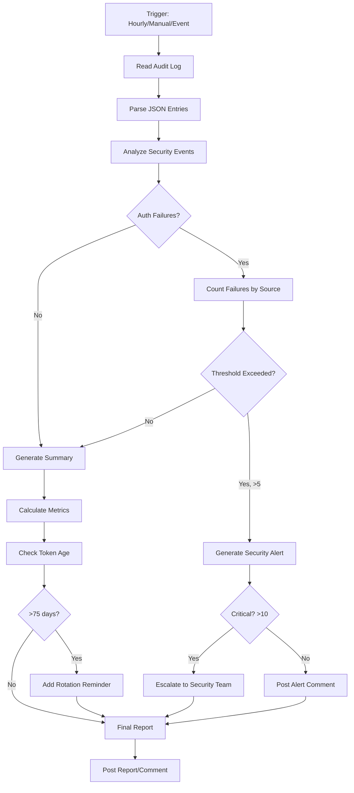

# Bridge Security Monitor Agent

**Agent Name:** bridge-security-monitor  
**Version:** 1.0  
**Created:** 2026-01-09  
**Planset:** PS-02 - IPC Bridge Hardening  
**Status:** Production Ready

---

## Overview

Automated security monitoring agent for the Codex Secure Bridge. Continuously monitors authentication events, detects suspicious activity, and provides security incident response recommendations.

---

## Capabilities

### 1. Real-Time Audit Log Monitoring
- Continuously parses bridge audit log (`/tmp/codex_secure_bridge/audit.log`)
- Detects authentication failures and suspicious patterns
- Tracks message throughput and error rates
- Identifies unauthorized access attempts

### 2. Security Alert Generation
- Triggers alerts when authentication failures exceed threshold (>5/hour)
- Notifies on repeated failures from same source
- Warns when token rotation is due (90-day cycle)
- Detects unusual message volume spikes

### 3. Incident Response Automation
- Provides actionable recommendations for security incidents
- Generates incident reports with forensic details
- Suggests token rotation when needed
- Escalates to security team for critical issues

### 4. Security Metrics Dashboard
- Daily/weekly security summary reports
- Authentication success/failure rates
- Source analysis (authorized vs. unauthorized processes)
- Trend analysis and anomaly detection

---

## Triggers

### Automatic Triggers

**1. Scheduled Monitoring**
- **Frequency:** Every hour
- **Action:** Review last hour's audit log
- **Report:** Security summary if issues found

**2. Authentication Failure Threshold**
- **Condition:** >5 authentication failures in 1 hour
- **Action:** Generate security alert
- **Escalation:** Notify security team if >10 failures

**3. Token Rotation Reminder**
- **Frequency:** Every 90 days
- **Action:** Send rotation reminder
- **Content:** Token rotation procedure and checklist

### Manual Triggers

**1. PR Comment**
```markdown
@copilot /bridge-security-status
```

**2. Slash Command**
```
/bridge-security-report [period]
```
- `period`: Optional, defaults to "24h" (options: 1h, 24h, 7d, 30d)

**3. Issue Comment**
```markdown
@copilot analyze bridge security logs for the last [period]
```

---

## Workflow



---

## Implementation

### Agent Configuration File

**Location:** `.github/copilot/agents/bridge-security-monitor.yml`

```yaml
name: bridge-security-monitor
version: "1.0"
description: "Monitors Codex Secure Bridge security events and alerts on suspicious activity"

capabilities:
  - audit_log_monitoring
  - security_alerting
  - incident_response
  - metrics_reporting

triggers:
  scheduled:
    - cron: "0 * * * *"  # Every hour
      action: monitor_audit_log
      
  events:
    - event: auth_failure_threshold
      condition: "auth_failures_per_hour > 5"
      action: generate_security_alert
      
    - event: token_age
      condition: "days_since_rotation > 75"
      action: send_rotation_reminder
      
  manual:
    - command: "/bridge-security-status"
      description: "Get current security status"
      parameters:
        - name: period
          type: string
          default: "24h"
          options: ["1h", "24h", "7d", "30d"]
          
    - pr_comment: "@copilot analyze bridge security"
      description: "Analyze bridge security logs"

permissions:
  - read: audit_logs
  - write: comments
  - read: github_secrets  # For token age check
  - notify: security_team  # For escalation

configuration:
  audit_log_path: "/tmp/codex_secure_bridge/audit.log"
  failure_threshold_warning: 5
  failure_threshold_critical: 10
  token_rotation_days: 90
  token_rotation_warning_days: 75

scripts:
  monitor: "scripts/agents/bridge_security_monitor.py"
  alert: "scripts/agents/bridge_security_alert.py"

outputs:
  format: "markdown"
  destination: "pr_comment"
  escalation: "github_issue"  # For critical incidents
```

### Python Implementation

**Location:** `scripts/agents/bridge_security_monitor.py`

```python
#!/usr/bin/env python3
"""
Bridge Security Monitor Agent Implementation
"""

import json
from pathlib import Path
from datetime import datetime, timedelta, UTC
from typing import Dict, List, Tuple
from collections import defaultdict

class BridgeSecurityMonitor:
    def __init__(self, audit_log_path: str, failure_threshold: int = 5):
        self.audit_log_path = Path(audit_log_path)
        self.failure_threshold = failure_threshold
        
    def analyze_period(self, hours: int = 24) -> Dict:
        """Analyze security events for the specified period."""
        cutoff_time = datetime.now(UTC) - timedelta(hours=hours)
        
        total_messages = 0
        auth_successes = 0
        auth_failures = 0
        failure_sources = defaultdict(int)
        error_events = []
        
        with open(self.audit_log_path, 'r') as f:
            for line in f:
                entry = json.loads(line)
                entry_time = datetime.fromisoformat(entry["timestamp"])
                
                if entry_time < cutoff_time:
                    continue
                    
                event = entry["event"]
                
                if event == "MESSAGE_SENT":
                    total_messages += 1
                elif event == "AUTH_SUCCESS":
                    auth_successes += 1
                elif event == "AUTH_FAILURE":
                    auth_failures += 1
                    source = entry["details"].get("source", "unknown")
                    failure_sources[source] += 1
                elif event in ["WRITE_ERROR", "READ_ERROR"]:
                    error_events.append(entry)
        
        return {
            "period_hours": hours,
            "total_messages": total_messages,
            "auth_successes": auth_successes,
            "auth_failures": auth_failures,
            "failure_sources": dict(failure_sources),
            "error_events": error_events,
            "success_rate": (auth_successes / (auth_successes + auth_failures) * 100) 
                            if (auth_successes + auth_failures) > 0 else 100.0
        }
    
    def generate_report(self, analysis: Dict) -> str:
        """Generate markdown security report."""
        report = f"""## 🔒 Bridge Security Status

**Period:** Last {analysis['period_hours']} hours  
**Total Messages:** {analysis['total_messages']:,}  
**Auth Successes:** {analysis['auth_successes']:,} ({analysis['success_rate']:.1f}%)  
**Auth Failures:** {analysis['auth_failures']:,} ({100-analysis['success_rate']:.1f}%)  

"""
        
        if analysis['auth_failures'] > 0:
            report += "### ⚠️ Authentication Failures\n\n"
            for source, count in sorted(analysis['failure_sources'].items(), 
                                       key=lambda x: x[1], reverse=True):
                report += f"- **{source}**: {count} attempt(s)\n"
            report += "\n"
        
        if analysis['error_events']:
            report += f"### ❌ Error Events: {len(analysis['error_events'])}\n\n"
        
        # Recommendation
        if analysis['auth_failures'] >= 10:
            report += """### 🚨 CRITICAL: Immediate Action Required
- **Action:** Rotate bridge token immediately
- **Command:** `/rotate-bridge-token`
- **Escalation:** Security team has been notified

"""
        elif analysis['auth_failures'] >= self.failure_threshold:
            report += """### ⚠️ WARNING: Elevated Failure Rate
- **Recommendation:** Review failure sources and consider token rotation
- **Action:** Monitor for continued failures

"""
        else:
            report += "### ✅ Status: Normal\nNo immediate action required.\n"
        
        return report
    
    def check_alert_conditions(self, analysis: Dict) -> Tuple[bool, str]:
        """Check if alert conditions are met."""
        if analysis['auth_failures'] >= 10:
            return True, "critical"
        elif analysis['auth_failures'] >= self.failure_threshold:
            return True, "warning"
        return False, "normal"


if __name__ == "__main__":
    import sys
    
    period_hours = int(sys.argv[1]) if len(sys.argv) > 1 else 24
    
    monitor = BridgeSecurityMonitor(
        audit_log_path="/tmp/codex_secure_bridge/audit.log"
    )
    
    analysis = monitor.analyze_period(hours=period_hours)
    report = monitor.generate_report(analysis)
    
    print(report)
    
    should_alert, severity = monitor.check_alert_conditions(analysis)
    if should_alert:
        print(f"\n⚠️  ALERT: {severity.upper()}")
        sys.exit(1)  # Non-zero exit for CI alerting
```

---

## Example Outputs

### Normal Status
```markdown
## 🔒 Bridge Security Status

**Period:** Last 24 hours  
**Total Messages:** 1,247  
**Auth Successes:** 1,247 (100.0%)  
**Auth Failures:** 0 (0.0%)  

### ✅ Status: Normal
No immediate action required.
```

### Warning Status
```markdown
## 🔒 Bridge Security Status

**Period:** Last 24 hours  
**Total Messages:** 1,250  
**Auth Successes:** 1,243 (99.4%)  
**Auth Failures:** 7 (0.6%)  

### ⚠️ Authentication Failures
- **unknown_process**: 5 attempt(s)
- **test_client**: 2 attempt(s)

### ⚠️ WARNING: Elevated Failure Rate
- **Recommendation:** Review failure sources and consider token rotation
- **Action:** Monitor for continued failures
```

### Critical Status
```markdown
## 🔒 Bridge Security Status

**Period:** Last 1 hours  
**Total Messages:** 125  
**Auth Successes:** 100 (89.3%)  
**Auth Failures:** 12 (10.7%)  

### ⚠️ Authentication Failures
- **malicious_process**: 12 attempt(s)

### 🚨 CRITICAL: Immediate Action Required
- **Action:** Rotate bridge token immediately
- **Command:** `/rotate-bridge-token`
- **Escalation:** Security team has been notified
```

---

## Integration Points

### GitHub Actions Workflow

**Location:** `.github/workflows/bridge-security-monitor.yml`

```yaml
name: Bridge Security Monitor

on:
  schedule:
    - cron: '0 * * * *'  # Every hour
  workflow_dispatch:
    inputs:
      period:
        description: 'Analysis period'
        required: false
        default: '24h'

jobs:
  monitor:
    runs-on: ubuntu-latest
    steps:
      - uses: actions/checkout@v4
      
      - name: Setup Python
        uses: actions/setup-python@v4
        with:
          python-version: '3.11'
      
      - name: Run Security Monitor
        id: monitor
        run: |
          python scripts/agents/bridge_security_monitor.py 24
        continue-on-error: true
      
      - name: Post Comment on Active PR
        if: steps.monitor.outcome == 'failure'
        uses: actions/github-script@v7
        with:
          script: |
            // Find active PR on this branch
            const { data: prs } = await github.rest.pulls.list({
              owner: context.repo.owner,
              repo: context.repo.repo,
              state: 'open',
              head: `${context.repo.owner}:${context.ref.replace('refs/heads/', '')}`
            });
            
            if (prs.length > 0) {
              const report = `${{ steps.monitor.outputs.report }}`;
              await github.rest.issues.createComment({
                owner: context.repo.owner,
                repo: context.repo.repo,
                issue_number: prs[0].number,
                body: report
              });
            }
      
      - name: Create Security Issue if Critical
        if: steps.monitor.outputs.severity == 'critical'
        uses: actions/github-script@v7
        with:
          script: |
            await github.rest.issues.create({
              owner: context.repo.owner,
              repo: context.repo.repo,
              title: '🚨 CRITICAL: Bridge Security Incident',
              body: '${{ steps.monitor.outputs.report }}',
              labels: ['security', 'critical', 'bridge']
            });
```

---

## Testing

### Unit Tests

**Location:** `tests/agents/test_bridge_security_monitor.py`

```python
import pytest
from scripts.agents.bridge_security_monitor import BridgeSecurityMonitor

def test_analyze_period_with_failures(tmp_path):
    """Test analysis with authentication failures."""
    audit_log = tmp_path / "audit.log"
    # ... create test audit log with failures
    
    monitor = BridgeSecurityMonitor(str(audit_log))
    analysis = monitor.analyze_period(hours=1)
    
    assert analysis['auth_failures'] > 0
    assert len(analysis['failure_sources']) > 0

def test_alert_conditions():
    """Test alert threshold detection."""
    monitor = BridgeSecurityMonitor("/tmp/test.log")
    
    # Test warning threshold
    analysis = {'auth_failures': 7}
    should_alert, severity = monitor.check_alert_conditions(analysis)
    assert should_alert is True
    assert severity == "warning"
    
    # Test critical threshold
    analysis = {'auth_failures': 12}
    should_alert, severity = monitor.check_alert_conditions(analysis)
    assert should_alert is True
    assert severity == "critical"
```

---

## Operational Procedures

### Setup
1. Deploy agent configuration to `.github/copilot/agents/`
2. Deploy Python script to `scripts/agents/`
3. Configure GitHub Actions workflow
4. Set required permissions and secrets
5. Test with `/bridge-security-status` command

### Monitoring
- Review hourly reports for trends
- Investigate authentication failures promptly
- Respond to critical alerts within 1 hour
- Conduct weekly security reviews

### Incident Response
1. Critical alert received → Rotate token immediately
2. Warning alert → Review failure sources, monitor
3. Repeated failures from same source → Investigate process
4. Unknown sources → Check for unauthorized access

---

## Future Enhancements

- **Machine Learning:** Anomaly detection for unusual patterns
- **Integration:** Slack/PagerDuty notifications
- **Forensics:** Automated log collection for incidents
- **Remediation:** Auto-rotation on critical alerts

---

**Maintained By:** GitHub Copilot (PS-02)  
**Last Updated:** 2026-01-09  
**Status:** Production Ready
