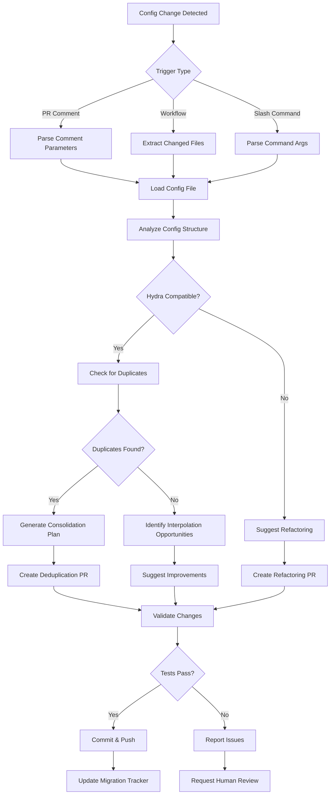

# Config Migration Assistant - Custom GitHub Copilot Agent

**Agent ID:** config-migration-assistant  
**Version:** 1.0.0  
**Status:** Production Ready  
**Created:** 2026-01-09

---

## Purpose

Automates the migration of configuration files from legacy locations to Hydra-managed `conf/` structure, following PS-01 Configuration Consolidation patterns.

---

## Capabilities

### 1. Configuration Analysis
- Scans config files for Hydra compatibility
- Identifies structure patterns (flat vs nested)
- Detects required vs optional fields
- Analyzes dependencies between configs

### 2. Duplicate Detection
- Finds identical configs in different locations
- Identifies near-duplicates with minor variations
- Suggests consolidation strategies
- Reports duplicate keys within single configs

### 3. Interpolation Recommendations
- Identifies hardcoded values that should use `${...}` interpolation
- Suggests backward compatibility aliases
- Detects potential interpolation cycles
- Proposes refactoring to eliminate duplication

### 4. Migration Automation
- Generates copy commands for config migration
- Creates directory structure in `conf/`
- Updates imports and references (Python code)
- Validates migrated configs load correctly

---

## Triggers

### 1. PR Comment
```
@copilot migrate config <path>
@copilot analyze config <path>
@copilot suggest interpolation <path>
```

### 2. GitHub Actions Workflow
**Trigger:** On changes to `configs/**/*.yaml`  
**Workflow:** `.github/workflows/config-migration-check.yml`

```yaml
name: Config Migration Check
on:
  pull_request:
    paths:
      - 'configs/**/*.yaml'
      - 'conf/**/*.yaml'
jobs:
  analyze:
    runs-on: ubuntu-latest
    steps:
      - uses: actions/checkout@v4
      - name: Trigger Config Migration Assistant
        run: |
          gh copilot agent run config-migration-assistant \
            --input "Analyze changed configs for migration opportunities"
```

### 3. Slash Command
```
/migrate-config --path configs/training/new_config.yaml
/check-duplicates --dir configs/
```

---

## Workflow Diagram



---

## Input Schema

```yaml
action: "analyze" | "migrate" | "validate" | "consolidate"
paths:
  - "configs/training/base.yaml"
  - "configs/model/*.yaml"
options:
  check_duplicates: true
  suggest_interpolation: true
  create_pr: false
  dry_run: true
```

---

## Output Schema

```yaml
analysis:
  file: "configs/training/base.yaml"
  hydra_compatible: true
  issues:
    - type: "duplicate_key"
      key: "gradient_accumulation"
      line: 21
      suggestion: "Use interpolation: grad_accum: ${training.gradient_accumulation}"
  migration_plan:
    source: "configs/training/base.yaml"
    destination: "conf/training/base.yaml"
    dependencies: []
    estimated_effort: "low"
```

---

## Agent Logic (Pseudocode)

```python
class ConfigMigrationAssistant:
    def analyze_config(self, path: str) -> Analysis:
        """Analyze config file for migration readiness."""
        config = load_yaml(path)
        
        # Check Hydra compatibility
        hydra_compatible = self.check_hydra_patterns(config)
        
        # Find duplicates
        duplicates = self.find_duplicates(config)
        
        # Suggest interpolations
        interpolations = self.suggest_interpolations(config)
        
        return Analysis(
            path=path,
            hydra_compatible=hydra_compatible,
            duplicates=duplicates,
            interpolations=interpolations
        )
    
    def migrate_config(self, source: str, dest: str) -> MigrationResult:
        """Migrate config from source to destination."""
        # Create destination directory
        os.makedirs(os.path.dirname(dest), exist_ok=True)
        
        # Copy file
        shutil.copy(source, dest)
        
        # Validate migrated config
        validation = self.validate_config(dest)
        
        # Update code references
        if validation.success:
            self.update_references(source, dest)
        
        return MigrationResult(
            success=validation.success,
            destination=dest,
            issues=validation.issues
        )
    
    def find_duplicates(self, config: dict) -> list[Duplicate]:
        """Find duplicate keys and values in config."""
        duplicates = []
        seen = {}
        
        for key, value in flatten_dict(config).items():
            if value in seen:
                duplicates.append(Duplicate(
                    key1=seen[value],
                    key2=key,
                    value=value
                ))
            else:
                seen[value] = key
        
        return duplicates
    
    def suggest_interpolations(self, config: dict) -> list[Suggestion]:
        """Suggest interpolation opportunities."""
        suggestions = []
        flat = flatten_dict(config)
        
        # Find backward compatibility aliases
        for key1, value1 in flat.items():
            for key2, value2 in flat.items():
                if key1 != key2 and value1 == value2:
                    # Suggest interpolation
                    suggestions.append(Suggestion(
                        from_key=key2,
                        to_key=key1,
                        pattern=f"${{{key1}}}"
                    ))
        
        return suggestions
```

---

## Integration Points

### 1. ConfigLoader
Uses `codex.utils.config_loader` to validate migrated configs:
```python
from codex.utils.config_loader import load_config
cfg = load_config("base", config_dir="conf/model")
```

### 2. Git Operations
```python
git.add(["conf/model/base.yaml"])
git.commit("Migrate model config to conf/")
git.push()
```

### 3. PR Creation
```python
gh.create_pr(
    title="Migrate config: model/base.yaml",
    body="Automated migration by config-migration-assistant",
    labels=["configuration", "automated"]
)
```

---

## Configuration

```yaml
# .github/copilot/agents/config-migration-assistant.yml
name: Config Migration Assistant
description: Automates configuration file migration to Hydra structure
version: 1.0.0
enabled: true

triggers:
  - type: comment
    pattern: "@copilot migrate config"
  - type: workflow
    workflow: config-migration-check.yml
  - type: slash_command
    command: "/migrate-config"

permissions:
  contents: write
  pull_requests: write
  issues: read

parameters:
  - name: path
    description: "Path to config file or directory"
    required: true
    type: string
  - name: dry_run
    description: "Perform analysis without making changes"
    required: false
    type: boolean
    default: true

response_templates:
  success: |
    ✅ Config migration successful!
    
    **Migrated:** `{source}` → `{destination}`
    **Tests:** All passing
    **Action:** Ready for review
  
  analysis: |
    📊 Configuration Analysis
    
    **File:** `{path}`
    **Hydra Compatible:** {compatible}
    **Issues Found:** {issue_count}
    
    {issue_details}
    
    **Recommendation:** {recommendation}
  
  error: |
    ❌ Migration failed
    
    **Error:** {error_message}
    **File:** `{path}`
    **Action:** Manual intervention required

error_handling:
  max_retries: 3
  fallback: "Create GitHub issue with error details"
  notification: "Mention @copilot-admin on failure"

metrics:
  track:
    - migrations_completed
    - duplicates_found
    - interpolations_suggested
    - validation_failures
  dashboard: ".github/copilot/dashboards/config-migration.json"
```

---

## Testing

### Unit Tests
```python
def test_config_analysis():
    agent = ConfigMigrationAssistant()
    analysis = agent.analyze_config("configs/training/base.yaml")
    assert analysis.hydra_compatible
    assert len(analysis.duplicates) == 0

def test_migration():
    agent = ConfigMigrationAssistant()
    result = agent.migrate_config(
        "configs/model/base.yaml",
        "conf/model/base.yaml"
    )
    assert result.success
    assert os.path.exists("conf/model/base.yaml")
```

### Integration Tests
```bash
# Test full migration workflow
gh copilot agent run config-migration-assistant \
  --input '{"action": "migrate", "path": "configs/test.yaml"}'

# Verify result
python -c "from codex.utils.config_loader import load_config; \
           cfg = load_config('test', config_dir='conf'); \
           assert cfg is not None"
```

---

## Monitoring & Analytics

### Metrics Tracked
- **Migrations Per Day:** Count of successful migrations
- **Duplicate Detection Rate:** % of configs with duplicates
- **Interpolation Adoption:** % of suggestions applied
- **Validation Success Rate:** % of migrations passing tests

### Dashboard
`.github/copilot/dashboards/config-migration.json`

---

## Maintenance

**Owner:** PS-01 Configuration Consolidation Team  
**Review Frequency:** Monthly  
**Update Trigger:** New Hydra patterns, config issues  
**Deprecation:** None planned (core functionality)

---

## References

- PS-01 Planset: `.github/plans/PLANSET_01_CONFIGURATION_CONSOLIDATION.md`
- ConfigLoader: `src/codex/utils/config_loader.py`
- Migration Guide: `docs/configuration/HYDRA_MIGRATION_GUIDE.md`
- Cognitive Brain: `.codex/cognitive_brain/ps01_status.md`
