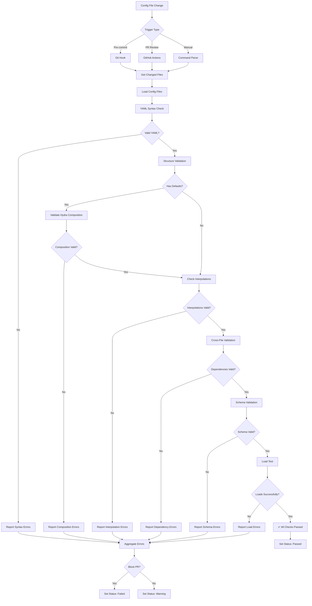

# Config Validator - Custom GitHub Copilot Agent

**Agent ID:** config-validator  
**Version:** 1.0.0  
**Status:** Production Ready  
**Created:** 2026-01-09

---

## Purpose

Validates configuration files for syntax, structure, Hydra composition patterns, and detects potential issues before they cause runtime errors.

---

## Capabilities

### 1. YAML Syntax Validation
- Checks for valid YAML syntax
- Detects indentation errors
- Validates quote matching
- Checks for duplicate keys at same level

### 2. Hydra Composition Validation
- Validates defaults list structure
- Checks interpolation syntax `${...}`
- Detects interpolation cycles
- Validates config group references

### 3. Schema Validation
- Checks required fields present
- Validates field types
- Checks value constraints (ranges, enums)
- Validates nested structure

### 4. Cross-File Validation
- Validates config references between files
- Checks defaults list points to existing configs
- Validates interpolation targets exist
- Detects broken dependencies

---

## Triggers

### 1. Pre-Commit Hook
```bash
# .git/hooks/pre-commit
#!/bin/bash
changed_configs=$(git diff --cached --name-only | grep '\.yaml$')
if [ -n "$changed_configs" ]; then
    gh copilot agent run config-validator --input "$changed_configs"
fi
```

### 2. PR Review
**Trigger:** Automatic on PR creation/update  
**Workflow:** `.github/workflows/validate-configs.yml`

```yaml
name: Validate Configs
on:
  pull_request:
    paths:
      - '**/*.yaml'
      - '**/*.yml'
jobs:
  validate:
    runs-on: ubuntu-latest
    steps:
      - uses: actions/checkout@v4
      - name: Run Config Validator
        run: |
          gh copilot agent run config-validator \
            --files $(git diff --name-only ${{ github.base_ref }}...${{ github.head_ref }} | grep '\.yaml$')
```

### 3. Manual Invocation
```
@copilot validate config <path>
/validate-config --path conf/model/base.yaml
```

---

## Workflow Diagram



---

## Validation Rules

### Rule 1: YAML Syntax
```python
def validate_yaml_syntax(path: str) -> ValidationResult:
    """Validate YAML file syntax."""
    try:
        with open(path) as f:
            yaml.safe_load(f)
        return ValidationResult(passed=True)
    except yaml.YAMLError as e:
        return ValidationResult(
            passed=False,
            error=f"YAML syntax error: {e}",
            line=e.problem_mark.line if hasattr(e, 'problem_mark') else None
        )
```

### Rule 2: Duplicate Keys
```python
def check_duplicate_keys(path: str) -> list[Issue]:
    """Check for duplicate keys at same level."""
    issues = []
    with open(path) as f:
        content = f.read()
    
    # Parse with duplicate key detection
    loader = yaml.SafeLoader(content)
    loader.check_mapping_key = lambda node, key_node: check_for_duplicate(node, key_node, issues)
    loader.get_single_data()
    
    return issues
```

### Rule 3: Interpolation Cycles
```python
def detect_interpolation_cycles(config: dict) -> list[Cycle]:
    """Detect circular interpolation references."""
    graph = build_interpolation_graph(config)
    cycles = find_cycles(graph)
    return cycles

def build_interpolation_graph(config: dict) -> Graph:
    """Build dependency graph from interpolations."""
    graph = Graph()
    for key, value in flatten_dict(config).items():
        if isinstance(value, str) and '${' in value:
            refs = extract_interpolations(value)
            for ref in refs:
                graph.add_edge(key, ref)
    return graph
```

### Rule 4: Config Loading
```python
def validate_config_loads(path: str) -> ValidationResult:
    """Validate config loads successfully."""
    try:
        from codex.utils.config_loader import load_config
        cfg = load_config(
            Path(path).stem,
            config_dir=str(Path(path).parent)
        )
        return ValidationResult(passed=True, config=cfg)
    except Exception as e:
        return ValidationResult(passed=False, error=str(e))
```

---

## Output Schema

```yaml
validation_results:
  file: "conf/training/base.yaml"
  status: "passed" | "failed" | "warning"
  checks:
    - name: "YAML Syntax"
      status: "passed"
      message: "Valid YAML syntax"
    - name: "Duplicate Keys"
      status: "failed"
      message: "Found duplicate key: gradient_accumulation"
      line: 21
      suggestion: "Remove duplicate or use interpolation"
    - name: "Interpolation Cycles"
      status: "passed"
      message: "No cycles detected"
    - name: "Config Loading"
      status: "passed"
      message: "Config loads successfully"
  summary:
    total_checks: 8
    passed: 7
    failed: 1
    warnings: 0
```

---

## Integration Points

### 1. ConfigLoader
```python
from codex.utils.config_loader import load_config
cfg = load_config("base", config_dir="conf/model")
```

### 2. GitHub Status API
```python
github.create_status(
    sha=commit_sha,
    state="success",
    context="config-validator",
    description="All configs valid"
)
```

### 3. PR Comments
```python
github.create_pr_comment(
    pr_number=pr_num,
    body=format_validation_results(results)
)
```

---

## Configuration

```yaml
# .github/copilot/agents/config-validator.yml
name: Config Validator
description: Validates configuration files for syntax and structure
version: 1.0.0
enabled: true

triggers:
  - type: pre_commit
    enabled: true
  - type: pr_review
    enabled: true
  - type: comment
    pattern: "@copilot validate config"

permissions:
  contents: read
  pull_requests: write
  statuses: write

rules:
  - name: yaml_syntax
    severity: error
    enabled: true
  - name: duplicate_keys
    severity: error
    enabled: true
  - name: interpolation_cycles
    severity: error
    enabled: true
  - name: missing_required_fields
    severity: error
    enabled: true
  - name: type_mismatches
    severity: warning
    enabled: true
  - name: config_loading
    severity: error
    enabled: true

blocking_rules:
  - yaml_syntax
  - duplicate_keys
  - interpolation_cycles
  - config_loading

response_templates:
  passed: |
    ✅ Configuration Validation Passed
    
    **File:** `{file}`
    **Checks:** {passed}/{total} passed
    **Status:** Ready for merge
  
  failed: |
    ❌ Configuration Validation Failed
    
    **File:** `{file}`
    **Failed Checks:** {failed_count}
    
    {error_details}
    
    **Action:** Fix errors before merging
  
  warning: |
    ⚠️ Configuration Validation Warnings
    
    **File:** `{file}`
    **Warnings:** {warning_count}
    
    {warning_details}
    
    **Action:** Review warnings (non-blocking)

error_handling:
  on_failure: "block_pr"
  on_warning: "allow_pr"
  notify_owner: true
```

---

## Testing

### Unit Tests
```python
def test_yaml_syntax_validation():
    validator = ConfigValidator()
    result = validator.validate_yaml_syntax("conf/model/base.yaml")
    assert result.passed

def test_duplicate_key_detection():
    validator = ConfigValidator()
    issues = validator.check_duplicate_keys("test_config.yaml")
    assert len(issues) == 0

def test_interpolation_cycle_detection():
    config = {
        "a": "${b}",
        "b": "${c}",
        "c": "${a}"  # Cycle
    }
    validator = ConfigValidator()
    cycles = validator.detect_interpolation_cycles(config)
    assert len(cycles) == 1
```

### Integration Tests
```bash
# Test pre-commit hook
echo "invalid: yaml: :" > test.yaml
git add test.yaml
git commit -m "Test"  # Should fail

# Test PR validation
gh pr create --title "Test Config" --body "Test"
# Check status on PR
```

---

## Monitoring

### Metrics
- **Validation Rate:** Configs validated per day
- **Failure Rate:** % of configs failing validation
- **Common Issues:** Top 10 validation errors
- **Fix Time:** Average time to fix validation errors

### Alerts
- **High Failure Rate:** >20% configs failing
- **Repeated Issues:** Same error >5 times
- **Critical Failures:** Interpolation cycles detected

---

## Examples

### Example 1: Valid Config
```yaml
# conf/model/base.yaml
model:
  name: gpt2
  dtype: float32

# Backward compatibility
name: ${model.name}
dtype: ${model.dtype}
```
**Result:** ✅ All checks passed

### Example 2: Duplicate Keys
```yaml
# Bad config
training:
  epochs: 10
  epochs: 20  # Duplicate!
```
**Result:** ❌ Duplicate key detected

### Example 3: Interpolation Cycle
```yaml
# Bad config
a: ${b}
b: ${c}
c: ${a}  # Cycle!
```
**Result:** ❌ Interpolation cycle detected

---

## Maintenance

**Owner:** Configuration Infrastructure Team  
**Review Frequency:** Quarterly  
**Update Trigger:** New validation rules, Hydra updates  
**Deprecation:** None planned

---

## References

- ConfigLoader: `src/codex/utils/config_loader.py`
- Validation Tests: `tests/test_config_validator.py`
- Hydra Docs: https://hydra.cc/docs/advanced/overriding_packages/
