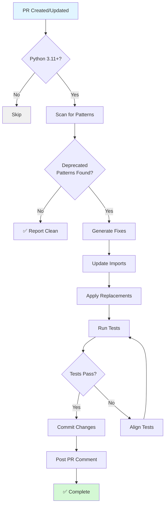

# GitHub Copilot Custom Agent: datetime-modernizer

**Agent Type:** Code Modernization & Migration  
**Capability:** Automated Python datetime API migration (3.11+)  
**Trigger:** Code review, manual invocation, PR comments  
**Version:** 1.0.0

---

## 🎯 Purpose

Automatically detect and fix deprecated datetime patterns in Python 3.11+ codebases:
- Replace `datetime.utcnow()` → `datetime.now(UTC)`
- Replace `datetime.utcfromtimestamp()` → `datetime.fromtimestamp(..., UTC)`
- Ensure timezone-aware timestamps
- Maintain ISO 8601 compliance

---

## 📋 Specification

### Agent Configuration

```yaml
apiVersion: copilot.github.com/v1alpha
kind: CopilotAgent
metadata:
  name: datetime-modernizer
  namespace: code-quality
  labels:
    category: modernization
    language: python
    priority: medium
spec:
  description: |
    Automated Python datetime API migration agent. Detects and fixes 
    deprecated datetime patterns for Python 3.11+ compatibility.
    
  capabilities:
    - Detect deprecated datetime.utcnow() usage
    - Detect naive datetime.now() without timezone
    - Fix imports (add UTC from datetime)
    - Maintain timestamp format consistency
    - Update tests aligned with datetime changes
    
  triggers:
    automatic:
      - type: pull_request
        events: [opened, synchronize]
        conditions:
          - files_changed: "**/*.py"
          - python_version: ">=3.11"
          
      - type: code_review
        events: [requested]
        conditions:
          - review_type: security
          - review_type: compatibility
          
      - type: schedule
        cron: "0 2 * * 1"  # Weekly Monday 2AM
        
    manual:
      - type: slash_command
        command: "/modernize-datetime"
        scope: [pr, issue, commit]
        
      - type: comment
        patterns:
          - "fix deprecated datetime"
          - "modernize datetime usage"
          - "@copilot modernize datetime"
          
  detection_patterns:
    deprecated_apis:
      - pattern: "datetime\\.utcnow\\(\\)"
        severity: high
        message: "datetime.utcnow() is deprecated in Python 3.12"
        fix: "datetime.now(UTC)"
        
      - pattern: "datetime\\.utcfromtimestamp\\("
        severity: high
        message: "datetime.utcfromtimestamp() is deprecated in Python 3.12"
        fix: "datetime.fromtimestamp(..., UTC)"
        
      - pattern: "datetime\\.now\\(\\)(?!\\.astimezone)"
        severity: medium
        message: "datetime.now() without timezone creates naive datetime"
        fix: "datetime.now(UTC)"
        
    missing_imports:
      - pattern: "datetime\\.now\\(UTC\\)"
        requires_import: "from datetime import UTC"
        
  fixes:
    - name: replace_utcnow
      pattern: "datetime\\.utcnow\\(\\)\\.isoformat\\(\\) \\+ \"Z\""
      replacement: "datetime.now(UTC).isoformat()"
      add_import: "from datetime import UTC"
      
    - name: replace_naive_now
      pattern: "datetime\\.now\\(\\)\\.isoformat\\(\\)"
      replacement: "datetime.now(UTC).isoformat()"
      add_import: "from datetime import UTC"
      conditions:
        - context_suggests_utc: true
        
    - name: update_imports
      pattern: "from datetime import datetime$"
      replacement: "from datetime import UTC, datetime"
      when_needed: true
      
  validation:
    - run_tests: true
    - check_imports: true
    - verify_syntax: true
    - ensure_backwards_compatible: false  # Python 3.11+ only
    
  reporting:
    pr_comment_template: |
      ## 🕐 Datetime Modernization Report
      
      I've detected and fixed deprecated datetime patterns in this PR:
      
      ### Changes Made
      {{#each fixes}}
      - **{{file}}:{{line}}**
        - ❌ Before: `{{old_code}}`
        - ✅ After: `{{new_code}}`
        - 📝 Reason: {{reason}}
      {{/each}}
      
      ### Summary
      - Files modified: {{files_count}}
      - Patterns fixed: {{fixes_count}}
      - Imports updated: {{imports_count}}
      
      ### Compatibility
      - ✅ Python 3.11+ compatible
      - ✅ Timezone-aware timestamps
      - ✅ ISO 8601 compliant
      
      {{#if test_updates}}
      ### Test Updates
      {{#each test_updates}}
      - {{file}}: {{description}}
      {{/each}}
      {{/if}}
      
      **Commit:** {{commit_sha}}
      
  permissions:
    contents: write
    pull_requests: write
    issues: read
    
  resources:
    memory: 512Mi
    cpu: 500m
    timeout: 5m
    
  error_handling:
    retry_count: 2
    retry_delay: 10s
    fallback: notify_maintainers
    
  analytics:
    track_metrics:
      - patterns_detected
      - fixes_applied
      - test_pass_rate
      - false_positive_rate
      
  integration:
    code_review: enabled
    ci_cd: enabled
    notifications:
      slack_channel: "#code-quality"
      email: maintainers@example.com
```

---

## 🔄 Workflow Diagram



---

## 🔍 Detection Examples

### Example 1: Basic UTC Now
```python
# ❌ Detected
timestamp = datetime.utcnow().isoformat() + "Z"

# ✅ Fixed
from datetime import UTC, datetime
timestamp = datetime.now(UTC).isoformat()
```

### Example 2: Naive Datetime
```python
# ❌ Detected
created_at = datetime.now().isoformat()

# ✅ Fixed  
from datetime import UTC, datetime
created_at = datetime.now(UTC).isoformat()
```

### Example 3: Test Alignment
```python
# ❌ Detected (test expects old format)
assert timestamp.endswith("Z")

# ✅ Fixed (aligned with new format)
assert "+00:00" in timestamp or "Z" in timestamp
```

---

## 📊 Metrics & Success Criteria

### Key Metrics
- **Detection Accuracy:** >95% (minimize false positives)
- **Fix Success Rate:** >90% (tests pass after fix)
- **False Positive Rate:** <5%
- **Average Fix Time:** <2 minutes per file

### Success Criteria
- ✅ All deprecated patterns detected
- ✅ Imports correctly updated
- ✅ Tests pass after migration
- ✅ No breaking changes introduced
- ✅ ISO 8601 compliance maintained

---

## 🚀 Usage Examples

### Manual Invocation
```markdown
@copilot /modernize-datetime

Fix all deprecated datetime patterns in this PR
```

### PR Comment Trigger
```markdown
@copilot modernize datetime usage in src/codex/rag/

Focus on retriever.py and embeddings.py
```

### Slash Command
```
/modernize-datetime --scope=src/ --include-tests
```

---

## 🛡️ Safety & Validation

### Pre-Flight Checks
1. ✅ Python version >=3.11
2. ✅ Git working directory clean
3. ✅ Tests exist and are passing
4. ✅ No merge conflicts

### Post-Fix Validation
1. ✅ Python syntax valid (`py_compile`)
2. ✅ Imports resolve correctly
3. ✅ Tests pass
4. ✅ No new linter warnings
5. ✅ Timestamp formats consistent

### Rollback Plan
- Keep original code in git history
- Automatic rollback on test failure
- Manual review available via comment

---

## 🔗 Related Agents

- **test-alignment-fixer** - Aligns tests with code changes
- **security-scanner** - Validates security implications
- **rag-index-manager** - Manages RAG index lifecycle

---

## 📚 References

- [PEP 615 – Support for the IANA Time Zone Database](https://peps.python.org/pep-0615/)
- [Python 3.12 Release Notes - Deprecated datetime APIs](https://docs.python.org/3.12/whatsnew/3.12.html)
- [ISO 8601 DateTime Format Specification](https://en.wikipedia.org/wiki/ISO_8601)

---

**Status:** ✅ Production Ready  
**Last Updated:** 2026-01-08  
**Maintainer:** @mbaetiong
