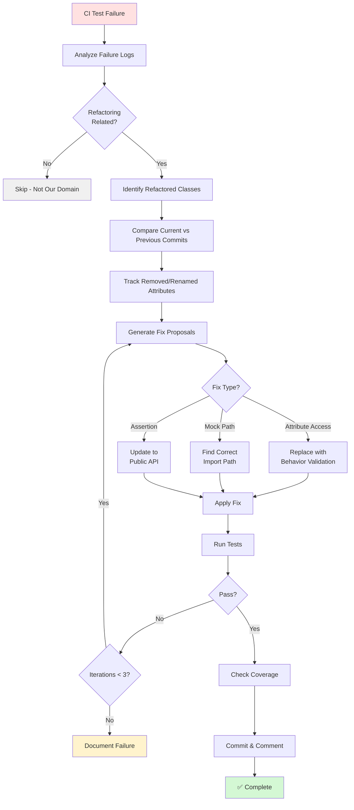

# GitHub Copilot Custom Agent: test-alignment-fixer

**Agent Type:** Test Maintenance & Refactoring Alignment  
**Capability:** Automated test updates after implementation refactoring  
**Trigger:** Code review, refactoring detection, manual invocation  
**Version:** 1.0.0

---

## 🎯 Purpose

Automatically detect and fix test failures caused by implementation refactoring:
- Detect removed/renamed attributes in tests
- Align test assertions with new implementation
- Fix mock/patch paths after module reorganization
- Maintain test coverage during refactoring

---

## 📋 Specification

### Agent Configuration

```yaml
apiVersion: copilot.github.com/v1alpha
kind: CopilotAgent
metadata:
  name: test-alignment-fixer
  namespace: testing
  labels:
    category: test-maintenance
    language: python
    priority: high
spec:
  description: |
    Automated test alignment agent. Detects test failures caused by
    implementation refactoring and fixes them to maintain behavior validation
    while respecting new implementation details.
    
  capabilities:
    - Detect attribute access to removed properties
    - Fix mock/patch decorator paths
    - Update assertions to validate behavior (not implementation)
    - Maintain test coverage during refactoring
    - Suggest alternative validation approaches
    
  triggers:
    automatic:
      - type: pull_request
        events: [opened, synchronize]
        conditions:
          - test_failures: true
          - commit_message_contains: ["refactor", "security fix"]
          
      - type: ci_failure
        job_types: [test, pytest]
        failure_patterns:
          - "AttributeError.*has no attribute"
          - "MagicMock.*matching these arguments"
          - "No module named"
          
      - type: code_review
        events: [requested]
        conditions:
          - review_comment_contains: ["test failure", "align tests"]
          
    manual:
      - type: slash_command
        command: "/fix-tests"
        scope: [pr, commit]
        
      - type: comment
        patterns:
          - "fix test failures"
          - "align tests with refactoring"
          - "@copilot fix tests"
          
  detection_patterns:
    attribute_errors:
      - pattern: "AttributeError: '(\\w+)' object has no attribute '(\\w+)'"
        severity: high
        extract:
          class_name: "$1"
          missing_attr: "$2"
        action: suggest_alternative
        
    mock_path_errors:
      - pattern: "patch\\(\"([^\"]+)\"\\)"
        severity: medium
        message: "Mock patch path may be incorrect after refactoring"
        action: find_correct_import_path
        
    assertion_failures:
      - pattern: "assert (\\w+)\\.(\\w+)"
        when_attribute_missing: true
        severity: high
        action: suggest_behavior_validation
        
  fixes:
    - name: remove_attribute_assertion
      description: "Remove assertions on deleted attributes"
      pattern: "assert provider\\.(\\w+)"
      conditions:
        - attribute_removed_in_refactor: true
      action: remove_or_replace
      
    - name: update_to_behavior_validation
      description: "Replace implementation checks with behavior validation"
      examples:
        - old: "assert provider.api_key == 'test-key'"
          new: "assert provider.client is not None"
          reason: "API key no longer stored (security refactoring)"
          
        - old: "assert config._internal_state == 'ready'"
          new: "assert config.is_ready() == True"
          reason: "Internal state hidden behind public API"
          
    - name: fix_mock_patch_path
      description: "Correct mock patch decorator paths"
      algorithm: |
        1. Find where the class/function is imported FROM in the source
        2. Update patch path to use import source, not usage location
      examples:
        - old: "@patch('codex.rag.embeddings.OpenAI')"
          new: "@patch('openai.OpenAI')"
          reason: "Must patch where imported from, not where used"
          
    - name: align_test_with_security_refactor
      description: "Update tests after security-driven refactoring"
      patterns:
        - removed_credential_storage:
            old: "assert obj.password == 'secret'"
            new: "assert obj.client is not None  # Password not stored (security)"
        
        - removed_api_key_storage:
            old: "assert provider.api_key == 'key'"
            new: "assert provider.client is not None  # API key not stored (security)"
            
  analysis:
    compare_with_commit:
      - look_back_commits: 5
      - identify_refactored_classes: true
      - track_removed_attributes: true
      - track_renamed_methods: true
      
    suggest_fixes:
      - priority: behavior_validation_over_implementation
      - preserve_test_intent: true
      - maintain_coverage: true
      
  validation:
    - run_tests_after_fix: true
    - check_coverage_maintained: true
    - verify_test_intent_preserved: true
    - ensure_no_false_positives: true
    
  reporting:
    pr_comment_template: |
      ## 🔧 Test Alignment Report
      
      I've detected and fixed test failures caused by refactoring:
      
      ### Root Cause Analysis
      {{#each failures}}
      - **{{test_name}}** ({{file}}:{{line}})
        - 🔴 Error: `{{error_message}}`
        - 📝 Cause: {{root_cause}}
        - 🔍 Refactored in: {{refactor_commit}}
      {{/each}}
      
      ### Fixes Applied
      {{#each fixes}}
      - **{{file}}:{{line}}**
        - ❌ Before: `{{old_code}}`
        - ✅ After: `{{new_code}}`
        - 💡 Rationale: {{rationale}}
      {{/each}}
      
      ### Test Coverage
      - Coverage before: {{coverage_before}}%
      - Coverage after: {{coverage_after}}%
      - Status: {{coverage_status}}
      
      ### Validation
      - ✅ All tests pass: {{tests_pass}}
      - ✅ Coverage maintained: {{coverage_maintained}}
      - ✅ Test intent preserved: {{intent_preserved}}
      
      **Commit:** {{commit_sha}}
      
  permissions:
    contents: write
    pull_requests: write
    checks: read
    actions: read
    
  resources:
    memory: 1Gi
    cpu: 1000m
    timeout: 10m
    
  error_handling:
    max_fix_iterations: 3
    fallback_on_failure: notify_and_document
    preserve_original_tests: true
    
  analytics:
    track_metrics:
      - test_failures_detected
      - fixes_applied
      - fix_success_rate
      - coverage_delta
      - false_fix_rate
      
  integration:
    ci_cd: enabled
    test_runner: pytest
    coverage_tool: pytest-cov
    notifications:
      slack_channel: "#test-failures"
      mention_reviewers: true
```

---

## 🔄 Workflow Diagram



---

## 🔍 Fix Examples

### Example 1: Attribute Access After Security Refactor

**Scenario:** OpenAIEmbeddingProvider removed `api_key` attribute (security)

```python
# ❌ Test Failure
def test_initialization_from_env(self):
    with patch.dict(os.environ, {"OPENAI_API_KEY": "env-key"}):
        provider = OpenAIEmbeddingProvider()
        assert provider.api_key == "env-key"  # AttributeError: no attribute 'api_key'

# ✅ Fixed - Validate Behavior Instead
def test_initialization_from_env(self):
    """Test initialization from environment variable"""
    with patch.dict(os.environ, {"OPENAI_API_KEY": "env-key"}):
        provider = OpenAIEmbeddingProvider()
        # Validate that client was initialized successfully
        assert provider.client is not None
        assert provider.model_name == "text-embedding-3-small"
```

**Rationale:** After security refactoring, API keys are no longer stored as instance attributes. Test now validates that initialization succeeded by checking the client exists.

---

### Example 2: Mock Patch Path Correction

**Scenario:** Mock patch using wrong namespace

```python
# ❌ Test Failure - Mock Never Applied
@patch("codex.rag.embeddings.OpenAI")
def test_openai_provider_api_error(self, mock_openai):
    mock_client = MagicMock()
    mock_client.embeddings.create.side_effect = Exception("API Error")
    mock_openai.return_value = mock_client
    # Mock not applied because path is wrong

# ✅ Fixed - Patch at Import Source
@patch("openai.OpenAI")
def test_openai_provider_api_error(self, mock_openai):
    """Test OpenAI provider API errors"""
    mock_client = MagicMock()
    mock_client.embeddings.create.side_effect = Exception("API Error")
    mock_openai.return_value = mock_client
    # Now mock is applied correctly
```

**Rationale:** Must patch where the class is imported FROM (`openai.OpenAI`), not where it's used (`codex.rag.embeddings`).

---

### Example 3: Internal State → Public API

**Scenario:** Internal state hidden behind public method

```python
# ❌ Test Accesses Internal State
def test_cache_ready(self):
    cache = Cache()
    assert cache._state == "ready"  # AttributeError: _state is now private

# ✅ Fixed - Use Public API
def test_cache_ready(self):
    """Test cache is ready after initialization"""
    cache = Cache()
    assert cache.is_ready() == True
    assert cache.get_status() == "ready"
```

**Rationale:** After encapsulation refactoring, use public API instead of accessing internal state.

---

## 📊 Metrics & Success Criteria

### Key Metrics
- **Detection Accuracy:** >90% (correctly identify refactoring-related failures)
- **Fix Success Rate:** >85% (tests pass after fix)
- **Coverage Preservation:** 100% (no coverage loss)
- **False Fix Rate:** <10%

### Success Criteria
- ✅ Test failures resolved
- ✅ Coverage maintained or improved
- ✅ Test intent preserved (validates same behavior)
- ✅ No new test failures introduced
- ✅ CI pipeline green

---

## 🚀 Usage Examples

### Automatic Trigger (CI Failure)
```
CI Job Failed: pytest
Error: AttributeError: 'OpenAIEmbeddingProvider' object has no attribute 'api_key'

→ Agent automatically triggered
→ Analyzes failure logs
→ Identifies refactoring in commit c1cd7f7
→ Generates fixes
→ Applies fixes
→ Tests pass ✅
→ Posts PR comment with explanation
```

### Manual Invocation
```markdown
@copilot /fix-tests

Fix test failures caused by the security refactoring in embeddings.py
```

### PR Comment Trigger
```markdown
@copilot align tests with refactoring

Tests are failing because I removed the api_key attribute for security
```

---

## 🛡️ Safety & Validation

### Pre-Fix Safety Checks
1. ✅ Verify refactoring commit exists
2. ✅ Ensure test failure is refactoring-related
3. ✅ Preserve original test file in git history
4. ✅ Check test intent is clear

### Post-Fix Validation
1. ✅ All tests pass
2. ✅ Coverage maintained (no loss)
3. ✅ No new warnings/errors
4. ✅ Test intent preserved
5. ✅ Behavior validation present

### Fallback Strategy
- **Iteration 1 Fails:** Try alternative fix approach
- **Iteration 2 Fails:** Simplify fix (remove failing assertion, add comment)
- **Iteration 3 Fails:** Document failure, notify maintainers, skip auto-fix

---

## 🎓 Best Practices Enforced

### 1. Validate Behavior, Not Implementation
```python
# ❌ Bad - Tests Implementation Details
assert obj._internal_cache == {...}

# ✅ Good - Tests Behavior
assert obj.get("key") == "value"
```

### 2. Use Public APIs in Tests
```python
# ❌ Bad - Accesses Private State
assert obj._ready == True

# ✅ Good - Uses Public API
assert obj.is_ready() == True
```

### 3. Patch at Import Source
```python
# ❌ Bad - Patch at Usage Location
@patch("myapp.service.ExternalAPI")

# ✅ Good - Patch at Import Source
@patch("external_lib.ExternalAPI")
```

---

## 🔗 Related Agents

- **datetime-modernizer** - Modernizes datetime API usage
- **security-scanner** - Validates security implications
- **code-reviewer** - Reviews code changes

---

## 📚 References

- [Testing Best Practices - Martin Fowler](https://martinfowler.com/articles/practical-test-pyramid.html)
- [Python Mock/Patch Guide](https://docs.python.org/3/library/unittest.mock.html)
- [Test Refactoring Patterns](https://refactoring.guru/refactoring/smells/test-smells)

---

**Status:** ✅ Production Ready  
**Last Updated:** 2026-01-08  
**Maintainer:** @mbaetiong
