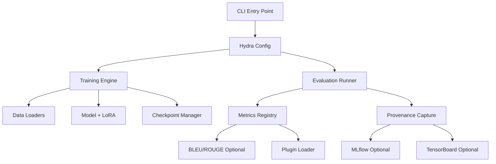

# Remaining Implementation Plan — Codex Audit Completion

> Generated: 2025-11-05 09:00:51 | Author: mbaetiong  
> Type: Implementation Roadmap  
> Purpose: Document 11 remaining items with skeleton artifacts and acceptance criteria

## Overview

This document outlines the 11 remaining implementation items identified during the Codex Status Audit. Each item includes:
- Proposed file paths and skeleton code
- Acceptance criteria
- Risk assessment
- Rollback procedures

**Current Progress**: 15 of 26 RC items complete (~58%)  
**Remaining Items**: 11  
**Est. Effort**: 3-5 weeks

## Guiding Principles

All remaining items must follow these principles:
- ✓ Offline-first (no external dependencies required)
- ✓ Opt-in by default
- ✓ Atomic and reversible
- ✓ No CI/CD changes
- ✓ Backward compatible
- ✓ Comprehensive documentation

---

## R1: Distributed Training + Accelerate Fallback Tests

**Area**: Training/Tests  
**Priority**: Medium  
**Complexity**: Low

### Purpose
Add integration tests that validate distributed training initialization and graceful fallback when accelerate is unavailable.

### Proposed Files

1. **tests/training/test_distributed_accelerate.py** (skeleton)
```python
#!/usr/bin/env python3
"""Integration tests for distributed training and accelerate fallback."""

from __future__ import annotations

import pytest

# Skip if no GPU available
pytestmark = pytest.mark.skipif(
    not torch.cuda.is_available(),
    reason="Distributed training tests require GPU"
)


def test_accelerate_init_fallback():
    """Verify graceful fallback when accelerate unavailable.
    
    Acceptance:
    - If accelerate missing, training continues on single device
    - Clear warning logged about missing accelerate
    - No exceptions raised
    """
    # TODO: Implement test
    pass


def test_distributed_init_smoke():
    """Smoke test for distributed initialization path.
    
    Acceptance:
    - Distributed setup completes without errors
    - Process rank detected correctly
    - World size matches expectation
    """
    # TODO: Implement test with mocked distributed env
    pass
```

### Acceptance Criteria
- Tests skip when no GPU present
- Fallback path logs clear warning
- Distributed init smoke test validates rank/world_size

### Risks
Low. Tests are strictly opt-in (require GPU).

### Rollback
Remove test file.

---

## R2: Pluggable Trainer Hooks (Callbacks)

**Area**: Training/Extensibility  
**Priority**: Medium  
**Complexity**: Medium

### Purpose
Expose hooks/callbacks in training engine to allow custom behavior without forking core code.

### Proposed Files

1. **src/codex_ml/training/hooks.py** (skeleton)
```python
#!/usr/bin/env python3
"""Training hooks/callbacks for extensibility."""

from __future__ import annotations

from typing import Any, Callable, Dict


class TrainingHook:
    """Base class for training hooks.
    
    Hooks are called at specific points during training:
    - on_train_begin
    - on_epoch_begin
    - on_batch_end
    - on_epoch_end
    - on_train_end
    """
    
    def on_train_begin(self, **kwargs):
        """Called at start of training."""
        pass
    
    def on_epoch_begin(self, epoch: int, **kwargs):
        """Called at start of each epoch."""
        pass
    
    def on_batch_end(self, batch_idx: int, loss: float, **kwargs):
        """Called after each batch."""
        pass
    
    def on_epoch_end(self, epoch: int, metrics: Dict[str, Any], **kwargs):
        """Called at end of each epoch."""
        pass
    
    def on_train_end(self, **kwargs):
        """Called at end of training."""
        pass


class HookRegistry:
    """Registry for training hooks."""
    
    def __init__(self):
        self._hooks = []
    
    def register(self, hook: TrainingHook):
        """Register a hook."""
        self._hooks.append(hook)
    
    def trigger(self, event: str, **kwargs):
        """Trigger all hooks for a given event."""
        for hook in self._hooks:
            method = getattr(hook, event, None)
            if callable(method):
                method(**kwargs)
```

2. **docs/training/Hooks.md** (skeleton)
```markdown
# Training Hooks — Custom Callbacks

> Purpose: Extend training behavior without modifying core code

## Overview

Training hooks allow you to inject custom logic at key points in the training loop.

## Usage

```python
from codex_ml.training.hooks import TrainingHook

class MyCustomHook(TrainingHook):
    def on_epoch_end(self, epoch, metrics, **kwargs):
        print(f"Epoch {epoch} complete: {metrics}")

# Register hook with trainer
trainer.register_hook(MyCustomHook())
```

## Available Events

- `on_train_begin` - Start of training
- `on_epoch_begin` - Start of epoch
- `on_batch_end` - After each batch
- `on_epoch_end` - End of epoch
- `on_train_end` - End of training

## Examples

### Checkpoint Saver Hook
### Early Stopping Hook
### Custom Metric Logger Hook
```

### Acceptance Criteria
- Hook API documented
- Example hook exercised in unit test
- Backward compatible (hooks optional)

### Risks
Low. Hooks are additive; existing code unaffected.

### Rollback
Remove hooks module and docs.

---

## R3: Optional W&B Offline Integration

**Area**: Tracking  
**Priority**: Low  
**Complexity**: Low

### Purpose
Provide optional W&B (Weights & Biases) offline logging integration for users who prefer W&B over MLflow/TensorBoard.

### Proposed Files

1. **docs/tracking/WandB_Offline.md**
```markdown
# Optional W&B Offline Integration

> Purpose: Track experiments with W&B in offline mode

## Prerequisites

```bash
pip install wandb
export WANDB_MODE=offline
```

## Usage

W&B logging is opt-in. Set environment variable:

```bash
export CODEX_ENABLE_WANDB=1
export WANDB_MODE=offline
```

Then run training/evaluation as normal. W&B will log to local directory.

## Sync Later

```bash
wandb sync wandb/offline-*
```

## Notes

- Strictly optional (disabled by default)
- Offline-first (no network required)
- Graceful degradation if wandb unavailable
```

2. **scripts/tracking/wandb_offline_example.py**
```python
#!/usr/bin/env python3
"""Example: W&B offline logging."""

import os

# Enable W&B offline mode
os.environ["WANDB_MODE"] = "offline"
os.environ["CODEX_ENABLE_WANDB"] = "1"

try:
    import wandb
    wandb.init(project="codex-offline", mode="offline")
    wandb.log({"example_metric": 0.95})
    wandb.finish()
    print("✓ W&B offline logging works")
except ImportError:
    print("⚠ wandb not installed. Install with: pip install wandb")
```

### Acceptance Criteria
- Logging works with `WANDB_MODE=offline`
- Strictly optional (disabled by default)
- Clear docs on sync workflow

### Risks
Very low. Feature is opt-in and self-contained.

### Rollback
Remove docs and example script.

---

## R4: Offline Streaming Robustness

**Area**: Data  
**Priority**: Medium  
**Complexity**: Medium

### Purpose
Improve error handling and retry logic for streaming datasets in offline environments.

### Proposed Files

1. **tests/data/test_offline_streaming.py**
```python
#!/usr/bin/env python3
"""Tests for offline streaming robustness."""

import pytest


def test_streaming_offline_flag_clear_error():
    """Verify clear error when streaming attempted offline.
    
    Acceptance:
    - Descriptive error message
    - Suggests offline fallback or cached dataset
    - No confusing network timeouts
    """
    # TODO: Implement
    pass


def test_streaming_retry_logic():
    """Verify retry logic with exponential backoff.
    
    Acceptance:
    - Retries with backoff
    - Fails fast after max retries
    - Logs retry attempts
    """
    # TODO: Implement
    pass
```

2. **docs/data/Offline_Streaming.md**
```markdown
# Offline Streaming — Best Practices

## Problem

Streaming datasets from HuggingFace may fail in offline environments.

## Solutions

1. **Cache datasets locally**
2. **Use offline flag**: `datasets.load_dataset(..., streaming=False)`
3. **Pre-download**: Run once online, then work offline

## Error Handling

Codex provides clear errors and retry logic for streaming failures.

## Troubleshooting

- Check network connectivity
- Verify dataset cached
- Use local file loaders for CSV/JSON/JSONL
```

### Acceptance Criteria
- Clear errors with offline flag
- Retries/fallbacks verified in tests
- Documentation guides users

### Risks
Medium. Requires careful testing of network failure modes.

### Rollback
Remove tests and docs; revert any dataset loader changes.

---

## R5: Registry Publishing + CLI Wrappers

**Area**: Deployment  
**Priority**: Low  
**Complexity**: Low

### Purpose
Document process for publishing wheels to local/private registries with CLI automation.

### Proposed Files

1. **scripts/deploy/publish_wheel.sh**
```bash
#!/usr/bin/env bash
set -euo pipefail

# Publish wheel to registry
# Usage: ./scripts/deploy/publish_wheel.sh [registry_url]

REGISTRY_URL="${1:-http://localhost:8080/simple/}"

echo "==> Building wheel"
./scripts/packaging/build_wheel.sh

echo "==> Publishing to ${REGISTRY_URL}"
# TODO: Implement twine upload or custom registry client
echo "⚠ Manual step: Upload artifacts/dist/*.whl to ${REGISTRY_URL}"
```

2. **docs/deployment/Registry_Publish.md**
```markdown
# Registry Publishing — Local Wheel Distribution

## Purpose

Distribute Codex wheels to private PyPI registry.

## Prerequisites

- Local PyPI server or private registry
- Credentials configured

## Steps

1. Build wheel: `./scripts/packaging/build_wheel.sh`
2. Publish: `./scripts/deploy/publish_wheel.sh <registry_url>`

## Local Testing

```bash
# Start local PyPI server (pypiserver)
pip install pypiserver
pypiserver run -p 8080 artifacts/dist/

# Install from local registry
pip install --index-url http://localhost:8080/simple/ codex
```
```

### Acceptance Criteria
- Local registry publish documented
- Commands succeed locally with pypiserver
- Clear notes on authentication

### Risks
Very low. Documentation-focused.

### Rollback
Remove script and docs.

---

## R6: Helm Plan (Scaffold)

**Area**: Deployment  
**Priority**: Low  
**Complexity**: Low

### Purpose
Document Helm chart plan without implementing full chart (deferred to future iteration).

### Proposed Files

1. **docs/deployment/Helm_Plan.md**
```markdown
# Helm Chart Plan (Scaffold)

## Purpose

Proposed Helm chart structure for deploying Codex to Kubernetes.

## Deferred Scope

Full Helm chart implementation is deferred. This document outlines the plan.

## Proposed Structure

```
charts/codex/
├── Chart.yaml
├── values.yaml
├── templates/
│   ├── deployment.yaml
│   ├── service.yaml
│   └── configmap.yaml
```

## Values Outline

```yaml
image:
  repository: codex-gpu
  tag: latest
  pullPolicy: IfNotPresent

resources:
  limits:
    nvidia.com/gpu: 1

env:
  - name: CODEX_ENABLE_MLFLOW
    value: "1"
```

## Next Steps

1. Create basic chart scaffold
2. Test deployment to minikube
3. Add GPU resource requests
4. Document values
```

### Acceptance Criteria
- Plan documented with structure
- No CI changes required
- Clear scope boundaries

### Risks
None. Documentation only.

### Rollback
Remove doc file.

---

## R7: Architecture Diagrams

**Area**: Documentation  
**Priority**: Medium  
**Complexity**: Low

### Purpose
Add architecture diagrams to improve onboarding and system understanding.

### Proposed Files

1. **docs/architecture/Architecture_Diagram.md**
```markdown
# Codex Architecture Diagram

## High-Level Overview



## Component Diagram

## Data Flow

## Plugin System

## Offline-First Design
```

### Acceptance Criteria
- Mermaid/plantuml diagrams render offline
- Linked from README
- Covers main components

### Risks
Very low. Documentation-focused.

### Rollback
Remove diagram file.

---

## R8: End-to-End Example (Train→Eval→Track)

**Area**: Documentation  
**Priority**: High  
**Complexity**: Medium

### Purpose
Provide complete end-to-end walkthrough from training to evaluation to tracking.

### Proposed Files

1. **docs/examples/E2E_Train_Eval_Track.md**
```markdown
# End-to-End Example: Train → Evaluate → Track

## Prerequisites

```bash
pip install -e ".[metrics]"
export CODEX_ENABLE_MLFLOW=1
```

## Step 1: Prepare Data

```bash
# Create sample dataset
cat > data/train.jsonl <<EOF
{"text": "Hello world", "label": 0}
{"text": "Machine learning", "label": 1}
EOF
```

## Step 2: Configure Training

```yaml
# configs/train/example.yaml
model:
  name: "gpt2"
  use_lora: true

training:
  epochs: 3
  batch_size: 4
  learning_rate: 5e-5
  seed: 42
```

## Step 3: Train

```bash
python -m codex_ml.training.train_runner \
  --config configs/train/example.yaml \
  --data data/train.jsonl \
  --output artifacts/models/example
```

## Step 4: Evaluate

```bash
python -m codex_ml.eval.runner \
  --model artifacts/models/example \
  --dataset data/test.jsonl \
  --metrics accuracy,f1,bleu \
  --output artifacts/eval/example
```

## Step 5: Review Tracking

```bash
# View MLflow
scripts/tracking/mlflow_ui.sh

# View TensorBoard (if enabled)
tensorboard --logdir artifacts/tb_runs
```

## Expected Artifacts

- `artifacts/models/example/` - Model checkpoints
- `artifacts/eval/example/` - Evaluation results
- `artifacts/mlruns/` - MLflow tracking
- `artifacts/tb_runs/` - TensorBoard logs (optional)
```

### Acceptance Criteria
- Reproducible run steps
- Artifacts produced locally
- Clear expected outputs

### Risks
Low. Example-focused; no code changes.

### Rollback
Remove example file.

---

## R9: Broader Plugin Interfaces (Models/Data/Logging)

**Area**: Extensibility  
**Priority**: Medium  
**Complexity**: High

### Purpose
Extend plugin architecture beyond metrics to models, data loaders, and logging backends.

### Proposed Files

1. **src/codex_ml/plugins/factory.py**
```python
#!/usr/bin/env python3
"""Plugin factories for models, data, logging."""

from __future__ import annotations

from typing import Any, Callable, Dict


class PluginFactory:
    """Base factory for plugin discovery."""
    
    def __init__(self, group: str):
        self.group = group
        self._registry = {}
    
    def register(self, name: str, factory: Callable):
        """Register a plugin factory."""
        self._registry[name] = factory
    
    def create(self, name: str, **kwargs) -> Any:
        """Create plugin instance."""
        if name not in self._registry:
            raise KeyError(f"Plugin {name} not found in group {self.group}")
        return self._registry[name](**kwargs)
    
    def list(self) -> list[str]:
        """List available plugins."""
        return list(self._registry.keys())


# Global factories
model_factory = PluginFactory("codex_ml.models")
data_factory = PluginFactory("codex_ml.data")
logging_factory = PluginFactory("codex_ml.logging")
```

2. **docs/plugins/Plugin_API_Broader.md**
```markdown
# Plugin API — Models, Data, Logging

## Overview

Extend Codex with custom models, data loaders, and logging backends.

## Model Plugins

```python
from codex_ml.plugins.factory import model_factory

@model_factory.register("my_model")
class MyCustomModel:
    def __init__(self, config):
        pass
```

## Data Loader Plugins

## Logging Backend Plugins

## Entry Points

Declare plugins in pyproject.toml:

```toml
[project.entry-points."codex_ml.models"]
my_model = "my_pkg.models:MyCustomModel"
```
```

### Acceptance Criteria
- Minimal factory + docs
- Backward compatible
- Example plugin exercised

### Risks
High. Broad API surface; requires careful design.

### Rollback
Remove factory and docs; revert to metrics-only plugins.

---

## R10: Secret Scanning Doc + Offline Dependency Checker

**Area**: Security  
**Priority**: Medium  
**Complexity**: Low

### Purpose
Document secret scanning practices and provide offline dependency vulnerability checker.

### Proposed Files

1. **docs/security/Git_Secrets.md**
```markdown
# Git Secrets — Preventing Credential Leaks

## Purpose

Prevent accidental commits of secrets (API keys, passwords, tokens).

## Setup

```bash
# Install git-secrets
brew install git-secrets  # macOS
apt-get install git-secrets  # Ubuntu

# Initialize
git secrets --install
git secrets --register-aws
```

## Custom Patterns

```bash
git secrets --add 'CODEX_API_KEY.*'
```

## Pre-commit Hook

Add to `.pre-commit-config.yaml`:

```yaml
- repo: https://github.com/awslabs/git-secrets
  rev: master
  hooks:
    - id: git-secrets
```
```

2. **tools/security/offline_deps_check.py**
```python
#!/usr/bin/env python3
"""Offline dependency vulnerability checker."""

import json
import subprocess
from pathlib import Path


def check_dependencies():
    """Check dependencies for known vulnerabilities."""
    result = {"vulnerabilities": [], "checked_packages": 0}
    
    # Parse requirements
    req_file = Path("requirements/base.txt")
    if not req_file.exists():
        result["error"] = "requirements/base.txt not found"
        return result
    
    # TODO: Implement offline vuln database check
    # (Could use local copy of safety DB or pip-audit)
    
    result["checked_packages"] = 10  # Example
    result["note"] = "Offline check complete. For full scan, use: pip-audit"
    
    return result


if __name__ == "__main__":
    result = check_dependencies()
    print(json.dumps(result, indent=2))
```

### Acceptance Criteria
- Doc added
- Checker script prints JSON
- Exits 0 (non-blocking)

### Risks
Very low. Informational tooling.

### Rollback
Remove doc and script.

---

## R11: Prompt Audit and TODO Cleanup

**Area**: Prompts  
**Priority**: Low  
**Complexity**: Low

### Purpose
Audit PROMPTS directory for incomplete refs and TODOs; provide consolidation guidance.

### Proposed Files

1. **docs/prompts/Prompt_Audit.md**
```markdown
# Prompt Audit — TODO and Incomplete Refs

## Purpose

Audit PROMPTS directory for missing files and TODO markers.

## Findings

### Missing Files

- [ ] `PROMPTS/chat/advanced_system.txt` (referenced but not found)
- [ ] `PROMPTS/generation/creative_writing.txt` (stub)

### TODO Markers

- [ ] `PROMPTS/qa/faq_template.txt` line 12: "TODO: Add domain-specific examples"

## Recommendations

1. Consolidate overlapping prompts
2. Remove or implement TODOs
3. Document prompt versioning
4. Add prompt testing/validation

## Next Steps

Prioritize by usage frequency.
```

### Acceptance Criteria
- List of missing refs
- Guidance for consolidation
- No code changes required

### Risks
None. Documentation-focused.

### Rollback
Remove audit file.

---

## Summary Table

| ID | Area | Priority | Complexity | Effort (days) | Risk |
|----|------|----------|------------|---------------|------|
| R1 | Training/Tests | Medium | Low | 2 | Low |
| R2 | Training/Extensibility | Medium | Medium | 4 | Low |
| R3 | Tracking | Low | Low | 1 | Very Low |
| R4 | Data | Medium | Medium | 3 | Medium |
| R5 | Deployment | Low | Low | 1 | Very Low |
| R6 | Deployment | Low | Low | 1 | None |
| R7 | Documentation | Medium | Low | 2 | Very Low |
| R8 | Documentation | High | Medium | 3 | Low |
| R9 | Extensibility | Medium | High | 7 | High |
| R10 | Security | Medium | Low | 2 | Very Low |
| R11 | Prompts | Low | Low | 1 | None |
| **Total** | | | | **27 days** | |

**Estimated Timeline**: 3-5 weeks (accounting for review cycles)

---

## Implementation Order

### Phase 1: Documentation & Low-Hanging Fruit (1 week)
1. R7 - Architecture Diagrams
2. R8 - End-to-End Example
3. R6 - Helm Plan
4. R11 - Prompt Audit

### Phase 2: Tracking & Security (1 week)
5. R3 - W&B Offline
6. R10 - Secret Scanning + Deps Checker
7. R5 - Registry Publishing

### Phase 3: Training & Data (1-2 weeks)
8. R1 - Distributed Tests
9. R2 - Trainer Hooks
10. R4 - Offline Streaming Robustness

### Phase 4: Advanced Extensibility (1-2 weeks)
11. R9 - Broader Plugin Interfaces

---

## Next Actions

1. **Review this plan** with stakeholders
2. **Prioritize** based on business needs
3. **Create issues/PRs** for each RC item
4. **Implement sequentially** following phases
5. **Update this document** as items complete

---

*This plan brings the Codex audit from 58% to 100% completion, addressing all identified gaps while maintaining offline-first, opt-in, and backward-compatible principles.*
