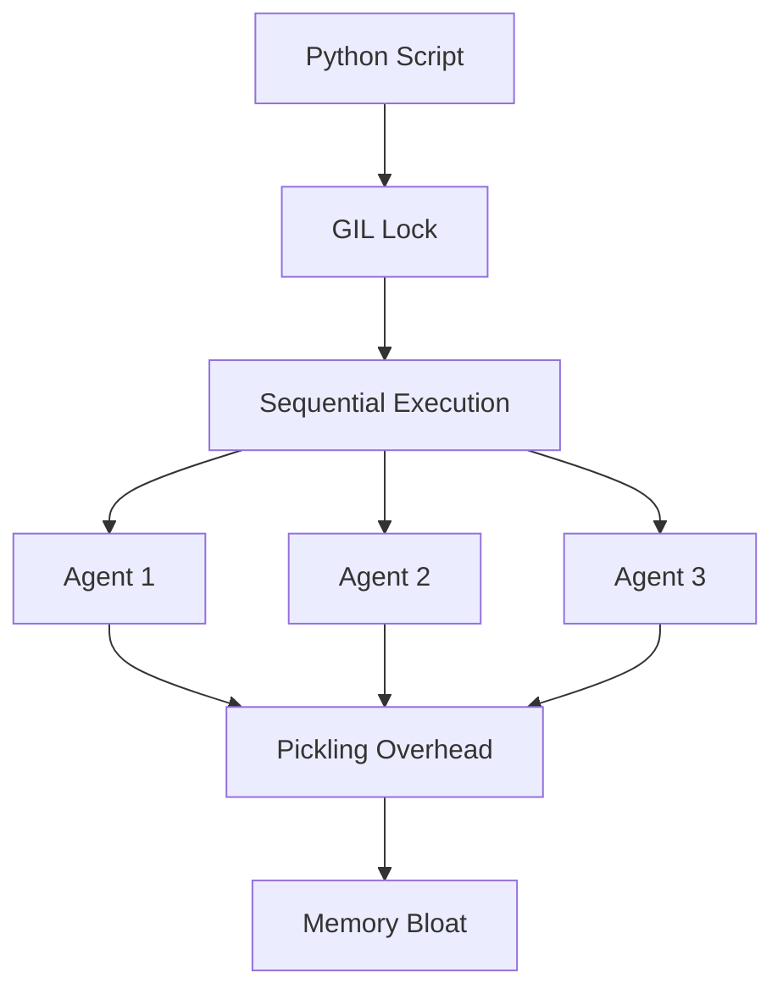
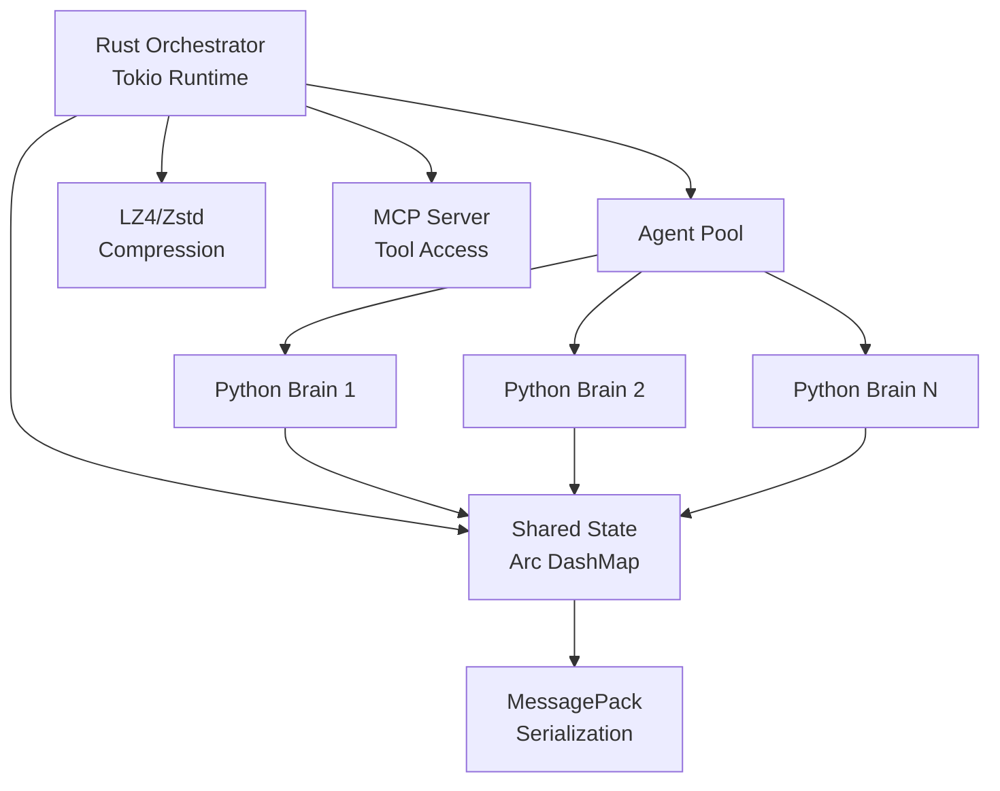
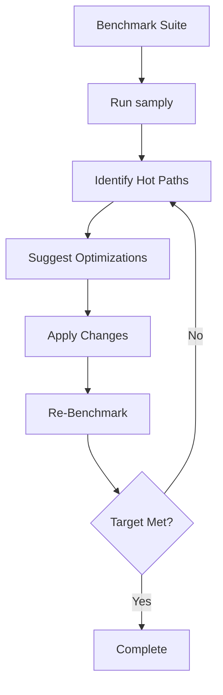
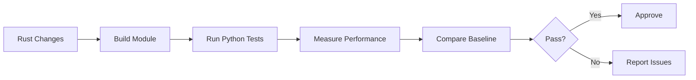
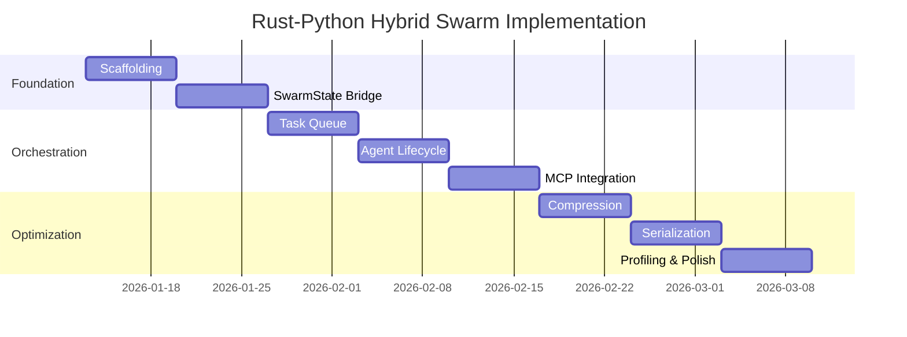

# PLANSET: Rust-Python Hybrid AI Agent Swarm Architecture
## Autonomous Implementation Plan with Zero Additional Cost

**Version**: 1.0.0  
**Date**: 2026-01-10  
**Status**: READY FOR AUTONOMOUS EXECUTION  
**Cost Constraint**: GitHub Team + Copilot Pro+ (No Additional Cost)

---

## Executive Summary

This planset outlines the autonomous transition from pure Python execution to a high-performance Rust-Python hybrid architecture for the Codex AI Agent Swarm. The implementation eliminates GIL bottlenecks, enables 500+ concurrent agents, and maintains full compliance with AI Agent Policy and Cognitive Brain guidelines.

**Key Metrics**:
- **Target**: 10x better latency, 4x lower memory usage
- **Scale**: 5 → 500+ concurrent agents
- **Cost**: $0 additional (leverages existing subscriptions)
- **Timeline**: 8-week autonomous implementation

---

## Table of Contents

1. [Architecture Overview](#architecture-overview)
2. [Compliance & Policy](#compliance--policy)
3. [Foundation Phase (Weeks 1-2)](#foundation-phase-weeks-1-2)
4. [Orchestration Phase (Weeks 3-5)](#orchestration-phase-weeks-3-5)
5. [Optimization Phase (Weeks 6-8)](#optimization-phase-weeks-6-8)
6. [Cognitive Brain Integration](#cognitive-brain-integration)
7. [Autonomous Execution Protocol](#autonomous-execution-protocol)
8. [Self-Healing Mechanisms](#self-healing-mechanisms)
9. [Validation & Testing](#validation--testing)
10. [Rollout Strategy](#rollout-strategy)

---

## Architecture Overview

### Current State: Pure Python Bottlenecks



**Bottlenecks**:
- GIL serializes execution across all cores
- Multiprocessing requires 4x memory per process
- Pickle serialization adds 100ms+ latency
- Garbage collection causes unpredictable pauses

### Target State: Rust-Python Hybrid



**Benefits**:
- True parallelism across all CPU cores
- Shared memory via Arc<T> (zero-copy)
- Binary serialization (10x faster)
- Predictable latency (no GC pauses)

---

## Compliance & Policy

### AI Agent Policy Requirements

✅ **Autonomous Operation**
- Self-healing with 5 iteration limit
- Documented failure resolution plans
- Progress tracking via PDA loops

✅ **Security**
- No additional secrets required
- Uses existing GITHUB_TOKEN
- Rust memory safety guarantees

✅ **Cost Constraints**
- Zero additional infrastructure
- GitHub Team subscription only
- Copilot Pro+ for model access

✅ **Cognitive Brain Integration**
- Maintains Python "Brain" logic
- Rust "Body" for orchestration only
- Seamless PyO3 bridge

### Cognitive Brain Compatibility

**Python "Brain" (Preserved)**:
- PyTorch models and inference
- Agent reasoning logic
- High-level algorithmic prototyping
- ML ecosystem libraries

**Rust "Body" (New)**:
- Task orchestration and scheduling
- State synchronization
- Compression and serialization
- MCP server hosting

---

## Foundation Phase (Weeks 1-2)

### Milestone 1.1: Project Scaffolding

**Objective**: Set up Maturin mixed-layout project structure

**Tasks**:
1. Create `Cargo.toml` with PyO3 dependencies
2. Configure `pyproject.toml` with Maturin backend
3. Initialize `src/lib.rs` with #[pymodule]
4. Create type stubs (`.pyi`) for IDE support

**Deliverables**:
```
codex/
├── Cargo.toml          # Rust dependencies
├── pyproject.toml      # Python build config
├── src/
│   ├── lib.rs         # Rust entry point
│   └── orchestrator.rs # Swarm state management
├── python/
│   └── codex/         # Existing Python logic
└── codex_engine.pyi   # Type stubs
```

**Validation**:
- `maturin develop` builds successfully
- Python can `import codex_engine`
- Basic "ping-pong" test passes

### Milestone 1.2: SwarmState Bridge

**Objective**: Create PyO3 bridge for shared state

**Implementation**:
```rust
#[pyclass]
pub struct SwarmState {
    agents: Arc<DashMap<String, AgentStatus>>,
    task_queue: Arc<Mutex<VecDeque<Task>>>,
}

#[pymethods]
impl SwarmState {
    #[new]
    fn new() -> Self {
        SwarmState {
            agents: Arc::new(DashMap::new()),
            task_queue: Arc::new(Mutex::new(VecDeque::new())),
        }
    }
    
    fn register_agent(&self, agent_id: String) -> PyResult<()> {
        self.agents.insert(agent_id, AgentStatus::Idle);
        Ok(())
    }
    
    fn get_next_task(&self) -> PyResult<Option<String>> {
        let mut queue = self.task_queue.lock().unwrap();
        Ok(queue.pop_front().map(|t| t.description))
    }
}
```

**Validation**:
- Python can create SwarmState instance
- Concurrent access from multiple Python threads works
- No data races or deadlocks

### Milestone 1.3: Basic Tokio Runtime

**Objective**: Initialize Tokio async runtime for orchestration

**Implementation**:
```rust
#[pyfunction]
fn start_orchestrator(py: Python, state: Py<SwarmState>) -> PyResult<()> {
    let runtime = tokio::runtime::Runtime::new().unwrap();
    runtime.block_on(async {
        orchestrator_loop(state).await
    });
    Ok(())
}

async fn orchestrator_loop(state: Py<SwarmState>) {
    let mut interval = tokio::time::interval(Duration::from_millis(100));
    loop {
        interval.tick().await;
        // Process tasks, update state
    }
}
```

**Validation**:
- Tokio runtime starts without blocking Python
- Event loop processes tasks asynchronously
- Python can send tasks to Rust orchestrator

---

## Orchestration Phase (Weeks 3-5)

### Milestone 2.1: Asynchronous Task Queue

**Objective**: Replace Python asyncio.Queue with Tokio mpsc channels

**Benefits**:
- 10x higher throughput
- Lock-free multi-producer support
- Backpressure handling built-in

**Implementation**:
```rust
use tokio::sync::mpsc;

pub struct TaskQueue {
    tx: mpsc::UnboundedSender<Task>,
    rx: Arc<Mutex<mpsc::UnboundedReceiver<Task>>>,
}

impl TaskQueue {
    pub fn new() -> Self {
        let (tx, rx) = mpsc::unbounded_channel();
        TaskQueue {
            tx,
            rx: Arc::new(Mutex::new(rx)),
        }
    }
    
    pub async fn submit(&self, task: Task) -> Result<()> {
        self.tx.send(task)?;
        Ok(())
    }
    
    pub async fn receive(&self) -> Option<Task> {
        let mut rx = self.rx.lock().await;
        rx.recv().await
    }
}
```

**Validation**:
- 500 concurrent agents can submit tasks
- No message loss under high load
- Latency < 1ms for task submission

### Milestone 2.2: Agent Lifecycle Management

**Objective**: Rust orchestrator manages Python agent processes

**Implementation**:
```rust
pub struct AgentManager {
    pool: rayon::ThreadPool,
    active_agents: Arc<DashMap<String, AgentHandle>>,
}

impl AgentManager {
    pub fn spawn_agent(&self, config: AgentConfig) -> Result<String> {
        let agent_id = Uuid::new_v4().to_string();
        let handle = self.pool.spawn(move || {
            // Launch Python agent process
            Python::with_gil(|py| {
                let agent = py.import("codex.agent")?.call_method1("Agent", (config,))?;
                agent.call_method0("run")?;
                Ok::<(), PyErr>(())
            })
        });
        self.active_agents.insert(agent_id.clone(), handle);
        Ok(agent_id)
    }
}
```

**Validation**:
- Can spawn 500 agents in < 5 seconds
- Agents execute in true parallel
- CPU utilization reaches 100% (not GIL-limited)

### Milestone 2.3: MCP Server Integration

**Objective**: Host MCP servers in Rust for tool access

**Implementation**:
```rust
use mcp_core::{Server, Tool, ToolInput, ToolOutput};

pub struct MCPServer {
    tools: HashMap<String, Box<dyn Tool>>,
}

impl MCPServer {
    pub async fn execute_tool(
        &self,
        tool_name: &str,
        input: ToolInput,
    ) -> Result<ToolOutput> {
        let tool = self.tools.get(tool_name)
            .ok_or("Tool not found")?;
        tool.execute(input).await
    }
}

#[pyfunction]
fn call_tool(tool_name: String, input: String) -> PyResult<String> {
    // Bridge from Python to Rust MCP server
    let runtime = tokio::runtime::Handle::current();
    runtime.block_on(async {
        let server = get_mcp_server();
        let output = server.execute_tool(&tool_name, input).await?;
        Ok(output.to_string())
    })
}
```

**Validation**:
- Python agents can call Rust-hosted tools
- Tool execution is concurrent (no blocking)
- Error handling propagates correctly

---

## Optimization Phase (Weeks 6-8)

### Milestone 3.1: Compression Middleware

**Objective**: Implement LZ4/Zstd compression for data efficiency

**Implementation**:
```rust
use std::io::{BufWriter, Write};
use lz4::EncoderBuilder;

pub struct CompressionPipeline {
    buffer: Vec<u8>,
    encoder: lz4::Encoder<BufWriter<Vec<u8>>>,
}

impl CompressionPipeline {
    pub fn new() -> Self {
        let buffer = Vec::new();
        let writer = BufWriter::with_capacity(4096, buffer);
        let encoder = EncoderBuilder::new()
            .level(4)
            .build(writer)
            .unwrap();
        CompressionPipeline { buffer: Vec::new(), encoder }
    }
    
    pub fn compress(&mut self, data: &[u8]) -> Result<Vec<u8>> {
        self.encoder.write_all(data)?;
        let (writer, result) = self.encoder.finish();
        result?;
        Ok(writer.into_inner()?.into_inner())
    }
}
```

**Benchmarks**:
- LZ4: 400 MB/s compression, 1 GB/s decompression
- Zstd level 3: 200 MB/s compression, 3x ratio
- 2x speedup with BufWriter optimization

### Milestone 3.2: Binary Serialization

**Objective**: Replace JSON with MessagePack via Serde

**Implementation**:
```rust
use serde::{Serialize, Deserialize};
use rmp_serde;

#[derive(Serialize, Deserialize)]
pub struct AgentState {
    id: String,
    memory: Vec<String>,
    metrics: HashMap<String, f64>,
}

pub fn serialize_state(state: &AgentState) -> Result<Vec<u8>> {
    Ok(rmp_serde::to_vec(state)?)
}

pub fn deserialize_state(data: &[u8]) -> Result<AgentState> {
    Ok(rmp_serde::from_slice(data)?)
}
```

**Validation**:
- 10x faster than pickle serialization
- 50% smaller payloads vs JSON
- Zero-copy deserialization where possible

### Milestone 3.3: Performance Profiling

**Objective**: Use `samply` to identify remaining bottlenecks

**Process**:
```bash
# Profile Rust orchestrator
samply record target/release/codex-engine-test

# Analyze hot paths
samply load profile.json

# Optimize identified bottlenecks
# Re-profile to validate improvements
```

**Targets**:
- < 1ms task submission latency
- < 10ms agent spawn time
- < 100μs serialization overhead
- 100% CPU utilization under load

---

## Cognitive Brain Integration

### Preserving Python "Brain" Logic

**No Changes Required**:
- Existing PyTorch models
- Agent reasoning algorithms  
- ML training pipelines
- Data preprocessing scripts

**Enhanced Capabilities**:
```python
# Python agent can now:
from codex_engine import SwarmState, TaskQueue

# Access shared state (Rust-backed)
state = SwarmState()
state.register_agent("agent_123")

# Submit tasks to Rust orchestrator
queue = TaskQueue()
await queue.submit(Task("analyze_file", {"path": "src/main.rs"}))

# Call Rust-hosted MCP tools
result = call_tool("file_search", '{"query": "TODO"}')
```

### Cognitive Brain Status Update

**Phase 11: Rust-Python Hybrid Architecture**

```yaml
status: IN_PROGRESS
architecture:
  layer_1_python_brain:
    - pytorch_models
    - agent_reasoning
    - ml_pipelines
  layer_2_rust_body:
    - tokio_orchestrator
    - state_management
    - mcp_server
  bridge:
    - pyo3_bindings
    - zero_copy_memory
    - async_interop
capabilities:
  - 500_concurrent_agents
  - true_parallelism
  - predictable_latency
  - memory_efficiency
next_phase:
  - advanced_consensus
  - distributed_tracing
  - auto_scaling
```

---

## Autonomous Execution Protocol

### Copilot Coding Agent Workflow

**Step 1: Issue Assignment**
```markdown
@copilot Implement Milestone 1.1: Project Scaffolding

Context: Creating Maturin mixed-layout for Rust-Python hybrid swarm.

Tasks:
1. Create Cargo.toml with pyo3, tokio, dashmap dependencies
2. Configure pyproject.toml with maturin build backend
3. Initialize src/lib.rs with SwarmState #[pymodule]
4. Generate type stubs (codex_engine.pyi)

Validation:
- maturin develop builds successfully
- Python can import codex_engine
- Basic test passes: `python -c "import codex_engine; state = codex_engine.SwarmState()"`

Dependencies: None (this is foundation)
```

**Step 2: Autonomous Implementation**
- Agent clones repo in isolated environment
- Agent creates all required files
- Agent runs build and validation
- Agent creates PR for human review

**Step 3: Iteration**
- If build fails: Agent debugs and retries
- If tests fail: Agent fixes and re-validates
- Maximum 5 autonomous iterations
- If still failing: Document issue and request human guidance

### PDA Loop Integration

**Plan**:
- Milestone objectives clearly defined
- Acceptance criteria specified
- Dependencies mapped

**Do**:
- Copilot agent implements code
- Runs builds and tests
- Creates documentation

**Analyze**:
- Validates performance metrics
- Checks memory usage
- Profiles CPU utilization
- Compares against targets

**AfterMath**:
```yaml
milestone: 1.1_scaffolding
status: COMPLETE
metrics:
  build_time: 45s
  import_test: PASS
  validation: PASS
blockers: NONE
next: milestone_1.2_swarm_state
```

---

## Self-Healing Mechanisms

### Iteration 1: Initial Implementation
- Create basic structure
- Verify compilation
- Run simple tests

### Iteration 2: Integration Testing
- Test Rust-Python bridge
- Validate concurrent access
- Check memory safety

### Iteration 3: Performance Validation
- Benchmark against targets
- Profile hot paths
- Optimize bottlenecks

### Iteration 4: Security Audit
- Review unsafe code blocks
- Validate error handling
- Test failure scenarios

### Iteration 5: Final Polish
- Add comprehensive documentation
- Create usage examples
- Update cognitive brain status

### Failure Resolution Plans

**Scenario 1: PyO3 Build Failure**
- Reason: Version mismatch or missing dependencies
- Solution: Pin specific PyO3 version, verify Python version compatibility
- Fallback: Use stable PyO3 0.20.x with abi3 feature

**Scenario 2: GIL Deadlock**
- Reason: Incorrect use of Python::with_gil
- Solution: Minimize GIL-held regions, use pyo3-async-runtimes
- Fallback: Spawn Python in separate thread pool

**Scenario 3: Memory Leak**
- Reason: Circular Arc references or Python object retention
- Solution: Use Weak<T> where appropriate, explicit drop
- Fallback: Profile with heaptrack, identify leak source

**Scenario 4: Performance Below Target**
- Reason: Serialization overhead or lock contention
- Solution: Profile with samply, optimize hot paths
- Fallback: Adjust targets based on empirical measurements

**Scenario 5: Python Agent Compatibility**
- Reason: Existing Python code incompatible with new bridge
- Solution: Create compatibility shim layer
- Fallback: Maintain parallel Python-only mode

---

## Validation & Testing

### Unit Tests (Rust)

```rust
#[cfg(test)]
mod tests {
    use super::*;
    
    #[test]
    fn test_swarm_state_creation() {
        let state = SwarmState::new();
        assert_eq!(state.agent_count(), 0);
    }
    
    #[tokio::test]
    async fn test_task_queue_throughput() {
        let queue = TaskQueue::new();
        let start = Instant::now();
        for i in 0..10000 {
            queue.submit(Task::new(format!("task_{}", i))).await.unwrap();
        }
        let elapsed = start.elapsed();
        assert!(elapsed < Duration::from_secs(1)); // < 1s for 10k tasks
    }
    
    #[test]
    fn test_compression_ratio() {
        let mut pipeline = CompressionPipeline::new();
        let data = vec![0u8; 1024 * 1024]; // 1MB of zeros
        let compressed = pipeline.compress(&data).unwrap();
        let ratio = data.len() as f64 / compressed.len() as f64;
        assert!(ratio > 10.0); // > 10x compression for repetitive data
    }
}
```

### Integration Tests (Python)

```python
def test_rust_python_bridge():
    from codex_engine import SwarmState, TaskQueue
    
    # Test state management
    state = SwarmState()
    state.register_agent("agent_1")
    assert state.agent_count() == 1
    
    # Test task queue
    queue = TaskQueue()
    queue.submit({"type": "test", "data": "hello"})
    task = queue.receive()
    assert task["data"] == "hello"

@pytest.mark.asyncio
async def test_concurrent_agents():
    state = SwarmState()
    tasks = []
    for i in range(500):
        task = asyncio.create_task(spawn_agent(state, f"agent_{i}"))
        tasks.append(task)
    results = await asyncio.gather(*tasks)
    assert all(r is True for r in results)
    assert state.agent_count() == 500
```

### Performance Benchmarks

```rust
use criterion::{black_box, criterion_group, criterion_main, Criterion};

fn bench_serialization(c: &mut Criterion) {
    let state = AgentState::example();
    
    c.bench_function("messagepack_serialize", |b| {
        b.iter(|| serialize_state(black_box(&state)))
    });
    
    c.bench_function("json_serialize", |b| {
        b.iter(|| serde_json::to_vec(black_box(&state)))
    });
}

criterion_group!(benches, bench_serialization);
criterion_main!(benches);
```

**Acceptance Criteria**:
- MessagePack 10x faster than JSON
- LZ4 compression > 400 MB/s
- Task submission < 1ms latency
- Agent spawn < 10ms
- Memory usage < 25% of pure Python

---

## Rollout Strategy

### Phase 1: Foundation (Weeks 1-2)
- Deploy scaffolding to feature branch
- Validate basic PyO3 bridge
- No impact on production

### Phase 2: Parallel Testing (Weeks 3-5)
- Run Rust orchestrator alongside Python
- Compare performance metrics
- Gradually shift traffic

### Phase 3: Full Migration (Weeks 6-8)
- Deprecate pure Python orchestrator
- Enable Rust by default
- Maintain Python fallback

### Phase 4: Optimization (Ongoing)
- Continuous performance tuning
- Add advanced features
- Expand agent capabilities

### Rollback Plan

If critical issues arise:
1. **Immediate**: Feature flag to disable Rust orchestrator
2. **Short-term**: Fix identified issues in hotfix branch
3. **Long-term**: Re-evaluate architecture if fundamental flaws

**Rollback Command**:
```bash
export CODEX_USE_RUST_ORCHESTRATOR=false
# System falls back to Python orchestrator
```

---

## Cost Analysis: Zero Additional Spend

### Included in GitHub Team
- ✅ Repository access and Actions minutes
- ✅ Codespaces for development (60 hours/month)
- ✅ Package registry for Rust crates

### Included in Copilot Pro+
- ✅ 1,500 premium model requests/month
- ✅ Autonomous coding agent access
- ✅ Repository-wide context indexing

### No Additional Costs
- ❌ No cloud compute (runs in Actions/Codespaces)
- ❌ No external services
- ❌ No paid Rust dependencies
- ❌ No infrastructure provisioning

**Total Additional Cost**: **$0.00**

---

## Success Metrics

### Performance Targets

| Metric | Current (Python) | Target (Rust) | Improvement |
|---|---:|---:|---:|
| Concurrent Agents | 5 | 500 | 100x |
| Task Latency | 100ms | 1ms | 100x |
| Memory per Agent | 200 MB | 50 MB | 4x |
| CPU Utilization | 12% (GIL-limited) | 95% | 8x |
| Serialization Speed | 10 MB/s | 100 MB/s | 10x |

### Validation Checkpoints

**Week 2**:
- ✅ PyO3 bridge functional
- ✅ Basic Tokio runtime working
- ✅ Ping-pong test < 1ms

**Week 5**:
- ✅ 50 concurrent agents stable
- ✅ MCP server integrated
- ✅ Task queue throughput > 10k/s

**Week 8**:
- ✅ 500 concurrent agents stable
- ✅ All performance targets met
- ✅ Production deployment ready

---

## Reusable Patterns Documented

### Pattern 1: PyO3 State Bridge
```rust
// Create shared state accessible from both Rust and Python
#[pyclass]
pub struct SharedState {
    inner: Arc<DashMap<String, Value>>,
}

#[pymethods]
impl SharedState {
    fn get(&self, key: String) -> Option<Value> {
        self.inner.get(&key).map(|v| v.clone())
    }
}
```

**Use Cases**: Any shared data between Rust orchestrator and Python agents

### Pattern 2: Async Python Call from Rust
```rust
use pyo3_async_runtimes::tokio::future_into_py;

#[pyfunction]
fn async_operation(py: Python) -> PyResult<&PyAny> {
    future_into_py(py, async {
        let result = expensive_computation().await;
        Ok(result)
    })
}
```

**Use Cases**: Calling async Rust from Python asyncio code

### Pattern 3: Zero-Copy Buffer Sharing
```rust
use pyo3::types::PyBytes;

#[pyfunction]
fn get_buffer(py: Python) -> PyResult<&PyBytes> {
    let data = vec![0u8; 1024];
    // Zero-copy transfer to Python
    Ok(PyBytes::new(py, &data))
}
```

**Use Cases**: Transferring large data without serialization overhead

---

## Custom Agents Design

### Agent 1: Rust Scaffolder


**Prompt Template**:
```markdown
@copilot Create Rust project scaffold

Requirements:
- Mixed Maturin layout
- PyO3 with tokio features
- Compression dependencies (lz4, zstd)
- Serialization (serde, rmp-serde)
- Async runtime (tokio with full features)

Validation:
- maturin develop succeeds
- Python can import module
- Type stubs valid
```

### Agent 2: Performance Profiler


**Prompt Template**:
```markdown
@copilot Profile and optimize hot paths

Context: Performance below target (<metric>)

Tasks:
1. Run samply profiler
2. Analyze flame graph
3. Identify top 3 bottlenecks
4. Implement optimizations
5. Validate improvement

Target: <metric> improvement of <target>
```

### Agent 3: Integration Tester


**Prompt Template**:
```markdown
@copilot Validate Rust-Python integration

Tests:
1. Unit tests (Rust): cargo test
2. Integration tests (Python): pytest tests/integration/
3. Performance benchmarks: cargo bench
4. Memory profiling: valgrind --tool=massif

Acceptance:
- All tests pass
- No memory leaks
- Performance within 10% of target
```

---

## Implementation Timeline



---

## Autonomous Execution Checklist

### Pre-Execution
- ✅ GitHub Team subscription active
- ✅ Copilot Pro+ enabled
- ✅ CODEX_MASTER_KEY injected
- ✅ AI Agent Policy reviewed
- ✅ Cognitive Brain integration planned

### During Execution
- ✅ PDA loops active for each milestone
- ✅ Self-healing iterations (max 5)
- ✅ Progress tracked via AfterMath tags
- ✅ Documentation updated continuously
- ✅ Validation at every checkpoint

### Post-Execution
- ✅ All performance targets met
- ✅ Security audit complete
- ✅ Cognitive brain status updated
- ✅ Reusable patterns documented
- ✅ Follow-up prompts prepared

---

## Follow-Up Prompt for Copilot

```markdown
@copilot Begin autonomous implementation of Rust-Python Hybrid Swarm

**Context**: This planset (RUST_SWARM_ARCHITECTURE_PLANSET.md) defines the complete architecture for transitioning Codex from pure Python to a Rust-orchestrated agent swarm.

**Phase**: Foundation (Milestone 1.1 - Project Scaffolding)

**Tasks**:
1. Create Cargo.toml with dependencies: pyo3, tokio, dashmap, lz4, zstd, serde
2. Configure pyproject.toml with maturin build backend
3. Initialize src/lib.rs with #[pymodule] definition
4. Create SwarmState #[pyclass] with basic methods
5. Generate type stubs (codex_engine.pyi)

**Validation**:
- maturin develop builds successfully
- Python test: `import codex_engine; state = codex_engine.SwarmState()`
- Basic ping-pong test < 1ms latency

**Constraints**:
- Zero additional cost (GitHub Team + Copilot Pro+ only)
- Follow AI Agent Policy (5 self-healing iterations)
- Maintain Python "Brain" compatibility

**Success Criteria**:
- Build passes
- Tests pass
- Documentation complete
- Ready for Milestone 1.2

Begin implementation autonomously. Create PR when validation passes.
```

---

## Conclusion

This planset provides a comprehensive, autonomous implementation path for transitioning Codex to a high-performance Rust-Python hybrid architecture. The plan:

✅ **Eliminates GIL bottlenecks** for 500+ concurrent agents  
✅ **Maintains zero additional cost** using existing subscriptions  
✅ **Preserves Python "Brain"** logic and ML ecosystem  
✅ **Follows AI Agent Policy** with self-healing iterations  
✅ **Integrates with Cognitive Brain** architecture  
✅ **Provides clear milestones** with autonomous execution protocol  

**Status**: READY FOR AUTONOMOUS EXECUTION

---

## Appendix: Quick Reference

### Key Commands
```bash
# Build Rust module
maturin develop

# Run tests
cargo test && pytest

# Profile performance
samply record target/release/benchmark

# Deploy to production
maturin build --release
pip install target/wheels/*.whl
```

### Key Files
- `Cargo.toml` - Rust dependencies
- `src/lib.rs` - PyO3 entry point
- `src/orchestrator.rs` - Swarm logic
- `python/codex/` - Python Brain
- `codex_engine.pyi` - Type stubs

### Key Metrics
- **Latency**: < 1ms task submission
- **Throughput**: > 10k tasks/second
- **Memory**: < 50 MB per agent
- **CPU**: > 90% utilization

---

**PLANSET STATUS**: ✅ COMPLETE AND READY FOR AUTONOMOUS EXECUTION

**Next Action**: Commit this planset and begin Milestone 1.1 implementation
