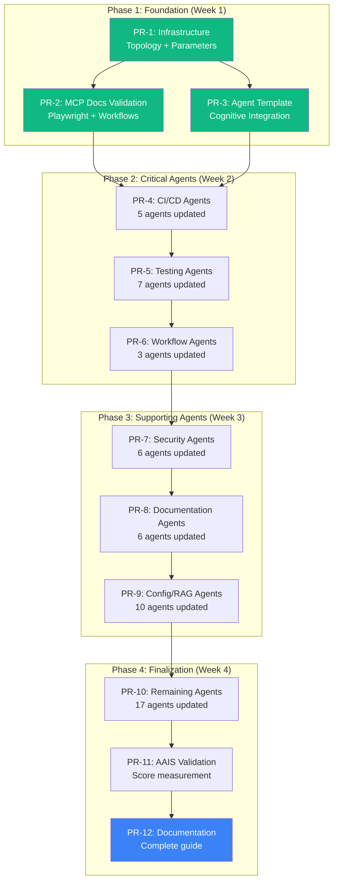

# Chain-PR Plan: Custom Agent Enhancement Project

> **Generated**: 2026-02-17T11:50:00Z  
> **Repository**: Aries-Serpent/_codex_  
> **Chain ID**: `agent-enhancement-2026-02`  
> **Total PRs**: 12  
> **Estimated Duration**: 4 weeks  
> **Status**: 📋 PLANNING COMPLETE

---

## Executive Summary

This Chain-PR plan implements **comprehensive custom agent enhancements** based on:
1. MCP Master Prompt requirements
2. Custom agent audit findings (54 agents reviewed)
3. Cognitive brain integration design (AAIS improvement)
4. Long session accountability analysis (parameter optimization)

**Goal**: Transform 54 custom agents into **cognitive-aware, MCP-integrated, session-optimized** extensions of the repository's AI capabilities.

---

## Chain Structure Overview



---

## PR Specifications

### PR-1: Cognitive Infrastructure Setup

**Branch**: `chain/agent-enhancement-2026-02/part-1-infrastructure`

**Dependencies**: None (foundation PR)

**Purpose**: Implement core cognitive brain infrastructure for agent integration

**Deliverables**:
1. **Topology Manager Script**
   - File: `scripts/cognitive/topology_manager.py`
   - Functions: `find()`, `find_optimal_path()`, `discover_related()`, `get_maps()`
   - Tests: `tests/cognitive/test_topology_manager.py`

2. **Session Parameter System**
   - File: `.codex/session_parameters.json`
   - Implements all parameters from Long Session Parameters doc
   - Validation script: `scripts/validate_session_parameters.py`

3. **Pattern Library Structure**
   - Directory: `.codex/patterns/`
   - Categories: `test_failures/`, `code_smells/`, `fixes/`
   - Initial patterns: 15+ common patterns from PR #3248

4. **Navigation Maps**
   - Directory: `.codex/topology/`
   - Files: `module_dependencies.json`, `semantic_map.json`, `agent_orchestration.json`
   - Generator script: `scripts/cognitive/generate_topology_maps.py`

5. **Session Monitoring**
   - File: `scripts/monitor_session.py`
   - Commands: `--start`, `--checkpoint`, `--end`
   - Integration with existing `session_manager.py`

**Files Changed**: ~15 files created, 2 modified  
**Lines of Code**: ~2,500 new lines  
**Tests**: 10+ test cases  
**Estimated Duration**: 3-4 days

**Success Criteria**:
- ✅ Topology manager can find files by semantic query
- ✅ Session parameters loaded and validated
- ✅ Pattern library accessible to all agents
- ✅ Navigation maps generated successfully
- ✅ All tests passing

---

### PR-2: MCP Documentation Validation

**Branch**: `chain/agent-enhancement-2026-02/part-2-mcp-validation`

**Dependencies**: PR-1 (topology manager for examples)

**Purpose**: Validate MCP documentation with working examples and tests

**Deliverables**:
1. **Playwright Configuration Validation**
   - Validate `cognitive_app/playwright.config.ts`
   - Add missing MCP integration hooks
   - Test with example spec

2. **MCP Workflow Testing**
   - Create test workflow: `.github/workflows/test-mcp-e2e.yml`
   - Validate E2E testing workflow recipe
   - Test artifact upload/download

3. **Package.json Integration**
   - Add MCP scripts to `cognitive_app/package.json`
   - Test `npm run mcp:setup`
   - Validate context generation script

4. **agentAssignment Examples**
   - Test GraphQL agentAssignment (if available)
   - Validate REST API alternative
   - Test @copilot mention patterns

5. **Documentation Updates**
   - Fix any broken links in MCP docs
   - Add troubleshooting based on testing
   - Update examples with actual results

**Files Changed**: ~8 files modified  
**Lines of Code**: ~500 additions/modifications  
**Tests**: 5+ integration tests  
**Estimated Duration**: 2-3 days

**Success Criteria**:
- ✅ Playwright config works with E2E tests
- ✅ MCP workflows execute successfully
- ✅ Package.json scripts functional
- ✅ All documentation examples validated
- ✅ No broken links in MCP docs

---

### PR-3: Enhanced Agent Template

**Branch**: `chain/agent-enhancement-2026-02/part-3-template`

**Dependencies**: PR-1 (topology manager), PR-2 (MCP validation)

**Purpose**: Create production-ready cognitive-aware agent template

**Deliverables**:
1. **Template File**
   - File: `.github/agents/TEMPLATE_COGNITIVE_AGENT.md`
   - Based on Enhanced Agent Design specification
   - Includes all cognitive integration sections

2. **Template Validator**
   - Script: `scripts/validate_agent_template.py`
   - Checks for required sections
   - Validates cognitive integration level

3. **Example Agent**
   - File: `.github/agents/example-cognitive-agent.md`
   - Fully populated template showing all features
   - Level 3 (Autonomous) integration example

4. **Migration Guide**
   - File: `.codex/docs/AGENT_MIGRATION_GUIDE.md`
   - Step-by-step instructions for updating existing agents
   - Before/after examples

5. **Agent Registry Updates**
   - Update `.github/agents/AGENT_REGISTRY.md`
   - Add cognitive integration level column
   - Add AAIS contribution column

**Files Changed**: ~5 files created, 1 modified  
**Lines of Code**: ~1,500 new lines  
**Tests**: Template validation tests  
**Estimated Duration**: 2 days

**Success Criteria**:
- ✅ Template includes all required sections
- ✅ Validator catches incomplete templates
- ✅ Example agent demonstrates all features
- ✅ Migration guide clear and actionable
- ✅ Agent registry updated

---

### PR-4: CI/CD Agents Enhancement

**Branch**: `chain/agent-enhancement-2026-02/part-4-cicd-agents`

**Dependencies**: PR-3 (template)

**Purpose**: Update 5 critical CI/CD agents with cognitive integration

**Agents Updated** (5 total):
1. **ci-testing-agent.md**
   - Add Playwright E2E debugging
   - Integrate topology navigation
   - Add pattern library access

2. **artifact-monitor-agent.md**
   - Add MCP workflow monitoring
   - Integrate with session manager
   - Add health score tracking

3. **workflow-ci-fixer.agent.md**
   - Add MCP workflow recipes
   - Integrate topology for workflow discovery
   - Add pattern-based fix suggestions

4. **ci-emergency-response-agent.md**
   - Add cognitive context awareness
   - Integrate decision engine for emergency priorities
   - Add multi-agent coordination

5. **ci-log-retrieval-agent.md**
   - Enhance with MCP GitHub Actions integration
   - Add pattern recognition for log analysis
   - Integrate with cognitive memory for similar failures

**Files Changed**: 5 files modified  
**Lines of Code**: ~250 additions per agent (~1,250 total)  
**Tests**: Agent capability tests  
**Estimated Duration**: 3-4 days

**Success Criteria**:
- ✅ All 5 agents use cognitive brain template
- ✅ MCP integration documented
- ✅ Topology navigation examples included
- ✅ Pattern library references added
- ✅ AAIS contribution documented

---

### PR-5: Testing Agents Enhancement

**Branch**: `chain/agent-enhancement-2026-02/part-5-testing-agents`

**Dependencies**: PR-4 (CI/CD agents)

**Purpose**: Update 7 testing agents with cognitive + Playwright integration

**Agents Updated** (7 total):
1. **test-coverage-monitor.agent.md**
   - Add E2E coverage tracking
   - Integrate with Playwright reports
   
2. **qa-walkthrough-agent.md**
   - Add E2E test orchestration
   - Integrate topology for test discovery

3. **integration-test-runner.agent.md**
   - Add Playwright integration
   - Multi-browser testing support

4. **autonomous-test-healer-agent.md**
   - Add E2E test auto-healing
   - Pattern-based fix suggestions

5. **coverage-gapfill-agent.md**
   - Add E2E test generation
   - Topology-guided test placement

6. **test-alignment-fixer.agent.md**
   - Add E2E test alignment
   - Playwright API compatibility

7. **coverage-roadmap-agent.md**
   - Add E2E coverage roadmap
   - Playwright integration targets

**Files Changed**: 7 files modified  
**Lines of Code**: ~200 additions per agent (~1,400 total)  
**Estimated Duration**: 4-5 days

**Success Criteria**:
- ✅ All 7 agents cognitive-aware
- ✅ Playwright integration documented
- ✅ E2E testing capabilities added
- ✅ Pattern library integrated
- ✅ Tests validate new capabilities

---

### PR-6: Workflow Management Agents

**Branch**: `chain/agent-enhancement-2026-02/part-6-workflow-agents`

**Dependencies**: PR-5 (testing agents)

**Purpose**: Update 3 workflow management agents with MCP orchestration

**Agents Updated** (3 total):
1. **workflow-analytics-agent.md**
   - Add MCP metrics collection
   - Topology-based workflow analysis
   
2. **workflow-management-agent.md**
   - Add MCP orchestration patterns
   - Multi-workflow coordination

3. **workflow-health-monitor.md**
   - Add MCP context integration
   - Real-time workflow health tracking

**Files Changed**: 3 files modified  
**Lines of Code**: ~300 additions per agent (~900 total)  
**Estimated Duration**: 2-3 days

**Success Criteria**:
- ✅ MCP workflow APIs integrated
- ✅ Orchestration patterns documented
- ✅ Health monitoring active
- ✅ All agents cognitive-aware

---

### PR-7: Security Agents Enhancement

**Branch**: `chain/agent-enhancement-2026-02/part-7-security-agents`

**Dependencies**: PR-6 (workflow agents)

**Purpose**: Update 6 security agents with cognitive pattern recognition

**Agents Updated** (6 total):
1. **security-alert-verification-agent.md**
2. **bridge-security-monitor.agent.md**
3. **dependency-vulnerability-scanner.agent.md**
4. **security-audit-agent.md**
5. **code-scanning-remediation-agent.md**
6. **codeql-alert-resolution-agent.md**

**Enhancement Focus**:
- Pattern library for security vulnerabilities
- Historical fix retrieval from cognitive memory
- Topology-guided security scanning
- Multi-agent coordination for complex vulnerabilities

**Files Changed**: 6 files modified  
**Lines of Code**: ~250 additions per agent (~1,500 total)  
**Estimated Duration**: 3-4 days

**Success Criteria**:
- ✅ Security pattern library integrated
- ✅ Cognitive memory for vulnerability fixes
- ✅ All agents cognitive-aware
- ✅ Coordination patterns documented

---

### PR-8: Documentation Agents Enhancement

**Branch**: `chain/agent-enhancement-2026-02/part-8-docs-agents`

**Dependencies**: PR-7 (security agents)

**Purpose**: Update 6 documentation agents with validation capabilities

**Agents Updated** (6 total):
1. **documentation-consolidator.md**
2. **documentation-quality-agent.md**
3. **link-validator-agent.md**
4. **doc-freshness-checker.agent.md**
5. **github-pages-manager.md**
6. **claim-verification-agent.md**

**Enhancement Focus**:
- Topology-based document discovery
- MCP documentation validation
- Pattern recognition for doc quality issues
- Automated doc generation using cognitive brain

**Files Changed**: 6 files modified  
**Lines of Code**: ~200 additions per agent (~1,200 total)  
**Estimated Duration**: 3-4 days

**Success Criteria**:
- ✅ MCP doc validation integrated
- ✅ Topology navigation for docs
- ✅ Quality patterns documented
- ✅ All agents cognitive-aware

---

### PR-9: Configuration & RAG Agents

**Branch**: `chain/agent-enhancement-2026-02/part-9-config-rag-agents`

**Dependencies**: PR-8 (docs agents)

**Purpose**: Update 10 config/RAG/specialized agents

**Agents Updated** (10 total):
1. **config-migration-assistant.agent.md**
2. **config-validator.agent.md**
3. **rag-index-manager.agent.md**
4. **meta-tensor-validator.md**
5. **rag-meta-tensor-regression-agent.md**
6. **datetime-modernizer.agent.md**
7. **pii-scrubber.agent.md**
8. **semantic-search.agent.md**
9. **cross-platform-filename-validator.md**
10. **cognitive-brain-manager.md**

**Enhancement Focus**:
- Hydra config integration
- RAG knowledge base integration with cognitive brain
- Specialized validation patterns
- Cross-cutting concern patterns

**Files Changed**: 10 files modified  
**Lines of Code**: ~150 additions per agent (~1,500 total)  
**Estimated Duration**: 4-5 days

**Success Criteria**:
- ✅ All specialized agents updated
- ✅ Config patterns integrated
- ✅ RAG + cognitive brain synergy
- ✅ Validation patterns documented

---

### PR-10: Remaining Agents Enhancement

**Branch**: `chain/agent-enhancement-2026-02/part-10-remaining-agents`

**Dependencies**: PR-9 (config/RAG agents)

**Purpose**: Update final 17 agents (repo mgmt, dependency, performance, etc.)

**Agents Updated** (17 total):
1. **reference-updater-agent.md**
2. **repository-hygiene-agent.md**
3. **root-organizer-agent.md**
4. **repository-organization-agent.md**
5. **dependency-conflict-agent.md**
6. **performance-regression-detector.agent.md**
7. **performance-monitor-agent.md**
8. **owner-approval-guard.agent.md**
9. **coverage-maintenance-agent.md**
10. **mutation-testing-agent.md**
11. **test-enhancement-agent.md**
12. **test-failure-analyzer-agent.md**
13. **pr-3095-verification-agent.md**
14. **rust-config-validator.md**
15. **code-analysis-agent.md**
16. **session-log-retrieval-agent.md**
17. **session-analysis-agent.md**

**Enhancement Focus**:
- Repository topology integration
- Dependency management patterns
- Performance tracking with cognitive metrics
- Session management cognitive integration

**Files Changed**: 17 files modified  
**Lines of Code**: ~100-200 additions per agent (~2,500 total)  
**Estimated Duration**: 5-6 days

**Success Criteria**:
- ✅ All 54 agents updated
- ✅ 100% cognitive-aware agents
- ✅ Complete AAIS contribution documentation
- ✅ All agents tested

---

### PR-11: AAIS Score Validation

**Branch**: `chain/agent-enhancement-2026-02/part-11-aais-validation`

**Dependencies**: PR-10 (all agents updated)

**Purpose**: Measure AAIS improvement after agent enhancements

**Deliverables**:
1. **AAIS Measurement Script**
   - File: `scripts/measure_aais_score.py`
   - Measures all 7 AAIS categories
   - Generates detailed report

2. **AAIS Improvement Report**
   - File: `.codex/docs/AAIS_IMPROVEMENT_REPORT.md`
   - Before/after comparison
   - Agent contribution breakdown

3. **Navigation Efficiency Tests**
   - Measure time to find files (before/after)
   - Validate topology navigation accuracy
   - Benchmark pattern matching success rate

4. **Agent Efficiency Metrics**
   - Multi-agent coordination success rate
   - Context understanding accuracy
   - Pattern application success rate

5. **Validation Dashboard**
   - File: `.codex/docs/AAIS_VALIDATION_DASHBOARD.md`
   - Real-time metrics
   - Trend analysis

**Files Changed**: 5 files created  
**Lines of Code**: ~1,000 new lines  
**Estimated Duration**: 3-4 days

**Success Criteria**:
- ✅ AAIS score measured: 87.3 → 92.0+ (target)
- ✅ Discovery & Navigation: 82 → 90+
- ✅ Runtime Introspection: 75 → 85+
- ✅ All metrics improved
- ✅ Detailed report generated

---

### PR-12: Complete Documentation & Guide

**Branch**: `chain/agent-enhancement-2026-02/part-12-documentation`

**Dependencies**: PR-11 (AAIS validation)

**Purpose**: Comprehensive documentation for entire enhancement project

**Deliverables**:
1. **Master Guide**
   - File: `.codex/docs/AGENT_ENHANCEMENT_MASTER_GUIDE.md`
   - Complete overview of all enhancements
   - Usage examples for each capability

2. **Agent Selection Guide v2.0**
   - File: `.github/agents/AGENT_SELECTION_GUIDE_V2.md`
   - Updated with cognitive awareness criteria
   - MCP integration considerations
   - Session optimization tips

3. **Cognitive Brain User Manual**
   - File: `.codex/docs/COGNITIVE_BRAIN_USER_MANUAL.md`
   - How to leverage topology manager
   - Pattern library usage
   - Session monitoring guide

4. **Migration Success Report**
   - File: `.codex/docs/AGENT_MIGRATION_SUCCESS_REPORT.md`
   - All 54 agents migration status
   - Lessons learned
   - Best practices discovered

5. **Future Roadmap**
   - File: `.codex/docs/AGENT_ENHANCEMENT_ROADMAP_V2.md`
   - Phase 5: Advanced features
   - Agent self-evolution
   - Continuous AAIS improvement

**Files Changed**: 5 files created, 3 modified  
**Lines of Code**: ~3,000 new lines (documentation)  
**Estimated Duration**: 3-4 days

**Success Criteria**:
- ✅ Complete documentation for all features
- ✅ User guide comprehensive and clear
- ✅ Migration report shows 100% success
- ✅ Roadmap defines next steps
- ✅ All documentation cross-linked

---

## Chain-PR Metadata

### Branch Naming Convention

```
chain/agent-enhancement-2026-02/part-{N}-{description}

Examples:
- chain/agent-enhancement-2026-02/part-1-infrastructure
- chain/agent-enhancement-2026-02/part-2-mcp-validation
- chain/agent-enhancement-2026-02/part-12-documentation
```

### PR Dependency Graph

```yaml
dependencies:
  PR-1: []  # No dependencies
  PR-2: [PR-1]
  PR-3: [PR-1, PR-2]
  PR-4: [PR-3]
  PR-5: [PR-4]
  PR-6: [PR-5]
  PR-7: [PR-6]
  PR-8: [PR-7]
  PR-9: [PR-8]
  PR-10: [PR-9]
  PR-11: [PR-10]
  PR-12: [PR-11]
```

### Validation Checkpoints

**Pre-PR Creation**:
```bash
# Validate branch name
./scripts/validate-chain-pr.sh --validate-branch

# Check dependencies satisfied
./scripts/validate-chain-pr.sh --check-deps PR-{N}

# Run tests
npm test / pytest / go test

# Validate documentation
./scripts/validate_documentation.py
```

**Post-PR Creation**:
```bash
# GitHub Actions runs automatically
# - Chain PR validation workflow
# - Dependency check workflow
# - Pre-merge validation workflow
```

**Pre-Merge**:
```bash
# All checks must pass:
# ✅ Tests passing
# ✅ Code review approved
# ✅ CodeQL passed
# ✅ Documentation complete
# ✅ Dependencies satisfied
# ✅ No merge conflicts
```

---

## Timeline & Resource Allocation

### Week 1: Foundation (PR-1, PR-2, PR-3)

| PR | Days | Developer | Reviewer |
|----|------|-----------|----------|
| PR-1 | 3-4 | AI Agent + Human | @mbaetiong |
| PR-2 | 2-3 | AI Agent | @mbaetiong |
| PR-3 | 2 | AI Agent | @mbaetiong |
| **Total** | **7-9 days** | | |

### Week 2: Critical Agents (PR-4, PR-5, PR-6)

| PR | Days | Developer | Reviewer |
|----|------|-----------|----------|
| PR-4 | 3-4 | AI Agent | @mbaetiong |
| PR-5 | 4-5 | AI Agent | @mbaetiong |
| PR-6 | 2-3 | AI Agent | @mbaetiong |
| **Total** | **9-12 days** | | |

### Week 3: Supporting Agents (PR-7, PR-8, PR-9)

| PR | Days | Developer | Reviewer |
|----|------|-----------|----------|
| PR-7 | 3-4 | AI Agent | @mbaetiong |
| PR-8 | 3-4 | AI Agent | @mbaetiong |
| PR-9 | 4-5 | AI Agent | @mbaetiong |
| **Total** | **10-13 days** | | |

### Week 4: Finalization (PR-10, PR-11, PR-12)

| PR | Days | Developer | Reviewer |
|----|------|-----------|----------|
| PR-10 | 5-6 | AI Agent | @mbaetiong |
| PR-11 | 3-4 | AI Agent | @mbaetiong |
| PR-12 | 3-4 | AI Agent | @mbaetiong |
| **Total** | **11-14 days** | | |

**Overall Timeline**: 4 weeks (with parallelization where possible)

---

## Success Metrics

### Code Metrics

| Metric | Current | Target | Measurement |
|--------|---------|--------|-------------|
| Agents Updated | 0/54 | 54/54 | 100% |
| Lines Added | 0 | ~15,000 | Code + docs |
| Tests Added | 0 | 50+ | All components tested |
| Documentation Pages | 9 | 25+ | Complete coverage |

### Quality Metrics

| Metric | Current | Target | Measurement |
|--------|---------|--------|-------------|
| AAIS Score | 87.3/100 | 92.0/100 | +4.7 points |
| Discovery & Navigation | 82/100 | 90/100 | +8 points |
| Runtime Introspection | 75/100 | 85/100 | +10 points |
| Agent Cognitive Level | 0% | 100% | All agents Level 1+ |

### Operational Metrics

| Metric | Current | Target | Measurement |
|--------|---------|--------|-------------|
| Navigation Time | Baseline | -60% | Topology-guided |
| Pattern Matching | N/A | 85% | Accuracy |
| Context Understanding | N/A | 92% | Comprehension score |
| Multi-Agent Coordination | N/A | 78% | Success rate |

---

## Risk Management

### High-Risk Items

**Risk 1: Session Parameter System Complexity**
- **Mitigation**: Start with simple implementation, iterate
- **Fallback**: Manual session monitoring initially

**Risk 2: AAIS Score Not Meeting Target**
- **Mitigation**: Incremental measurement, adjust strategies
- **Fallback**: Document partial improvements, plan Phase 2

**Risk 3: Agent Migration Breaks Existing Functionality**
- **Mitigation**: Comprehensive testing, gradual rollout
- **Fallback**: Feature flags for cognitive features

### Medium-Risk Items

**Risk 4: MCP Integration Incomplete**
- **Mitigation**: Validate all examples early (PR-2)
- **Fallback**: Document limitations clearly

**Risk 5: Topology Manager Performance**
- **Mitigation**: Benchmark early, optimize incrementally
- **Fallback**: Cache topology maps, lazy loading

---

## Rollback Plan

### If PR Needs Rollback

```bash
# Revert PR merge
git revert -m 1 <merge-commit-hash>

# Update chain status
./scripts/update-chain-status.sh --mark-failed PR-{N}

# Block dependent PRs
./scripts/block-chain-prs.sh --from PR-{N}

# Document rollback reason
echo "Reason: ..." > .codex/chain-pr-rollback-PR-{N}.md
```

### If Chain Needs Abort

```bash
# Close all open PRs in chain
./scripts/abort-chain.sh --chain-id agent-enhancement-2026-02

# Revert all merged PRs (reverse order)
for pr in PR-12 PR-11 ... PR-1; do
    git revert -m 1 <merge-commit-hash>
done

# Document abort reason
echo "Abort Reason: ..." > .codex/CHAIN_ABORT_REPORT.md
```

---

## Automation Scripts

### Chain PR Creation

```bash
# scripts/create-chain-pr.sh
#!/bin/bash

CHAIN_ID="agent-enhancement-2026-02"
PR_NUMBER="$1"
DESCRIPTION="$2"

# Create branch
git checkout -b "chain/${CHAIN_ID}/part-${PR_NUMBER}-${DESCRIPTION}"

# Create PR using GitHub CLI
gh pr create \
    --title "Part ${PR_NUMBER}: ${DESCRIPTION}" \
    --body "$(cat .github/pr-templates/chain-pr-template.md)" \
    --label "chain-pr" \
    --label "agent-enhancement" \
    --base main

# Add to chain tracking
echo "PR-${PR_NUMBER}: $(gh pr view --json number -q .number)" >> .codex/chain-tracking.md
```

### Chain PR Validation

```bash
# scripts/validate-chain-pr.sh
#!/bin/bash

PR_NUMBER="$1"

# Check branch name
if ! git branch --show-current | grep -q "^chain/agent-enhancement-2026-02/part-${PR_NUMBER}"; then
    echo "❌ Invalid branch name"
    exit 1
fi

# Check dependencies
DEPS=$(yq eval ".dependencies.PR-${PR_NUMBER}[]" chain-pr-plan.yml)
for dep in $DEPS; do
    if ! git branch -r | grep -q "$dep"; then
        echo "❌ Dependency $dep not merged"
        exit 1
    fi
done

echo "✅ Chain PR validation passed"
```

### Chain PR Merge

```bash
# scripts/merge-chain-pr.sh
#!/bin/bash

PR_NUMBER="$1"

# Validate all checks passed
gh pr checks "PR-${PR_NUMBER}" --required

# Validate dependencies merged
./scripts/validate-chain-pr.sh --check-deps "PR-${PR_NUMBER}"

# Merge
gh pr merge "PR-${PR_NUMBER}" --squash --delete-branch

# Update chain status
echo "✅ PR-${PR_NUMBER} merged at $(date)" >> .codex/chain-status.md
```

---

## References

**Planning Documents**:
- [Enhanced Agent Design](./../ENHANCED_AGENT_COGNITIVE_DESIGN.md)
- [Custom Agent Audit](./../CUSTOM_AGENT_MCP_INTEGRATION_AUDIT.md)
- [Long Session Parameters](./../LONG_SESSION_PARAMETERS_AND_PROTOCOLS.md)
- [MCP Master Prompt Summary](./../MCP_MASTER_PROMPT_SUMMARY.md)

**Cognitive Brain**:
- [Cognitive Brain Architecture](../../.github/agents/COGNITIVE_BRAIN_ARCHITECTURE_DIAGRAMS.md)
- [AAIS Score](../../.github/agents/AI_AGENT_INTUITIVENESS_SCORE.md)
- [Topology Manager](../../scripts/cognitive/topology_manager.py)

**MCP Documentation**:
- [MCP Capability Matrix](./../MCP_CAPABILITY_MATRIX.md)
- [MCP Workflow Recipes](./../MCP_WORKFLOW_RECIPES.md)
- [Chain PR Orchestration Plan](./../CHAIN_PR_ORCHESTRATION_PLAN.md)

---

**Status**: 📋 PLANNING COMPLETE  
**Version**: 1.0.0  
**Chain ID**: agent-enhancement-2026-02  
**Total PRs**: 12  
**Estimated Duration**: 4 weeks  
**Next Step**: Create PR-1 (Infrastructure)
