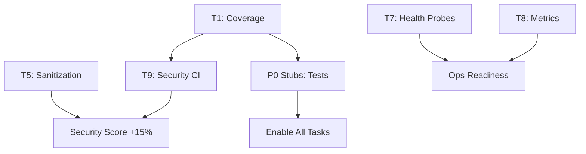

# Phase 1 Foundation - Master Execution Plan

🎯 **COPILOT INSTRUCTION: PHASE-LEVEL ORCHESTRATION**

@workspace Execute Phase 1 (Weeks 1-4) with autonomous coordination

## Phase Overview

**Objective:** Establish security, monitoring, and basic autonomy foundation

**Duration:** 4 weeks (Sprints 1-2)

**Team:** 2-3 engineers

**Success Criteria:**
- Security score: 0.61 → 0.75+
- CI/Test infrastructure: 0.35 → 0.70+
- All P0 tasks completed
- Foundation ready for Phase 2 reproducibility work

---

## Task Execution Order

### Sprint 1 (Week 1-2): Quality & Security Foundation

**Day 1-5: T1 Coverage Gate** ⚡ CRITICAL PATH
- No dependencies, starts immediately
- Enables testing for all subsequent tasks
- Prompt: `phase_1_foundation/T1_coverage_gate_enforcement.md`
- Expected: 70% coverage enforced, deterministic tests

**Day 6-8: T5 Prompt Sanitization** 🔒 SECURITY
- Can run in parallel with T1
- Prompt: `phase_1_foundation/T5_prompt_sanitization_default.md`
- Expected: Inference endpoints secure by default

**Day 9-10: T9 Security Scans** 🔒 SECURITY
- Depends on T1 (uses CI infrastructure)
- Prompt: `phase_1_foundation/T7_T10_and_stub_cleanup.md` → T9 section
- Expected: Bandit, pip-audit, detect-secrets in CI

### Sprint 2 (Week 3-4): Observability & Operations

**Day 11-13: T7 Health Probes** 🏥 OPERATIONS
- Can run in parallel with security work
- Prompt: `phase_1_foundation/T7_T10_and_stub_cleanup.md` → T7 section
- Expected: /health and /ready endpoints functional

**Day 14-16: T8 Prometheus Metrics** 📊 OBSERVABILITY
- Can run in parallel with T7
- Prompt: `phase_1_foundation/T7_T10_and_stub_cleanup.md` → T8 section
- Expected: /metrics endpoint scrape-ready

**Day 17-20: P0 Stub Cleanup** 🧹 FOUNDATION
- Ongoing throughout sprints
- Prompt: `phase_1_foundation/T7_T10_and_stub_cleanup.md` → Stub cleanup section
- Expected: 15 P0 blocking stubs resolved

---

## Dependency Graph



**Critical Path:** T1 → T9 → Phase 2

**Parallel Tracks:**
- Track A: T1 → T9 (CI/Security)
- Track B: T5 (Security)
- Track C: T7 + T8 (Observability)
- Track D: P0 Stubs (Continuous)

---

## Autonomous Execution Protocol

### Phase Start
```python
def execute_phase_1():
    print("🚀 Starting Phase 1: Foundation")
    
    # Initialize tracking
    phase_status = {
        "started": datetime.now(),
        "tasks": ["T1", "T5", "T7", "T8", "T9", "P0-Stubs"],
        "completed": [],
        "blocked": [],
    }
    
    # Execute critical path first
    execute_task("T1")  # Blocks nothing, enables everything
    
    # Parallel execution
    parallel_execute([
        "T5",  # Security
        "T7",  # Health
        "T8",  # Metrics
    ])
    
    # Sequential after T1
    if "T1" in phase_status["completed"]:
        execute_task("T9")  # Security scans
    
    # Continuous cleanup
    execute_ongoing("P0-Stubs", priority="background")
    
    # Validate phase completion
    return validate_phase_1_completion()
```

### Task Execution Pattern
```python
def execute_task(task_id):
    prompt_file = f"phase_1_foundation/{task_id}_*.md"
    
    for attempt in range(5):
        # Load and execute prompt
        result = copilot_execute(prompt_file)
        
        if result.success:
            update_progress(task_id, "COMPLETED")
            return SUCCESS
        else:
            diagnose_and_fix(result.errors)
    
    escalate_to_human(task_id)
```

---

## Validation Checkpoints

### Sprint 1 Checkpoint (End of Week 2)
```bash
# T1 Validation
pytest --cov=src --cov-fail-under=70
nox -s tests

# T5 Validation  
python cli/inference.py --prompt "test <script>alert()</script>"
# Should fail/sanitize

# T9 Validation
# CI should have security workflow
gh workflow view security

# Expected Metrics:
# - Coverage: ≥70%
# - Security score: 0.61 → 0.70
# - P0 stubs resolved: ≥5/15
```

### Sprint 2 Checkpoint (End of Week 4)
```bash
# T7 Validation
curl http://localhost:8000/health
curl http://localhost:8000/ready

# T8 Validation
curl http://localhost:8000/metrics | grep requests_total

# Phase Completion:
# - All P0 tasks: 5/5 complete
# - P0 stubs: 15/15 resolved
# - Security score: ≥0.75
# - CI/Test score: ≥0.70
# - Ready for Phase 2
```

---

## Risk Mitigation

| Risk | Likelihood | Impact | Mitigation |
|------|------------|--------|------------|
| T1 blocks everything | Medium | High | Start T1 immediately; have fallback plan |
| Security scans fail CI | High | Medium | Set fail-fast=false initially, harden iteratively |
| Coverage too low initially | High | Low | Expected; focus on critical paths first |
| Prometheus integration complex | Medium | Low | Use simple Counter/Histogram initially |
| Health checks require service refactor | Low | Medium | Add minimal endpoints first, expand later |

---

## Success Metrics

### Quantitative
- [ ] Test coverage: 0% → ≥70%
- [ ] Security score: 0.61 → ≥0.75
- [ ] CI/Test infrastructure: 0.35 → ≥0.70
- [ ] P0 stubs resolved: 15/15 (100%)
- [ ] Security scans passing in CI
- [ ] Health endpoints responding <100ms

### Qualitative  
- [ ] Developers can run `nox -s tests` confidently
- [ ] Inference endpoints reject malicious prompts
- [ ] Services auto-restart on health check failures
- [ ] Prometheus can scrape metrics
- [ ] No blocking technical debt remains

---

## Phase Transition Criteria

**Ready for Phase 2 when:**
1. ✅ All P0 tasks completed
2. ✅ Coverage gate enforced
3. ✅ Security baselines established
4. ✅ Observability operational
5. ✅ No P0 blockers remaining
6. ✅ Team velocity stable (able to estimate Phase 2)

**Phase 2 Preview:**
- T4: Strict Resume RNG
- T6: Dataset Hash Manifests
- Deterministic algorithm enforcement
- Checkpoint integrity validation
- SBOM generation

---

## Copilot Execution Commands

### Execute Entire Phase
```
@workspace Execute Phase 1 Foundation

Read orchestration plan:
.github/prompts/sprint_execution_plan/phase_1_foundation/phase_1_overview.md

Execute tasks in dependency order:
1. T1 (critical path)
2. T5, T7, T8 (parallel)
3. T9 (after T1)
4. P0 stubs (ongoing)

Validate each sprint checkpoint.
Report phase completion when all criteria met.
```

### Execute Individual Sprint
```
@workspace Execute Sprint 1 of Phase 1

Tasks:
- T1: Coverage Gate (days 1-5)
- T5: Prompt Sanitization (days 6-8)
- T9: Security Scans (days 9-10)

Validate checkpoint at day 10.
```

### Monitor Progress
```
@workspace Report Phase 1 progress

Check:
- Completed tasks
- Blocked tasks
- Sprint velocity
- Checkpoint status
- Risk assessment

Generate progress report.
```

---

## Handoff to Phase 2

**Deliverables:**
- Coverage infrastructure operational
- Security baselines enforced
- Observability stack functional
- P0 technical debt cleared

**Documentation Updates:**
- Testing guide with coverage examples
- Security policy with sanitization rules
- Operations runbook with health check procedures
- Metrics catalog for Prometheus

**Knowledge Transfer:**
- Coverage enforcement patterns
- Security scanning integration
- Health check implementation
- Metrics export patterns

🤖 **Copilot:** Execute this phase autonomously, reporting progress at checkpoints and escalating only blocking issues.
