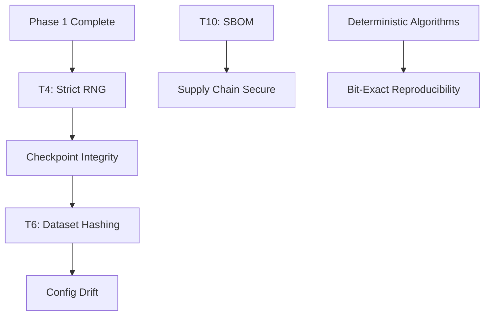

# Phase 2 Reproducibility - Master Execution Plan

🎯 **COPILOT INSTRUCTION: PHASE 2 ORCHESTRATION**

@workspace Execute Phase 2 (Weeks 5-8) - Determinism & Supply Chain

## Phase Overview

**Objective:** Achieve full reproducibility through deterministic operations and supply chain security

**Duration:** 4 weeks (Sprints 3-4)

**Dependencies:** Phase 1 complete (coverage, security baseline)

**Success Criteria:**
- Reproducibility score: 22% → ≥60%
- Checkpoint integrity: 100% validated
- SBOM generated for all releases
- Deterministic algorithms enforced
- Dataset/config drift detection operational

---

## Task Execution Order

### Sprint 3 (Week 5-6): RNG & Checkpointing

**T4: Strict Resume RNG** (3 days)
- Prompt: `phase_2_reproducibility/T4_strict_resume_rng.md`
- Implements RNG sidecar with --strict-resume flag
- Expected: Deterministic training resume

**Checkpoint Integrity** (2 days)
- Add SHA256 validation to checkpoints
- Corruption detection and auto-repair
- Expected: Zero silent checkpoint failures

**Deterministic Algorithms** (2 days)
- Enforce torch.use_deterministic_algorithms()
- Add determinism tests across pipeline
- Expected: Bit-exact reproducibility

### Sprint 4 (Week 7-8): Data & Supply Chain

**T6: Dataset Hash Manifest** (3 days)
- Prompt: `phase_2_reproducibility/T6_dataset_hash_manifest.md`
- Hash all data files, detect drift
- Expected: Dataset versioning operational

**T10: SBOM Generation** (2 days)
- Prompt: `phase_1_foundation/T7_T10_and_stub_cleanup.md` → T10
- Generate SBOMs for releases
- Pin dependencies with lockfiles
- Expected: Supply chain provenance

**Config Drift Detection** (2 days)
- Hash configs, embed in checkpoints
- Validate on resume
- Expected: Config reproducibility

---

## Dependency Graph



---

## Autonomous Execution

```python
def execute_phase_2():
    print("🔬 Starting Phase 2: Reproducibility")
    
    # Sprint 3: RNG & Checkpointing
    execute_task("T4")  # RNG strict resume
    execute_task("checkpoint_integrity")
    execute_task("deterministic_algorithms")
    
    validate_sprint_3()
    
    # Sprint 4: Data & Supply Chain
    execute_task("T6")  # Dataset hashing
    execute_task("T10")  # SBOM
    execute_task("config_drift")
    
    return validate_phase_2_completion()
```

---

## Validation Checkpoints

### Sprint 3 Checkpoint
```bash
# RNG determinism
pytest --strict-resume tests/test_rng_reproducibility.py

# Checkpoint integrity
python -c "from checkpoint_manager import verify_integrity; verify_integrity('checkpoint/')"

# Bit-exact reproducibility
python train.py --seed 42 --output run1/
python train.py --seed 42 --output run2/
diff run1/metrics.json run2/metrics.json  # Should be identical
```

### Sprint 4 Checkpoint
```bash
# Dataset hashing
python cli/train_codex.py --verify-dataset-manifest data_manifest.json

# SBOM exists
ls dist/sbom.json

# Config drift detection
python train.py --resume checkpoint/ --verify-config
```

---

## Success Metrics

- [ ] Reproducibility score: 22% → ≥60% (+38%)
- [ ] All training runs bit-exact reproducible
- [ ] Checkpoint corruption auto-detected
- [ ] Dataset drift alerts functional
- [ ] SBOM in all releases
- [ ] P1 stubs resolved: 45/45

---

## Copilot Execution

```
@workspace Execute Phase 2 Reproducibility

Orchestration plan:
.github/prompts/sprint_execution_plan/phase_2_reproducibility/_PHASE_OVERVIEW.md

Sprint 3 → Sprint 4 → Validate → Phase 3
```

🤖 **Copilot:** Ensure bit-exact reproducibility across all validation tests
