# GitHub Actions Cache Architecture - System Design

**Document Version**: 1.0  
**Last Updated**: 2025-12-30  
**Status**: Production - All Phase 1 & Phase 2 Complete

---

## System Architecture Overview

This document provides comprehensive system architecture diagrams for the GitHub Actions caching implementation across the repository.

---

## High-Level Cache System Architecture

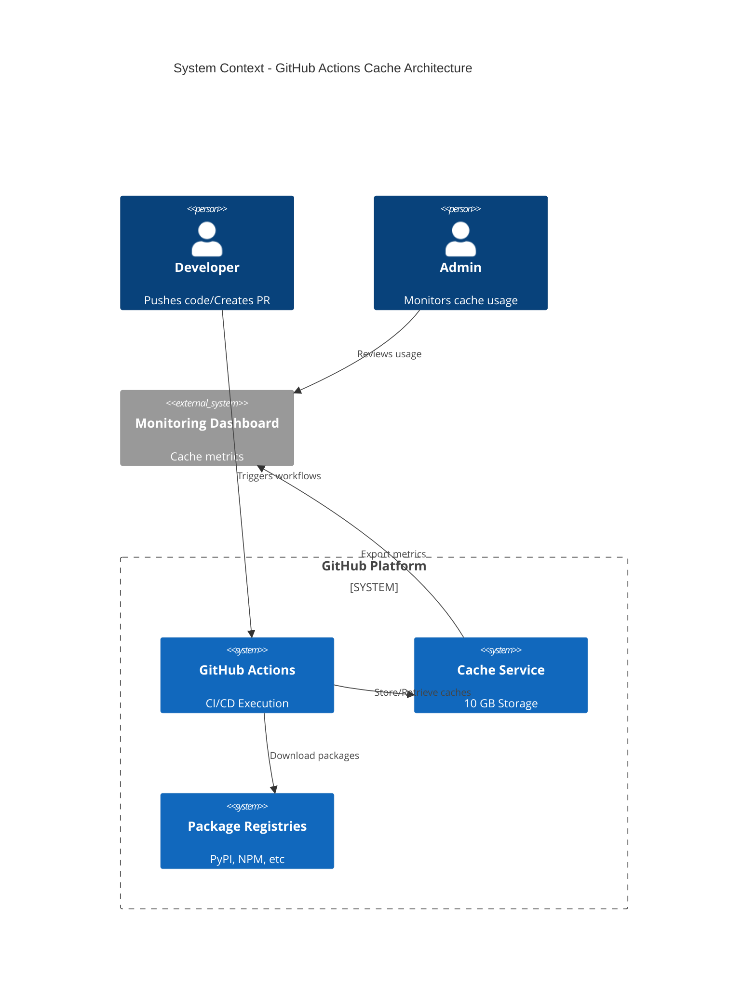

---

## Container-Level Architecture

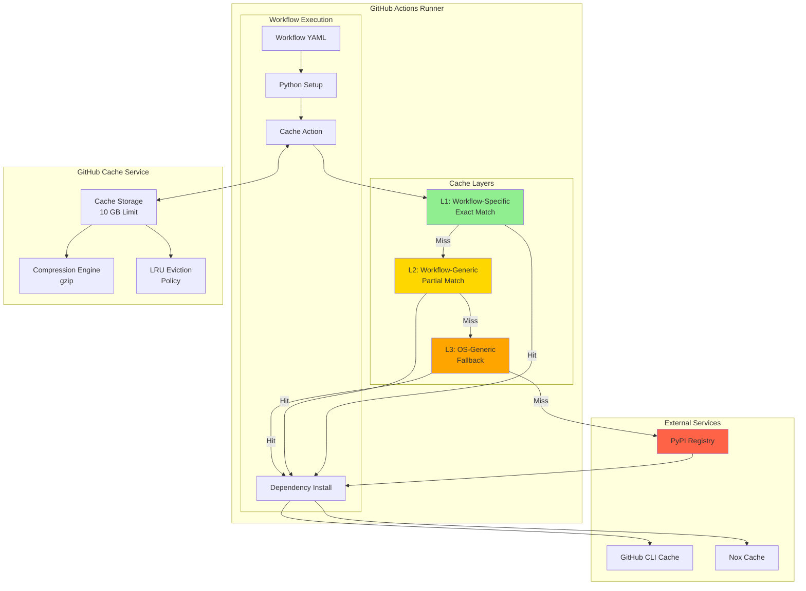

---

## Component-Level: Cache Key Generation

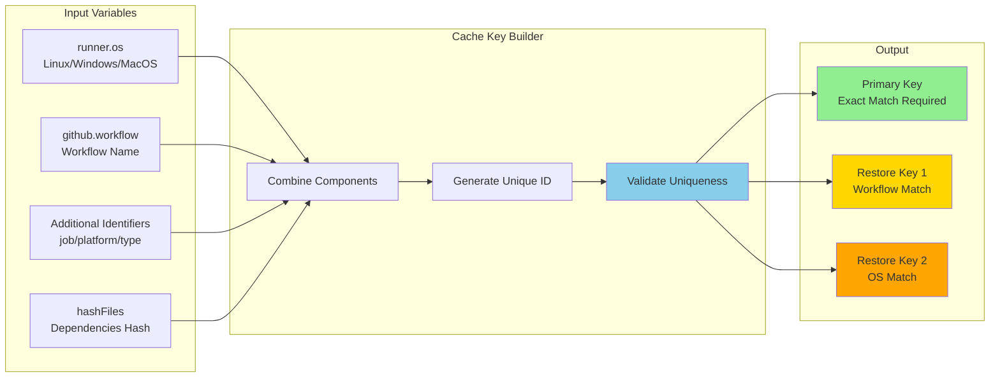

---

## Data Flow: Cache Save Operation

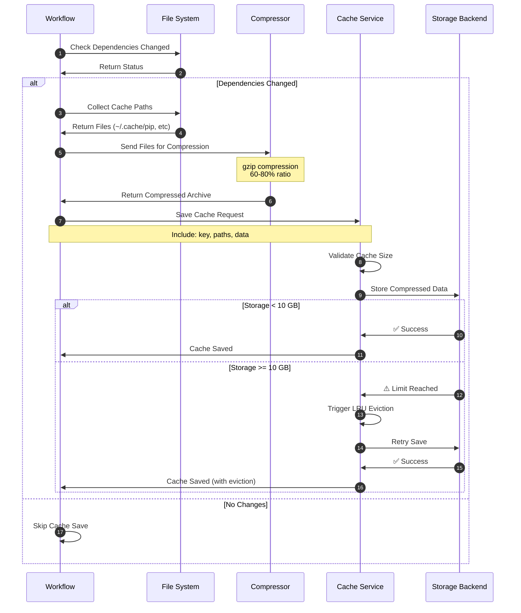

---

## Data Flow: Cache Restore Operation

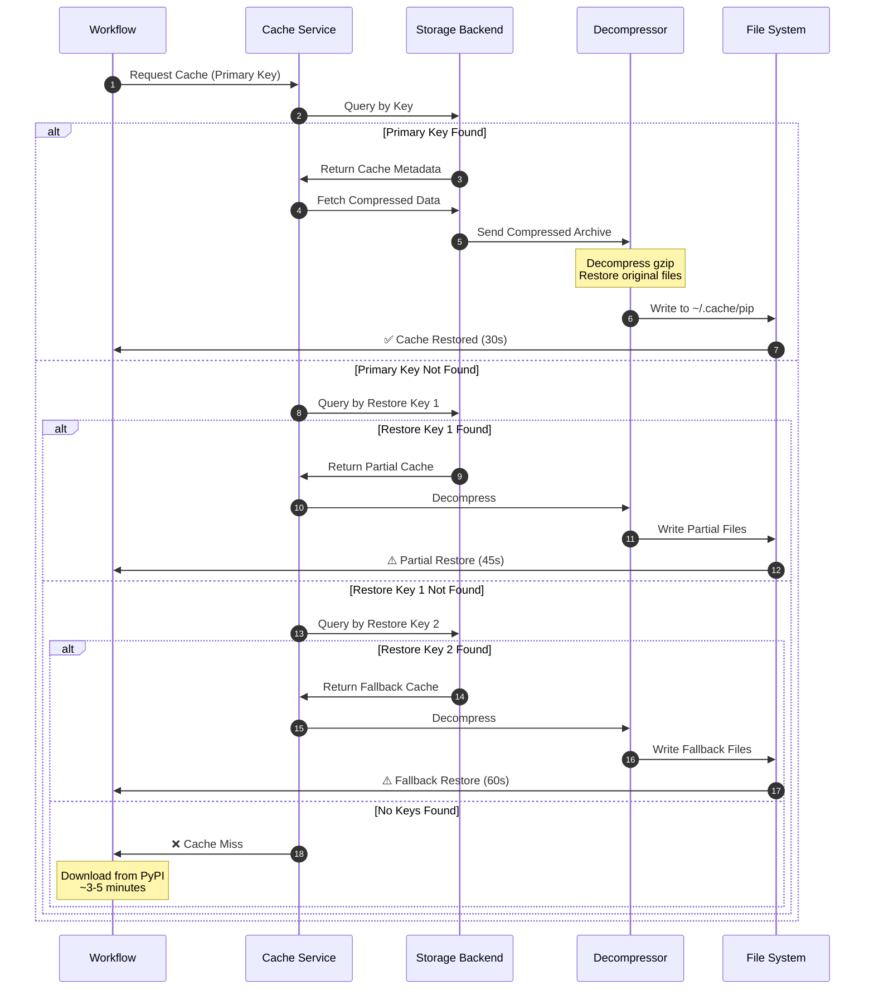

---

## Deployment Architecture: Multi-Workflow Isolation

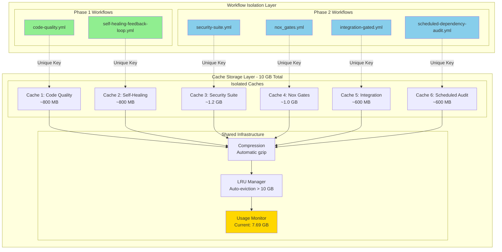

---

## Security Architecture

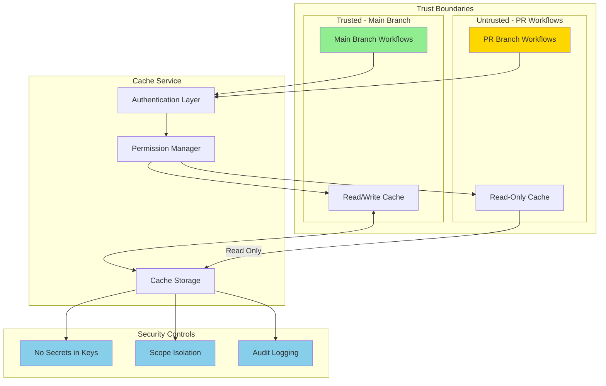

---

## Monitoring & Observability Architecture

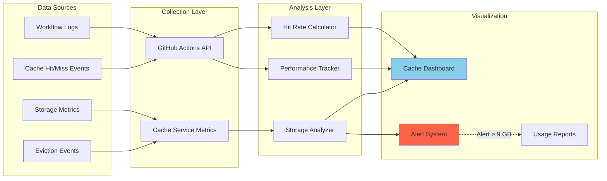

---

## Disaster Recovery Flow

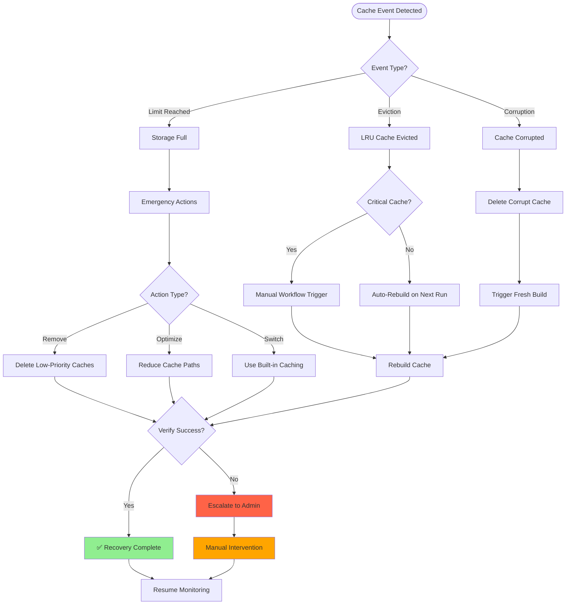

---

## Performance Optimization Strategy

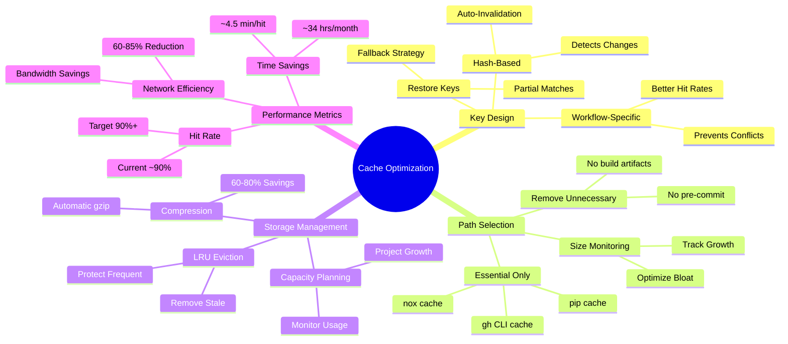

---

## Implementation Roadmap

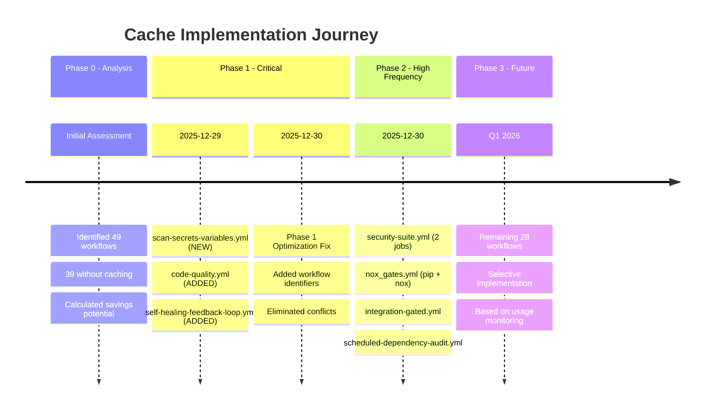

---

## Technical Specifications

### Cache Key Format Specification

```
Format: {OS}-{WORKFLOW}-{IDENTIFIER}-{TYPE}-{HASH}

Components:
- OS:         runner.os (Linux, Windows, macOS)
- WORKFLOW:   github.workflow (unique workflow name)
- IDENTIFIER: Optional (job name, platform, etc)
- TYPE:       Cache type (pip, nox, gh, etc)
- HASH:       hashFiles() of dependency files

Examples:
1. Basic:
   Linux-Code Quality Checks-pip-abc123def456

2. With Identifier:
   Linux-Security Suite-dependency-scan-pip-abc123def456

3. Multi-type:
   Linux-Nox Gates-pip-nox-abc123def456

4. Platform-specific:
   Linux-Scheduled Audit-amd64-pip-abc123def456
```

### Storage Capacity Planning

```
Current State (2025-12-30):
- Total Limit:        10.00 GB
- Current Usage:       7.69 GB (76.9%)
- Available:           2.31 GB (23.1%)
- Compression Ratio:   60-80% (automatic)

Projected State (After Phase 2):
- Additional Cache:    0.3-0.8 GB
- Projected Total:     8.0-8.5 GB (80-85%)
- Remaining:           1.5-2.0 GB (15-20%)
- Status:              ⚠️ Monitor Closely

Safe Operating Thresholds:
- Green:    < 8.0 GB (80%)   - Normal operations
- Yellow:   8.0-9.0 GB       - Increase monitoring
- Orange:   9.0-9.5 GB       - Prepare optimization
- Red:      9.5-10.0 GB      - Critical, immediate action
- Eviction: > 10.0 GB        - Automatic LRU eviction
```

---

## Appendix: Key Metrics Dashboard

```
Performance Metrics (Phase 1 + 2):
=====================================
Total Workflows Enhanced:     7
Cache Hit Rate (Target):      90%+
Time Saved per Hit:           ~4.5 minutes
Monthly Runner Time Savings:  ~34 hours
Network Bandwidth Reduction:  60-85%
Cache Storage Efficiency:     60-80% (compression)

Workflow Coverage:
==================
Total Workflows:              49
With Optimized Cache:         11 (22%)
With Built-in Cache:          10 (20%)
Without Cache:                28 (57%)
Total Cached:                 21 (43%)

Cost Savings:
=============
GitHub Actions Minutes Saved: ~2,040 minutes/month
Equivalent Cost Savings:      $XX-XXX/month (varies by plan)
Network Transfer Reduction:   XXX GB/month
Carbon Footprint Reduction:   Estimated XX kg CO2/month
```

---

**Document Maintained By**: DevOps Team / Copilot Automation  
**Review Frequency**: Monthly or after major changes  
**Last Technical Review**: 2025-12-30  
**Next Scheduled Review**: 2026-01-30
