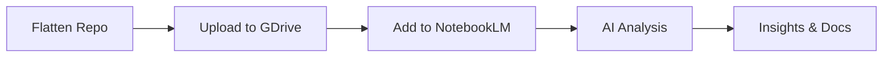

# Flatten Repository GitHub Action

## Overview

The **Flatten Repository GitHub Action** generates a consolidated view of the entire codebase in a single file format (XML, Markdown, or Plain text) using [Repomix](https://github.com/yamadashy/repomix). This is invaluable for:

- AI analysis and code review
- Documentation generation
- Architecture visualization
- NotebookLM integration
- Codebase search and indexing

## Features

✅ **Multiple Output Formats**: XML, Markdown, or Plain text  
✅ **Configurable Compression**: Tree-sitter based compression  
✅ **Security Scanning**: Automatic secret detection  
✅ **Metadata Generation**: Complete statistics and provenance  
✅ **Artifact Storage**: Automatic upload with configurable retention  
✅ **Download Instructions**: CLI, Web UI, and API methods

## Usage

### Manual Trigger (Workflow Dispatch)

Navigate to **Actions** → **Flatten Repository Download** → **Run workflow**

**Parameters:**
- `compress` (boolean): Enable Tree-sitter compression (default: true)
- `include_tests` (boolean): Include test files in output (default: true)
- `output_format` (choice): Output format - xml, markdown, or plain (default: xml)
- `retention_days` (number): Artifact retention days, 1-90 (default: 30)

### Programmatic Trigger (GitHub CLI)

```bash
# Trigger workflow with default settings
gh workflow run flatten-repo-download.yml

# Trigger with custom settings
gh workflow run flatten-repo-download.yml \
  -f compress=true \
  -f include_tests=false \
  -f output_format=markdown \
  -f retention_days=7

# Wait for completion and download artifact
gh run watch
gh run download $(gh run list --workflow=flatten-repo-download.yml --limit 1 --json databaseId --jq '.[0].databaseId')
```

### Workflow Integration (workflow_call)

Call from another workflow:

```yaml
jobs:
  generate-flatten:
    uses: ./.github/workflows/flatten-repo-download.yml
    with:
      compress: true
      include_tests: true
      output_format: xml
      retention_days: 30
  
  use-flatten:
    needs: generate-flatten
    runs-on: ubuntu-latest
    steps:
      - name: Download flattened repo
        uses: actions/download-artifact@v4
        with:
          name: ${{ needs.generate-flatten.outputs.artifact_name }}
      
      - name: Process flattened repo
        run: |
          echo "File size: ${{ needs.generate-flatten.outputs.file_size_mb }} MB"
          echo "Processing..."
```

## Download Methods

### Method 1: GitHub CLI (Recommended)

```bash
# List recent runs
gh run list --workflow=flatten-repo-download.yml --limit 5

# Download latest artifact
RUN_ID=$(gh run list --workflow=flatten-repo-download.yml --limit 1 --json databaseId --jq '.[0].databaseId')
gh run download $RUN_ID

# Download specific run
gh run download 12345678 -n flattened-repo-42
```

### Method 2: GitHub Web UI

1. Navigate to the repository **Actions** tab
2. Click on the **Flatten Repository Download** workflow
3. Select the desired workflow run
4. Scroll to the **Artifacts** section
5. Click on the artifact name to download

### Method 3: GitHub API

```bash
# Set your GitHub token
export GITHUB_TOKEN="ghp_your_token_here"
REPO="Aries-Serpent/_codex_"
RUN_ID=12345678

# List artifacts for a run
curl -H "Authorization: Bearer $GITHUB_TOKEN" \
  -H "Accept: application/vnd.github+json" \
  "https://api.github.com/repos/$REPO/actions/runs/$RUN_ID/artifacts"

# Download artifact (get artifact_id from above)
ARTIFACT_ID=123456789
curl -L -H "Authorization: Bearer $GITHUB_TOKEN" \
  -H "Accept: application/vnd.github+json" \
  "https://api.github.com/repos/$REPO/actions/artifacts/$ARTIFACT_ID/zip" \
  -o flattened-repo.zip

# Extract
unzip flattened-repo.zip
```

### Method 4: Python Script

```python
import requests
import os
from pathlib import Path

# Configuration
GITHUB_TOKEN = os.getenv("GITHUB_TOKEN")
REPO = "Aries-Serpent/_codex_"
WORKFLOW_NAME = "flatten-repo-download.yml"

headers = {
    "Authorization": f"Bearer {GITHUB_TOKEN}",
    "Accept": "application/vnd.github+json"
}

# Get latest workflow run
runs_url = f"https://api.github.com/repos/{REPO}/actions/workflows/{WORKFLOW_NAME}/runs"
response = requests.get(runs_url, headers=headers)
latest_run = response.json()["workflow_runs"][0]
run_id = latest_run["id"]

# Get artifacts
artifacts_url = f"https://api.github.com/repos/{REPO}/actions/runs/{run_id}/artifacts"
response = requests.get(artifacts_url, headers=headers)
artifact = response.json()["artifacts"][0]
artifact_id = artifact["id"]

# Download artifact
download_url = f"https://api.github.com/repos/{REPO}/actions/artifacts/{artifact_id}/zip"
response = requests.get(download_url, headers=headers, allow_redirects=True)

# Save to file
output_path = Path("flattened-repo.zip")
output_path.write_bytes(response.content)
print(f"Downloaded to: {output_path}")
```

## Output Structure

### Artifact Contents

```
flattened-repo-{run_number}/
├── codex-flatten-{run_number}.xml          # Main flattened file
├── flatten-metadata.json                    # Metadata and statistics
└── repomix.config.runtime.json             # Configuration used
```

### Metadata Format

```json
{
  "generated_at": "2026-01-14T05:20:59Z",
  "run_id": "12345678",
  "run_number": "42",
  "repository": "Aries-Serpent/_codex_",
  "ref": "refs/heads/main",
  "sha": "abc123def456",
  "output_format": "xml",
  "file_size_bytes": 5242880,
  "file_size_mb": 5.00,
  "line_count": 50000,
  "files_included": "250",
  "compression_enabled": true,
  "tests_included": true
}
```

### XML Output Format (Default)

```xml
<?xml version="1.0" encoding="UTF-8"?>
<repository>
  <header>
    <title>_codex_ Repository Consolidation (Run #42)</title>
    <generated_at>2026-01-14T05:20:59Z</generated_at>
    <instruction_file>repomix-instruction.md</instruction_file>
  </header>
  
  <files>
    <file>
      <file_path>src/codex/__init__.py</file_path>
      <file_size>1024</file_size>
      <content line_numbers="true">
        1. """Codex package initialization."""
        2. 
        3. __version__ = "1.0.0"
        ...
      </content>
    </file>
    ...
  </files>
</repository>
```

## Configuration

### Default Repomix Settings

The action uses a dynamic configuration based on `repomix.config.json` with runtime modifications:

```json
{
  "output": {
    "style": "xml",
    "headerText": "_codex_ Repository Consolidation",
    "instructionFilePath": "repomix-instruction.md",
    "showLineNumbers": true,
    "compress": true
  },
  "include": [
    "src/**",
    ".github/**",
    "tools/**",
    "scripts/**",
    "docs/**",
    "*.md",
    "*.py",
    "*.yml",
    "*.rs"
  ],
  "ignore": {
    "useGitignore": true,
    "customPatterns": [
      ".env*",
      "secrets.*",
      "node_modules/**",
      "*.pyc",
      "__pycache__/**",
      "target/**",
      "dist/**",
      "*.log"
    ]
  },
  "security": {
    "enableSecretDetection": true
  }
}
```

### Customizing Configuration

To customize the configuration:

1. Edit `repomix.config.json` in repository root
2. Trigger workflow with desired parameters
3. The action merges your config with runtime settings

## Security

### Secret Detection

The action performs automatic secret scanning using:

- **Repomix built-in detection**: Enabled by default
- **detect-secrets**: Python-based secret scanner
- **Secretlint**: npm-based secret linter

All detected secrets are logged as warnings but don't fail the workflow (use `continue-on-error: false` to change this).

### Excluded Patterns

The following patterns are automatically excluded:

- Environment files (`.env*`, `*.env`)
- Secret files (`secrets.*`, `*.key`, `*.pem`)
- Credentials (`*.crt`, `*.p12`, `*.jks`)
- Binary files (`*.so`, `*.dll`, `*.exe`)
- Large assets (`*.png`, `*.jpg`, `*.mp4`, `*.zip`)

### Best Practices

1. **Never commit secrets** to the repository
2. **Review metadata** before sharing flattened output
3. **Use short retention** (7-14 days) for sensitive projects
4. **Enable secret detection** in repomix.config.json
5. **Audit flattened output** before external sharing

## Performance

### Optimization Tips

1. **Enable Compression**: Reduces file size by 50-70%
2. **Exclude Tests**: Remove `tests/**` if not needed
3. **Filter Large Files**: Add patterns to `ignore.customPatterns`
4. **Use XML Format**: Most compact format with tree-sitter compression

### Expected Output Sizes

| Repository Size | Without Compression | With Compression | Reduction |
|----------------|--------------------:|----------------:|-----------:|
| Small (< 1MB)  | 2-5 MB             | 1-2 MB          | 50-60%    |
| Medium (< 10MB)| 10-20 MB           | 4-8 MB          | 60-70%    |
| Large (< 50MB) | 50-100 MB          | 15-30 MB        | 70-80%    |

**_codex_ Repository**: ~5-8 MB with compression enabled

## Use Cases

### 1. NotebookLM Integration

```bash
# Generate flattened repo
gh workflow run flatten-repo-download.yml -f output_format=xml

# Download artifact
gh run download $(gh run list --workflow=flatten-repo-download.yml --limit 1 --json databaseId --jq '.[0].databaseId')

# Upload to Google Drive (use upload script)
python scripts/phase10/upload_to_gdrive.py codex-flatten-*.xml

# Add as source to NotebookLM
# (Manual step in NotebookLM UI)
```

### 2. AI Code Review

```python
# Load flattened repo
with open("codex-flatten-42.xml") as f:
    repo_content = f.read()

# Send to AI model
response = openai.ChatCompletion.create(
    model="gpt-4",
    messages=[
        {"role": "system", "content": "You are a code reviewer."},
        {"role": "user", "content": f"Review this codebase:\n\n{repo_content}"}
    ]
)
```

### 3. Documentation Generation

```bash
# Generate markdown format
gh workflow run flatten-repo-download.yml -f output_format=markdown

# Download and process
gh run download ...
python scripts/generate_docs.py codex-flatten-42.md > docs/FULL_CODEBASE.md
```

### 4. Search Indexing

```python
# Load flattened repo and index for search
import xml.etree.ElementTree as ET

tree = ET.parse("codex-flatten-42.xml")
root = tree.getroot()

for file_elem in root.findall(".//file"):
    file_path = file_elem.find("file_path").text
    content = file_elem.find("content").text
    # Index content in search engine (Elasticsearch, Algolia, etc.)
```

## Troubleshooting

### Issue: Workflow fails with "File too small"

**Cause**: Repomix didn't generate output (config error, no matching files)

**Solution**:
1. Check repomix.config.json for syntax errors
2. Verify include patterns match actual files
3. Review workflow logs for Repomix errors

### Issue: Artifact not found

**Cause**: Workflow failed before upload step

**Solution**:
1. Check workflow run status
2. Review logs for errors in earlier steps
3. Ensure all dependencies installed correctly

### Issue: File size too large (> 100MB)

**Cause**: Too many files included or compression disabled

**Solution**:
1. Enable compression: `-f compress=true`
2. Exclude tests: `-f include_tests=false`
3. Add more ignore patterns to config
4. Use `.gitignore` patterns effectively

### Issue: Secrets detected in output

**Cause**: Secret committed to repository

**Solution**:
1. **Immediately** remove secret from repository
2. Rotate the compromised credential
3. Use `git filter-branch` or BFG Repo-Cleaner to remove from history
4. Re-run workflow to verify secret removed

## Workflow Outputs

When called as `workflow_call`, the action provides:

```yaml
outputs:
  artifact_name: "flattened-repo-42"
  artifact_url: "https://github.com/Aries-Serpent/_codex_/actions/runs/12345678"
  file_size_mb: "5.23"
```

Use in dependent jobs:

```yaml
- name: Use outputs
  run: |
    echo "Artifact: ${{ needs.flatten-repo.outputs.artifact_name }}"
    echo "Size: ${{ needs.flatten-repo.outputs.file_size_mb }} MB"
    echo "URL: ${{ needs.flatten-repo.outputs.artifact_url }}"
```

## Integration with Phase 10

This action integrates with Phase 10 NotebookLM workflow:



**Manual Steps:**
1. Trigger `flatten-repo-download.yml`
2. Download artifact
3. Run `scripts/phase10/upload_to_gdrive.py`
4. Add Google Drive file as NotebookLM source
5. Configure AI Architect instructions

**Future Automation:**
- Auto-upload to Google Drive
- Auto-sync with NotebookLM
- Scheduled regeneration

## References

- [Repomix GitHub](https://github.com/yamadashy/repomix)
- [GitHub Actions Artifacts](https://docs.github.com/en/actions/using-workflows/storing-workflow-data-as-artifacts)
- [GitHub REST API - Artifacts](https://docs.github.com/en/rest/actions/artifacts)
- [Phase 10 Documentation](../../PHASE_10_MASTER_INTEGRATION_PLANSET.md)

---

**Version**: 1.0.0  
**Last Updated**: 2026-01-14  
**Maintained By**: admin-automation-agent  
**Related**: `.github/workflows/flatten-repo-download.yml`
