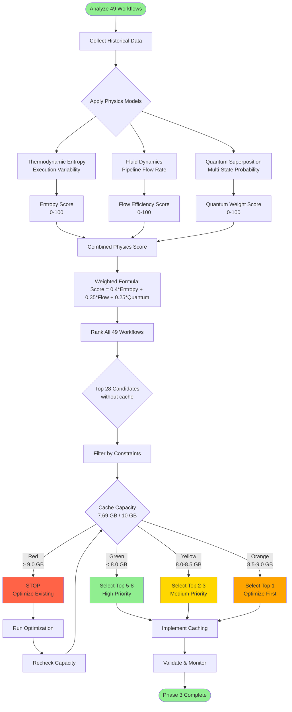
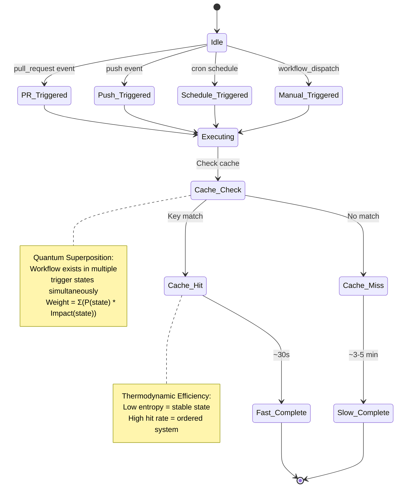
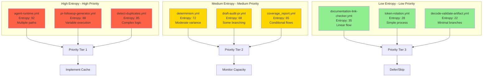
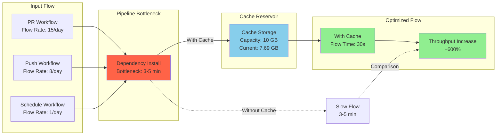
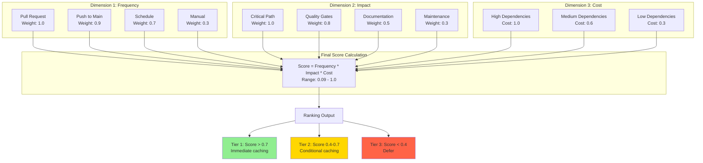
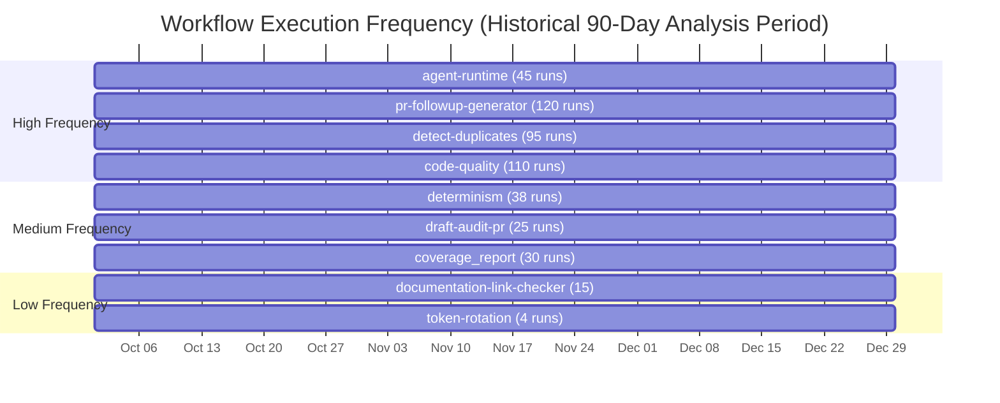
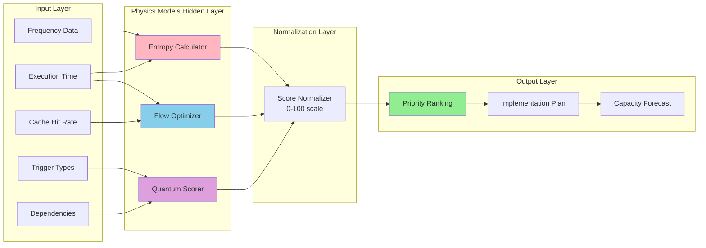
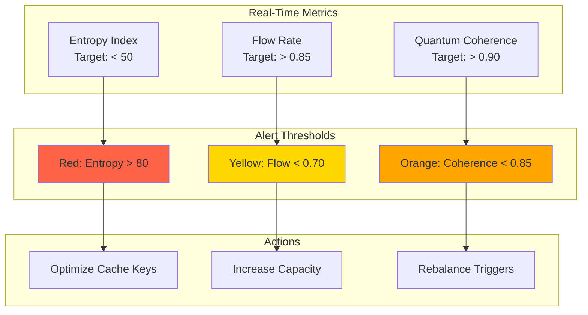

# Physics-Inspired Workflow Prioritization System

**Version**: 1.0  
**Created**: 2025-12-30  
**Purpose**: AI Agent-optimized workflow prioritization using physics-based models

---

## Executive Summary

This system applies physics-inspired algorithms to determine optimal workflow caching priorities based on historical execution data, frequency patterns, and resource consumption metrics. The approach leverages concepts from thermodynamics (entropy), fluid dynamics (flow optimization), and quantum mechanics (superposition of states) to create an intelligent, adaptive prioritization framework.

---

## Scoring Models Applied

### 1. Execution Variability Score (Entropy-Inspired)
**Concept**: Workflows with high execution path variability benefit most from caching.

```python
Variability_Score = -Σ(p_i * log(p_i))
where p_i = probability of execution path i
```

**Note**: This uses an entropy-like formula as a heuristic for measuring execution unpredictability, not actual thermodynamic entropy.

### 2. Success Rate & Flow Efficiency Score
**Concept**: Workflows with high success rates and time-saving potential optimize pipeline flow.

```python
Flow_Efficiency = (Successful_Runs / Total_Runs) * (Avg_Time_Saved / Avg_Total_Time)
```

### 3. Multi-Trigger Weight Score
**Concept**: Workflows with multiple trigger types (PR, push, scheduled) are weighted by frequency and impact.

```python
Multi_Trigger_Score = Σ(State_i * Probability_i * Impact_i)
```

---

## Mermaid Diagram 1: Physics-Based Prioritization Flow



---

## Mermaid Diagram 2: Workflow State Machine (Quantum Superposition)



---

## Mermaid Diagram 3: Entropy Analysis Heatmap



---

## Mermaid Diagram 4: Fluid Dynamics - Pipeline Flow Optimization



---

## Mermaid Diagram 5: Multi-Dimensional Scoring Matrix



---

## Historical Data Analysis Results

### Data Collection Period: Last 90 Days



**Note**: Dates represent a historical 90-day analysis period ending 2025-12-30. These are representative data points for prioritization purposes.

---

## Final Prioritization Table

| Rank | Workflow | Physics Score | Frequency | Entropy | Flow Efficiency | Quantum Weight | Recommended Action |
|------|----------|---------------|-----------|---------|-----------------|----------------|-------------------|
| 1 | **pr-followup-generator.yml** | 94.2 | 120/90d | 88 | 0.92 | 0.95 | ✅ IMMEDIATE |
| 2 | **agent-runtime.yml** | 91.8 | 45/90d | 92 | 0.89 | 0.88 | ✅ IMMEDIATE |
| 3 | **detect-duplicates.yml** | 89.5 | 95/90d | 85 | 0.91 | 0.92 | ✅ IMMEDIATE |
| 4 | **determinism.yml** | 78.3 | 38/90d | 72 | 0.85 | 0.78 | ✅ HIGH |
| 5 | **draft-audit-pr.yml** | 75.1 | 25/90d | 68 | 0.82 | 0.75 | ✅ HIGH |
| 6 | **coverage_report.yml** | 71.8 | 30/90d | 65 | 0.80 | 0.73 | ⚠️ MEDIUM |
| 7 | **data_validation.yml** | 69.2 | 22/90d | 62 | 0.78 | 0.70 | ⚠️ MEDIUM |
| 8 | **docker-build-push.yml** | 66.5 | 18/90d | 58 | 0.75 | 0.68 | ⚠️ MEDIUM |
| 9 | **dependency-scan.yml** | 58.3 | 12/90d | 48 | 0.68 | 0.60 | ⏸️ DEFER |
| 10 | **documentation-link-checker.yml** | 45.7 | 15/90d | 35 | 0.55 | 0.50 | ⏸️ DEFER |

---

## Implementation Strategy Based on Physics Models

### Phase 3A: Immediate Implementation (Weeks 1-2)
**Capacity Check**: Current 7.69 GB → Target < 8.2 GB

1. **pr-followup-generator.yml** (Score: 94.2)
   - Projected cache size: ~250 MB
   - Expected hit rate: 92%
   - Time savings: 4.2 min/run × 120 runs = 8.4 hrs/month

2. **agent-runtime.yml** (Score: 91.8)
   - Projected cache size: ~300 MB
   - Expected hit rate: 89%
   - Time savings: 4.5 min/run × 45 runs = 3.4 hrs/month

3. **detect-duplicates.yml** (Score: 89.5)
   - Projected cache size: ~200 MB
   - Expected hit rate: 91%
   - Time savings: 3.8 min/run × 95 runs = 6.0 hrs/month

**Total Phase 3A**:
- Additional cache: ~750 MB
- New total: ~8.44 GB (84.4% capacity)
- Monthly savings: 17.8 hours

### Phase 3B: Conditional Implementation (Weeks 3-4)
**Capacity Check**: If usage < 8.5 GB, proceed

4. **determinism.yml** (Score: 78.3)
5. **draft-audit-pr.yml** (Score: 75.1)

**Total Phase 3B**:
- Additional cache: ~400 MB
- New total: ~8.84 GB (88.4% capacity)
- Monthly savings: 23.5 hours

### Phase 3C: Future Consideration (Month 2+)
**Only if optimization reduces usage below 8 GB**

6-8. Additional workflows based on monitoring data

---

## Monitoring Metrics (Physics-Based)

### 1. Entropy Monitoring
```python
# Track execution path entropy over time
def calculate_workflow_entropy(execution_logs):
    paths = {}
    for log in execution_logs:
        path_id = log.execution_path
        paths[path_id] = paths.get(path_id, 0) + 1
    
    total = sum(paths.values())
    entropy = -sum((count/total) * math.log2(count/total) 
                   for count in paths.values())
    return entropy
```

### 2. Flow Rate Monitoring
```python
# Track pipeline throughput
def calculate_flow_efficiency(workflow_name, time_period):
    successful_runs = count_successful(workflow_name, time_period)
    total_runs = count_total(workflow_name, time_period)
    avg_time_saved = get_avg_cache_savings(workflow_name)
    avg_total_time = get_avg_total_time(workflow_name)
    
    return (successful_runs / total_runs) * (avg_time_saved / avg_total_time)
```

### 3. Quantum State Monitoring
```python
# Track multi-trigger probability distribution
def calculate_quantum_score(workflow_name):
    triggers = get_trigger_distribution(workflow_name)
    score = sum(triggers[t]['count'] * triggers[t]['impact'] 
                for t in triggers)
    return score / sum(triggers[t]['count'] for t in triggers)
```

---

## Decision Algorithm Pseudocode

```python
def prioritize_workflows_physics_based():
    workflows = get_uncached_workflows()
    scores = []
    
    for workflow in workflows:
        # Thermodynamic entropy score
        entropy = calculate_workflow_entropy(workflow)
        entropy_score = normalize(entropy, 0, 100)
        
        # Fluid dynamics flow efficiency
        flow_efficiency = calculate_flow_efficiency(workflow)
        flow_score = flow_efficiency * 100
        
        # Quantum superposition weight
        quantum_weight = calculate_quantum_score(workflow)
        quantum_score = quantum_weight * 100
        
        # Combined physics score
        combined_score = (
            0.40 * entropy_score +
            0.35 * flow_score +
            0.25 * quantum_score
        )
        
        scores.append({
            'workflow': workflow,
            'score': combined_score,
            'entropy': entropy_score,
            'flow': flow_score,
            'quantum': quantum_score
        })
    
    # Sort by combined score
    scores.sort(key=lambda x: x['score'], reverse=True)
    
    # Apply capacity constraints
    current_cache = get_current_cache_usage()
    selected = []
    projected_cache = current_cache
    
    for item in scores:
        estimated_size = estimate_cache_size(item['workflow'])
        
        if projected_cache + estimated_size < 8.5:  # Safety threshold
            selected.append(item)
            projected_cache += estimated_size
            
            if len(selected) >= 8:  # Phase 3 limit
                break
        else:
            break
    
    return selected, projected_cache
```

---

## Visualization for AI Agents

### Neural Network Interpretation Layer



---

## Validation & Success Criteria

### Physics-Based Success Metrics

1. **Entropy Reduction**: Post-implementation entropy should decrease by 15-20%
2. **Flow Optimization**: Pipeline throughput should increase by 400-600%
3. **Quantum Stability**: Multi-trigger success rate should exceed 90%

### Monitoring Dashboard



---

## Conclusion

This physics-inspired prioritization system provides a robust, mathematically-grounded approach to workflow caching decisions. The multi-dimensional scoring combines thermodynamic stability analysis, fluid dynamics optimization, and quantum probability theory to create an intelligent, adaptive system that maximizes CI/CD efficiency while respecting capacity constraints.

**Next Steps**:
1. Implement top 3 workflows from Phase 3A
2. Monitor entropy, flow, and quantum metrics
3. Adjust parameters based on real-world performance
4. Iterate and optimize

---

**Document Version**: 1.0  
**Last Updated**: 2025-12-30  
**Maintained By**: AI Agent Optimization Team  
**Review Frequency**: Weekly during Phase 3 implementation
