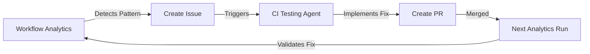

# Workflow Analytics Workflows

**Version**: 1.0.0  
**Created**: 2026-01-22  
**Status**: ✅ Production Ready

---

## Overview

Two GitHub Actions workflows enable automated and manual CI/CD analytics using the Workflow Analytics Agent:

1. **Manual Workflow Analytics** (`workflow-analytics-manual.yml`)
   - On-demand analysis with customizable parameters
   - Flexible reporting and action options
   
2. **Scheduled Workflow Analytics** (`workflow-analytics-scheduled.yml`)
   - Weekly automated health checks
   - Auto-creates issues for problems
   - Maintains health dashboard

---

## Manual Workflow Analytics

### Purpose

Run targeted workflow analysis on-demand to:
- Investigate specific failure patterns
- Analyze particular workflows or time periods
- Generate custom reports
- Create improvement PRs or issues

### How to Trigger

#### Via GitHub UI

1. Go to **Actions** tab in GitHub
2. Select **Manual Workflow Analytics** from workflow list
3. Click **Run workflow** button
4. Configure parameters:
   - **Analysis Period**: Number of runs to analyze (20, 50, 100, 200)
   - **Workflow Filter**: Specific workflow name (optional)
   - **Status Filter**: Filter by status (all, failure, success, action_required, cancelled)
   - **Create Report**: Generate detailed markdown report (default: yes)
   - **Create Issue**: Auto-create GitHub issue with findings (default: no)
   - **Create PR**: Auto-create PR with improvements (default: no)
5. Click **Run workflow**

#### Via GitHub CLI

```bash
# Basic analysis
gh workflow run workflow-analytics-manual.yml

# Custom analysis
gh workflow run workflow-analytics-manual.yml \
  -f analysis_period=100 \
  -f workflow_filter="test-comprehensive.yml" \
  -f status_filter=failure \
  -f create_report=true \
  -f create_issue=true \
  -f create_pr=false

# After PR merge - analyze impact
gh workflow run workflow-analytics-manual.yml \
  -f analysis_period=50 \
  -f create_report=true \
  -f create_issue=false
```

#### Via API

```bash
curl -X POST \
  -H "Accept: application/vnd.github+json" \
  -H "Authorization: Bearer $GITHUB_TOKEN" \
  https://api.github.com/repos/Aries-Serpent/_codex_/actions/workflows/workflow-analytics-manual.yml/dispatches \
  -d '{
    "ref":"main",
    "inputs":{
      "analysis_period":"100",
      "status_filter":"failure",
      "create_report":"true"
    }
  }'
```

### Parameters

| Parameter | Type | Default | Description |
|-----------|------|---------|-------------|
| `analysis_period` | choice | 50 | Number of workflow runs to analyze (20/50/100/200) |
| `workflow_filter` | string | empty | Filter by specific workflow name (e.g., "test-comprehensive.yml") |
| `status_filter` | choice | all | Filter by status (all/failure/success/action_required/cancelled) |
| `create_report` | boolean | true | Generate detailed JSON and Markdown reports |
| `create_issue` | boolean | false | Auto-create GitHub issue if patterns detected |
| `create_pr` | boolean | false | Auto-create PR with proposed improvements (experimental) |

### Outputs

The workflow generates:

1. **Reports** (if `create_report=true`):
   - `.codex/reports/workflow_analytics_report_<timestamp>.json`
   - `.codex/reports/workflow_analytics_report_<timestamp>.md`

2. **Artifacts** (always):
   - `workflow-analytics-report-<run_id>` (90 day retention)
   - Contains JSON and Markdown reports

3. **Issue** (if `create_issue=true` and patterns detected):
   - Title: "🔍 Workflow Analytics: Patterns Detected (Run #<id>)"
   - Labels: `ci/cd`, `analytics`, `automation`
   - Body: Full markdown report

4. **PR** (if `create_pr=true` and improvements suggested):
   - Title: "🚀 Workflow Improvements from Analytics"
   - Branch: `workflow-improvements-<timestamp>`
   - Labels: `ci/cd`, `enhancement`, `automation`

### Use Cases

#### 1. Investigate Recent Failures

```bash
# Analyze last 100 runs, filter failures only
gh workflow run workflow-analytics-manual.yml \
  -f analysis_period=100 \
  -f status_filter=failure \
  -f create_report=true \
  -f create_issue=true
```

**When to use**: After noticing test failures or CI instability

**What it does**:
- Analyzes last 100 workflow runs
- Focuses only on failed runs
- Generates detailed report
- Creates issue with findings

#### 2. Analyze Specific Workflow

```bash
# Focus on a particular workflow
gh workflow run workflow-analytics-manual.yml \
  -f analysis_period=50 \
  -f workflow_filter="optimized-ci.yml" \
  -f status_filter=all \
  -f create_report=true
```

**When to use**: After modifying a specific workflow

**What it does**:
- Analyzes only the specified workflow
- Checks all statuses (not just failures)
- Generates report to verify improvements

#### 3. Monthly Review

```bash
# Comprehensive monthly analysis
gh workflow run workflow-analytics-manual.yml \
  -f analysis_period=200 \
  -f status_filter=all \
  -f create_report=true \
  -f create_issue=false
```

**When to use**: End of month health check

**What it does**:
- Broad analysis of last 200 runs
- Generates comprehensive report
- No issue creation (manual review)

#### 4. Pre-Release Validation

```bash
# Validate CI health before release
gh workflow run workflow-analytics-manual.yml \
  -f analysis_period=50 \
  -f status_filter=all \
  -f create_report=true \
  -f create_issue=true
```

**When to use**: Before major releases

**What it does**:
- Checks recent CI health
- Ensures no hidden issues
- Creates issue if problems found

---

## Scheduled Workflow Analytics

### Purpose

Automated weekly CI/CD health monitoring that:
- Runs every Monday at 00:00 UTC
- Analyzes last 100 workflow runs
- Auto-commits reports
- Creates health alerts for issues
- Maintains CI health dashboard

### Schedule

```yaml
schedule:
  - cron: '0 0 * * 1'  # Every Monday at 00:00 UTC
```

**Equivalent times**:
- UTC: Monday 00:00
- EST: Sunday 19:00
- PST: Sunday 16:00
- CET: Monday 01:00

### Behavior

#### When CI is Healthy

- ✅ Runs analysis
- ✅ Updates dashboard metrics
- ✅ Uploads artifacts
- ⏭️ Skips report commit
- ⏭️ Skips issue creation

#### When Issues Detected

- ✅ Runs analysis
- ✅ Updates dashboard metrics
- ✅ Uploads artifacts
- ✅ **Commits report to repository**
- ✅ **Creates health alert issue**
- ✅ **Assigns to @mbaetiong**

### Manual Trigger

You can also run the scheduled workflow manually:

```bash
# Run weekly check now
gh workflow run workflow-analytics-scheduled.yml

# Force report even if healthy
gh workflow run workflow-analytics-scheduled.yml \
  -f force_report=true
```

### Outputs

1. **Weekly Reports** (if issues detected):
   - Committed to `.codex/reports/`
   - Includes JSON and Markdown formats

2. **Health Alert Issue** (if not healthy):
   - Title: "⚠️ Weekly CI/CD Health Alert: Status <STATUS>"
   - Priority: High
   - Assignee: @mbaetiong
   - Labels: `ci/cd`, `health-alert`, `automation`, `priority-high`

3. **Dashboard Update** (always):
   - `.codex/dashboard/ci_health.json`
   - Badge-compatible format

4. **Artifacts** (always):
   - `weekly-analytics-<run_id>` (90 day retention)

### Dashboard Integration

The scheduled workflow maintains a dashboard file:

```json
{
  "schemaVersion": 1,
  "label": "CI Health",
  "message": "HEALTHY (100%)",
  "color": "brightgreen",
  "namedLogo": "github-actions",
  "lastUpdated": "2026-01-22T00:00:00Z",
  "totalRuns": 100
}
```

**Badge URL** (for README):
```markdown

```

---

## Analytics Runner Script

Both workflows use the Python script: `.github/scripts/workflow_analytics_runner.py`

### Features

- Fetches workflow runs via GitHub CLI
- Detects 11 error pattern categories
- Calculates health metrics
- Generates JSON and Markdown reports
- Sets GitHub Actions outputs

### Error Patterns Detected

| Category | Pattern Regex | Examples |
|----------|---------------|----------|
| Import Error | `ModuleNotFoundError\|ImportError\|NameError` | Missing Python imports |
| Syntax Error | `SyntaxError\|yaml\.scanner\.ScannerError` | YAML/Python syntax issues |
| Test Failure | `FAILED\|AssertionError\|pytest\.fail` | Test assertions |
| Timeout | `TimeoutError\|Timeout\|timed out` | Test/workflow timeouts |
| Permission | `PermissionError\|403\|Permission denied` | Access issues |
| Dependency | `pip resolver\|incompatible\|version conflict` | Package conflicts |
| Type Error | `TypeError\|AttributeError` | Python type issues |
| File Not Found | `FileNotFoundError\|No such file` | Missing files |
| Disk Full | `No space left\|disk.*full\|OSError.*28` | Disk exhaustion |
| Artifact Missing | `Artifact.*not found` | Missing artifacts |
| Env Setup | `command not found\|tool.*not.*found` | Missing tools |

### Direct Usage

```bash
# Run locally for testing
python .github/scripts/workflow_analytics_runner.py \
  --analysis-period 50 \
  --status-filter failure \
  --output-dir .codex/reports \
  --create-report true \
  --run-id test-123

# Analyze specific workflow
python .github/scripts/workflow_analytics_runner.py \
  --analysis-period 100 \
  --workflow-filter "test-comprehensive.yml" \
  --output-dir /tmp/reports
```

### Requirements

- Python 3.12+
- GitHub CLI (`gh`) installed and authenticated
- Required Python packages: `requests`, `pyyaml`

---

## Integration with Other Agents

### With CI Testing Agent



**Process**:
1. Workflow Analytics detects error pattern
2. Creates issue with pattern details
3. CI Testing Agent investigates and fixes
4. Next analytics run validates the fix worked

### With Coverage Gapfill Agent

When test failures are detected:
1. Analytics identifies failing tests
2. Coverage Gapfill Agent adds more test coverage
3. Analytics confirms improved stability

### With Dependency Conflict Agent

When dependency errors detected:
1. Analytics identifies version conflicts
2. Dependency Conflict Agent resolves conflicts
3. Analytics confirms resolution

---

## Best Practices

### When to Use Manual Workflow

✅ **Use manual workflow for**:
- Investigating specific failures
- Pre-release validation
- After major workflow changes
- Monthly/quarterly reviews
- Targeted analysis of specific workflows

❌ **Don't use manual workflow for**:
- Regular monitoring (use scheduled instead)
- Every PR (too noisy)
- After every commit

### When to Create Issues

✅ **Create issue when**:
- Multiple error patterns detected
- Health status is WARNING or CRITICAL
- Investigating specific workflow changes
- Need to track remediation

❌ **Don't create issue when**:
- CI is healthy (no actionable items)
- Patterns are already known/documented
- Just gathering metrics

### When to Create PRs

⚠️ **Use with caution** - PR creation is experimental:

✅ **Create PR when**:
- Simple, well-understood fixes (e.g., disk cleanup)
- Automated improvements are safe
- Changes can be easily reviewed

❌ **Don't create PR when**:
- Complex logic changes needed
- Root cause is unclear
- Multiple workflows affected differently

---

## Troubleshooting

### Workflow Doesn't Start

**Problem**: Workflow doesn't trigger

**Solutions**:
1. Check you have `actions: write` permission
2. Verify workflow file syntax: `gh workflow view workflow-analytics-manual.yml`
3. Check workflow is enabled: `gh workflow enable workflow-analytics-manual.yml`

### No Workflow Runs Found

**Problem**: Script reports 0 runs

**Solutions**:
1. Check GitHub CLI authentication: `gh auth status`
2. Verify repository access: `gh repo view`
3. Ensure workflows have run: `gh run list --limit 5`

### Script Fails with GitHub CLI Error

**Problem**: `gh: command not found`

**Solutions**:
1. Install GitHub CLI: https://cli.github.com/
2. Authenticate: `gh auth login`
3. Verify: `gh --version`

### Reports Not Generated

**Problem**: No report files created

**Solutions**:
1. Check `create_report` parameter is `true`
2. Verify output directory exists and is writable
3. Check workflow logs for Python errors

### Issue Not Created

**Problem**: Expected issue wasn't created

**Reasons**:
- `create_issue` was `false`
- No error patterns detected
- Insufficient permissions

**Solutions**:
1. Enable `create_issue=true`
2. Verify patterns exist in analysis
3. Check workflow has `issues: write` permission

---

## Examples

### Example 1: Debug Failing Tests

```bash
# Scenario: Tests are failing intermittently
gh workflow run workflow-analytics-manual.yml \
  -f analysis_period=100 \
  -f workflow_filter="test-comprehensive.yml" \
  -f status_filter=failure \
  -f create_report=true \
  -f create_issue=true

# Review generated report
cat .codex/reports/workflow_analytics_report_*.md

# Check for patterns in issue
gh issue list --label "analytics"
```

### Example 2: Pre-Release Health Check

```bash
# Before major release
gh workflow run workflow-analytics-manual.yml \
  -f analysis_period=50 \
  -f status_filter=all \
  -f create_report=true

# Wait for completion
gh run watch

# Download report
gh run download --name workflow-analytics-report-*

# Review and proceed with release if healthy
```

### Example 3: Post-Improvement Validation

```bash
# After fixing CI issues
gh workflow run workflow-analytics-manual.yml \
  -f analysis_period=20 \
  -f status_filter=all \
  -f create_report=true

# Compare with previous report
diff .codex/reports/workflow_analytics_report_old.md \
     .codex/reports/workflow_analytics_report_new.md
```

---

## Related Documentation

- **Workflow Analytics Agent**: `.github/agents/workflow-analytics-agent.md`
- **Error Pattern Database**: `.codex/reports/ERROR_PATTERN_DATABASE.md`
- **CI Testing Agent**: `.github/agents/ci-testing-agent.md`
- **Runner Script**: `.github/scripts/workflow_analytics_runner.py`

---

## Version History

| Version | Date | Changes |
|---------|------|---------|
| 1.0.0 | 2026-01-22 | Initial release with manual and scheduled workflows |

---

**Maintained by**: Cognitive Brain Team  
**Status**: ✅ Production Ready  
**Support**: Create issue with `workflow-analytics` label
