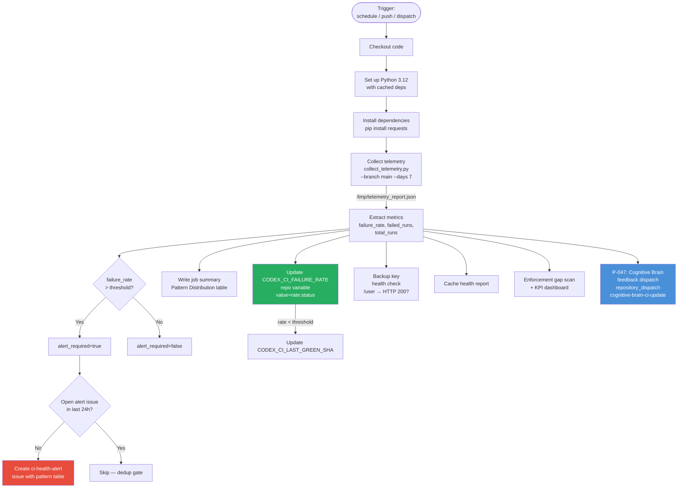
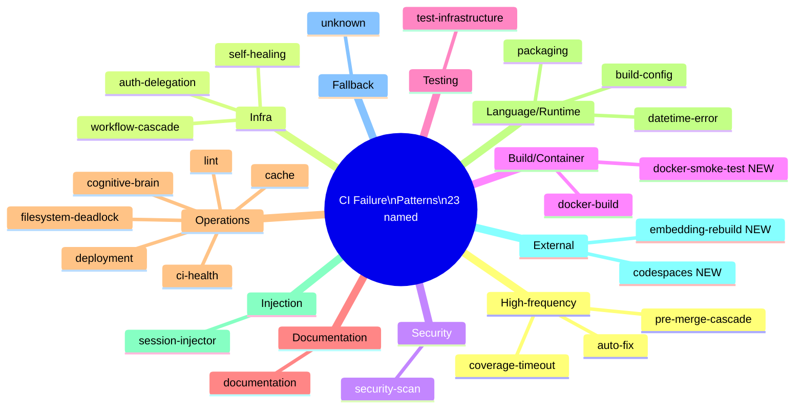
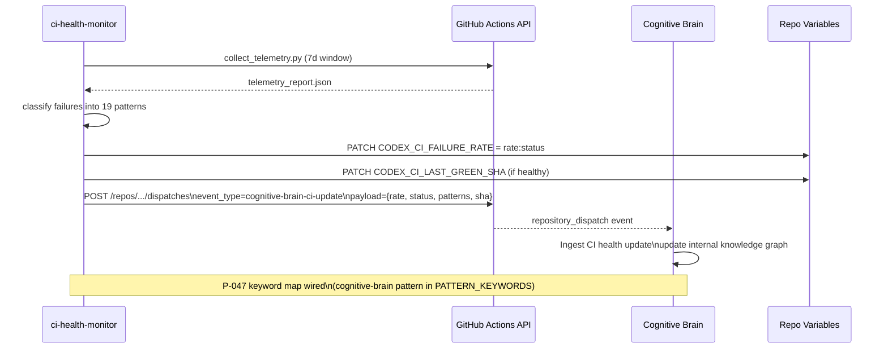

# CI Health Monitor

**Workflow File**: `ci-health-monitor.yml`
**Version**: 2.0.0
**Updated**: 2026-03-11 (PR #3552 — P-047 cognitive brain feedback loop wired)

## Purpose

Scheduled and event-driven CI health monitoring workflow. Every 6 hours (and on
relevant pushes) it:

1. Collects 7-day telemetry from GitHub Actions via `collect_telemetry.py`
2. Classifies failures into 19 named patterns (including the 3 new PR #3552 patterns)
3. Auto-updates `CODEX_CI_FAILURE_RATE` repository variable
4. Creates dedup-gated alert issues when failure rate exceeds threshold
5. Dispatches a `cognitive-brain-ci-update` repository event (P-047 feedback loop)

## Triggers

| Trigger | Details |
|---------|---------|
| `schedule` | Every 6 hours (`0 */6 * * *`) |
| `workflow_dispatch` | Manual trigger |
| `push` to `main` / `copilot/**` | On `.github/workflows/**`, `scripts/ci/collect_telemetry.py` changes |

## Permissions Required

| Permission | Level | Reason |
|------------|-------|--------|
| `contents` | `write` | Write cognitive brain status docs |
| `issues` | `write` | Create CI health alert issues |
| `pull-requests` | `write` | Comment on relevant PRs |

## Workflow Architecture



## Telemetry Pattern Classifiers (23 patterns)

`scripts/ci/collect_telemetry.py` — `PATTERN_KEYWORDS` map (23 named patterns + `unknown` fallback):



## P-047 Cognitive Brain Feedback Loop



## CODEX_CI_FAILURE_RATE Variable Format

```
value = "<rate>:<status>"
Examples:
  "3.2:ok"        — below threshold (default 10%)
  "15.0:degraded" — above threshold
  "25.0:critical" — above 2× threshold
```

## Environment Variables

| Variable | Source | Default | Purpose |
|----------|--------|---------|---------|
| `GITHUB_TOKEN` | `CODEX_MASTER_KEY \|\| CODEX_BACKUP_KEY \|\| GITHUB_TOKEN` | — | API calls |
| `CODEX_CI_FAILURE_THRESHOLD` | repo variable | `10` | Alert threshold (%) |

## Secrets Used

| Secret | Purpose |
|--------|---------|
| `CODEX_MASTER_KEY` | Primary PAT for API calls + variable updates |
| `CODEX_BACKUP_KEY` | Fallback PAT (health-checked each run) |

## History

| Date | PR | Change |
|------|----|--------|
| 2026-01-16 | — | Initial creation |
| 2026-03-11 | #3552 | P-047: cognitive brain feedback dispatch step added; 3 new patterns (`docker-smoke-test`, `codespaces`, `embedding-rebuild`); Mermaid architecture + sequence diagrams |

## Related Documentation

- [`collect_telemetry.py`](../../scripts/ci/collect_telemetry.py) — Pattern classifier implementation
- [`COGNITIVE_BRAIN_STATUS_PR3552.md`](../../.codex/docs/COGNITIVE_BRAIN_STATUS_PR3552.md) — Sprint 2 CI health plan
- [GitHub Actions Documentation](https://docs.github.com/en/actions)
