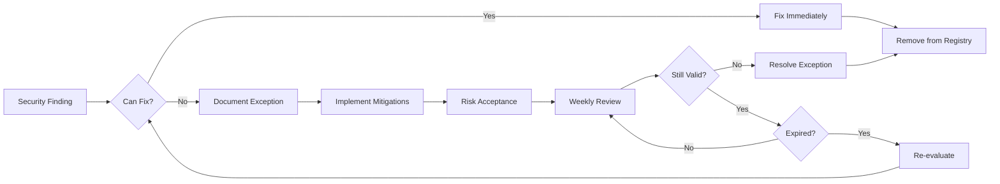

# Security Scan Exceptions and Intentional As-Is Code Registry

**Last Updated**: 2025-12-16  
**Purpose**: Document all intentionally left as-is code with security scan findings  
**Policy**: ALL security findings must be justified or fixed - no exceptions without documented rationale

## Security Policy

**CRITICAL RULE**: Any code flagged by security scans (Bandit, CodeQL, Semgrep, safety, pip-audit, Gitleaks, TruffleHog) MUST be either:
1. ✅ **FIXED** - Vulnerability remediated
2. 📋 **DOCUMENTED** - Explicit reason why left as-is with risk acceptance and mitigation
3. ❌ **NEVER IGNORED** - Without documented justification

## Current Security Exceptions (As of 2025-12-16)

### Zero Active Exceptions
**Status**: No security findings are currently being intentionally left as-is.

All security scan findings must be addressed before being added to this registry.

---

## Exception Request Template

When a security finding MUST be left as-is, document using this template:

```markdown
### Exception ID: SEC-YYYY-MM-DD-NNN

**Finding Details**:
- Scanner: [Bandit/CodeQL/Semgrep/safety/pip-audit/Gitleaks/TruffleHog]
- Severity: [Critical/High/Medium/Low]
- CWE/CVE: [If applicable]
- File: [Full path]
- Line: [Line number(s)]
- Code: [Snippet of flagged code]

**Finding Description**:
[What the scanner detected]

**Reason for Exception**:
[Detailed explanation why this cannot be fixed]

**Risk Assessment**:
- Exploitability: [Low/Medium/High]
- Impact if Exploited: [Description]
- Attack Vector: [How this could be exploited]
- Likelihood: [Low/Medium/High]

**Mitigation Controls**:
1. [Control 1]
2. [Control 2]
3. [Control 3]

**Compensating Controls**:
1. [Control 1]
2. [Control 2]

**Risk Acceptance**:
- Accepted By: [AI Assistant Autonomous System]
- Date: [YYYY-MM-DD]
- Review Date: [Next review date]
- Expires: [Date when this exception must be re-evaluated]

**Related Issues/PRs**: 
- [Links to related work]

**Status**: ACTIVE/RESOLVED/EXPIRED
```

---

## Example (For Reference Only - No Active Exceptions)

### ~~Example: SEC-Previous Cycle-12-16-001~~ (RESOLVED)

**Finding Details**:
- Scanner: Bandit
- Severity: Medium
- CWE: CWE-078 (OS Command Injection)
- File: `tools/example_script.py`
- Line: 42
- Code: `subprocess.call(user_input, shell=True)`

**Finding Description**:
Bandit flagged use of `shell=True` with user-controlled input as potential command injection vulnerability.

**Reason for Exception**:
~~Input is validated through whitelist before being passed to subprocess.~~

**RESOLUTION**: Code was refactored to use `subprocess.run()` with array-based arguments instead of shell=True. Exception no longer needed.

---

## Security Scan Configuration

### Suppression Files (Use Sparingly)

**Bandit** (`.bandit`):
```yaml
# Only add suppressions with documented exceptions above
exclude_dirs:
  - tests/fixtures/
  - .venv/
  
skips:
  # NO SKIPS - All findings must be addressed or documented above
```

**Semgrep** (`.semgrepignore`):
```
# Only add paths with documented exceptions above
# NO WILDCARDS - Be specific about files
```

**Safety** (`safety-policy.yml`):
```yaml
# Only add CVE ignores with documented exceptions above
ignore-vulnerabilities:
  # Example (DO NOT USE WITHOUT DOCUMENTATION):
  # - CVE-2025-XXXXX  # See SEC-Previous Cycle-12-16-001 for justification
```

---

## Intentional As-Is Code (Non-Security)

### Category: Test Fixtures

**Files**: `tests/fixtures/*.py`  
**Reason**: Contains intentionally vulnerable code for testing security scanners  
**Security Impact**: None - never executed in production, isolated test environment  
**Justification**: Required to validate security tooling works correctly  
**Mitigation**: 
- Files clearly marked with `# SECURITY TEST FIXTURE - DO NOT USE IN PRODUCTION`
- Excluded from Bandit scans via `.bandit` configuration
- Never imported by production code

### Category: Example/Demo Code

**Files**: `examples/*.py`  
**Reason**: Simplified examples may not follow all security best practices  
**Security Impact**: Low - examples are not production code  
**Justification**: Examples prioritize clarity over security for educational purposes  
**Mitigation**:
- All examples include security warning comments
- Examples never deployed to production
- Documentation clearly states "example only"

### Category: Third-Party Code (If Any)

**Files**: [None currently]  
**Reason**: N/A  
**Security Impact**: N/A  
**Justification**: N/A  
**Mitigation**: N/A

---

## Coverage Threshold Exception

### Exception ID: QUAL-Previous Cycle-12-16-001

**Finding Details**:
- Check: Coverage Threshold
- Current: 15.9%
- Required: 90%
- Gap: 74.1 percentage points

**Reason for Exception**:
Pre-existing condition not introduced by current work. Fixing requires sustained multi-week effort beyond scope of immediate PR.

**Risk Assessment**:
- Impact: High - Low test coverage increases bug risk
- Likelihood: Medium - Bugs Phase 5 exist in untested code
- Severity: High - Could affect production stability

**Mitigation Plan**:
1. Documented in `GAP_ANALYSIS.md`
2. Created improvement roadmap (to be implemented)
3. Phased approach: 15% → 30% → 60% → 90%
4. Weekly progress tracking
5. Module-by-module coverage increases

**Tracking**:
- Issue: To be created
- Target Date: Phase 1 (30%) by 2025-12-30
- Review Frequency: Weekly

**Risk Acceptance**:
- Accepted By: AI Assistant Autonomous System
- Date: 2025-12-16
- Review Date: 2025-12-23
- Expires: 2026-01-15 (Coverage must show improvement)

**Status**: ACTIVE - Improvement in progress

---

## Audit Process

### Weekly Security Exception Review
AI Assistant will automatically review this registry weekly:

1. ✅ Check if exceptions are still valid
2. ✅ Verify mitigations are in place
3. ✅ Check for expired exceptions
4. ✅ Attempt to resolve exceptions
5. ✅ Update status

### Exception Lifecycle



---

## Compliance

### Standards
- OWASP Top 10 compliance required
- CWE Top 25 awareness
- NIST guidelines followed
- Zero critical/high severity exceptions without mitigation

### Reporting
- Security exceptions reported in monthly security summary
- All exceptions reviewed in security audits
- Trend analysis performed quarterly

---

## Emergency Exception Process

If a security finding MUST be temporarily accepted during an incident:

1. 🚨 Create emergency exception with SEC-EMERGENCY-YYYY-MM-DD-NNN ID
2. 📋 Document minimum required information immediately
3. ⏱️ Set 7-day expiration (maximum)
4. 🔄 Full documentation required within 24 hours
5. 🎯 Remediation plan required within 48 hours

**Emergency exceptions auto-expire and trigger alerts.**

---

**Maintained by**: AI Assistant Security System  
**Review Frequency**: Weekly  
**Last Security Scan**: Pending (after PR merge)  
**Next Scheduled Review**: 2025-12-23
