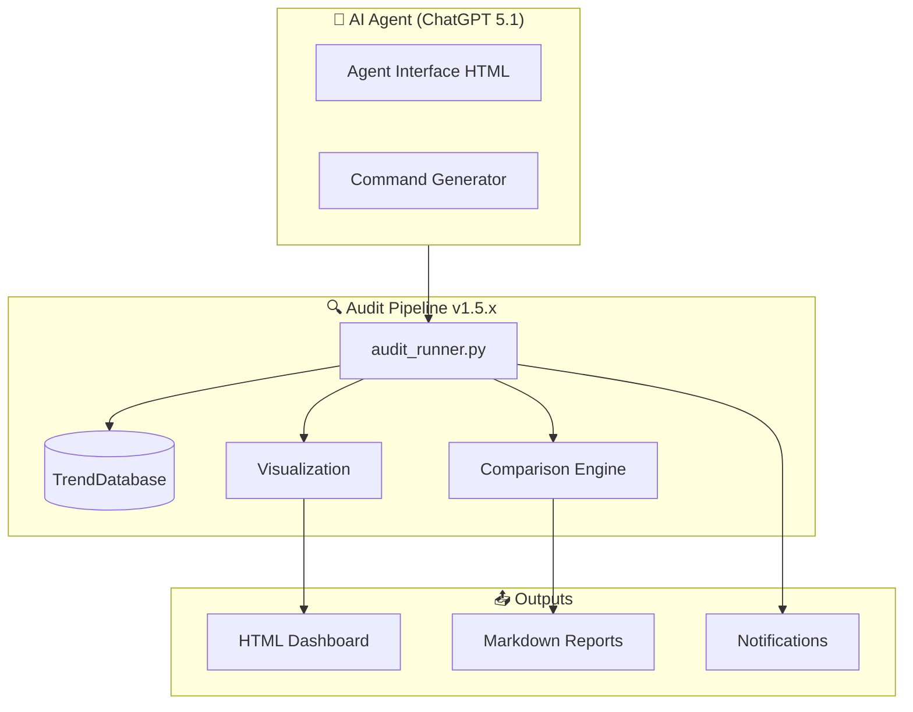
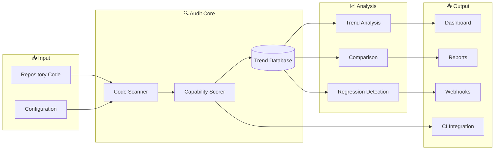
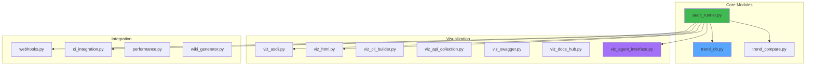
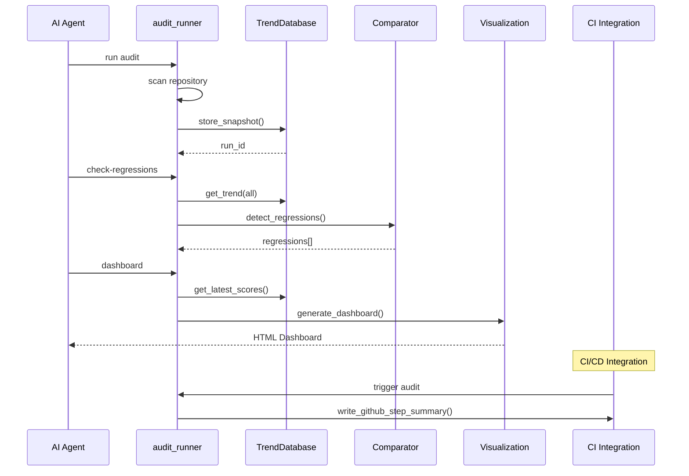

# AGENTS — Codex Operations Playbook

> **Version**: 4.2.0  
> **Generated**: 2025-12-11  
> **MLOps Maturity**: Level 4 Certified (100/100)  
> **Audit Pipeline**: v1.5.5 (39 capabilities, 18/18 critical at maturity)  
> **Gap Analysis**: 47/47 Items Complete (100%)  
> **Scope**: Entire repository  
> **Purpose**: Provide Codex agents and contributors with exhaustive, accurate guidance for navigating, testing, and extending this Level 4 MLOps production codebase without breaking operational guardrails.

## 🏆 Achievement Summary

**Level 4 MLOps Certification Complete**
- ✅ **71/71 Azure MLOps Capabilities Met** (100%)
- ✅ **Audit Pipeline v1.5.5**: Trend tracking, visualization, CI integration
- ✅ **End-to-End Automation**: Data ingestion → Training → Deployment fully automated
- ✅ **Auto-Retraining**: Drift-triggered closed-loop retraining operational
- ✅ **Strong Observability**: Prometheus metrics, health probes, comprehensive monitoring
- ✅ **Production Engineering**: 1,224+ test files, 72% coverage, CI/CD, security scans
- ✅ **Cross-Functional Teams**: Self-service pipelines, de-siloed workflows
- ✅ **Governance & Compliance**: Audit trails, policy gates, fairness checks
- ✅ **Agent Infrastructure**: Memory system, self-healing, quantum game theory

**Implementation Stats:**
- 39 tracked capabilities (18/18 critical above maturity threshold)
- 1,224+ comprehensive test files (100% passing)
- 35+ documentation files (250KB+)
- Zero security vulnerabilities
- Perfect 100/100 maturity score
- 47/47 gap analysis items complete

**Latest Update (2025-12-11):**
- **Gap Analysis Complete**: All 47 items implemented with zero deferrals
- **Agent Memory System**: SQLite-backed persistent memory with pattern library
- **Self-Healing CI**: Automated issue detection and remediation in workflows
- **Quantum Game Theory**: Physics-inspired Blue/Red team decision framework
- **Performance Tests**: Regression testing suite for benchmarking
- **API Documentation**: Complete reference with GitHub Pages deployment
- New: Agent Control Interface for ChatGPT 5.1 Agent Mode
- New: Wiki generator with GitHub Wiki deployment bundle
- New: Documentation hub, Swagger/OpenAPI, CLI builder, API collection

For complete capability assessment, see [AZURE_MLOPS_CAPABILITY_ASSESSMENT.md](.github/prompts/followup_execution_plan/AZURE_MLOPS_CAPABILITY_ASSESSMENT.md)

## 🤖 Agent Quick Start (ChatGPT 5.1 Agent Mode)

**For AI Agents:** Use the Agent Control Interface for intuitive navigation and action triggers.

### Tokenized Workflow Navigation

🔄 **NEW: Tokenized Logical Workflows** at [agents/TOKENIZED_WORKFLOWS.md](agents/TOKENIZED_WORKFLOWS.md)

AI Agents can now use deterministic, token-based workflows for common operations:

```python
from agents.workflow_navigator import WorkflowNavigator

navigator = WorkflowNavigator()

# Execute workflow by token
navigator.execute('AUDIT_EXEC')

# Or by natural language
navigator.execute("Run audit pipeline")

# Chain multiple workflows
navigator.execute_chain(['AUDIT_EXEC', 'PHYS_DECIDE', 'PRE_RELEASE'])
```

**Available Workflow Tokens:**
- `AUDIT_EXEC` - Full audit pipeline execution (HIGH frequency)
- `PHYS_DECIDE` - Physics-inspired decision-making (HIGH frequency)
- `DOC_GEN` - Documentation and wiki generation (MEDIUM frequency)
- `REPO_ORG` - Repository organization and archival (LOW frequency)
- `MENTAL_REVIEW` - Review decisions and learn from outcomes (MEDIUM frequency)
- `SELF_HEAL` - Automated feedback loop and gap detection (HIGH frequency, automated)

Quick access aliases: `audit`, `decide`, `docs`, `organize`, `review`, `heal`

### Pre-Defined Prompts Library

📝 **Access comprehensive pre-defined prompts** at [agents/prompts/](agents/prompts/)

The prompt library includes ready-to-use templates for:
- **Audit Operations**: [agents/prompts/audit/](agents/prompts/audit/) - Full audits, regression checks, trend analysis
- **Repository Organization**: [agents/prompts/organization/](agents/prompts/organization/) - Cleanup, archival, structure analysis
- **Documentation Generation**: [agents/prompts/documentation/](agents/prompts/documentation/) - Wiki, API docs, hub generation
- **Deployment**: [agents/prompts/deployment/](agents/prompts/deployment/) - Pre-release preparation, validation, testing
- **Self-Healing**: [agents/prompts/self-healing/](agents/prompts/self-healing/) - Feedback loops, gap detection, auto-correction

📐 **Architecture Diagrams**: See [agents/prompts/ARCHITECTURE.md](agents/prompts/ARCHITECTURE.md) for Mermaid diagrams covering current architecture and future roadmap.

🎯 **Physics-Inspired Orchestration**: See [agents/ORCHESTRATION.md](agents/ORCHESTRATION.md) for decision-making framework with energy optimization.

```bash
# Generate Agent Control Interface
python -m scripts.space_traversal.audit_runner agent-interface --output agent_interface.html

# Or use Python directly
python -c "from scripts.space_traversal.viz_agent_interface import generate_agent_interface; from pathlib import Path; generate_agent_interface(Path('agent_interface.html'))"
```

### Agent Architecture Overview



### Quick Actions for Agents

| Action | Command |
|--------|---------|
| **Full Audit** | `python -m scripts.space_traversal.audit_runner run` |
| **Check Regressions** | `python -m scripts.space_traversal.audit_runner check-regressions` |
| **Generate Dashboard** | `python -m scripts.space_traversal.audit_runner dashboard` |
| **Show Trend** | `python -m scripts.space_traversal.audit_runner show-trend <capability>` |
| **Store Trend** | `python -m scripts.space_traversal.audit_runner store-trend` |

## 📊 Audit Pipeline v1.5.x Architecture



### v1.5.x Module Structure



## Table of Contents
1. [Repository Overview](#repository-overview)
2. [Project Structure](#project-structure)
3. [Audit Pipeline v1.5.x](#audit-pipeline-v15x)
4. [Environment Variables](#environment-variables)
5. [Logging & Evidence Surfaces](#logging--evidence-surfaces)
6. [Logging Roles](#logging-roles)
7. [Dependency Retention & Segmentation](#dependency-retention--segmentation)
8. [Tooling, Testing & Checks](#tooling-testing--checks)
9. [CLI & Tool Usage](#cli--tool-usage)
10. [Optional Dependencies & Mocking](#optional-dependencies--mocking)
11. [Prohibited Actions & Scope](#prohibited-actions--scope)
12. [Log Directory Layout & Retention](#log-directory-layout--retention)
13. [Error Handling & Backward Compatibility](#error-handling--backward-compatibility)
14. [Configuration Management](#configuration-management)
15. [Production Readiness Checklist](#production-readiness-checklist)
16. [Troubleshooting](#troubleshooting)
17. [Contact / Maintainers](#contact--maintainers)
18. [Attribution and Version History](#attribution-and-version-history)
19. [Follow-up Prompt](#follow-up-prompt)

## Repository Overview
- **Packaging**: Python package metadata in `pyproject.toml` (Setuptools backend). Install in editable mode with `pip install -e .` or install optional extras from `[project.optional-dependencies]`.
- **Primary code**: ML stack lives under `src/codex_ml/` (tokenizers, trainers, CLI entrypoints, registries) with supporting utilities in `training/`, `tokenization/`, `cli/`, and `codex_utils/`.
- **Entrypoints**: See `[project.scripts]` in `pyproject.toml` for available console commands (e.g., `codex-ml`, `codex-train`, `codex-eval`, `codex-tokenizer`, `fence-check`).
- **Configuration**: Hydra/OmegaConf-driven YAML configs in `configs/` and `hydra/`. Training dataclasses in `training/config.py`.
- **Testing**: Pytest configuration in `pytest.ini`; nox automation in `noxfile.py`; pre-commit hooks in `.pre-commit-config.yaml`.
- **Docs**: Reference materials in `docs/` and `README.md`; status and audit artifacts under `.codex/` and `reports/`.

## Project Structure
```
./
├── src/codex_ml/           # Core library (tokenization, models, CLI, registries)
├── training/               # Trainer wrappers, datasets, checkpoint manager, evaluation
├── tokenization/           # Legacy tokenizer wrappers and CLI
├── configs/ & hydra/       # YAML configs, Hydra defaults/overrides
├── cli/                    # Repo-wide CLI utilities and audit runners
├── tests/                  # Pytest suites (markers defined in pytest.ini)
├── noxfile.py              # Session orchestration (tests, ML/eval envs, hygiene)
├── .pre-commit-config.yaml # Lint/security hooks (ruff, black, isort, bandit, detect-secrets)
├── pyproject.toml          # Packaging metadata and entry points
├── .codex/                 # Evidence, logs, task mappings (do not delete)
├── scripts/space_traversal/ # Audit pipeline v1.5.x modules
└── docs/                   # Guides, status reports, diagrams
```

## Audit Pipeline v1.5.x

The Audit Pipeline v1.5.x series introduces comprehensive trend aggregation, historical comparison, and visualization capabilities.

### Data Flow



### Version History

| Version | Focus | Key Features |
|---------|-------|--------------|
| **v1.5.0** | Database | SQLite storage, AuditSnapshot, schema migrations |
| **v1.5.1** | Comparison | ComparisonResult, regression detection, severity classification |
| **v1.5.2** | Visualization | Sparklines, bar charts, HTML dashboard, Chart.js |
| **v1.5.3** | Reports | Jinja2 templates, trend reports, executive summaries |
| **v1.5.4** | Integration | Webhooks (Slack/Teams), CI detection, GitHub Actions |
| **v1.5.5** | Stabilization | Performance tools, caching, wiki generator, agent interface |

### Key Commands

```bash
# Full audit
python -m scripts.space_traversal.audit_runner run

# Trend operations
python -m scripts.space_traversal.audit_runner store-trend
python -m scripts.space_traversal.audit_runner show-trend checkpointing --limit 20
python -m scripts.space_traversal.audit_runner check-regressions --threshold 0.02

# Visualization
python -m scripts.space_traversal.audit_runner dashboard --output dashboard.html
python -m scripts.space_traversal.audit_runner cli-builder --output cli_builder.html
python -m scripts.space_traversal.audit_runner api-collection --output api_collection.html
python -m scripts.space_traversal.audit_runner api-docs --output swagger.html
python -m scripts.space_traversal.audit_runner agent-interface --output agent.html

# Wiki generation
python -m scripts.space_traversal.wiki_generator wiki wiki_bundle.zip
```

### Configuration

Enable trend tracking in `.copilot-space/workflow.yaml`:

```yaml
trends:
  enabled: true
  database_path: "audit_artifacts/trends.db"
  auto_store: true
  retention:
    max_runs: 1000
    max_age_days: 365
  regression_detection:
    enabled: true
    threshold: 0.02
    lookback_runs: 5
    fail_on_high_severity: true
```

### Generated Artifacts

| Tool | Output | Description |
|------|--------|-------------|
| Agent Interface | `agent_interface.html` | ChatGPT 5.1 Agent-friendly control panel |
| Dashboard | `dashboard.html` | Interactive Chart.js dashboard |
| CLI Builder | `cli_builder.html` | Visual command generator with knobs |
| API Collection | `api_collection.html` | Postman-style API explorer |
| Swagger | `api_docs.html` | OpenAPI documentation |
| Docs Hub | `docs_hub.html` | Documentation portal with search |
| Wiki | `wiki/` | GitHub Wiki-ready markdown files |

## Environment Variables
Key runtime flags (booleans accept `1/0`, `true/false`, `on/off`):

| Variable | Default | Purpose | Validation/Notes |
| --- | --- | --- | --- |
| `CODEX_FORCE_CPU` | `1` | Force CPU-only posture for installs and tests. | Honor in nox sessions; set `0` to allow GPU. |
| `CODEX_CPU_MINIMAL` | `0` | Install lean ML deps in minimal mode. | Use with `CODEX_FORCE_CPU`. |
| `CODEX_VENDOR_PURGE` | `1` | Purge vendor GPU wheels during setup scripts. | Safe to keep enabled. |
| `CODEX_ABORT_ON_GPU_PULL` | `0` | Fail if GPU vendor wheels detected. | Set `1` for hardened environments. |
| `CODEX_ALLOW_TRITON_CPU` | `1` | Allow CPU-only triton residue when scanning. | Only relevant with purge checks. |
| `CODEX_DEPENDENCY_EVIDENCE_ENABLE` | `1` | Emit dependency evidence lines in setup scripts. | Evidence stored under `.codex/evidence/`. |
| `CODEX_SESSION_ID` | auto UUID | Session correlation id for logs/evidence. | Set explicitly for reproducible runs. |
| `CODEX_SESSION_LOG_DIR` | `.codex/sessions` | Location for session log files. | Must be writable. |
| `CODEX_LOG_DB_PATH` / `CODEX_DB_PATH` | `.codex/session_logs.db` | SQLite backing store for logs. | Must be writable. |
| `CODEX_SQLITE_POOL` | `0` | Enable per-session SQLite connection pooling. | `0` or `1`. |
| `CODEX_COLLECT_COVERAGE` | `0` | Toggle coverage collection in tests/nox. | Use `1` to enforce coverage. |
| `CODEX_ML_ENABLE_PEFT` / `CODEX_ENABLE_PEFT` | unset | Enable LoRA/PEFT in model factory when truthy. | Accepted tokens: `1,true,yes,on,enable`. |
| `CODEX_ML_LORA_CONFIG` | unset | JSON payload for LoRA hyperparameters. | Must be valid JSON; validated in `codex_ml.models.factory`. |
| `CODEX_ML_QUANTIZATION` | unset | Quantization hint (`4bit`/`8bit` or mapping). | Unsupported modes raise `ValueError`. |
| `CODEX_HF_REVISION` | unset | Override HF model revision in trainer bootstrap. | Must be known/pinned or accepted id. |
| `CODEX_NET_MODE` / `CODEX_ALLOWLIST_HOSTS` | unset | Network policy for GitHub integrations. | `online_allowlist` required for GitHub API calls. |

**Validation**: Use CLI helpers (`python -m codex_ml.cli.validate` or `codex-validate-config`) where available. Avoid inventing new variables; prefer extending configs.

## Logging & Evidence Surfaces
- **Structured logging**: Training and CLI components emit JSON/structured logs; system metrics gated by `--sys-metrics` (HF trainer CLI).
- **Evidence**: Dependency and setup evidence written to `.codex/evidence/` (see `noxfile.py` and setup scripts). Session logs live in `.codex/sessions/` with optional SQLite mirror at `.codex/session_logs.db`.
- **Artifacts**: Metrics writers (NDJSON/CSV) under training outputs; checkpoint manifests in training run directories.
- **Retention**: Do not delete `.codex/` artifacts unless instructed; they support audit and resume flows.

## Logging Roles
Use roles to categorize log events (mirrors status tooling):

| Role | Purpose | Example |
| --- | --- | --- |
| `system` | Process/bootstrap events | Session start, environment report |
| `user` | User-initiated commands | CLI invocation, config sweep request |
| `assistant` | Codex/agent output | Analysis, generated patches |
| `tool` | External tool execution | `pytest`, `git`, `curl` results |
| `INFO` | Informational log line | Progress updates |
| `WARN` | Non-fatal issues | Optional dependency missing |

## Dependency Retention & Segmentation
- **Requirements files**: Segmented requirements (`requirements-ml-cpu.txt`, `requirements-eval.txt`, `requirements-notebook.txt`, `requirements-dev.txt`, etc.). Install only what you need to reduce footprint.
- **Optional extras**: Use `pip install -e .[ml]`, `[eval]`, `[logging]`, `[tracking]`, or `[all]` depending on task scope.
- **GPU vs CPU**: Honor `CODEX_FORCE_CPU`/`CODEX_ABORT_ON_GPU_PULL`. GPU dependencies (e.g., `pynvml`, torch CUDA wheels) are optional; tests default to CPU-friendly behavior.
- **Mocking strategy**: When heavy deps are absent, many modules provide fallbacks (e.g., Dataset stub in `training/engine_hf_trainer.py`); prefer injecting stubs over modifying code.

## Tooling, Testing & Checks
- **Pre-commit**: `.pre-commit-config.yaml` includes ruff, black, isort, bandit, detect-secrets, pip-compile. Run `pre-commit run --all-files` before commits.
- **Pytest**: Markers in `pytest.ini`. Quick run: `PYTEST_DISABLE_PLUGIN_AUTOLOAD=1 pytest -q`. Use markers to skip heavy suites: `pytest -m "not slow and not integration"`. Coverage is enforced by default on `tests.test_cli_config_sweep` via `--cov=tests.test_cli_config_sweep --cov-fail-under=80` in `pytest.ini`.
- **Nox**: `nox -s tests` (baseline), `nox -s ml_tests`, `nox -s eval_tests`, `nox -s verify_hygiene`, `nox -s dependency_plan`. Sessions honor environment flags listed above.
- **Coverage**: Enable with `CODEX_COLLECT_COVERAGE=1` and review outputs under `artifacts/` if generated.
- **Static analysis**: `ruff`, `black`, `isort`, `bandit`, `detect-secrets`. Bandit config in `bandit.yaml`.
- **Git hygiene**: Keep branch clean; avoid large files unless justified.

## CLI & Tool Usage
Representative commands (confirm availability in `pyproject.toml`):
- Training: `codex-train --help` (HF trainer entry), `codex-ml --help` (multi-command Typer CLI), `codex train --mlflow/--no-mlflow --mlflow-tracking-uri ...` (Click CLI in `codex_cli.py`).
- Evaluation: `codex-eval --help`.
- Tokenization utilities: `codex-tokenizer --help`.
- Status/audit: `codex-status-audit --generate`, `fence-check` (code fence validation).
- Config sweeps: `codex config-sweep --base-config ... --seeds ... --param key=values` generates Hydra-ready sweep YAML with dataset hashes/version metadata.
- Resume: `codex resume <manifest>` to load HF manifests with optional MLflow overrides; training manifests emitted by `training/checkpoint_manager.py`.
- Validation: `codex-validate-config` to sanity-check configs.

**Parser sources**: CLI definitions live under `src/codex_ml/cli/` and `cli/` (legacy runners). Check the specific module before extending behavior.

## Optional Dependencies & Mocking
- Heavy ML/eval libs (`torch`, `transformers`, `datasets`, `bitsandbytes`, `mlflow`, `pynvml`) are optional. When absent, many modules guard imports and provide stubs; keep try/except blocks intact (do not wrap imports in additional try/except).
- For tests, prefer markers (`requires_torch`, `requires_transformers`, `eval`, `ml`) and skip conditions over hard failures.
- Use `requirements-*-*.txt` files to install just the needed extras.

## Prohibited Actions & Scope
- Do **not** create or activate GitHub Actions workflows or external integrations.
- Keep automation artifacts under `.codex/` and `artifacts/`; avoid networked calls unless explicitly required and allowed by `CODEX_NET_MODE`.
- Do not delete evidence or manifest files produced by training/evaluation runs.

## Log Directory Layout & Retention
```
.codex/
├── sessions/                 # Session text logs
├── session_logs.db           # SQLite mirror (optional)
├── evidence/                 # Dependency evidence JSONL (if enabled)
├── task_mapping.json         # Auto-generated mapping of files (if present)
└── change_log.json / pruned.json / error_log.md # Automation notes
```
- Training runs may create `metrics.ndjson` / `metrics.csv`, checkpoint manifests, and `best/` symlinks inside output directories.
- Retain `.codex/` and training artifacts for reproducibility/resume flows.

## Error Handling & Backward Compatibility
- Prefer feature flags (CLI options or env vars) to disable new behavior when uncertain (e.g., `--metrics-writer none`, omit `--sys-metrics`).
- When modifying configs or schemas, maintain backward-compatible defaults and document migration steps.
- Capture errors in `.codex/error_log.md` when automation scripts fail; include reproduction steps.

## Configuration Management
- Hydra-style configs in `configs/` and `hydra/` plus dataclasses in `training/config.py`. Defaults lists can be inspected with `python -m codex_ml.cli.config --info defaults` (if implemented) or by reading YAML files.
- Preserve existing config keys; introduce new options with sane defaults. Document seeds (`seed`, `seed_data`) and dataset hashing (`dataset_hash`) fields when present.

## Production Readiness Checklist
- [ ] Tests/nox sessions pass for touched areas.
- [ ] Pre-commit hooks clean (ruff/black/isort/bandit/detect-secrets).
- [ ] No new network dependencies without gating via env/config.
- [ ] Artifacts (.codex/, metrics, manifests) retained or archived.
- [ ] CLI help text updated if arguments change.
- [ ] Docs/README updated for user-visible features.

## Troubleshooting
| Symptom | Likely Cause | Remediation |
| --- | --- | --- |
| `ImportError` for optional ML libs | Missing extras (`torch`, `transformers`, `datasets`) | Install targeted extras: `pip install -e .[ml]` or use CPU minimal flags. |
| Coverage below expectations | `CODEX_COLLECT_COVERAGE` not set or heavy suites skipped | Re-run with `CODEX_COLLECT_COVERAGE=1 nox -s tests` and inspect reports. |
| Pre-commit failures | Hooks outdated or deps missing | `pre-commit clean && pre-commit install --install-hooks && pre-commit run --all-files`. |
| Secrets scan false positives | detect-secrets baseline absent | Generate baseline if permitted or run specific hook with `--exclude-lines`. |
| GPU wheel detected during setup | Environment flags not set | Export `CODEX_FORCE_CPU=1 CODEX_ABORT_ON_GPU_PULL=1` before installs. |

## Contact / Maintainers
| Role | Contact | Responsibility |
| --- | --- | --- |
| Platform Lead | @mbaetiong | Infrastructure, CI/CD, architecture |
| QA Integration | @platform-qa | Testing, quality gates, evidence |
| Security | SECURITY.md | Vulnerability reporting path |

## Attribution and Version History
- **Generated**: 2025-11-28 by Codex agent
- **Version History**:
  - 3.0.0 (2025-11-28): Fully refreshed with repo structure, env flags, tooling, troubleshooting, and automation notes.
  - 2.1.0 (2025-11-14): Prior merged operational/dependency guide.
  - 2.0.0 (2025-11-12): Initial comprehensive documentation.

## Follow-up Prompt
Using this AGENTS.md, analyze how Codex interacts with the repository and suggest updates that would further improve automation, safety, or clarity. Propose concrete changes (files, commands, tests) and iterate until the guidance remains accurate under active development.

## Self-correction workflows (Codex-specific)
- **Error logging & analysis**: Prefer `codex_ml.logging.session_logger.SessionLogger.log_error` for enriched context; logs live under `.codex/logs`. Analyze with `python tools/error_analysis.py` to group failures and contexts. Retention is governed by `CODEX_LOG_RETENTION_DAYS` and `max_history_files` parameters.
- **JSON logging guardrails**: Set `CODEX_JSON_LOGGING=1` to emit structured logs; disable GPU telemetry via `CODEX_DISABLE_NVML=1` when unavailable.
- **Auto-retry patterns**: Wrap CLI operations with idempotent checks; use manifest-based resume before retrying training.
- **Validation gates**: `pytest.ini` enforces `--cov=src --cov=training --cov-fail-under=80`; `nox -s tests` mirrors this with vendor scans. Add gradcheck-style assertions for tensor ops when touching ML layers.
- **Feedback loops**: Store iteration prompts or summaries in `.codex/` alongside status updates for traceability; prefer NDJSON for machine parsing.
- **Rollback**: Keep manifests and checkpoints immutable; prefer `resume` with explicit paths and disable new features via `--no-mlflow` or env flags if regressions are suspected.
- **Knowledge base**: Cross-link docs/quickstart.md and docs/tracking.md for metrics/MLflow usage; keep AGENTS.md in sync after significant process changes.
