# AGENTS.md - AI Agent Documentation

<!--
🤖 CHATGPT CODEX AGENT ENTRY POINT 🤖
This file serves as the primary entry point for ChatGPT Codex Agents interacting with this repository.
It provides essential orientation, operational guidelines, and navigation to all agent resources.

⚠️ IMPORTANT: This file MUST remain in the repository root for easy agent access.
DO NOT MOVE this file - it is intentionally placed here as the first point of contact.
-->

> **Status:** ✅ UP-TO-DATE (2026-06-11 - Phase 6 Consolidation)
> **Repository:** Aries-Serpent/_codex_ (ID: 1040037790)
> **Genesis Status:** Phase 1 Complete - Pre-Token Setup
> **Root Organization:** Phase 2 Complete
> **Workflows:** 126 active (S174: 3 archived, Art_ prefix removed from 34 workflows)
> **Agents:** 145 active (source of truth: [`.github/agents/AGENT_REGISTRY.yaml`](.github/agents/AGENT_REGISTRY.yaml); 14 archived prompt files remain for backward compatibility. Key unified entry points: `unified-coverage-agent`, `unified-doc-agent`, `unified-security-scanner`, `unified-governance-gate`, `cache-management-agent`, `self-healing-orchestrator-agent`.)
> **Security:** ✅ 26 vulnerabilities fixed (IP-005 Complete)
> **Automation:** ✅ CI Auto-Fix System Active (37.5% auto-fix coverage)
>
> **📚 Full Documentation:** For complete operational details including audit pipelines, Python ingestion,
> security utilities, and troubleshooting procedures, see [.codex/docs/AGENTS.md.original.cf4e8c9.md](.codex/docs/AGENTS.md.original.cf4e8c9.md)

---

## 🎯 Quick Start

**New AI Agent?** Read this first (5 min orientation):

0. **🚨 CRITICAL: Read [AI Codebase Agency Policy](.codex/CODEBASE_AGENCY_POLICY.md)** - MANDATORY
1. **Repository Status:** Pre-Genesis (Template Mode - SAFE_MODE active)
2. **Your Role:** Advisory only - No autonomous actions yet
3. **Key Constraints:** See [.codex/guardrails.md](.codex/guardrails.md)
4. **Operational Guide:** See [docs/agent/OPERATIONAL_GUIDELINES.md](docs/agent/OPERATIONAL_GUIDELINES.md)

### ⚠️ AI Codebase Agency Policy (MANDATORY)

**ALL AI agents MUST address ALL issues discovered in the codebase, regardless of whether they are pre-existing or introduced by current work.**

**Prohibited Statements:**
- ❌ "This is not related to my PR"
- ❌ "These are pre-existing issues"
- ❌ "My PR only adds files to X"

**Required Actions:**
- ✅ Fix ALL CI/CD failures
- ✅ Fix ALL broken documentation links
- ✅ Fix ALL linting/type errors
- ✅ Leave codebase better than found

**Full Policy:** [.codex/CODEBASE_AGENCY_POLICY.md](.codex/CODEBASE_AGENCY_POLICY.md)

---

## 📊 Current Repository State

```
Repository: Aries-Serpent/_codex_
Repository ID: 1040037790
Language: Python (78.3%), Markdown (18%), Shell (2.5%)
Tests: 1500+ | Coverage: 90% | Security: 0 vulnerabilities (48 fixed)

Genesis Protocol Status:
├─ Phase 1: ✅ COMPLETE (Full implementation with API preserved)
├─ Phase 2: 🔄 READY (Awaiting human admin activation)
└─ Phase 3: ⏳ FUTURE (Full autonomous operations)

Agent Implementation: FULL API MODE
├─ autonomous_actions_enabled: false (safety guard active)
├─ scripts/autonomous_agent.py: Full implementation with complete API
├─ Test Suite: 23/23 tests passing ✅
└─ Workflows: Enabled (if: true - Genesis activated)
```

**Note on autonomous_agent.py:**
The autonomous agent implementation has been restored to its full version (pre-Genesis)
to maintain API compatibility with the test suite. All classes (AutonomousAgent,
CodeHealthSensor, ActionProposer) and enums (HealthStatus, ActionType, DecisionLevel)
are available for testing and development purposes.

---

## 🤖 Agent Profile

| Attribute | Value |
|-----------|-------|
| Agent Name | ai_org_repo_admin |
| Version | 0.0.0-template |
| Authority Level | Pre-Genesis (Advisory Only) |
| Operational Mode | SAFE_MODE enabled |

---

## 📚 Essential Documentation

### Must-Read Documents

1. **[.codex/guardrails.md](.codex/guardrails.md)** - Operational constraints (5 min)
2. **[.github/TEMPORARY_FILES_POLICY.md](.github/TEMPORARY_FILES_POLICY.md)** - 🚨 CRITICAL: Never use /tmp/ for important files (2 min)
3. **[docs/agent/OPERATIONAL_GUIDELINES.md](docs/agent/OPERATIONAL_GUIDELINES.md)** - Complete framework (15 min)
4. **[docs/admin/GENESIS_SETUP_GUIDE.md](docs/admin/GENESIS_SETUP_GUIDE.md)** - Genesis process (10 min)
5. **[README.md](README.md)** - Repository overview (5 min)
6. **[.codex/docs/COGNITIVE_BRAIN_COMPLETE_DOCS.md](.codex/docs/COGNITIVE_BRAIN_COMPLETE_DOCS.md)** - 🆕 Cognitive Brain System (20 min)
7. **[.codex/docs/CI_AUTO_FIX_SYSTEM.md](.codex/docs/CI_AUTO_FIX_SYSTEM.md)** - 🆕 CI/CD Automation (10 min)

### 🔑 GitHub API & MCP Knowledge — MUST LOAD before any API call

> **Agents:** Read these before making any GitHub API, secret, variable, or workflow dispatch call.

8. **[docs/reference/GITHUB_VARIABLES_SECRETS_REFERENCE.md](docs/reference/GITHUB_VARIABLES_SECRETS_REFERENCE.md)** - 🆕 Complete REST API endpoint tables for all scopes (repo/org/env/user) × all types (variables/secrets/Dependabot/Codespaces), CLI patterns, MCP gap analysis (5 min)
9. **[docs/ci/GITHUB_API_COPILOT_AGENT_REFERENCE.md](docs/ci/GITHUB_API_COPILOT_AGENT_REFERENCE.md)** - 🆕 Token hierarchy, repo variables read/write, PR body WEC protocol, workflow approve/cancel/dispatch (10 min)
10. **[.codex/docs/COPILOT_MCP_TOOL_REFERENCE.md](.codex/docs/COPILOT_MCP_TOOL_REFERENCE.md)** - Live MCP tool inventory: 21 Playwright + 28 GitHub MCP tools (5 min)
11. **[.codex/docs/GITHUB_API_AND_MCP_REFERENCE.md](.codex/docs/GITHUB_API_AND_MCP_REFERENCE.md)** - 🆕 CB knowledge entry: quick-access token chain + scope matrix + full doc wiring map (2 min)

> **Critical token fact:** `GITHUB_TOKEN` (installation token) returns **HTTP 403** on the variables/secrets API.
> Always use `CODEX_MASTER_KEY || CODEX_BACKUP_KEY` for variable/secret CRUD.

### Reference Documents

- [scripts/AUTONOMOUS_AGENT_README.md](scripts/AUTONOMOUS_AGENT_README.md) - Agent setup
- [docs/admin/CONTINUATION_ROADMAP.md](docs/ROADMAP.md) - Future plans
- [.codex/change_log.md](.codex/change_log.md) - Audit trail
- [.github/workflow-archive/PARITY_CHECKLIST.md](.github/workflow-archive/PARITY_CHECKLIST.md) - Workflow consolidation (100% parity) 🆕
- [.github/workflow-archive/ARTIFACT_CATALOG.md](.github/workflow-archive/ARTIFACT_CATALOG.md) - GitHub Actions artifacts guide 🆕
- [.codex/plans/cognitive_brain_phase_implementation.md](.codex/plans/cognitive_brain_phase_implementation.md) - Cognitive Brain Phase Plan 🆕
- [.codex/archive/pr-resolutions/PR_3095_RESOLUTION_PATTERNS.md](.codex/archive/pr-resolutions/PR_3095_RESOLUTION_PATTERNS.md) - CI Fix Pattern Library 🆕
- [scripts/ci/auto_fix_common_issues.py](scripts/ci/auto_fix_common_issues.py) - Auto-fix script 🆕
- [scripts/cognitive/](scripts/cognitive/) - Cognitive Brain Scripts (22 files) 🆕

###human Workflow & Artifact Resources (Updated 2025-12-28)

**Workflow Consolidation**:
- **Status**: ✅ COMPLETE (100% parity confirmed)
- **Documentation**: [.github/workflow-archive/PARITY_CHECKLIST.md](.github/workflow-archive/PARITY_CHECKLIST.md)
- **Categories**: 8 of 8 verified (Testing, Docs, Container, Validation, Monitoring, Cache, Duplication, Post-Merge)
- **Patterns**: Monolithic, Distributed, Optimized, Automated consolidations
- **Active Workflows**: 49 (target: 48 - within tolerance)
- **Disabled**: 19 workflows (28.4% reduction)

**Artifact Retrieval for Copilot Sessions**:
- **Catalog**: [.github/workflow-archive/ARTIFACT_CATALOG.md](.github/workflow-archive/ARTIFACT_CATALOG.md)
- **Types**: 20+ artifact types documented
- **Methods**: GitHub CLI, API, Direct access
- **Examples**: Code quality, coverage, audits, tests, health metrics
- **Retention**: 30-180 iterations depending on type

**Quick Artifact Access**:
```bash
# View catalog
view .github/workflow-archive/ARTIFACT_CATALOG.md

# Download latest artifacts
gh run download --name code-quality-report
gh run download --name audit-results
gh run download --name workflow-trends-12345
```

---

## 🛡️ Safety & Constraints

### Active Safety Guards

**Three-Layer Protection:**
1. ✅ Workflow Guard: `if: false` in genesis-bootstrap.yml
2. ✅ Script Guard: `SAFE_MODE = True` in autonomous_agent.py
3. ✅ Config Guard: `autonomous_actions_enabled: false`

### Operational Constraints

**✅ Allowed (Pre-Genesis):**
- Answer questions about codebase
- Provide recommendations
- Create PRs for human review
- Run validation scripts
- Generate documentation

**❌ Prohibited (Pre-Genesis):**
- Direct commits to any branch
- Workflow execution
- Secret management
- Repository settings changes
- Autonomous code modifications

---

## 🚀 Genesis Protocol

### What is Genesis?

Genesis Protocol establishes AI agent authority through secure initialization:
- **Phase 1** ✅: Template creation (COMPLETE)
- **Phase 2** ⏳: Human admin injects secrets, enables workflows
- **Phase 3** 🔮: Full autonomous operations within guardrails

### Current Status: Pre-Genesis

**Completed:**
- Template files created
- Documentation comprehensive
- Safety guards active
- Ready for human review

**Awaiting:**
- Human admin secret injection
- Workflow enablement
- Genesis validation execution

**See:** [docs/admin/GENESIS_SETUP_GUIDE.md](docs/admin/GENESIS_SETUP_GUIDE.md)

---

## 📂 Repository Navigation

### Key Directories

```
_codex_/
├── .codex/              # Genesis configuration
├── .github/workflows/   # CI/CD (disabled pre-Genesis)
├── docs/
│   ├── admin/          # Human admin docs
│   └── agent/          # AI agent docs
├── scripts/            # Automation scripts
├── src/                # Source code
└── tests/              # Test suite
```

### Quick Navigation

| Need to... | Check... |
|------------|----------|
| Understand constraints | `.codex/guardrails.md` |
| Learn Genesis | `docs/admin/GENESIS_SETUP_GUIDE.md` |
| Agent capabilities | `docs/agent/OPERATIONAL_GUIDELINES.md` |
| Current status | `.codex/change_log.md` |

---

## 🎯 Decision Framework

```
Risk Assessment → Action

LOW RISK (Post-Genesis)
• Documentation → Execute autonomously
• Code formatting → Execute autonomously
• Testing → Execute autonomously

MEDIUM RISK
• Optimization → Create PR, await approval
• Refactoring → Create PR, await approval
• Dependencies → Create PR, await approval

HIGH RISK
• Security → Escalate immediately
• Configuration → Escalate immediately
• Secrets → Escalate immediately <!-- pragma: allowlist secret -->
```

**When in doubt:** Escalate to @mbaetiong

---

## 🚨 Escalation

### When to Escalate

- **Critical:** Security issues, data loss risk
- **High:** Config changes, breaking changes
- **Medium:** Optimizations, refactoring

### How to Escalate

1. Create GitHub issue with [ESCALATION] tag
2. Include: severity, impact, recommendation
3. Assign to @mbaetiong
4. Wait for human response

---

## 📊 Logging

All operations must be logged to:
- `.codex/action_log.ndjson` - Operations log
- `.codex/change_log.md` - Change audit trail
- `.codex/results.md` - Results summary

---

## 🛠️ Tools Available

### Core Tools

- `view` - Read files
- `edit` - Modify files
- `create` - Create files
- `grep` - Search content (ripgrep)
- `glob` - Find files by pattern
- `bash` - Execute commands (limited pre-Genesis)

### CI/CD Automation Tools 🆕

#### Auto-Fix Script with JSON Output

**Script:** `scripts/ci/auto_fix_common_issues.py`

Detects and fixes 8 common workflow failure patterns with machine-readable output for Copilot Agent integration:

```bash
# Check for issues (no changes)
python scripts/ci/auto_fix_common_issues.py --check-only

# Apply automatic fixes
python scripts/ci/auto_fix_common_issues.py

# Generate JSON diagnostic report
python scripts/ci/auto_fix_common_issues.py --check-only --json-output .codex/diagnostic-report.json

# Dry run (show what would change)
python scripts/ci/auto_fix_common_issues.py --dry-run

# Specific pattern only (1-8)
python scripts/ci/auto_fix_common_issues.py --pattern 1
```

**Auto-Fix Patterns:**
- ✅ Pattern 1: Unused imports (ruff F401)
- ⚠️ Pattern 2: Unused variables (detect only)
- ⚠️ Pattern 3: YAML indentation (detect only)
- ✅ Pattern 4: Coverage thresholds (standardize to 70%)
- ⚠️ Pattern 5: Tokenizer fallbacks (detect only)
- ⚠️ Pattern 6: Test assertions (detect only)
- ⚠️ Pattern 7: Redundant imports (detect only)
- ✅ Pattern 8: CodeQL alerts (ruff F401/F841)

#### Copilot Agent Helper

**Script:** `scripts/ci/copilot_agent_auto_fix.py`

Orchestrates automated fixes with progress tracking:

```bash
# Parse diagnostic report and apply all auto-fixable issues
python scripts/ci/copilot_agent_auto_fix.py
```

The helper script:
1. Reads `.codex/diagnostic-report.json`
2. Applies fixes pattern-by-pattern
3. Validates all fixes are applied
4. Provides next-step guidance

#### PR Auto-Fix Workflow

**Workflow:** `.github/workflows/auto-fix-pr-check.yml`

Automatically triggered on PR events:
- Runs diagnostic check
- Generates JSON report
- Posts Copilot Agent instructions to PR
- Uploads diagnostic artifacts
- Blocks merge if auto-fixable issues found

**What it does:**
1. Detects auto-fixable issues in PR
2. Posts detailed comment with:
   - Issue summary table
   - Critical vs informational categorization
   - Three fix options (Copilot, Local, Workflow)
   - Step-by-step instructions
3. Creates check run with inline annotations
4. Uploads diagnostic report as artifact (30-day retention)

#### Pre-Merge Validation Workflow

**Workflow:** `.github/workflows/pre-merge-validation.yml`

Final validation before merge approval:
- Auto-fix check (required)
- Quick test run (warning only)
- Code quality check (warning only)
- Posts validation summary

**Integration Points:**
1. **Pre-commit Hook** - Runs automatically on `git commit`
2. **PR Check** - Automatic on PR open/update
3. **Pre-Merge** - Runs before merge approval
4. **Manual CLI** - On-demand execution

#### JSON Diagnostic Report Format

```json
{
  "timestamp": "2026-02-09T19:30:00Z",
  "status": "failed",
  "total_issues": 10,
  "auto_fixable": 5,
  "manual_review": 5,
  "issues": [
    {
      "pattern": 1,
      "pattern_name": "Unused Imports",
      "type": "unused_imports",
      "severity": "error",
      "file": "tests/test_example.py",
      "line": 10,
      "message": "Import 'Mock' is unused",
      "auto_fix_available": true,
      "suggested_fix": "Run: python scripts/ci/auto_fix_common_issues.py --pattern 1"
    }
  ],
  "fixes_applied": {},
  "next_steps": [
    "Run: python scripts/ci/auto_fix_common_issues.py"
  ]
}
```

**Documentation:** [.codex/docs/CI_AUTO_FIX_SYSTEM.md](.codex/docs/CI_AUTO_FIX_SYSTEM.md)

---

## 🖥️ Cross-Platform Filename Requirements

### Windows Compatibility
All generated filenames **MUST** be Windows-compatible. The following characters are **PROHIBITED** in filenames:

```
< > : " / \ | ? *
```

### Timestamp Generation
**Always use** `codex.utils.path_utils.windows_safe_timestamp()` for filename timestamps:

```python
from codex.utils.path_utils import windows_safe_timestamp

# ✅ CORRECT
filename = f"report_{windows_safe_timestamp(fmt='compact')}.json"
# Produces: report_20260121_143045.json

# ❌ INCORRECT - Creates colons
filename = f"report_{datetime.utcnow().strftime('%Y-%m-%dT%H:%M:%SZ')}.json"
# Produces: report_2026-01-21T14:30:45Z.json (FAILS ON WINDOWS)
```

### Available Formats
- `iso`: ISO-8601-like with hyphens → `2026-01-21T14-30-45Z`
- `compact`: Compact numeric → `20260121_143045`
- `readable`: Human-friendly → `2026-01-21-14-30-45-UTC`

### Validation
Pre-commit hooks automatically check for Windows-incompatible filenames. Run manually:

```bash
python scripts/remediation/check_windows_filenames.py <files...>
```

---

## ✅ Best Practices

**Do:**
- ✅ Cite sources and references
- ✅ Explain rationale clearly
- ✅ Document all decisions
- ✅ Validate all changes
- ✅ Respect safety guards

**Don't:**
- ❌ Commit secrets
- ❌ Bypass safety mechanisms
- ❌ Make assumptions
- ❌ Skip documentation
- ❌ Ignore warnings

---

## 🤖 Specialized Agents

The source of truth for the custom-agent ecosystem is [`.github/agents/AGENT_REGISTRY.yaml`](.github/agents/AGENT_REGISTRY.yaml): **145 active agents** and **14 archived agents**. Archived prompt files are still present under `.github/agents/` for backward compatibility, but routing should prefer the active consolidated entry points below.

## 🗺️ Agent Consolidation Map

```mermaid
flowchart TB
  Registry["AGENT_REGISTRY.yaml
145 active / 14 archived"]

  subgraph Coverage["Coverage family"]
    CG["coverage-gapfill-agent"] --> UC["unified-coverage-agent"]
    CM["coverage-maintenance-agent"] --> UC
    CR["coverage-roadmap-agent"] --> UC
    TCA["test-coverage-agent"] --> UC
    TCM["test-coverage-monitor"] --> UC
  end

  subgraph Docs["Documentation family"]
    DC["documentation-consolidator"] --> UD["unified-doc-agent"]
    DQ["documentation-quality-agent"] --> UD
    DF["doc-freshness-checker"] -. specialist .-> UD
    LV["link-validator-agent"] -. specialist .-> UD
    PM["post-merge-doc-alignment-agent"] -. specialist .-> UD
  end

  subgraph Security["Security family"]
    SDS["secret-detection-agent"] --> US["unified-security-scanner"]
    DVS["dependency-vulnerability-scanner"] --> US
    DSR["dependency-security-review-agent"] --> US
    SA["security-audit-agent"] --> US
    CSV["security-alert-verification-agent"] -. verify .-> US
    CSR["code-scanning-remediation-agent"] -. remediate .-> US
    CQL["codeql-alert-resolution-agent"] -. fix .-> US
  end

  subgraph Healing["CI healing / cache family"]
    CFR["ci-failure-resolution-agent"] --> CAH["ci-auto-healer-agent"]
    CRE["ci-resilience-emergency-response-agent"] --> CER["ci-emergency-response-agent"]
    CMI["cache-manager-integration"] --> CMA["cache-management-agent"]
    SHO["self-healing-orchestrator-agent"] --> CAH
    SHO --> CER
  end

  Registry --> UC
  Registry --> UD
  Registry --> US
  Registry --> CAH
  Registry --> CER
  Registry --> CMA
  Registry --> UGG["unified-governance-gate"]
```



### Available Agents (145 Active)

These tables intentionally list the **active entry points surfaced in this guide**. For the full 145-agent inventory, use `AGENT_REGISTRY.yaml`.

#### Unified Entry Points
| Agent | Purpose | Location |
|-------|---------|----------|
| **Unified Coverage Agent** | Canonical entry point for coverage monitoring, gap-filling, maintenance, and roadmap enforcement | [.github/agents/unified-coverage-agent.md](.github/agents/unified-coverage-agent.md) |
| **Unified Doc Agent** | Canonical entry point for documentation management and consolidation workflows | [.github/agents/unified-doc-agent.md](.github/agents/unified-doc-agent.md) |
| **Unified Security Scanner** | Canonical entry point for dependency, secrets, and SAST scanning | [.github/agents/unified-security-scanner.md](.github/agents/unified-security-scanner.md) | <!-- pragma: allowlist secret -->
| **Unified Governance Gate** | Canonical gate for PR, deployment, and policy governance workflows | [.github/agents/unified-governance-gate.md](.github/agents/unified-governance-gate.md) |
| **Cache Management Agent** | Canonical owner of the four-layer cache hierarchy and related integrations | [.github/agents/cache-management-agent.md](.github/agents/cache-management-agent.md) |
| **Self-Healing Orchestrator Agent** | Canonical coordinator for CI self-healing loops and specialist handoffs | [.github/agents/self-healing-orchestrator-agent.md](.github/agents/self-healing-orchestrator-agent.md) |

#### CI/CD & Workflow
| Agent | Purpose | Location |
|-------|---------|----------|
| **Artifact Monitor Agent** | Autonomous CI/CD health monitoring with pattern recognition and agent orchestration | [.github/agents/artifact-monitor-agent.md](.github/agents/artifact-monitor-agent.md) |
| **CI Testing Agent** | Debug CI/CD pipelines, test failures, import errors, and build problems | [.github/agents/ci-testing-agent.md](.github/agents/ci-testing-agent.md) |
| **CI Log Retrieval Agent** | Retrieve authenticated GitHub Actions logs and summarize failures | [.github/agents/ci-log-retrieval-agent.md](.github/agents/ci-log-retrieval-agent.md) |
| **CI Auto-Healer Agent** | Apply automated CI fix patterns and execute healing loops | [.github/agents/ci-auto-healer-agent.md](.github/agents/ci-auto-healer-agent.md) |
| **CI Emergency Response Agent** | Handle blocking CI/CD incidents that need rapid remediation | [.github/agents/ci-emergency-response-agent.md](.github/agents/ci-emergency-response-agent.md) |
| **CI Triage Pipeline Agent** | Route failures by severity to the appropriate specialist agents | [.github/agents/ci-triage-pipeline-agent.md](.github/agents/ci-triage-pipeline-agent.md) |
| **Workflow CI Fixer** | Fix GitHub Actions workflow syntax errors and job failures | [.github/agents/workflow-ci-fixer.agent.md](.github/agents/workflow-ci-fixer.agent.md) |
| **Workflow Analytics Agent** | Analyze workflow performance, trends, and optimization opportunities | [.github/agents/workflow-analytics-agent.md](.github/agents/workflow-analytics-agent.md) |
| **Workflow Health Monitor** | Monitor GitHub Actions workflow health and surface anomalies | [.github/agents/workflow-health-monitor.agent.md](.github/agents/workflow-health-monitor.agent.md) |
| **Workflow Management Agent** | Manage workflow lifecycle operations and consolidations | [.github/agents/workflow-management-agent.md](.github/agents/workflow-management-agent.md) |

#### Testing & Quality
| Agent | Purpose | Location |
|-------|---------|----------|
| **QA Walkthrough Agent** | Run repository-wide QA walkthroughs across code, tests, security, and docs | [.github/agents/qa-walkthrough-agent.md](.github/agents/qa-walkthrough-agent.md) |
| **Autonomous Test Healer Agent** | Detect and automatically fix failing tests | [.github/agents/autonomous-test-healer-agent.md](.github/agents/autonomous-test-healer-agent.md) |
| **Test Alignment Fixer** | Repair tests after API or signature changes | [.github/agents/test-alignment-fixer.agent.md](.github/agents/test-alignment-fixer.agent.md) |
| **Integration Test Runner** | Run integration tests across services and validate end-to-end flows | [.github/agents/integration-test-runner.agent.md](.github/agents/integration-test-runner.agent.md) |
| **Mutation Testing Agent** | Assess test-suite effectiveness through mutation testing | [.github/agents/mutation-testing-agent.md](.github/agents/mutation-testing-agent.md) |
| **Test Enhancement Agent** | Improve assertions, add edge cases, and deepen test coverage | [.github/agents/test-enhancement-agent.md](.github/agents/test-enhancement-agent.md) |
| **Test Failure Analyzer Agent** | Diagnose failing tests and recommend targeted fixes | [.github/agents/test-failure-analyzer-agent.md](.github/agents/test-failure-analyzer-agent.md) |
| **Fragile Test Guardian** | Identify and stabilize flaky or fragile tests | [.github/agents/fragile-test-guardian.md](.github/agents/fragile-test-guardian.md) |
| **Test Pattern Guardian** | Enforce testing best practices and guard against anti-patterns | [.github/agents/test-pattern-guardian.md](.github/agents/test-pattern-guardian.md) |
| **Tokenization Coverage Agent** | Improve tokenization-module coverage and validation depth | [.github/agents/tokenization-coverage-agent.md](.github/agents/tokenization-coverage-agent.md) | <!-- pragma: allowlist secret -->

#### Documentation & Knowledge
| Agent | Purpose | Location |
|-------|---------|----------|
| **Doc Freshness Checker** | Check documentation freshness and validate links and timestamps | [.github/agents/doc-freshness-checker.agent.md](.github/agents/doc-freshness-checker.agent.md) |
| **Doc Refactor Test Agent** | Refactor docs and validate them with targeted checks | [.github/agents/doc-refactor-test-agent.md](.github/agents/doc-refactor-test-agent.md) |
| **Link Validator Agent** | Validate internal and external links across documentation | [.github/agents/link-validator-agent.md](.github/agents/link-validator-agent.md) |
| **Terminology Consistency Agent** | Enforce consistent terminology across documentation and code comments | [.github/agents/terminology-consistency-agent.md](.github/agents/terminology-consistency-agent.md) |
| **Post-Merge Doc Alignment Agent** | Reconcile GitHub Pages and docs content after merges to `main` | [.github/agents/post-merge-doc-alignment-agent.md](.github/agents/post-merge-doc-alignment-agent.md) |
| **Semantic Search** | Perform semantic search over code and documentation | [.github/agents/semantic-search.agent.md](.github/agents/semantic-search.agent.md) |
| **GitHub Pages Manager Agent** | Manage GitHub Pages deployment, theme, and live documentation sync | [.github/agents/github-pages-manager.md](.github/agents/github-pages-manager.md) |
| **Claim Verification Agent** | Verify claims made in PRs, commits, and documentation | [.github/agents/claim-verification-agent.md](.github/agents/claim-verification-agent.md) |

#### Security & Compliance
| Agent | Purpose | Location |
|-------|---------|----------|
| **Security Alert Verification Agent** | Verify GitHub security alerts and propose targeted fixes | [.github/agents/security-alert-verification-agent.md](.github/agents/security-alert-verification-agent.md) |
| **Code Scanning Remediation Agent** | Remediate code scanning findings and GHAS issues | [.github/agents/code-scanning-remediation-agent.md](.github/agents/code-scanning-remediation-agent.md) |
| **CodeQL Alert Resolution Agent** | Resolve CodeQL findings with targeted code changes | [.github/agents/codeql-alert-resolution-agent.md](.github/agents/codeql-alert-resolution-agent.md) |
| **Bridge Security Monitor** | Monitor IPC bridge security and detect unauthorized access | [.github/agents/bridge-security-monitor.agent.md](.github/agents/bridge-security-monitor.agent.md) |
| **PII Scrubber** | Scrub logs and outputs for personally identifiable information | [.github/agents/pii-scrubber.agent.md](.github/agents/pii-scrubber.agent.md) |
| **Dependency Conflict Agent** | Diagnose pip resolver conflicts and recommend safe pins | [.github/agents/dependency-conflict-agent.md](.github/agents/dependency-conflict-agent.md) |
| **Owner Approval Guard** | Enforce owner approval requirements for sensitive operations | [.github/agents/owner-approval-guard.agent.md](.github/agents/owner-approval-guard.agent.md) |
| **Policy Coach Agent** | Coach contributors on repository policies and governance rules | [.github/agents/policy-coach-agent.md](.github/agents/policy-coach-agent.md) |

#### Platform, Configuration & RAG
| Agent | Purpose | Location |
|-------|---------|----------|
| **Config Migration Assistant** | Migrate legacy configuration to Hydra-compatible layouts | [.github/agents/config-migration-assistant.agent.md](.github/agents/config-migration-assistant.agent.md) |
| **Config Validator** | Validate Hydra and project configuration files | [.github/agents/config-validator.agent.md](.github/agents/config-validator.agent.md) |
| **Meta Tensor Validator** | Guard PyTorch initialization patterns against meta-tensor errors | [.github/agents/meta-tensor-validator.md](.github/agents/meta-tensor-validator.md) |
| **RAG Index Manager** | Manage RAG index building, updates, and retrieval operations | [.github/agents/rag-index-manager.agent.md](.github/agents/rag-index-manager.agent.md) |
| **RAG Module Management Agent** | Manage RAG module lifecycle and updates | [.github/agents/rag-module-management-agent.md](.github/agents/rag-module-management-agent.md) |
| **RAG Freshness Loop Agent** | Keep RAG indexes current through incremental refresh loops | [.github/agents/rag-freshness-loop-agent.md](.github/agents/rag-freshness-loop-agent.md) |
| **RAG Meta Tensor Guardian** | Guard RAG tensor operations against meta-tensor regressions | [.github/agents/rag-meta-tensor-guardian.md](.github/agents/rag-meta-tensor-guardian.md) |
| **RAG Meta Tensor Regression Agent** | Catch meta-tensor regressions introduced by RAG changes | [.github/agents/rag-meta-tensor-regression-agent.md](.github/agents/rag-meta-tensor-regression-agent.md) |
| **ML Validation Suite Agent** | Run the ML validation suite for model and data checks | [.github/agents/ml-validation-suite-agent.md](.github/agents/ml-validation-suite-agent.md) |
| **Cross Platform Filename Validator** | Enforce Windows-safe filenames across repository outputs | [.github/agents/cross-platform-filename-validator.md](.github/agents/cross-platform-filename-validator.md) |
| **Rust Config Validator** | Validate Cargo and Rust configuration correctness | [.github/agents/rust-config-validator.md](.github/agents/rust-config-validator.md) |

#### Session, Cognitive Brain & Repository Operations
| Agent | Purpose | Location |
|-------|---------|----------|
| **Agent Orchestrator** | Coordinate multi-agent workflows and capability-based routing | [.github/agents/agent-orchestrator.md](.github/agents/agent-orchestrator.md) |
| **Orchestrator Agent** | Advisory orchestrator over the broader agent ecosystem | [.github/agents/orchestrator-agent.md](.github/agents/orchestrator-agent.md) |
| **Skills Master Agent** | Discover, maintain, and score reusable skills and custom agents | [.github/agents/skills-master-agent.md](.github/agents/skills-master-agent.md) |
| **Cognitive Brain CLI Agent** | Operate the Cognitive Brain CLI and related APIs | [.github/agents/cognitive-brain-cli-agent.md](.github/agents/cognitive-brain-cli-agent.md) |
| **Cognitive Brain Session Injector** | Inject session context and close the AfterMath loop | [.github/agents/cognitive-brain-session-injector.md](.github/agents/cognitive-brain-session-injector.md) |
| **Cognitive OODA Loop Agent** | Run full OODA loop execution for the cognitive stack | [.github/agents/cognitive-ooda-loop-agent.md](.github/agents/cognitive-ooda-loop-agent.md) |
| **Memory Sync Agent** | Consolidate STM/LTM memory and prune stale patterns | [.github/agents/memory-sync-agent.md](.github/agents/memory-sync-agent.md) |
| **Session Log Retrieval Agent** | Recall prior Copilot sessions and recover uncommitted work | [.github/agents/session-log-retrieval-agent.md](.github/agents/session-log-retrieval-agent.md) |
| **Session Analysis Agent** | Analyze Copilot sessions, commits, and objective completion patterns | [.github/agents/session-analysis-agent.md](.github/agents/session-analysis-agent.md) |
| **Repository Hygiene Agent** | Clean stale files and maintain repository hygiene | [.github/agents/repository-hygiene-agent.md](.github/agents/repository-hygiene-agent.md) |
| **Repository Organization Agent** | Organize repository structure for maintainability | [.github/agents/repository-organization-agent.md](.github/agents/repository-organization-agent.md) |
| **Reference Updater Agent** | Update cross-repository references after refactors | [.github/agents/reference-updater-agent.md](.github/agents/reference-updater-agent.md) |
| **Root Organizer Agent** | Safely reorganize root-level repository structure | [.github/agents/root-organizer-agent.md](.github/agents/root-organizer-agent.md) |
| **Repo Var Sync Agent** | Sync `.codex/agent_context.json` with repository variables | [.github/agents/repo-var-sync-agent.md](.github/agents/repo-var-sync-agent.md) |

### Using Specialized Agents

Activate specialized agents using the `@copilot` command:

```markdown
@copilot Use the CI Testing Agent to debug the test failure in tests/monitoring/
```

### Creating New Agents

To create a new specialized agent:

1. Create agent file in `.github/agents/[agent-name].md`
2. Follow the template in [.github/agents/README.md](.github/agents/README.md)
3. Document agent capabilities, responsibilities, and activation commands
4. Register the agent in `.github/agents/AGENT_REGISTRY.yaml`
5. Update the active-agent tables above if the new agent should be surfaced here
6. Test agent activation and behavior

---

## 📞 Support

**For Agents:**
- Search this documentation
- Check operational guidelines
- Create escalation issue if needed

**For Humans:**
- Critical: @mbaetiong
- General: GitHub Issues
- Features: Discussions

---

## 📝 Document Status

**Version:** 2.1.0
**Last Updated:** 2026-06-11T06:30:00Z
**Status:** ✅ UP-TO-DATE (Active-agent tables consolidated; Mermaid hierarchy added)
**Next Review:** After Phase 2 completion

---

**Complete Documentation:**
- Full details: [docs/agent/OPERATIONAL_GUIDELINES.md](docs/agent/OPERATIONAL_GUIDELINES.md)
- Genesis guide: [docs/admin/GENESIS_SETUP_GUIDE.md](docs/admin/GENESIS_SETUP_GUIDE.md)
- Future plans: [docs/admin/CONTINUATION_ROADMAP.md](docs/ROADMAP.md)

**Questions?** Create an issue or contact @mbaetiong
