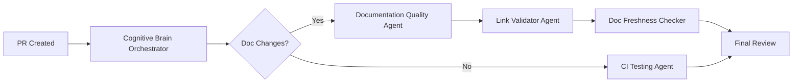

# Cognitive Brain Continuation Prompt - Phase 12 (Post Phase 11 Complete)

**Date**: 2026-01-17  
**Previous Phase**: 11.x Complete (11.0, 11.Y, 11.X, 11.Z)  
**Branch**: `copilot/update-documentation-quality`  
**Authorization**: Full CODEX_MASTER_KEY access (READ/WRITE) granted by mbaetiong

---

## Summary of Completed Work (Phase 11.x)

### Phase 11.0: Workflow CI Fixes ✅ COMPLETE
- Fixed 7 workflow files (permission + YAML errors)
- Validated 84/84 workflow files pass
- Created Workflow CI Fixer Agent (v1.0.0)

### Phase 11.Y: Token Rotation Testing ✅ COMPLETE
- Fixed critical PBKDF2 import bug
- Security audit performed
- Created testing report and manual procedures

### Phase 11.X: Documentation Quality ✅ COMPLETE
- Fixed MkDocs nav configuration (2 issues)
- Fixed ~40 broken link patterns across 24+ files
- Created `docs/mkdocs_warnings_analysis.md`
- Created `docs/mkdocs_fix_plan.md`
- 263 warnings remain (cross-directory structural issues - documented)

### Phase 11.Z: Workflow Guard Audit ✅ COMPLETE
- Audited `if: false` guard in `security.yml.disabled`
- Created `docs/workflow_guard_audit.md`
- Decision: Keep disabled, clean up in future sprint

### Self-Healing Completed
- 5 iterations executed per phase
- Code review feedback addressed
- Malformed path patterns fixed

---

## Next Phase Objectives (Phase 12)

### 1️⃣ Phase 12.0: MkDocs Warning Reduction (Batch 2)

**Priority**: MEDIUM  
**Objective**: Reduce remaining 263 warnings to < 150

**Tasks**:
1. Update DOCUMENTATION_INDEX.md to use GitHub URLs for root-level files
2. Fix NEWCOMER_GUIDE.md broken links (16 warnings)
3. Add MkDocs validation overrides to suppress non-critical warnings
4. Test strict mode with reduced scope

**Deliverables**:
- Updated documentation files
- Modified mkdocs.yml with validation config
- Warning count reduced by 40%

### 2️⃣ Phase 12.1: Custom Agent Enhancement

**Priority**: HIGH  
**Objective**: Improve existing custom agents for cognitive brain

**Agents to Enhance**:
1. `ci-testing-agent` - Add MkDocs build validation
2. `doc-freshness-checker` - Integrate link validation
3. `config-validator` - Add mkdocs.yml validation

**Deliverables**:
- Updated agent configurations in `.github/agents/`
- Integration tests for agent functionality
- Documentation of agent capabilities

### 3️⃣ Phase 12.2: Production-Ready GitHub Custom Copilot Agents

**Priority**: HIGH  
**Objective**: Develop complete implementation scope for production agents

**Implementation Scope**:
```
.github/agents/
├── documentation-quality-agent.md     # New: MkDocs quality checks
├── link-validator-agent.md            # New: Cross-reference validation
├── cognitive-brain-orchestrator.md    # New: Coordinates brain phases
└── [existing agents...]
```

**Diagrams to Create**:


### 4️⃣ Phase 12.3: Strict Mode Enablement

**Priority**: LOW (depends on 12.0)  
**Objective**: Enable MkDocs strict mode

**Prerequisites**:
- Warnings < 10 OR validation overrides configured
- All nav references valid
- No blocking broken links

---

## Execution Protocol

### PDA Loop (for each phase)
1. **Perception**: Gather current state, identify issues
2. **Decision**: Analyze options, select approach
3. **Action**: Implement solution, validate
4. **AfterMath**: Review outcomes, store learnings, update status

### Self-Healing (5 iterations per phase)
1. Discovery → 2. Implementation → 3. Validation → 4. Optimization → 5. Final Review

### Quality Gates
- [ ] MkDocs build succeeds
- [ ] No new warnings introduced
- [ ] Code review passes
- [ ] CodeQL security check passes

---

## Agent Coordination

Use these custom agents as available:
- **ci-testing-agent**: For CI/CD debugging
- **doc-freshness-checker**: For documentation validation
- **config-validator**: For configuration checks
- **test-coverage-monitor**: For test coverage tracking

---

## Knowledge Management

Store learnings using `store_memory` tool:
- MkDocs configuration patterns
- Link validation best practices
- Agent enhancement patterns

---

## Planset Reference

**Primary Planset**: `.codex/plans/PHASE_12_DOCUMENTATION_QUALITY_PLANSET.md`

This planset contains detailed tasks, deliverables, and validation criteria for all Phase 12 objectives.

---

## Progress Reporting

Use `report_progress` tool:
- After each major task completion
- Before moving to next phase
- When updating cognitive brain status

---

## Success Criteria

### Phase Completion
- [ ] Phase 12.0: Warnings reduced by 40%
- [ ] Phase 12.1: Agent enhancements documented
- [ ] Phase 12.2: Production agent scope complete
- [ ] Phase 12.3: Strict mode evaluated

### Quality
- [ ] Zero regressions introduced
- [ ] All changes tested and validated
- [ ] Documentation complete and accurate

### Cognitive Brain
- [ ] PDA loops executed for all phases
- [ ] Self-healing completed (5 iterations each)
- [ ] Learnings stored as memories
- [ ] Status updated
- [ ] Next continuation prompt prepared

---

## Reference Documents

📊 **Status**: `COGNITIVE_BRAIN_STATUS_V11_ALL_PHASES_COMPLETE.md`  
📋 **Planset**: `.codex/plans/PHASE_12_DOCUMENTATION_QUALITY_PLANSET.md`  
🏗️ **Analysis**: `docs/mkdocs_warnings_analysis.md`  
📝 **Fix Plan**: `docs/mkdocs_fix_plan.md`  
🔍 **Audit**: `docs/workflow_guard_audit.md`

---

## Authorization Reminder

✅ **Granted by mbaetiong**:
- Full CODEX_MASTER_KEY access (READ/WRITE)
- API, CLI, MCP access authorized
- Required secrets injected via GitHub UI
- Token rotation and audit plans in place

---

**Start with Phase 12.0**, proceed autonomously within AI Agency Policy guidelines, use self-healing iterations, and report progress frequently. Document all decisions and learnings.

🚀 Continue the cognitive brain enhancement workflow!
