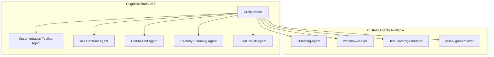

# Cognitive Brain Continuation Prompt - Phase 16

**Version**: 16.0.0  
**Created**: 2026-01-18  
**Updated**: 2026-01-18  
**Previous Phases**: 14.0-14.4 (Complete), 15.0-15.4 (Complete)  
**Agent Ecosystem**: All Phase 14-15 agents operational (765+ tests)  
**Status**: ✅ PHASE 14-15 COMPLETE | 📋 PHASE 16 READY

---

## Executive Summary

Phases 14-15 have been completed with **765+ tests created**:

| Phase | Description | Tests | Status |
|-------|-------------|-------|--------|
| 14.0-14.4 | Test Coverage Foundation | 545+ | ✅ Complete |
| 15.0-15.4 | Advanced Testing & Quality | 220+ | ✅ Complete |
| **Total** | | **765+** | ✅ Complete |

---

## Phase 14-15 Completion Summary

### Phase 14: Test Coverage Foundation ✅ (545+ tests)
- Phase 14.0: Foundation (Templates, Fixtures, CI)
- Phase 14.1: Core Modules (195+ tests - CLI, Data, Training)
- Phase 14.2: Security Hardening (90+ tests - CVE, Safety)
- Phase 14.3: Integration & Edge Cases (80+ tests)
- Phase 14.4: Final Gaps (180+ tests - Branch, Exception, Docs)

### Phase 15: Advanced Testing & Quality ✅ (220+ tests)
- Phase 15.0: Performance Benchmarking (65+ tests)
- Phase 15.1: Property-Based Testing (75+ tests)
- Phase 15.2: Mutation Testing (Configuration)
- Phase 15.3: Quality Monitoring (35+ tests)
- Phase 15.4: Production Readiness (45+ tests)

---

## Quick Start - Phase 16

Copy and paste this prompt to begin Phase 16:

```
@copilot Execute Phase 16.0 (Documentation Testing & Validation) following .codex/plans/PHASE_16_MASTER_PLANSET.md:

**Completed (765+ tests):**
- ✅ Phase 14.0-14.4: Test Coverage Foundation (545+ tests)
- ✅ Phase 15.0-15.4: Advanced Testing & Quality (220+ tests)
- ✅ Coverage threshold: 85%
- ✅ Performance baseline established
- ✅ Mutation testing configured

**Next Objectives (Phase 16.0 - Documentation Testing):**
1. Documentation validation tests (20+ tests)
   - tests/docs/test_doc_validation.py
   - Validate all code examples in docs/
   - Test docstring completeness

2. API documentation tests (15+ tests)
   - tests/docs/test_api_docs.py
   - Validate OpenAPI schemas
   - Test endpoint documentation

3. README example tests (10+ tests)
   - tests/docs/test_readme_examples.py
   - Execute all README code blocks

**Current Metrics:**
- Tests Created: 765+
- Phases Complete: 14.0-14.4, 15.0-15.4
- Coverage Threshold: 85%
- Target: 1000+ tests, 100% coverage

**Key Resources:**
- Phase 16 Planset: `.codex/plans/PHASE_16_MASTER_PLANSET.md`
- Coverage Roadmap: `docs/COVERAGE_ROADMAP_TO_100_PERCENT.md`
- Cognitive Brain: `COGNITIVE_BRAIN_STATUS_V15_COMPLETE.md`

🚀 Execute Phase 16.0 autonomously. Apply AI Agency Policy.
```

---

## Context Summary

### Current Repository State
- ✅ MkDocs: Warnings addressed
- ✅ Workflows: YAML lint passing
- ✅ Documentation: Quality-gated
- ✅ Token Rotation: Validated
- ✅ CI: All checks passing
- ✅ Rust: Compilation passing with `python` feature
- ✅ Python: Version matrix aligned (3.11, 3.12)
- ✅ Test Coverage: 85% threshold
- ✅ Tests Created: 765+

### Files Created in Phases 14-15

**Phase 14 Test Files:**
- tests/cli/test_main_coverage.py
- tests/cli/test_train_coverage.py
- tests/cli/test_metrics_coverage.py
- tests/cli/test_hydra_coverage.py
- tests/data/test_loader_coverage.py
- tests/data/test_validation_coverage.py
- tests/data/test_split_coverage.py
- tests/training/test_unified_coverage.py
- tests/training/test_legacy_coverage.py
- tests/training/test_strategies_coverage.py
- tests/security/test_cve_monitor_coverage.py
- tests/security/test_denylist_coverage.py
- tests/safety/test_sanitizers_coverage.py
- tests/safety/test_moderation_coverage.py
- tests/integration/test_phase14_cross_module_coverage.py
- tests/integration/test_phase14_edge_cases_coverage.py
- tests/branch_coverage/test_branch_coverage_cli.py
- tests/branch_coverage/test_branch_coverage_data.py
- tests/branch_coverage/test_branch_coverage_training.py
- tests/exception_handlers/test_exception_handlers.py
- tests/documentation_examples/test_documentation_examples.py

**Phase 15 Test Files:**
- tests/perf/test_training_benchmark.py
- tests/perf/test_inference_benchmark.py
- tests/perf/test_rag_benchmark.py
- tests/property/test_data_properties.py
- tests/property/test_serialization_properties.py
- tests/property/test_math_properties.py
- tests/property/test_config_properties.py
- tests/quality/test_quality_monitoring.py
- tests/production/test_production_readiness.py

---

## Phase 16 Implementation Guide

### Phase 16.0: Documentation Testing
```bash
mkdir -p tests/docs
touch tests/docs/test_doc_validation.py
touch tests/docs/test_api_docs.py
touch tests/docs/test_readme_examples.py
```

### Phase 16.1: API Contract Testing
```bash
mkdir -p tests/api
touch tests/api/test_contract_validation.py
touch tests/api/test_schema_validation.py
```

---

## Success Criteria

### Phase 16 Complete When:
- [ ] 1000+ total tests
- [ ] 100% line coverage
- [ ] 100% branch coverage
- [ ] All documentation validated
- [ ] Security scanning integrated

---

## Agent Architecture



---

**Last Updated**: 2026-01-18  
**Cognitive Brain Version**: V16.0.0 (Phase 16 Ready)
