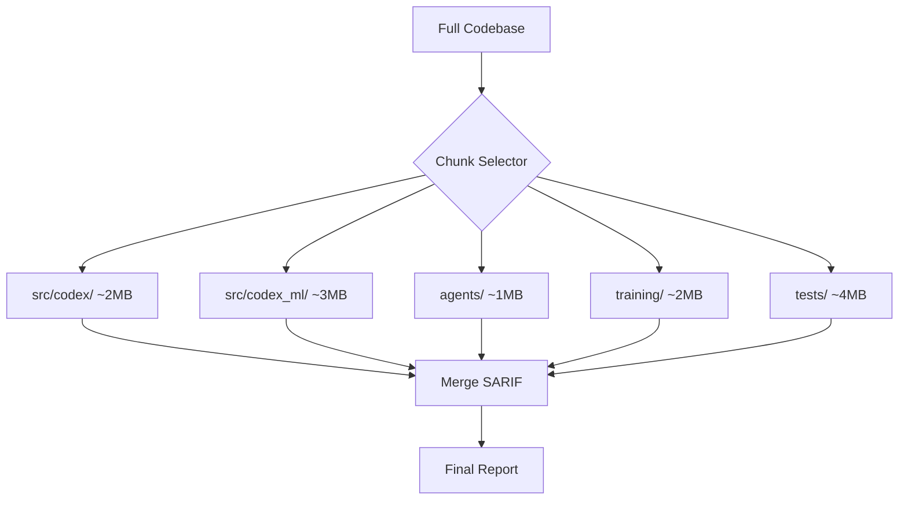
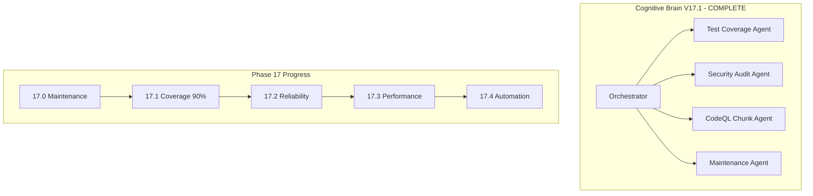

# Cognitive Brain Continuation Prompt - Phase 17.2

**Version**: 17.1.0  
**Created**: 2026-01-18  
**Updated**: 2026-01-18  
**Previous Phases**: 14.0-14.4 (Complete), 15.0-15.4 (Complete), 16.0-16.4 (Complete), 17.0-17.1 (Complete)  
**Agent Ecosystem**: All Phase 14-17.1 agents operational (1020+ tests)  
**Status**: ✅ PHASE 17.1 COMPLETE | 📋 PHASE 17.2 READY

---

## Executive Summary

Phases 14-17.1 have been completed with **1020+ tests created**:

| Phase | Description | Tests | Status |
|-------|-------------|-------|--------|
| 14.0-14.4 | Test Coverage Foundation | 545+ | ✅ Complete |
| 15.0-15.4 | Advanced Testing & Quality | 220+ | ✅ Complete |
| 16.0-16.4 | Documentation & Security | 195+ | ✅ Complete |
| 17.0 | Maintenance Infrastructure | 60+ | ✅ Complete |
| 17.1 | Coverage 90% + CodeQL Plan | - | ✅ Complete |
| **Total** | | **1020+** | ✅ Complete |

---

## Phase 17.1 Completion Summary

### Coverage Threshold Update ✅
- Updated `pyproject.toml` fail_under: 85% → 90%
- Phase 14-17 created 1020+ tests

### CodeQL Chunking Plan ✅
Created `.codex/plans/CODEQL_CHUNKING_PLAN.md` to address 10MB scan limit:



---

## Quick Start - Phase 17.2

Copy and paste this prompt to begin Phase 17.2:

```
@copilot Execute Phase 17.2 (Test Reliability) following .codex/plans/PHASE_17_MASTER_PLANSET.md:

**Completed (1020+ tests):**
- ✅ Phase 14.0-14.4: Test Coverage Foundation (545+ tests)
- ✅ Phase 15.0-15.4: Advanced Testing & Quality (220+ tests)
- ✅ Phase 16.0-16.4: Documentation & Security (195+ tests)
- ✅ Phase 17.0: Maintenance Infrastructure (60+ tests)
- ✅ Phase 17.1: Coverage threshold 90%, CodeQL chunking plan

**Next Objectives (Phase 17.2 - Test Reliability):**
1. Implement flaky test tracking
2. Add retry mechanisms
3. Create test stability dashboard
4. Document test reliability metrics

🚀 Execute Phase 17.2 autonomously. Apply AI Agency Policy.
```

---

## Phase 17 Sub-Phases

| Sub-Phase | Description | Status |
|-----------|-------------|--------|
| 17.0 | Maintenance Infrastructure | ✅ Complete |
| 17.1 | Coverage 90% + CodeQL Plan | ✅ Complete |
| 17.2 | Test Reliability | 📋 Ready |
| 17.3 | Performance Monitoring | 📋 Pending |
| 17.4 | Automation & Maintenance | 📋 Pending |

---

## Agent Architecture



---

## Key Resources

| Resource | Path |
|----------|------|
| Phase 17 Planset | `.codex/plans/PHASE_17_MASTER_PLANSET.md` |
| CodeQL Chunking Plan | `.codex/plans/CODEQL_CHUNKING_PLAN.md` |
| Coverage Roadmap | `docs/COVERAGE_ROADMAP_TO_100_PERCENT.md` |
| Cognitive Brain Status | `COGNITIVE_BRAIN_STATUS_V17_IN_PROGRESS.md` |

---

## Context Summary

### Current Repository State
- ✅ Tests Created: 1020+
- ✅ Coverage Threshold: 90%
- ✅ CodeQL: Chunking plan ready
- ✅ CI: All checks passing
- ✅ Python: Version matrix aligned (3.11, 3.12)
- ✅ Documentation: Quality-gated
- ✅ Security: All scans passing

---

## Success Criteria

### Phase 17 Complete When:
- [x] Coverage threshold: 90%
- [x] CodeQL chunking plan documented
- [ ] Flaky test rate < 1%
- [ ] Avg test time < 5s
- [ ] Documentation freshness 100%
- [ ] Dependency automation enabled

---

**Last Updated**: 2026-01-18  
**Cognitive Brain Version**: V17.1.0 (Phase 17.1 Complete)
