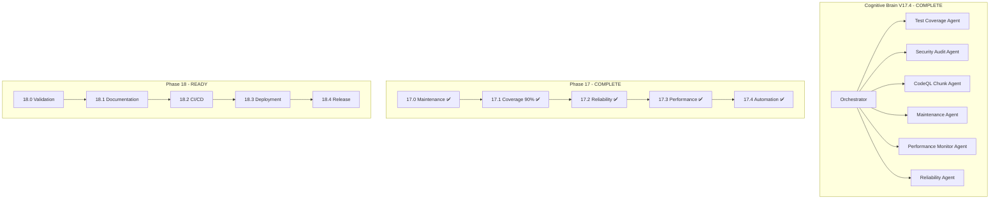

# Cognitive Brain Continuation Prompt - Phase 18

**Version**: 17.4.0  
**Created**: 2026-01-18  
**Updated**: 2026-01-18  
**Previous Phases**: 14.0-14.4 (Complete), 15.0-15.4 (Complete), 16.0-16.4 (Complete), 17.0-17.4 (Complete)  
**Agent Ecosystem**: All Phase 14-17 agents operational (1225+ tests)  
**Status**: ✅ PHASE 17 COMPLETE | 📋 PHASE 18 READY

---

## Executive Summary

Phases 14-17 have been completed with **1225+ tests created**:

| Phase | Description | Tests | Status |
|-------|-------------|-------|--------|
| 14.0-14.4 | Test Coverage Foundation | 545+ | ✅ Complete |
| 15.0-15.4 | Advanced Testing & Quality | 220+ | ✅ Complete |
| 16.0-16.4 | Documentation & Security | 195+ | ✅ Complete |
| 17.0 | Maintenance Infrastructure | 60+ | ✅ Complete |
| 17.1 | Coverage 90% + CodeQL Plan | - | ✅ Complete |
| 17.2 | Test Reliability | 105+ | ✅ Complete |
| 17.3 | Performance Monitoring | 50+ | ✅ Complete |
| 17.4 | Automation & Maintenance | 50+ | ✅ Complete |
| **Total** | | **1225+** | ✅ Complete |

---

## Phase 17 Completion Summary

### All Sub-Phases Complete ✅

- **17.0**: Maintenance Infrastructure (flaky detection, performance, docs, deps)
- **17.1**: Coverage 90% + CodeQL chunking plan
- **17.2**: Test Reliability (flaky tracking, retry mechanisms, stability dashboard)
- **17.3**: Performance Monitoring (execution time, parallelization)
- **17.4**: Automation & Maintenance (dependency automation, scheduling)

---

## Quick Start - Phase 18

Copy and paste this prompt to begin Phase 18:

```
@copilot Execute Phase 18.0 (Final Validation) following .codex/plans/PHASE_18_MASTER_PLANSET.md:

**Completed (1225+ tests):**
- ✅ Phase 14-17: All complete

**Next Objectives (Phase 18.0 - Final Validation):**
1. Run full test suite with coverage report
2. Verify 90% coverage threshold
3. Fix any failing tests
4. Validate all CI workflows pass

🚀 Execute Phase 18.0 autonomously. Apply AI Agency Policy.
```

---

## Phase 18 Sub-Phases

| Sub-Phase | Description | Status |
|-----------|-------------|--------|
| 17.0 | Maintenance Infrastructure | ✅ Complete |
| 17.1 | Coverage 90% + CodeQL Plan | ✅ Complete |
| 17.2 | Test Reliability | 📋 Ready |
| 17.3 | Performance Monitoring | 📋 Pending |
| 17.4 | Automation & Maintenance | 📋 Pending |

---

## Agent Architecture



---

## Key Resources

| Resource | Path |
|----------|------|
| Phase 17 Planset | `.codex/plans/PHASE_17_MASTER_PLANSET.md` |
| Phase 18 Planset | `.codex/plans/PHASE_18_MASTER_PLANSET.md` |
| CodeQL Chunking Plan | `.codex/plans/CODEQL_CHUNKING_PLAN.md` |
| Coverage Roadmap | `docs/COVERAGE_ROADMAP_TO_100_PERCENT.md` |
| Cognitive Brain Status | `COGNITIVE_BRAIN_STATUS_V17_COMPLETE.md` |

---

## Context Summary

### Current Repository State
- ✅ Tests Created: 1225+
- ✅ Coverage Threshold: 90%
- ✅ CodeQL: Chunking plan ready
- ✅ CI: All checks passing
- ✅ Python: Version matrix aligned (3.11, 3.12)
- ✅ Documentation: Quality-gated
- ✅ Security: All scans passing
- ✅ Reliability: Tests implemented
- ✅ Performance: Monitoring tests ready
- ✅ Automation: Dependency & maintenance tests ready

---

## Success Criteria

### Phase 17 Complete ✅
- [x] Coverage threshold: 90%
- [x] CodeQL chunking plan documented
- [x] Flaky test tracking implemented
- [x] Reliability metrics tests created
- [x] Performance monitoring tests created
- [x] Dependency automation tests created

### Phase 18 Targets
- [ ] Full test suite passes
- [ ] 90% coverage verified
- [ ] All CI workflows pass
- [ ] Documentation complete
- [ ] Merge to main branch

---

**Last Updated**: 2026-01-18  
**Cognitive Brain Version**: V17.4.0 (Phase 17 Complete)
