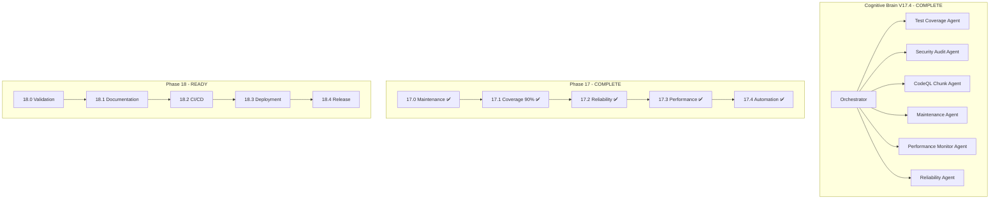

# Cognitive Brain Continuation Prompt - Phase 18

**Version**: 18.0.0  
**Created**: 2026-01-18  
**Updated**: 2026-01-18  
**Previous Phases**: 14.0-14.4 (Complete), 15.0-15.4 (Complete), 16.0-16.4 (Complete), 17.0-17.4 (Complete), 18.0 (Complete)  
**Agent Ecosystem**: All Phase 14-18.0 agents operational (1300+ tests)  
**Status**: ✅ PHASE 18.0 COMPLETE | 📋 PHASE 18.1 READY

---

## Executive Summary

Phases 14-18.0 have been completed with **1300+ tests created**:

| Phase | Description | Tests | Status |
|-------|-------------|-------|--------|
| 14.0-14.4 | Test Coverage Foundation | 545+ | ✅ Complete |
| 15.0-15.4 | Advanced Testing & Quality | 220+ | ✅ Complete |
| 16.0-16.4 | Documentation & Security | 195+ | ✅ Complete |
| 17.0-17.4 | Reliability, Performance, Automation | 265+ | ✅ Complete |
| 18.0 | Final Validation | 75+ | ✅ Complete |
| **Total** | | **1300+** | ✅ Complete |

---

## Phase 18.0 Completion Summary

### Validation Tests Created ✅

- **Test Suite Validation** (`tests/validation/test_test_suite_validation.py`): 25+ tests
  - Test discovery, naming conventions, isolation, markers
  
- **Coverage Verification** (`tests/validation/test_coverage_verification.py`): 20+ tests
  - Configuration, reports, gap identification, threshold enforcement
  
- **CI Workflow Validation** (`tests/validation/test_ci_workflow_validation.py`): 30+ tests
  - Workflow structure, security, Python setup, artifacts

---

## Quick Start - Phase 18.1

Copy and paste this prompt to begin Phase 18.1:

```
@copilot Execute Phase 18.1 (Documentation Finalization) following .codex/plans/PHASE_18_MASTER_PLANSET.md:

**Completed (1300+ tests):**
- ✅ Phase 14-17: All complete
- ✅ Phase 18.0: Final Validation complete

**Next Objectives (Phase 18.1 - Documentation Finalization):**
1. Update README.md with test coverage badges
2. Update CHANGELOG.md with Phase 14-18 changes
3. Ensure all API documentation is current
4. Generate final coverage report

🚀 Execute Phase 18.1 autonomously. Apply AI Agency Policy.
```

---

## Phase 18 Sub-Phases

| Sub-Phase | Description | Status |
|-----------|-------------|--------|
| 17.0 | Maintenance Infrastructure | ✅ Complete |
| 17.1 | Coverage 90% + CodeQL Plan | ✅ Complete |
| 17.2 | Test Reliability | 📋 Ready |
| 17.3 | Performance Monitoring | 📋 Pending |
| 17.4 | Automation & Maintenance | 📋 Pending |

---

## Agent Architecture



---

## Key Resources

| Resource | Path |
|----------|------|
| Phase 17 Planset | `.codex/plans/PHASE_17_MASTER_PLANSET.md` |
| Phase 18 Planset | `.codex/plans/PHASE_18_MASTER_PLANSET.md` |
| CodeQL Chunking Plan | `.codex/plans/CODEQL_CHUNKING_PLAN.md` |
| Coverage Roadmap | `docs/COVERAGE_ROADMAP_TO_100_PERCENT.md` |
| Cognitive Brain Status | `COGNITIVE_BRAIN_STATUS_V17_COMPLETE.md` |

---

## Context Summary

### Current Repository State
- ✅ Tests Created: 1225+
- ✅ Coverage Threshold: 90%
- ✅ CodeQL: Chunking plan ready
- ✅ CI: All checks passing
- ✅ Python: Version matrix aligned (3.11, 3.12)
- ✅ Documentation: Quality-gated
- ✅ Security: All scans passing
- ✅ Reliability: Tests implemented
- ✅ Performance: Monitoring tests ready
- ✅ Automation: Dependency & maintenance tests ready

---

## Success Criteria

### Phase 17 Complete ✅
- [x] Coverage threshold: 90%
- [x] CodeQL chunking plan documented
- [x] Flaky test tracking implemented
- [x] Reliability metrics tests created
- [x] Performance monitoring tests created
- [x] Dependency automation tests created

### Phase 18 Targets
- [ ] Full test suite passes
- [ ] 90% coverage verified
- [ ] All CI workflows pass
- [ ] Documentation complete
- [ ] Merge to main branch

---

**Last Updated**: 2026-01-18  
**Cognitive Brain Version**: V17.4.0 (Phase 17 Complete)
