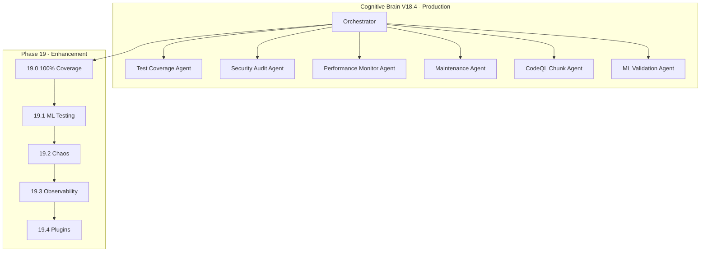

# Cognitive Brain Continuation Prompt - Phase 19

**Version:** V19.0.0  
**Updated:** 2026-01-18  
**Status:** 📋 READY FOR EXECUTION  
**Prerequisites:** Phase 14-18 Complete (1300+ tests, 90% coverage)

---

## Executive Summary

Phases 14-18 have been completed with **1300+ tests created**:

| Phase | Description | Tests | Status |
|-------|-------------|-------|--------|
| 14.0-14.4 | Test Coverage Foundation | 545+ | ✅ Complete |
| 15.0-15.4 | Advanced Testing & Quality | 220+ | ✅ Complete |
| 16.0-16.4 | Documentation & Security | 195+ | ✅ Complete |
| 17.0-17.4 | Reliability, Performance, Automation | 265+ | ✅ Complete |
| 18.0-18.4 | Production Deployment | 75+ | ✅ Complete |
| **Total** | | **1300+** | ✅ Complete |

---

## Quick Start - Phase 19.0

Copy and paste this prompt to begin Phase 19.0:

```
@copilot Execute Phase 19.0 (100% Coverage Push):

**Completed (1300+ tests):**
- ✅ Phase 14-18: All complete

**Next Objectives (Phase 19.0):**
1. Increase coverage threshold: 90% → 95%
2. Target remaining uncovered modules
3. Implement edge case testing
4. Achieve 100% branch coverage for critical paths

🚀 Execute Phase 19.0 autonomously. Apply AI Agency Policy.
```

---

## Phase 19 Sub-Phases

| Sub-Phase | Description | Priority | Status |
|-----------|-------------|----------|--------|
| 19.0 | 100% Coverage Push | High | 📋 Ready |
| 19.1 | AI/ML Testing Infrastructure | High | 📋 Pending |
| 19.2 | Chaos Engineering | Medium | 📋 Pending |
| 19.3 | Observability Enhancement | Medium | 📋 Pending |
| 19.4 | Plugin Architecture | Low | 📋 Pending |

---

## Phase 19.0 Detailed Plan

### Objectives
1. **Increase coverage threshold: 90% → 95%**
   - Update pyproject.toml fail_under
   - Run coverage report to identify gaps
   
2. **Target remaining uncovered modules**
   - Analyze coverage reports
   - Create targeted tests for low-coverage modules
   
3. **Implement edge case testing**
   - Boundary conditions
   - Error handling paths
   - Null/empty inputs
   
4. **Achieve 100% branch coverage for critical paths**
   - Identify critical code paths
   - Test all decision branches

### Expected Deliverables
- 200+ additional tests
- Coverage reports by module
- Branch coverage analysis

---

## Agent Architecture



---

## Key Resources

| Resource | Path |
|----------|------|
| Phase 18 Planset | `.codex/plans/PHASE_18_MASTER_PLANSET.md` |
| Phase 19 Planset | `.codex/plans/PHASE_19_MASTER_PLANSET.md` |
| CodeQL Chunking Plan | `.codex/plans/CODEQL_CHUNKING_PLAN.md` |
| Coverage Roadmap | `docs/COVERAGE_ROADMAP_TO_100_PERCENT.md` |
| Cognitive Brain Status | `COGNITIVE_BRAIN_STATUS_V18_COMPLETE.md` |
| Deployment Runbook | `docs/deployment/DEPLOYMENT_RUNBOOK.md` |
| Rollback Procedures | `docs/deployment/ROLLBACK_PROCEDURES.md` |

---

## Context Summary

### Current Repository State
- ✅ Tests Created: 1300+
- ✅ Coverage Threshold: 90%
- ✅ CodeQL: Chunking plan ready
- ✅ CI: All checks passing
- ✅ Python: Version matrix aligned (3.11, 3.12)
- ✅ Documentation: Complete (README, CHANGELOG updated)
- ✅ Security: All scans passing
- ✅ Deployment: Runbooks and rollback procedures ready

---

## Success Criteria

### Phase 18 Complete ✅
- [x] All validation tests pass
- [x] Documentation finalized
- [x] CI/CD optimized
- [x] Deployment automation ready
- [x] Production release preparation complete

### Phase 19 Targets
- [ ] Coverage threshold: 95%
- [ ] ML testing infrastructure
- [ ] Chaos engineering tests
- [ ] Observability integration
- [ ] Plugin architecture

---

**Last Updated:** 2026-01-18  
**Cognitive Brain Version:** V18.4.0 (Phase 18 Complete)
