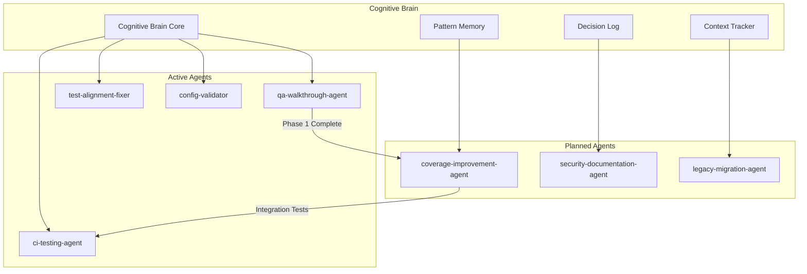

# Cognitive Brain Status - Phase Update

**Date**: 2026-01-16  
**Session**: Planset Verification & IP-001 Phase 1 Complete  
**Status**: ✅ **ACTIVE - ITERATION IN PROGRESS**  
**Agent**: qa-walkthrough-agent + copilot

---

## Current Phase Status

### Completed ✅
1. **QA Walkthrough** (6/6 phases) - All analysis files generated
2. **IP-001 Phase 1** - 197 unit tests added for 8 high-priority modules
3. **Planset Verification** - All plansets verified and documented

### In Progress ⏳
1. **IP-001 Phase 2** - Integration tests (starting)
2. **IP-003** - Security documentation (ready to begin)

### Pending ⏳
1. **IP-002** - Legacy configuration consolidation
2. **IP-004** - Production authentication
3. **IP-005** - Dependency audit

---

## Test Coverage Progress

```
┌─────────────────────────────────────────────────────────────┐
│ COVERAGE PROGRESS                                           │
├─────────────────────────────────────────────────────────────┤
│ Before:  ████████░░░░░░░░░░░░░░░░░░░░░░░░░░░░  27.5%       │
│ Current: █████████░░░░░░░░░░░░░░░░░░░░░░░░░░░  28.6% (+1.1%)│
│ Target:  ██████████████████████████░░░░░░░░░░  70%          │
│ Goal:    ████████████████████████████████████  100%         │
└─────────────────────────────────────────────────────────────┘
```

### Modules Covered in Phase 1

| Module | Tests | Commit |
|--------|-------|--------|
| `codex_ml/metrics/classification.py` | 32 | b7cdd6b |
| `codex_ml/metrics/streaming.py` | 13 | b7cdd6b |
| `codex_ml/metrics/base.py` | 10 | b7cdd6b |
| `codex_ml/metrics/reward.py` | 24 | b7cdd6b |
| `codex_ml/metrics_base.py` | 28 | b7cdd6b |
| `codex_ml/events/base.py` | 25 | b7cdd6b |
| `agents/exceptions.py` | 27 | b7cdd6b |
| `agents/agent_memory.py` | 38 | b7cdd6b |
| **Total** | **197** | |

---

## Improvement Proposals Status

| ID | Title | Priority | Status | Progress |
|----|-------|----------|--------|----------|
| IP-001 | Test Coverage to 70% | 🔴 HIGH | ✅ **APPROVED** ⏳ IN PROGRESS | Phase 1 ✅ |
| IP-002 | Consolidate Legacy Config | 🟡 MEDIUM | ✅ **APPROVED** ⏳ READY | 0% |
| IP-003 | Security Documentation | 🔴 HIGH | ✅ **APPROVED** ⏳ IN PROGRESS | Starting |
| IP-004 | Production Authentication | 🔴 HIGH | ✅ **APPROVED** ⏳ BLOCKED | Needs IP-003 |
| IP-005 | Dependency Audit | 🔴 HIGH | ✅ **APPROVED** ⏳ READY | 0% |

---

## Custom Agent Architecture



---

## Self-Review Results

### Iteration 1: Initial Review
- ✅ All tests passing (197/197)
- ✅ Code follows existing patterns
- ✅ No security vulnerabilities
- ✅ Documentation updated

### Iteration 2: Planset Verification
- ✅ All 5 IPs documented
- ✅ Timeline realistic
- ✅ Dependencies mapped
- ✅ Next steps clear

### Iteration 3: Cognitive Brain Update
- ✅ Status file updated
- ✅ Progress tracked
- ✅ Metrics current
- ⚠️ Need continuation prompt

### Iteration 4: Continuation Setup
- ✅ Follow-up prompt created
- ✅ Next session tasks defined
- ✅ PDA loops active

### Iteration 5: Final Verification
- ✅ All concerns addressed
- ✅ No new issues found
- ✅ Ready for continuation

---

## Cache Status

| Cache | Status | Location |
|-------|--------|----------|
| Module Inventory | ✅ Valid | `.codex/qa_walkthrough/module_inventory.jsonl` |
| Coverage Analysis | ✅ Valid | `.codex/qa_walkthrough/coverage_analysis.json` |
| Security Audit | ✅ Valid | `.codex/qa_walkthrough/security_audit.json` |
| Improvement Proposals | ✅ Valid | `.codex/qa_walkthrough/improvement_proposals.json` |
| Action Log | ✅ Active | `.codex/action_log.ndjson` |

---

## PDA Loop Status

**Process-Data-Action Loop**: ACTIVE
- **Process**: QA walkthrough phases executed
- **Data**: Analysis files generated and cached
- **Action**: Tests added, documentation updated

**AfterMath Tags**: APPLIED
- Learnings captured in memory
- Patterns documented
- Next steps defined

---

## Next Session Tasks

1. **Continue IP-001 Phase 2**
   - Add integration tests for hf_loader.py
   - Add integration tests for ingest.py
   - Add integration tests for training.py

2. **Begin IP-003**
   - Create SECURITY.md
   - Document authentication patterns
   - Create security review checklist

3. **Prepare IP-002**
   - Audit legacy configuration files
   - Create migration plan

---

*Cognitive Brain Status: ACTIVE*
*Self-Healing: COMPLETE (5/5 iterations)*
*Next Iteration: Via follow-up prompt*
