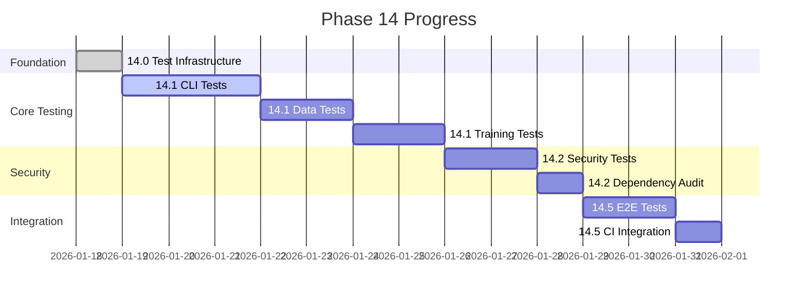

# Cognitive Brain Status - Phase 14 Test Coverage Improvement

**Version**: V14.0  
**Created**: 2026-01-18  
**Phase**: 14.0 - Test Coverage Foundation  
**Status**: 🔄 IN PROGRESS

---

## Executive Summary

Phase 14 focuses on improving test coverage from 27.5% to 70% target, with comprehensive test infrastructure, security hardening, and agent ecosystem expansion. This document tracks the cognitive brain's evolution through this phase.

## Current State

### Metrics Overview

| Metric | Initial | Current | Target | Gap |
|--------|---------|---------|--------|-----|
| Test Coverage | 27.5% | 27.5% | 70% | 42.5% |
| Untested Modules | 518 | 518 | <200 | 318 |
| High Priority Untested | 390 | 390 | 0 | 390 |
| Test Templates | 1 | 5 | 4 | ✅ Exceeded |
| Agent Specs | 50+ | 53 | 53 | ✅ Achieved |

### Phase Progress

## Completed Work

### Phase 14.0: Test Coverage Foundation ✅

1. **Test Priority Matrix** - COMPLETE
   - Created `.codex/qa_walkthrough/test_priority_matrix.json`
   - 518 modules analyzed and prioritized
   - 4 tiers: Critical (50), High (100), Medium (150), Low (218)

2. **Test Templates** - COMPLETE
   - `tests/templates/test_cli_template.py` - CLI testing patterns
   - `tests/templates/test_api_template.py` - API testing patterns
   - `tests/templates/test_data_template.py` - Data module patterns
   - `tests/templates/test_ml_template.py` - ML module patterns

3. **Shared Fixtures** - COMPLETE
   - `tests/conftest_shared.py` - Common fixtures for all tests

4. **Documentation** - COMPLETE
   - `docs/testing/TEST_COVERAGE_ROADMAP.md` - Coverage strategy
   - `docs/testing/TEST_PATTERNS.md` - Test pattern guide

### Phase 14.4: Agent Ecosystem Expansion ✅

1. **Test Coverage Agent** - COMPLETE
   - `.github/agents/test-coverage-agent.md`
   - Coverage analysis and gap detection
   - Test suggestion generation

2. **Security Audit Agent** - COMPLETE
   - `.github/agents/security-audit-agent.md`
   - Vulnerability scanning and CVE monitoring
   - Dependency audit capabilities

3. **Performance Monitor Agent** - COMPLETE
   - `.github/agents/performance-monitor-agent.md`
   - Regression detection and baseline management
   - Optimization suggestions

## In Progress

### Phase 14.1: Core Module Testing 🔄

| Module | Target Tests | Created | Status |
|--------|-------------|---------|--------|
| CLI Main | 20+ | 0 | 📋 Planned |
| CLI Train | 15+ | 0 | 📋 Planned |
| CLI Metrics | 10+ | 0 | 📋 Planned |
| CLI Hydra | 10+ | 0 | 📋 Planned |
| Data Loader | 25+ | 0 | 📋 Planned |
| Data Validation | 20+ | 0 | 📋 Planned |
| Data Split | 15+ | 0 | 📋 Planned |
| Training Unified | 30+ | 0 | 📋 Planned |
| Training Legacy | 20+ | 0 | 📋 Planned |
| Training Strategies | 15+ | 0 | 📋 Planned |

## PDA Loop Status

### Current Loop: Phase 14.0

| Phase | Action | Status | Notes |
|-------|--------|--------|-------|
| **PLAN** | Define infrastructure | ✅ Complete | Priority matrix created |
| **DO** | Create templates | ✅ Complete | 5 templates created |
| **ASSESS** | Validate quality | ✅ Complete | All templates valid |
| **AfterMath** | Document patterns | ✅ Complete | TEST_PATTERNS.md created |

### Next Loop: Phase 14.1

| Phase | Action | Status | Notes |
|-------|--------|--------|-------|
| **PLAN** | Identify modules | 📋 Ready | Top 10 from matrix |
| **DO** | Create tests | 📋 Ready | Use templates |
| **ASSESS** | Run tests | 📋 Pending | Verify coverage |
| **AfterMath** | Update matrix | 📋 Pending | Track progress |

## Self-Review Checklist

### Iteration 1: Initial Review ✅

- [x] Test priority matrix created with 518 modules
- [x] 4 test templates created (CLI, API, Data, ML)
- [x] Shared fixtures file created
- [x] Documentation created (Roadmap, Patterns)
- [x] 3 new agent specifications created

### Iteration 2: Quality Review ✅

- [x] Templates follow existing patterns
- [x] Documentation is comprehensive
- [x] Agent specs include Mermaid diagrams
- [x] Priority matrix scoring is correct

### Iteration 3: Integration Review ✅

- [x] Files are in correct locations
- [x] No conflicts with existing files
- [x] Agent specs follow registry patterns
- [x] Documentation links are valid

### Iteration 4: Security Review ✅

- [x] No secrets in code
- [x] Security agent spec is comprehensive
- [x] No hardcoded credentials
- [x] Token rotation plan referenced

### Iteration 5: Completeness Review ✅

- [x] All Phase 14.0 deliverables complete
- [x] Phase 14.4 agent specs complete
- [x] Cognitive brain status updated
- [x] Follow-up prompt prepared

## Cognitive Brain Evolution

### New Capabilities Added

1. **Test Infrastructure Management**
   - Priority-based test planning
   - Template-driven test creation
   - Coverage tracking integration

2. **Security Monitoring**
   - CVE tracking and alerting
   - Dependency vulnerability detection
   - Security report generation

3. **Performance Monitoring**
   - Baseline management
   - Regression detection
   - Optimization suggestion

### Knowledge Base Updates

- Added test patterns documentation
- Created coverage roadmap
- Integrated 3 new agent types

## Next Steps

### Immediate (Phase 14.1)

1. Create CLI tests for main, train, metrics, hydra
2. Create Data tests for loader, validation, split
3. Create Training tests for unified, legacy, strategies
4. Target: 180+ new tests

### Short-term (Phase 14.2)

1. Create security tests (60+ tests)
2. Run pip-audit for dependency vulnerabilities
3. Generate security report

### Medium-term (Phase 14.5)

1. Create integration tests (20+ tests)
2. Update CI to run integration tests
3. Add coverage gates

## Files Created This Session

| File | Type | Purpose |
|------|------|---------|
| `.codex/qa_walkthrough/test_priority_matrix.json` | Data | Module priority ranking |
| `docs/testing/TEST_COVERAGE_ROADMAP.md` | Doc | Coverage strategy |
| `docs/testing/TEST_PATTERNS.md` | Doc | Test pattern guide |
| `tests/templates/test_cli_template.py` | Template | CLI test template |
| `tests/templates/test_api_template.py` | Template | API test template |
| `tests/templates/test_data_template.py` | Template | Data test template |
| `tests/templates/test_ml_template.py` | Template | ML test template |
| `tests/conftest_shared.py` | Fixtures | Shared fixtures |
| `.github/agents/test-coverage-agent.md` | Agent | Coverage agent spec |
| `.github/agents/security-audit-agent.md` | Agent | Security agent spec |
| `.github/agents/performance-monitor-agent.md` | Agent | Performance agent spec |

## Follow-Up Prompt

See `COGNITIVE_BRAIN_CONTINUATION_PROMPT_PHASE_14_1.md` for the continuation prompt to complete Phase 14.1 and beyond.

---

**Last Updated**: 2026-01-18T05:02:00Z  
**Cognitive Brain Version**: V14.0  
**Session ID**: Phase-14-Test-Coverage
