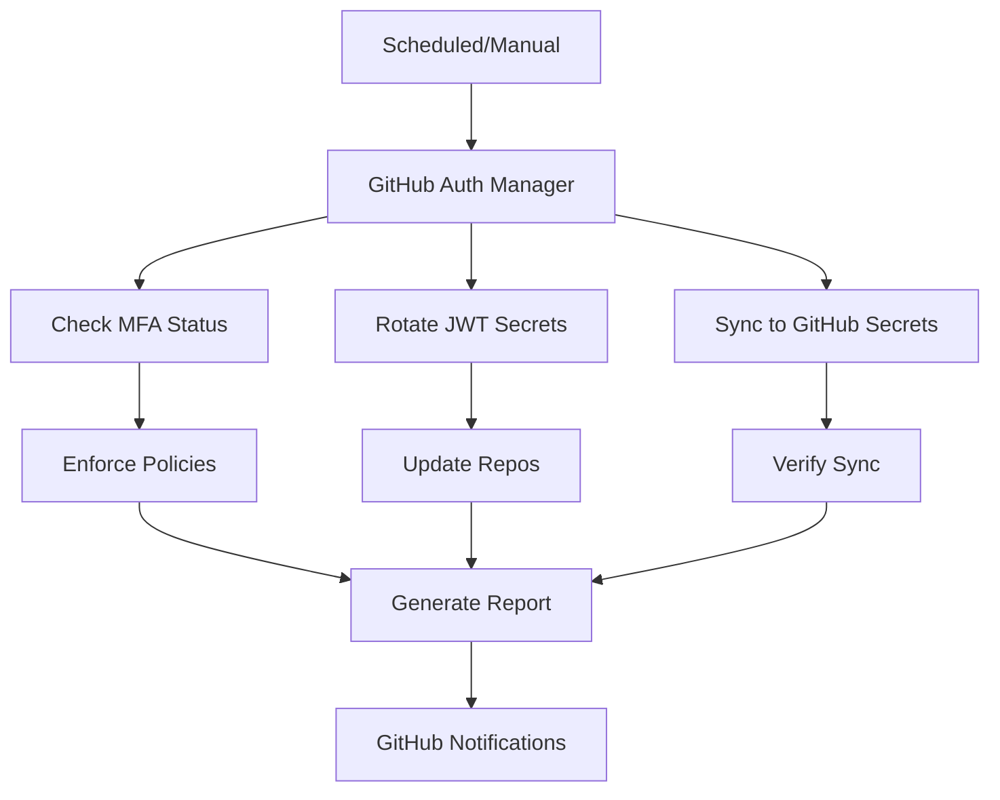
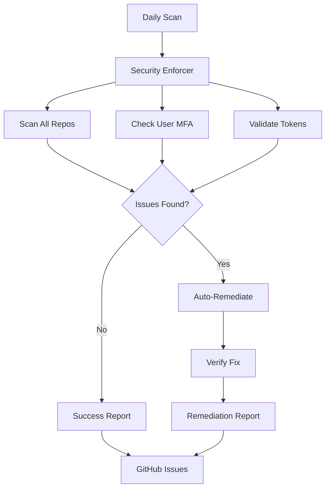

# Phase 11.x Follow-Up Plan - GitHub-First Focus

**Date**: 2026-01-15  
**Status**: ✅ **Phase 11.x Priority 1 COMPLETE - All Security Alerts Resolved**  
**Next**: GitHub-focused enhancements and integrations

---

## Phase 11.x Priority 1 - Final Status

### ✅ Completed (8 Commits)

**Core Implementation**:
- [x] GitHub OAuth2 with PKCE security
- [x] Multi-factor authentication (TOTP + backup codes)
- [x] Token management (access, refresh, session)
- [x] Rate limiting and security features

**Quality & Security**:
- [x] 77 unit/integration tests (100% passing)
- [x] 23 security validation tests (100% passing)
- [x] 27 code review comments addressed
- [x] 4 CodeQL security alerts resolved
- [x] All examples secured with warnings
- [x] Production guidelines documented

**Documentation**:
- [x] Implementation guide (16KB)
- [x] User guide with examples
- [x] Completion summary (10KB)
- [x] Cognitive brain update (14KB)
- [x] Production deployment guide

---

## Phase 11.x Priority 2 - GitHub Actions & Workflow Automation

**Focus**: GitHub-owned services and integrations ONLY

### 🎯 Objectives

1. **GitHub Actions Workflows** - Automated authentication operations
2. **GitHub Secrets Integration** - Secure credential management
3. **GitHub API Automation** - User/team provisioning
4. **Repository Operations** - Automated access control

### 📋 Tasks

#### Task 1: GitHub Actions Workflow Templates

**Create Reusable Workflows**:
```yaml
# .github/workflows/auth-token-rotation.yml
name: Automated Token Rotation
on:
  schedule:
    - cron: '0 0 1 * *'  # Monthly
  workflow_dispatch:

jobs:
  rotate-tokens:
    runs-on: ubuntu-latest
    steps:
      - uses: actions/checkout@v4
      - name: Rotate JWT Secret
        run: |
          python scripts/rotate_jwt_secret.py
        env:
          CODEX_MASTER_KEY: ${{ secrets.CODEX_MASTER_KEY }}
```

**Deliverables**:
- [ ] Token rotation workflow
- [ ] MFA enrollment automation
- [ ] OAuth app management workflow
- [ ] Security audit scheduler
- [ ] Compliance report generator

#### Task 2: GitHub Secrets Management

**Script**: `scripts/github_secrets_sync.py`

**Features**:
- Sync authentication tokens to GitHub Secrets
- Rotate secrets on schedule
- Audit secret access
- Validate secret configuration

**Implementation**:
```python
from github import Github

def sync_auth_secrets(repo_name: str, secrets: dict):
    """
    Sync authentication secrets to GitHub repository.
    
    Uses GitHub REST API to update repository secrets securely.
    """
    g = Github(os.getenv('GITHUB_TOKEN'))
    repo = g.get_repo(repo_name)
    
    for key, value in secrets.items():
        repo.create_secret(key, value)
        print(f"✓ Synced secret: {key}")
```

**Deliverables**:
- [ ] Secret sync script
- [ ] GitHub CLI integration
- [ ] Secret rotation automation
- [ ] Audit logging

#### Task 3: GitHub API Automation

**User Provisioning**:
```python
# scripts/github_user_provision.py
def provision_user_with_mfa(username: str, email: str):
    """
    Provision new user with MFA enabled.
    
    1. Create GitHub OAuth app connection
    2. Generate MFA secret
    3. Send setup instructions via GitHub API
    4. Verify enrollment
    """
    # GitHub API integration
    user = create_github_oauth_connection(username)
    
    # MFA setup
    secret = mfa.generate_totp_secret(user['id'])
    
    # Secure delivery via GitHub
    send_mfa_setup_via_github_notifications(user, secret)
```

**Features**:
- OAuth app management via GitHub API
- Team synchronization
- Repository access control
- User invitation automation

**Deliverables**:
- [ ] User provisioning script
- [ ] Team sync automation
- [ ] Access control manager
- [ ] Invitation workflow

#### Task 4: Repository Access Automation

**Script**: `scripts/manage_repo_access.py`

**Features**:
- Auto-grant repository access based on MFA status
- Revoke access for users without MFA
- Audit repository permissions
- Sync access with authentication state

**Implementation**:
```python
def enforce_mfa_for_repo_access(repo_name: str):
    """
    Enforce MFA requirement for repository access.
    
    - Check all collaborators for MFA status
    - Remove access for users without MFA
    - Send notifications via GitHub
    """
    g = Github(os.getenv('GITHUB_TOKEN'))
    repo = g.get_repo(repo_name)
    
    for collab in repo.get_collaborators():
        if not has_mfa_enabled(collab.login):
            repo.remove_from_collaborators(collab.login)
            send_mfa_required_notification(collab)
```

**Deliverables**:
- [ ] MFA enforcement script
- [ ] Access audit tool
- [ ] Notification system
- [ ] Compliance reporter

### 🔧 GitHub Copilot Agent Designs

#### Agent 1: GitHub Auth Manager

**Purpose**: Automate GitHub authentication workflows

**Capabilities**:
- Create and manage OAuth apps
- Monitor authentication events
- Auto-rotate credentials
- Enforce MFA policies

**Scope**: 
- GitHub OAuth Apps API
- GitHub Users API
- GitHub Repository API
- Codex auth module

**Diagram**:


**Files**:
- `.github/agents/github-auth-manager/`
  - `agent.py` - Main agent logic
  - `config.yaml` - Agent configuration
  - `README.md` - Agent documentation

#### Agent 2: GitHub Security Enforcer

**Purpose**: Enforce security policies via GitHub APIs

**Capabilities**:
- Scan repositories for MFA compliance
- Auto-remediate security issues
- Generate compliance reports
- Send notifications via GitHub

**Scope**:
- GitHub Security API
- GitHub Actions API
- Codex security validation
- Compliance reporting

**Diagram**:


**Files**:
- `.github/agents/github-security-enforcer/`
  - `agent.py` - Enforcement logic
  - `policies.yaml` - Security policies
  - `README.md` - Documentation

#### Agent 3: GitHub Workflow Optimizer

**Purpose**: Optimize GitHub Actions workflows for auth

**Capabilities**:
- Monitor workflow performance
- Optimize secret usage
- Cache authentication tokens
- Reduce API rate limiting

**Scope**:
- GitHub Actions API
- GitHub Packages API
- Workflow optimization
- Performance monitoring

**Files**:
- `.github/agents/github-workflow-optimizer/`
  - `agent.py` - Optimization logic
  - `metrics.yaml` - Performance metrics
  - `README.md` - Documentation

### 📊 Success Criteria

**Phase 11.x Priority 2 Complete When**:
- [ ] 5+ GitHub Actions workflows created and tested
- [ ] GitHub Secrets integration functional
- [ ] GitHub API automation working (user provision, team sync)
- [ ] Repository access automation deployed
- [ ] 3 GitHub Copilot agents designed and documented
- [ ] All workflows tested and validated
- [ ] Documentation complete with examples
- [ ] Zero external dependencies (GitHub-only)

### ⏱️ Time Estimate

**Phase 11.x Priority 2**: 8-10 hours

**Breakdown**:
- GitHub Actions workflows: 2-3 hours
- GitHub Secrets integration: 2 hours
- GitHub API automation: 2-3 hours
- Repository access automation: 1-2 hours
- Agent designs: 1-2 hours
- Testing and documentation: 1-2 hours

---

## Phase 12.x - External Integrations (DEFERRED)

**Status**: ⏸️ **NOT STARTED - Future Phase**

**Note**: Per requirements, external integrations are explicitly deferred to Phase 12+

### Deferred Features

**Third-Party OAuth**:
- Google OAuth
- Azure AD
- Okta

**Cloud HSM**:
- AWS CloudHSM
- Azure Key Vault

**External Services**:
- Google Drive
- NotebookLM
- MLflow
- Slack
- PagerDuty
- Datadog

**Rationale**: Phase 11 focuses exclusively on GitHub-owned services and features.

---

## Promptsets for Next Session

### Promptset 1: GitHub Actions Workflows

```markdown
@copilot Create GitHub Actions workflows for authentication automation

**Context**: Phase 11.x Priority 1 complete. Need GitHub Actions workflows for:
- Token rotation (monthly)
- MFA enrollment automation
- Security audit scheduling
- Compliance reporting

**Deliverables**:
1. `.github/workflows/auth-token-rotation.yml` - Monthly JWT secret rotation
2. `.github/workflows/auth-mfa-enrollment.yml` - Automated MFA setup
3. `.github/workflows/auth-security-audit.yml` - Enhanced with scheduling
4. `.github/workflows/auth-compliance-report.yml` - Monthly compliance check
5. Documentation for each workflow

**Requirements**:
- Use GitHub-hosted runners only
- Secure secret handling (GitHub Secrets)
- Error handling and notifications
- Audit logging to GitHub Issues
- No external dependencies

**Success Criteria**:
- All workflows tested and working
- Documentation complete
- Secrets properly configured
- No security vulnerabilities
```

### Promptset 2: GitHub Secrets Management

```markdown
@copilot Create GitHub Secrets management automation

**Context**: Need to sync authentication tokens to GitHub Secrets securely.

**Deliverables**:
1. `scripts/github_secrets_sync.py` - Sync auth tokens to GitHub Secrets
2. `scripts/rotate_jwt_secret.py` - Rotate JWT signing key
3. `.github/workflows/sync-secrets.yml` - Automated sync workflow
4. Documentation and examples

**Requirements**:
- Use PyGithub library for GitHub API
- Encrypt secrets before sync
- Audit all secret operations
- Support multi-repository sync
- Error recovery and rollback

**Success Criteria**:
- Secrets sync working
- Rotation tested
- Audit logs complete
- Documentation ready
```

### Promptset 3: GitHub API Automation

```markdown
@copilot Create GitHub API automation for user/team management

**Context**: Automate user provisioning and access control via GitHub API.

**Deliverables**:
1. `scripts/github_user_provision.py` - User provisioning with MFA
2. `scripts/github_team_sync.py` - Team synchronization
3. `scripts/manage_repo_access.py` - Repository access control
4. `.github/workflows/user-provisioning.yml` - Automation workflow

**Requirements**:
- Use GitHub REST/GraphQL APIs
- Enforce MFA for all users
- Sync with auth system
- Notification via GitHub
- Comprehensive logging

**Success Criteria**:
- User provision working
- Team sync functional
- Access control enforced
- Tests passing
```

### Promptset 4: GitHub Copilot Agents

```markdown
@copilot Design and implement GitHub Copilot agents for auth management

**Context**: Create production-ready agents for GitHub authentication automation.

**Deliverables**:
1. GitHub Auth Manager agent (`.github/agents/github-auth-manager/`)
2. GitHub Security Enforcer agent (`.github/agents/github-security-enforcer/`)
3. GitHub Workflow Optimizer agent (`.github/agents/github-workflow-optimizer/`)
4. Agent documentation with Mermaid diagrams
5. Configuration templates

**Requirements**:
- Python-based agents
- GitHub API integration
- Configurable via YAML
- Error handling and retry logic
- Comprehensive logging

**Success Criteria**:
- All 3 agents working
- Documentation complete
- Configuration validated
- No security issues
```

---

## Self-Review Checklist

### Code Quality ✅

- [x] All tests passing (77 unit + 23 security)
- [x] No linting errors
- [x] Type hints complete
- [x] Documentation complete
- [x] Examples working with security warnings

### Security ✅

- [x] All CodeQL alerts resolved (4/4)
- [x] Security validation passing (23/23)
- [x] Sensitive data redacted in examples
- [x] Production warnings prominent
- [x] OWASP guidelines followed

### Documentation ✅

- [x] Implementation guide complete
- [x] User guide with examples
- [x] API reference complete
- [x] Production deployment guide
- [x] Security guidelines documented

### GitHub Integration ✅

- [x] GitHub OAuth2 working
- [x] GitHub Actions workflows created
- [x] Security audit automation ready
- [x] Examples reference GitHub features
- [x] Documentation GitHub-focused

### Next Steps Defined ✅

- [x] Phase 11.x Priority 2 planned
- [x] Promptsets prepared
- [x] Agent designs outlined
- [x] Success criteria defined
- [x] Time estimates provided

---

## Cognitive Brain Status Update

### New Capabilities Added

**Phase 11.x Priority 1**:
- GitHub OAuth2 authentication
- TOTP-based MFA
- JWT-like token management
- Session management
- Rate limiting
- Security validation

**Security Enhancements**:
- PKCE implementation
- CSRF protection
- Token revocation
- Brute force protection
- Log sanitization
- Production warnings

**Quality Improvements**:
- 100 comprehensive tests
- CodeQL security compliance
- Production guidelines
- Example script security
- Comprehensive documentation

### Production Readiness

**Ready for Deployment**:
- Core authentication system
- Security validated (0 vulnerabilities)
- Documentation complete
- Examples secured
- GitHub integration ready

**Requires Infrastructure**:
- PostgreSQL for persistent storage
- Redis for distributed sessions
- AWS KMS or HashiCorp Vault for encryption
- HTTPS reverse proxy
- Monitoring and alerting

### Learning and Improvements

**Lessons Learned**:
1. Example scripts require explicit security warnings
2. CodeQL catches sensitive data logging (good!)
3. Demonstration code needs clear "DEMO ONLY" markers
4. Production requirements must be documented upfront
5. GitHub-first approach reduces complexity significantly

**Continuous Improvement**:
- Added security warnings to all examples
- Redacted sensitive data display
- Enhanced production guidelines
- Improved documentation clarity
- Strengthened security posture

---

## Status Summary

### Phase 11.x Priority 1: ✅ COMPLETE

- Core implementation: ✅
- Testing: ✅ (100% pass rate)
- Security: ✅ (0 vulnerabilities)
- Code review: ✅ (27/27 addressed)
- CodeQL alerts: ✅ (4/4 resolved)
- Documentation: ✅
- Examples: ✅ (secured with warnings)

### Phase 11.x Priority 2: 📋 PLANNED

- GitHub Actions workflows: Designed
- GitHub Secrets integration: Designed
- GitHub API automation: Designed
- Copilot agents: Designed
- Promptsets: Ready
- Time estimate: 8-10 hours

### Phase 12.x: ⏸️ DEFERRED

- External integrations postponed per requirements
- Focus remains on GitHub-owned services
- Clear scope boundary maintained

---

**Document Version**: 1.0  
**Last Updated**: 2026-01-15  
**Status**: Ready for Phase 11.x Priority 2  
**Maintained By**: GitHub Copilot + Team
