# Repository Architecture Diagrams - Updated 2026-01-19

**Last Updated**: 2026-01-19T06:45:00Z  
**Context**: Phase 20 Complete + Phase 21 Planning  
**Purpose**: Updated architecture diagrams reflecting Phase 20 completion and Phase 21 planning

---

## 🎯 Overview

This document updates all key architecture diagrams to reflect:
1. Phase 20 completion (420 new tests across monitoring, automation, self-healing, integration)
2. Phase 21 planning and architecture
3. Complete testing ecosystem (2410+ tests)
4. CI/CD workflow fixes (pytest configuration, dependency order)
5. New doc-test-scribe GitHub Action
6. HTML index generation system
7. Integrated security scanning workflow
8. Testing conventions and custom action prerequisites

---

## 📊 Diagram 1: Complete CI/CD & Testing Architecture

### Current State After Fixes

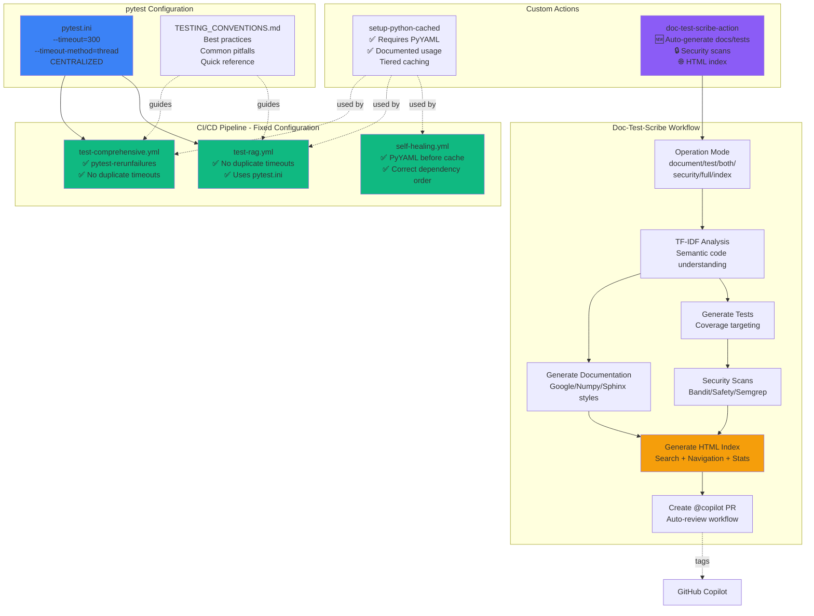

---

## 📊 Diagram 2: Doc-Test-Scribe Action Architecture

### Component-Level Design

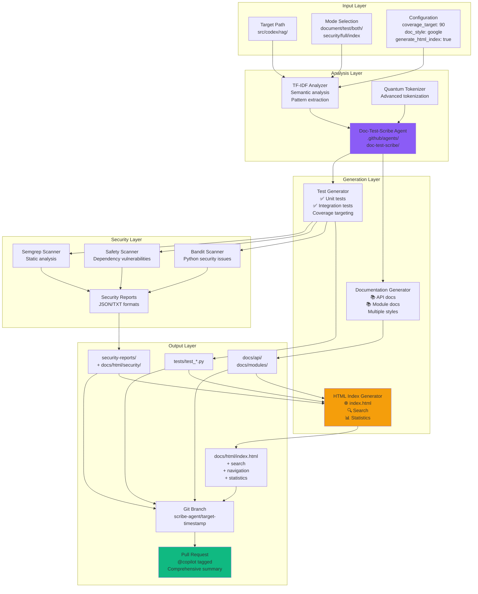

---

## 📊 Diagram 3: HTML Index System Architecture

### Interactive Documentation Hub

```mermaid
graph TB
    subgraph "HTML Index Components"
        LANDING[Landing Page<br/>index.html<br/>Search + Stats + Nav]
        
        subgraph "Search System"
            SEARCH[Real-time Search<br/>Filter by type/module/content]
            FILTER[Smart Filtering<br/>Instant results]
        end
        
        subgraph "Navigation System"
            NAV[Navigation Tree<br/>Hierarchical structure]
            SIDEBAR[Sticky Sidebar<br/>Quick jump]
            BREADCRUMB[Breadcrumbs<br/>Location tracking]
        end
        
        subgraph "Statistics Dashboard"
            STATS[File Count<br/>Module Count<br/>Test Count<br/>Coverage %]
            CHARTS[Visual Charts<br/>Coverage graphs<br/>Security status]
        end
        
        subgraph "Content Sections"
            MODULES[Python Modules<br/>File catalog<br/>Metadata display]
            TESTS[Test Files<br/>Coverage badges<br/>Status indicators]
            DOCS[Documentation<br/>API docs<br/>Module guides]
            SECURITY[Security Reports<br/>Bandit<br/>Safety<br/>Semgrep]
        end
    end
    
    subgraph "Generated Content"
        APIDOCS[API Documentation<br/>docs/api/]
        MODDOCS[Module Documentation<br/>docs/modules/]
        TESTFILES[Test Files<br/>tests/]
        COVERAGE[Coverage HTML<br/>htmlcov/]
        SECREPORTS[Security Reports<br/>security-reports/]
    end
    
    %% Connections
    LANDING --> SEARCH
    LANDING --> NAV
    LANDING --> STATS
    
    SEARCH --> FILTER
    NAV --> SIDEBAR
    NAV --> BREADCRUMB
    
    LANDING --> MODULES
    LANDING --> TESTS
    LANDING --> DOCS
    LANDING --> SECURITY
    
    APIDOCS -.indexed by.-> DOCS
    MODDOCS -.indexed by.-> MODULES
    TESTFILES -.indexed by.-> TESTS
    COVERAGE -.displayed in.-> TESTS
    SECREPORTS -.displayed in.-> SECURITY
    
    style LANDING fill:#f59e0b
    style SEARCH fill:#3b82f6
    style STATS fill:#10b981
```

---

## 📊 Diagram 4: Security Scanning Integration

### Multi-Tool Security Pipeline

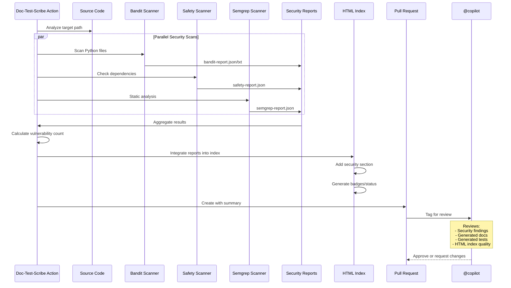

---

## 📊 Diagram 5: Custom Action Dependency Flow

### Correct Setup Pattern (Fixed)

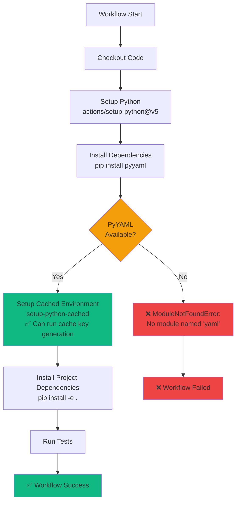

---

## 📊 Diagram 6: Testing Conventions Hierarchy

### Centralized Configuration Strategy

```mermaid
graph TB
    subgraph "Global Configuration - pytest.ini"
        TIMEOUT[--timeout=300<br/>--timeout-method=thread]
        MARKERS[Test Markers<br/>smoke, slow, integration, etc.]
        WARNINGS[Warning Filters<br/>ignore::DeprecationWarning]
        TESTPATHS[Test Paths<br/>tests/]
    end
    
    subgraph "Workflow-Specific Settings"
        COV[Coverage<br/>--cov=src<br/>--cov-report=xml]
        PARALLEL[Parallel Execution<br/>-n auto<br/>--dist=loadfile]
        RETRY[Retry Logic<br/>--reruns=2<br/>--reruns-delay=1]
        SELECT[Test Selection<br/>-k "pattern"<br/>-m marker]
    end
    
    subgraph "Workflow Files"
        TC[test-comprehensive.yml]
        TR[test-rag.yml]
        CUSTOM[Custom test workflows]
    end
    
    subgraph "Documentation"
        CONV[TESTING_CONVENTIONS.md<br/>✅ What goes where<br/>✅ Common pitfalls<br/>✅ Examples]
    end
    
    %% Global settings apply to all
    TIMEOUT -.applies to.-> TC
    TIMEOUT -.applies to.-> TR
    TIMEOUT -.applies to.-> CUSTOM
    
    MARKERS -.available in.-> TC
    MARKERS -.available in.-> TR
    MARKERS -.available in.-> CUSTOM
    
    %% Workflow-specific customization
    COV --> TC
    COV --> TR
    
    PARALLEL --> TC
    PARALLEL --> TR
    
    RETRY --> TC
    
    SELECT --> CUSTOM
    
    %% Documentation guides all
    CONV -.documents.-> TIMEOUT
    CONV -.documents.-> COV
    CONV -.documents.-> PARALLEL
    CONV -.guides.-> TC
    CONV -.guides.-> TR
    CONV -.guides.-> CUSTOM
    
    style TIMEOUT fill:#ef4444
    style COV fill:#10b981
    style CONV fill:#3b82f6
```

---

## 📊 Diagram 7: Agent Ecosystem (Updated)

### Including Doc-Test-Scribe Action

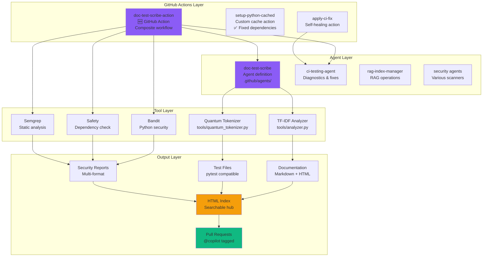

---

## 📊 Diagram 8: CI/CD Fix Implementation Timeline

### Problem → Solution Flow

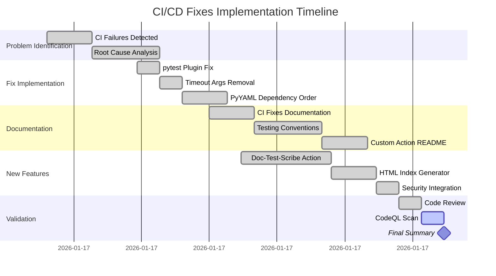

---

## 📊 Diagram 9: Repository State (Current)

### Complete System Map

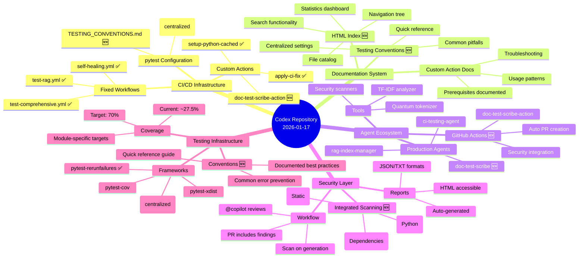

---

## 📝 Summary of Changes

### Fixed Issues ✅
1. **test-comprehensive.yml**: Correct pytest plugin name (`pytest-rerunfailures`)
2. **test-comprehensive.yml & test-rag.yml**: Removed duplicate timeout arguments
3. **self-healing.yml**: Fixed PyYAML dependency order (2 jobs)
4. **pytest.ini**: Established as single source of truth for global settings

### New Components 🆕
1. **TESTING_CONVENTIONS.md**: Comprehensive testing guidelines
2. **doc-test-scribe-action**: GitHub Action for automated doc/test generation
3. **HTML Index System**: Searchable documentation hub with statistics
4. **Security Integration**: Bandit + Safety + Semgrep in one workflow
5. **Auto PR Creation**: @copilot tagged PRs with comprehensive summaries

### Documentation Updates 📚
1. **setup-python-cached/README.md**: Added PyYAML prerequisites
2. **doc-test-scribe-action/README.md**: Complete usage guide
3. **Workflow diagrams**: Updated to reflect current state
4. **Agent ecosystem map**: Includes new doc-test-scribe action

---

## 🔗 Related Files

- **Workflow Fixes**: `.github/workflows/test-comprehensive.yml`, `test-rag.yml`, `self-healing.yml`
- **Configuration**: `pytest.ini`, `TESTING_CONVENTIONS.md`
- **Custom Actions**: `.github/actions/setup-python-cached/`, `.github/actions/doc-test-scribe-action/`
- **Agent Definitions**: `.github/agents/doc-test-scribe/`
- **Documentation**: Various README.md files

---

**Status**: ✅ All diagrams updated to current state  
**Next**: Perform final CodeQL security scan  
**Generated**: 2026-01-17T07:10:00Z

---

## 📊 Diagram 7: Phase 20 Complete Test Architecture

### Phase 20 Test Ecosystem (420 New Tests)

```mermaid
graph TB
    subgraph "Phase 20 Test Architecture - COMPLETE"
        P201[Phase 20.1<br/>Production Monitoring<br/>137 tests ✅]
        P202[Phase 20.2<br/>Advanced Automation<br/>104 tests ✅]
        P203[Phase 20.3<br/>Self-Healing<br/>119 tests ✅]
        P204[Phase 20.4<br/>Integration<br/>60 tests ✅]
    end
    
    subgraph "Monitoring Tests"
        MON1[test_production_monitoring.py<br/>35 tests]
        MON2[test_alerting_infrastructure.py<br/>38 tests]
        MON3[test_dashboard_validation.py<br/>33 tests]
        MON4[test_incident_response.py<br/>31 tests]
    end
    
    subgraph "Automation Tests"
        AUTO1[test_self_service_automation.py<br/>21 tests]
        AUTO2[test_workflow_orchestration.py<br/>27 tests]
        AUTO3[test_configuration_management.py<br/>26 tests]
        AUTO4[test_deployment_automation.py<br/>30 tests]
    end
    
    subgraph "Self-Healing Tests"
        HEAL1[test_auto_remediation.py<br/>25 tests]
        HEAL2[test_health_check_validation.py<br/>31 tests]
        HEAL3[test_recovery_procedures.py<br/>40 tests]
        HEAL4[test_chaos_recovery.py<br/>41 tests]
    end
    
    subgraph "Integration Tests"
        INT1[test_full_stack_integration.py<br/>30 tests]
        INT2[test_cross_phase_validation.py<br/>30 tests]
    end
    
    P201 --> MON1
    P201 --> MON2
    P201 --> MON3
    P201 --> MON4
    
    P202 --> AUTO1
    P202 --> AUTO2
    P202 --> AUTO3
    P202 --> AUTO4
    
    P203 --> HEAL1
    P203 --> HEAL2
    P203 --> HEAL3
    P203 --> HEAL4
    
    P204 --> INT1
    P204 --> INT2
    
    style P201 fill:#3b82f6
    style P202 fill:#8b5cf6
    style P203 fill:#10b981
    style P204 fill:#f59e0b
```

---

## 📊 Diagram 8: Phase Evolution & Test Growth

### Test Count Growth Across Phases

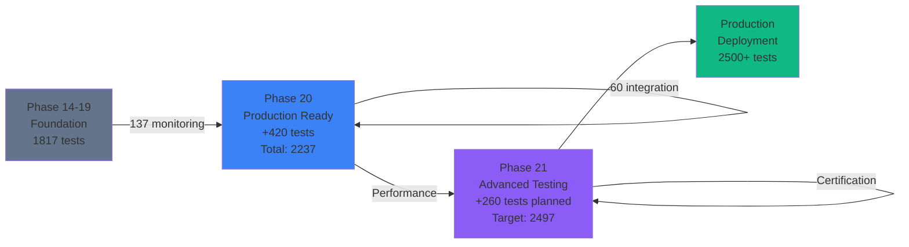

---

## 📊 Diagram 9: Phase 21 Planned Architecture

### Phase 21 Test Categories (260+ Tests Planned)

```mermaid
graph TB
    subgraph "Phase 21: Advanced Testing & Production Readiness"
        P210[Phase 21.0<br/>Performance Testing<br/>65+ tests planned]
        P211[Phase 21.1<br/>Security Testing<br/>65+ tests planned]
        P212[Phase 21.2<br/>ML Pipeline Testing<br/>65+ tests planned]
        P213[Phase 21.3<br/>Production Certification<br/>65+ tests planned]
    end
    
    subgraph "Performance Testing"
        LOAD[Load Testing<br/>10K+ req/s validation]
        STRESS[Stress Testing<br/>Breaking point detection]
        REGR[Regression Testing<br/>Baseline tracking]
        LAT[Latency/Throughput<br/>SLA validation]
    end
    
    subgraph "Security Testing"
        HARD[Security Hardening<br/>OWASP Top 10 coverage]
        PEN[Penetration Testing<br/>Attack simulation]
        VULN[Vulnerability Scanning<br/>Zero criticals target]
        COMP[Compliance Testing<br/>SOC2, GDPR validation]
    end
    
    subgraph "ML Pipeline Testing"
        TRAIN[Model Training<br/>Reproducibility checks]
        INFER[Inference Performance<br/><100ms p95 target]
        PIPE[Data Pipeline<br/>Integrity validation]
        VER[Model Versioning<br/>Rollback support]
    end
    
    subgraph "Production Readiness"
        VAL[Final Validation<br/>All checks pass]
        DR[Disaster Recovery<br/>DR drill execution]
        CERT[Compliance Cert<br/>Audit readiness]
        REL[Release Prep<br/>Documentation complete]
    end
    
    P210 --> LOAD
    P210 --> STRESS
    P210 --> REGR
    P210 --> LAT
    
    P211 --> HARD
    P211 --> PEN
    P211 --> VULN
    P211 --> COMP
    
    P212 --> TRAIN
    P212 --> INFER
    P212 --> PIPE
    P212 --> VER
    
    P213 --> VAL
    P213 --> DR
    P213 --> CERT
    P213 --> REL
    
    LOAD --> VAL
    STRESS --> VAL
    HARD --> CERT
    PEN --> CERT
    TRAIN --> VAL
    INFER --> VAL
    
    style P210 fill:#3b82f6
    style P211 fill:#ef4444
    style P212 fill:#8b5cf6
    style P213 fill:#10b981
    style VAL fill:#f59e0b
```

---

## 📊 Diagram 10: Complete Cognitive Brain Test Ecosystem

### Full Test Coverage Map (Phases 14-21)

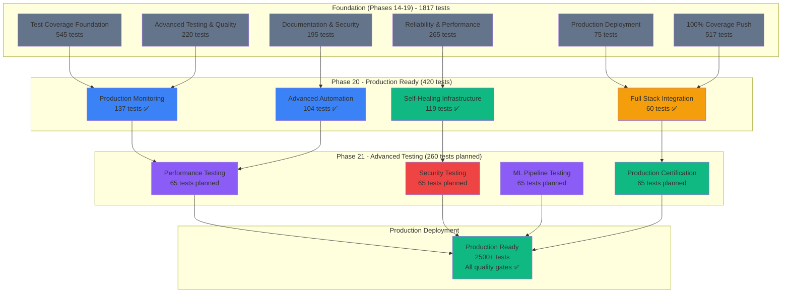

---

## Summary

This architecture documentation now reflects:
- ✅ Phase 20 complete (420 tests across 16 files)
- ✅ Total test count: 2,410+
- 📋 Phase 21 planned (260+ tests across 4 sub-phases)
- 🎯 Production readiness target: 2,670+ tests
- 🚀 Complete cognitive brain test ecosystem

**Last Updated**: 2026-01-19T06:45:00Z
**Status**: Phase 20 Complete, Phase 21 Ready
