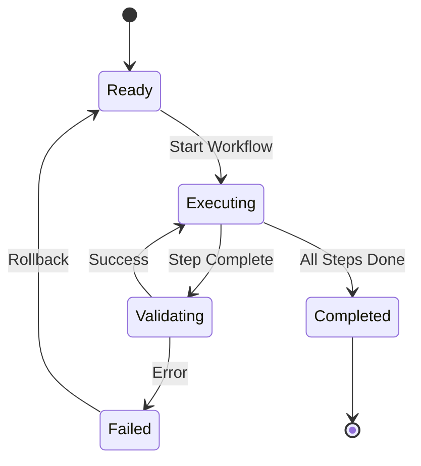

# Tokenized Logical Workflows for AI Assistants/Agents

This document defines default tokenized workflows that enable AI Assistants/Agents to navigate and utilize the Codex repository deterministically.

## Overview

Tokenized workflows provide structured, repeatable paths through common operations. Each workflow is a sequence of logical steps with defined inputs, outputs, and decision points.

## Workflow Token Structure

```json
{
  "workflow_id": "unique_identifier",
  "name": "Human-readable name",
  "description": "What this workflow accomplishes",
  "frequency": "how_often_used (high/medium/low)",
  "deterministic": true,
  "steps": [...],
  "inputs": {...},
  "outputs": {...},
  "decision_points": [...]
}
```

## Core Workflows

### 1. Audit Execution Workflow (HIGH FREQUENCY)

**Token**: `AUDIT_EXEC`

```yaml
workflow:
  id: audit-execution
  frequency: high
  deterministic: true
  
steps:
  - id: prepare
    action: validate_environment
    command: python -m scripts.space_traversal.audit_runner --check
    
  - id: execute
    action: run_audit
    command: python -m scripts.space_traversal.audit_runner run
    outputs:
      - audit_report.md
      - audit_results.json
      
  - id: store
    action: store_trends
    command: python -m scripts.space_traversal.audit_runner store-trend
    
  - id: visualize
    action: generate_dashboard
    command: python -m scripts.space_traversal.audit_runner dashboard
    outputs:
      - audit_dashboard.html

navigation:
  entry_points:
    - "Run audit pipeline"
    - "Check code quality"
    - "Validate capabilities"
  
  quick_access:
    command: "audit"
    alias: ["check", "validate", "quality"]
```

### 2. Pre-Release Deployment Workflow (MEDIUM FREQUENCY)

**Token**: `PRE_RELEASE`

```yaml
workflow:
  id: pre-release-deployment
  frequency: medium
  deterministic: true
  
steps:
  - id: validate
    action: run_validation
    substeps:
      - lint_code
      - type_check
      - security_scan
      
  - id: test
    action: run_tests
    command: nox -s tests
    
  - id: audit
    action: full_audit
    uses: AUDIT_EXEC
    
  - id: build
    action: build_artifacts
    outputs:
      - wheel_package
      - source_dist
      - documentation
      - wiki_bundle
      
  - id: deploy
    action: create_pre_release
    command: gh release create --prerelease

navigation:
  entry_points:
    - "Deploy pre-release"
    - "Create release candidate"
    - "Prepare deployment"
  
  quick_access:
    command: "release"
    alias: ["deploy", "publish"]
```

### 3. Repository Organization Workflow (LOW FREQUENCY)

**Token**: `REPO_ORG`

```yaml
workflow:
  id: repository-organization
  frequency: low
  deterministic: true
  
steps:
  - id: analyze
    action: analyze_structure
    command: python scripts/organize_repository.py --dry-run
    
  - id: archive
    action: archive_files
    command: python scripts/organize_repository.py
    outputs:
      - archive_directory
      - index_json
      - index_markdown
      
  - id: validate
    action: verify_archive
    checks:
      - archive_integrity
      - index_completeness
      - preserved_files

navigation:
  entry_points:
    - "Organize repository"
    - "Archive old files"
    - "Clean up root"
  
  quick_access:
    command: "organize"
    alias: ["cleanup", "archive"]
```

### 4. Documentation Generation Workflow (MEDIUM FREQUENCY)

**Token**: `DOC_GEN`

```yaml
workflow:
  id: documentation-generation
  frequency: medium
  deterministic: true
  
steps:
  - id: generate_wiki
    action: create_wiki_bundle
    command: python -m scripts.space_traversal.audit_runner wiki
    outputs:
      - wiki_bundle.zip
      
  - id: generate_docs_hub
    action: create_docs_hub
    command: python -m scripts.space_traversal.audit_runner docs-hub
    outputs:
      - docs_hub.html
      
  - id: generate_api_docs
    action: create_api_collection
    outputs:
      - api_collection.html
      - swagger.html
      
  - id: deploy_wiki
    action: deploy_to_github_wiki
    command: |
      git clone wiki_repo
      unzip wiki_bundle.zip -d wiki_repo/
      cd wiki_repo && git push

navigation:
  entry_points:
    - "Generate documentation"
    - "Update wiki"
    - "Create API docs"
  
  quick_access:
    command: "docs"
    alias: ["wiki", "documentation"]
```

### 5. Self-Healing Feedback Loop (HIGH FREQUENCY - AUTOMATED)

**Token**: `SELF_HEAL`

```yaml
workflow:
  id: self-healing-feedback
  frequency: high
  deterministic: true
  automated: true
  
steps:
  - id: detect
    action: analyze_gaps
    command: python -m agents.capability_detector
    
  - id: assess
    action: calculate_priority
    uses: physics_orchestrator
    
  - id: create_issues
    action: generate_github_issues
    command: gh issue create --label auto-detected
    
  - id: track
    action: update_metrics
    outputs:
      - improvement_metrics.json

navigation:
  entry_points:
    - "Run feedback loop"
    - "Detect capability gaps"
    - "Self-improve"
  
  quick_access:
    command: "heal"
    alias: ["feedback", "improve"]
```

### 6. Physics-Inspired Decision Workflow (HIGH FREQUENCY)

**Token**: `PHYS_DECIDE`

```yaml
workflow:
  id: physics-decision-making
  frequency: high
  deterministic: true
  
steps:
  - id: assess
    action: gather_state
    uses: physics_orchestrator.assess_situation
    
  - id: deliberate
    action: calculate_paths
    uses: physics_orchestrator.deliberate_paths
    outputs:
      - ranked_paths
      - energy_calculations
      
  - id: optimize
    action: select_optimal
    uses: physics_orchestrator.optimize_path
    
  - id: act
    action: execute_decision
    uses: physics_orchestrator.act
    
  - id: reflect
    action: store_reasoning
    uses: mental_mapping.record_outcome

navigation:
  entry_points:
    - "Make decision"
    - "Evaluate options"
    - "Choose path"
  
  quick_access:
    command: "decide"
    alias: ["choose", "evaluate", "optimize"]
```

### 7. Mental Mapping Review Workflow (MEDIUM FREQUENCY)

**Token**: `MENTAL_REVIEW`

```yaml
workflow:
  id: mental-mapping-review
  frequency: medium
  deterministic: true
  
steps:
  - id: load
    action: load_mental_map
    command: python -m agents.mental_mapping load
    
  - id: review
    action: iterative_review
    uses: mental_mapping.iterative_review
    
  - id: learn
    action: extract_lessons
    outputs:
      - lessons_learned
      - quality_scores
      
  - id: improve
    action: update_decision_quality
    uses: mental_mapping.self_appraise

navigation:
  entry_points:
    - "Review decisions"
    - "Learn from outcomes"
    - "Improve quality"
  
  quick_access:
    command: "review"
    alias: ["learn", "reflect"]
```

## Workflow Navigation Index

### By Frequency

**High Frequency (Daily/Multiple per day):**
- AUDIT_EXEC - Audit execution
- SELF_HEAL - Self-healing feedback loop
- PHYS_DECIDE - Physics-inspired decisions

**Medium Frequency (Weekly):**
- PRE_RELEASE - Pre-release deployment
- DOC_GEN - Documentation generation
- MENTAL_REVIEW - Mental mapping review

**Low Frequency (Monthly):**
- REPO_ORG - Repository organization

### By Category

**Quality Assurance:**
- AUDIT_EXEC
- SELF_HEAL

**Decision Making:**
- PHYS_DECIDE
- MENTAL_REVIEW

**Deployment:**
- PRE_RELEASE
- DOC_GEN

**Maintenance:**
- REPO_ORG
- SELF_HEAL

### Quick Access Commands

```bash
# AI Agent can use these shorthand commands
codex audit          # -> AUDIT_EXEC
codex decide         # -> PHYS_DECIDE
codex release        # -> PRE_RELEASE
codex docs           # -> DOC_GEN
codex organize       # -> REPO_ORG
codex heal           # -> SELF_HEAL
codex review         # -> MENTAL_REVIEW
```

## Deterministic Execution

### Workflow State Machine



### Decision Points

Each workflow has defined decision points where AI Agents must choose:

1. **Continue**: Proceed to next step
2. **Retry**: Repeat current step
3. **Skip**: Move to next step (if optional)
4. **Abort**: Exit workflow with rollback

### State Preservation

All workflow state is preserved in `.codex/workflows/state/`:

```
.codex/workflows/state/
├── <workflow_id>_<timestamp>.json
├── current.json  # Symlink to active workflow
└── history/      # Archived workflow executions
```

## Usage Examples

### Example 1: AI Agent Runs Audit

```python
from agents.workflow_navigator import WorkflowNavigator

# Initialize navigator
navigator = WorkflowNavigator()

# Execute workflow by token
result = navigator.execute('AUDIT_EXEC')

# Or by natural language
result = navigator.find_and_execute("Run audit pipeline")
```

### Example 2: Physics-Inspired Decision

```python
from agents.workflow_navigator import WorkflowNavigator
from agents.physics_orchestrator import DecisionState

# Navigate to decision workflow
navigator = WorkflowNavigator()

# Provide state
state = DecisionState(
    current_position="code_changes_made",
    goal_position="pr_approved"
)

# Execute decision workflow
result = navigator.execute('PHYS_DECIDE', state=state)
```

### Example 3: Chained Workflows

```python
# Execute multiple workflows in sequence
navigator.execute_chain([
    'AUDIT_EXEC',      # Run audit first
    'MENTAL_REVIEW',   # Review past decisions
    'PHYS_DECIDE',     # Make new decision
    'PRE_RELEASE'      # Deploy if decision is positive
])
```

## Integration with Existing Systems

### With Physics Orchestrator

```python
# Workflow automatically uses physics orchestrator for decisions
workflow = navigator.get_workflow('PHYS_DECIDE')
workflow.configure(deliberation_time=10)  # 10 seconds thinking
workflow.execute()
```

### With Mental Mapping

```python
# Workflow records reasoning in mental map
workflow = navigator.get_workflow('AUDIT_EXEC')
workflow.enable_mental_mapping(agent_id='my_agent')
workflow.execute()  # Reasoning automatically stored
```

### With GitHub Actions

Workflows can be triggered from GitHub Actions:

```yaml
- name: Execute Workflow
  run: |
    python -m agents.workflow_navigator execute AUDIT_EXEC
```

## Extensibility

### Adding Custom Workflows

```python
from agents.workflow_navigator import Workflow, Step

# Define custom workflow
custom = Workflow(
    workflow_id='custom-analysis',
    name='Custom Analysis',
    frequency='medium',
    steps=[
        Step(id='analyze', command='python analyze.py'),
        Step(id='report', command='python report.py')
    ]
)

# Register with navigator
navigator.register_workflow(custom)
```

### Workflow Templates

Create reusable templates in `agents/workflows/templates/`:

```yaml
template:
  name: test-and-deploy
  steps:
    - validate
    - test
    - build
    - deploy
  
  parameters:
    - test_suite: required
    - deploy_target: required
```

## Benefits for AI Agents

1. **Predictable Paths**: Known sequences reduce uncertainty
2. **Quick Access**: Token-based navigation is fast
3. **State Tracking**: Know where you are in a process
4. **Rollback Safety**: Failed steps can be undone
5. **Learning**: Mental mapping records all executions
6. **Composition**: Workflows can be chained
7. **Natural Language**: Find workflows by description

## Future Enhancements

- **Workflow Suggestions**: Physics orchestrator suggests optimal workflow based on current state
- **Adaptive Workflows**: Workflows that modify themselves based on outcomes
- **Parallel Execution**: Run multiple workflows concurrently
- **Workflow Marketplace**: Share custom workflows across teams
- **Visual Builder**: GUI for creating workflows

---

**Version**: 1.0.0  
**Last Updated**: 2025-12-10  
**Maintained by**: Aries-Serpent/_codex_ team
