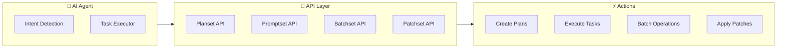

# API Model - Plansets, Promptsets, Batchsets, and Patchsets

This document defines the API model for fluid pipelines that enable AI Agents to interact with the Codex repository through structured sets.

## Table of Contents
1. [Overview](#overview)
2. [Plansets](#plansets)
3. [Promptsets](#promptsets)
4. [Batchsets](#batchsets)
5. [Patchsets](#patchsets)
6. [GitHub API Integration](#github-api-integration)
7. [Usage Examples](#usage-examples)

---

## Overview

The API model provides structured interfaces for AI Agents to:
- **Plan** work with Plansets
- **Execute** tasks with Promptsets
- **Batch** operations with Batchsets
- **Apply** changes with Patchsets

### Architecture



---

## Plansets

### Definition
A **Planset** is a structured work plan that defines objectives, tasks, dependencies, and success criteria.

### Schema

```json
{
  "planset_version": "1.0.0",
  "id": "plan-Previous Cycle-12-10-001",
  "name": "Repository Organization Phase 1",
  "description": "Clean up root directory and archive old files",
  "created_at": "2025-12-10T18:00:00Z",
  "status": "active",
  "priority": "high",
  "objectives": [
    {
      "id": "obj-1",
      "description": "Archive old status reports",
      "success_criteria": "All *STATUS*.md files moved to archive/",
      "priority": "high"
    }
  ],
  "tasks": [
    {
      "id": "task-1",
      "objective_id": "obj-1",
      "description": "Create archive directory structure",
      "command": "mkdir -p archive/status_reports_$(date +%Y%m%d)",
      "dependencies": [],
      "estimated_duration": "5s",
      "status": "pending"
    },
    {
      "id": "task-2",
      "objective_id": "obj-1",
      "description": "Move status files to archive",
      "command": "find . -maxdepth 1 -name '*STATUS*.md' -exec mv {} archive/status_reports_$(date +%Y%m%d)/ \\;",
      "dependencies": ["task-1"],
      "estimated_duration": "10s",
      "status": "pending"
    }
  ],
  "validation": {
    "checks": [
      {
        "type": "file_count",
        "description": "Verify files archived",
        "command": "ls -1 archive/status_reports_*/  | wc -l",
        "expected_min": 1
      }
    ]
  },
  "rollback": {
    "enabled": true,
    "steps": [
      "cp archive/status_reports_*/* ./"
    ]
  }
}
```

### API Endpoints

```python
from agents.api.plansets import PlansetAPI

# Create a new planset
planset = PlansetAPI.create(
    name="Repository Organization Phase 1",
    objectives=[...],
    tasks=[...]
)

# Load existing planset
planset = PlansetAPI.load("plan-Previous Cycle-12-10-001")

# Execute planset
results = planset.execute()

# Check status
status = planset.get_status()

# Rollback if needed
planset.rollback()
```

### CLI Usage

```bash
# Create planset from JSON
codex planset create --file plan.json

# Execute planset
codex planset execute plan-Previous Cycle-12-10-001

# Show status
codex planset status plan-Previous Cycle-12-10-001

# List all plansets
codex planset list --status active
```

---

## Promptsets

### Definition
A **Promptset** is a collection of AI Agent prompts organized by category, with metadata for discovery and execution.

### Schema

```json
{
  "promptset_version": "1.0.0",
  "id": "promptset-audit-v1",
  "name": "Audit Operations Promptset",
  "description": "Comprehensive prompts for audit pipeline operations",
  "created_at": "2025-12-10T18:00:00Z",
  "category": "audit",
  "prompts": [
    {
      "id": "prompt-full-audit",
      "name": "Run Full Audit",
      "description": "Execute comprehensive audit of all capabilities",
      "file": "agents/prompts/audit/run-full-audit.md",
      "tags": ["audit", "full-scan", "comprehensive"],
      "prerequisites": ["python", "sqlite", "dependencies-installed"],
      "estimated_time": "5m",
      "complexity": "medium",
      "commands": [
        "python -m scripts.space_traversal.audit_runner run",
        "python -m scripts.space_traversal.audit_runner store-trend"
      ],
      "expected_outputs": [
        "audit_report.md",
        "audit_results.json",
        "audit_dashboard.html"
      ]
    },
    {
      "id": "prompt-check-regressions",
      "name": "Check for Regressions",
      "description": "Detect capability score regressions",
      "file": "agents/prompts/audit/check-regressions.md",
      "tags": ["audit", "regression", "validation"],
      "prerequisites": ["audit-completed", "historical-data"],
      "estimated_time": "2m",
      "complexity": "low",
      "commands": [
        "python -m scripts.space_traversal.audit_runner check-regressions"
      ]
    }
  ],
  "workflows": [
    {
      "id": "workflow-full-audit-cycle",
      "name": "Full Audit Cycle",
      "description": "Complete audit with trend storage and regression check",
      "prompts": ["prompt-full-audit", "prompt-check-regressions"],
      "sequential": true
    }
  ]
}
```

### API Endpoints

```python
from agents.api.promptsets import PromptsetAPI

# Load promptset
promptset = PromptsetAPI.load("promptset-audit-v1")

# Search prompts
prompts = promptset.search(tags=["audit", "full-scan"])

# Get prompt details
prompt = promptset.get_prompt("prompt-full-audit")

# Execute prompt
result = prompt.execute()

# Execute workflow
workflow_result = promptset.execute_workflow("workflow-full-audit-cycle")
```

### CLI Usage

```bash
# List available promptsets
codex promptset list

# Show promptset details
codex promptset show promptset-audit-v1

# Search prompts
codex promptset search --tag audit --tag regression

# Execute prompt
codex promptset execute prompt-full-audit

# Execute workflow
codex promptset workflow workflow-full-audit-cycle
```

---

## Batchsets

### Definition
A **Batchset** groups multiple operations for efficient batch execution with transaction support.

### Schema

```json
{
  "batchset_version": "1.0.0",
  "id": "batch-Previous Cycle-12-10-001",
  "name": "Pre-Release Preparation Batch",
  "description": "Batch all pre-release preparation tasks",
  "created_at": "2025-12-10T18:00:00Z",
  "transaction_mode": "atomic",
  "parallel": false,
  "operations": [
    {
      "id": "op-1",
      "type": "command",
      "description": "Run full test suite",
      "command": "nox -s tests",
      "timeout": 600,
      "retry": {
        "enabled": true,
        "max_attempts": 3,
        "backoff": "exponential"
      }
    },
    {
      "id": "op-2",
      "type": "command",
      "description": "Run security checks",
      "command": "nox -s security",
      "timeout": 300,
      "depends_on": ["op-1"]
    },
    {
      "id": "op-3",
      "type": "audit",
      "description": "Run full audit",
      "command": "python -m scripts.space_traversal.audit_runner run",
      "timeout": 300,
      "depends_on": ["op-1", "op-2"]
    },
    {
      "id": "op-4",
      "type": "artifact",
      "description": "Generate release artifacts",
      "commands": [
        "python -m build --sdist --wheel --outdir release_artifacts/",
        "python -m scripts.space_traversal.audit_runner dashboard --output release_artifacts/dashboard.html"
      ],
      "timeout": 120,
      "depends_on": ["op-3"]
    }
  ],
  "validation": {
    "enabled": true,
    "checks": [
      {
        "type": "exit_code",
        "description": "All operations succeeded",
        "expected": 0
      },
      {
        "type": "file_exists",
        "files": [
          "release_artifacts/*.whl",
          "release_artifacts/dashboard.html"
        ]
      }
    ]
  },
  "on_failure": "rollback",
  "notification": {
    "enabled": true,
    "channels": ["webhook", "log"]
  }
}
```

### API Endpoints

```python
from agents.api.batchsets import BatchsetAPI

# Create batchset
batchset = BatchsetAPI.create(
    name="Pre-Release Preparation Batch",
    operations=[...],
    transaction_mode="atomic"
)

# Execute batchset
result = batchset.execute(parallel=False)

# Monitor progress
for op in batchset.operations:
    print(f"{op.id}: {op.status} ({op.progress}%)")

# Get results
results = batchset.get_results()

# Rollback if needed
if not results.success:
    batchset.rollback()
```

### CLI Usage

```bash
# Create batchset
codex batchset create --file batch.json

# Execute batchset
codex batchset execute batch-Previous Cycle-12-10-001

# Monitor execution
codex batchset status batch-Previous Cycle-12-10-001 --watch

# View results
codex batchset results batch-Previous Cycle-12-10-001

# Rollback
codex batchset rollback batch-Previous Cycle-12-10-001
```

---

## Patchsets

### Definition
A **Patchset** is a collection of code changes (patches) with metadata, validation, and rollback support.

### Schema

```json
{
  "patchset_version": "1.0.0",
  "id": "patch-Previous Cycle-12-10-001",
  "name": "Fix Unused Format Arguments",
  "description": "Remove unused timestamp and version arguments in visualization modules",
  "created_at": "2025-12-10T18:00:00Z",
  "author": "copilot-agent",
  "issue_refs": ["#2459"],
  "patches": [
    {
      "id": "patch-1",
      "file": "scripts/space_traversal/viz_api_collection.py",
      "line_range": [1772, 1776],
      "operation": "replace",
      "old_content": "html = API_COLLECTION_TEMPLATE.format(\n    repo_name=repo_name,\n    version=version,\n    timestamp=datetime.now().strftime(\"%Y-%m-%d %H:%M\"),\n)",
      "new_content": "html = API_COLLECTION_TEMPLATE.format(\n    repo_name=repo_name,\n    version=version,\n)",
      "diff": "@@ -1772,7 +1772,6 @@\n html = API_COLLECTION_TEMPLATE.format(\n     repo_name=repo_name,\n     version=version,\n-    timestamp=datetime.now().strftime(\"%Y-%m-%d %H:%M\"),\n )"
    },
    {
      "id": "patch-2",
      "file": "scripts/space_traversal/viz_cli_builder.py",
      "line_range": [977, 981],
      "operation": "replace",
      "old_content": "html = CLI_BUILDER_TEMPLATE.format(\n    repo_name=repo_name,\n    version=version,\n    timestamp=datetime.now().strftime(\"%Y-%m-%d %H:%M\"),\n)",
      "new_content": "html = CLI_BUILDER_TEMPLATE.format(\n    repo_name=repo_name,\n)"
    }
  ],
  "validation": {
    "pre_apply": [
      {
        "type": "syntax_check",
        "command": "python -m py_compile {file}",
        "files": ["all"]
      },
      {
        "type": "lint",
        "command": "ruff check {file}",
        "files": ["all"]
      }
    ],
    "post_apply": [
      {
        "type": "test",
        "command": "pytest tests/space_traversal/test_viz_cli_api.py -v",
        "required": true
      },
      {
        "type": "integration",
        "command": "nox -s tests -- -k viz",
        "required": false
      }
    ]
  },
  "rollback": {
    "enabled": true,
    "method": "git_checkout",
    "commit_before": "5701d7f"
  }
}
```

### API Endpoints

```python
from agents.api.patchsets import PatchsetAPI

# Create patchset
patchset = PatchsetAPI.create(
    name="Fix Unused Format Arguments",
    patches=[...],
    validation={...}
)

# Preview changes
preview = patchset.preview()
print(preview.diff)

# Validate before applying
validation = patchset.validate_pre()
if not validation.passed:
    print("Validation failed:", validation.errors)
    exit(1)

# Apply patches
result = patchset.apply()

# Validate after applying
validation = patchset.validate_post()

# Commit if successful
if result.success and validation.passed:
    patchset.commit(message="fix: Remove unused format arguments")
else:
    patchset.rollback()
```

### CLI Usage

```bash
# Create patchset from diff
codex patchset create --from-diff changes.diff --name "Fix format args"

# Preview patchset
codex patchset preview patch-Previous Cycle-12-10-001

# Validate before applying
codex patchset validate patch-Previous Cycle-12-10-001

# Apply patchset
codex patchset apply patch-Previous Cycle-12-10-001

# Commit changes
codex patchset commit patch-Previous Cycle-12-10-001 -m "fix: Remove unused format arguments"

# Rollback if needed
codex patchset rollback patch-Previous Cycle-12-10-001
```

---

## GitHub API Integration

### Native GitHub API Extensions

```python
from agents.api.github_integration import CodexGitHubAPI

# Initialize with token
gh = CodexGitHubAPI(token=os.getenv('GITHUB_TOKEN'))

# Create planset from issue
issue = gh.issues.get(repo='Aries-Serpent/_codex_', number=2459)
planset = gh.plansets.from_issue(issue)

# Create patchset from PR
pr = gh.pull_requests.get(repo='Aries-Serpent/_codex_', number=2459)
patchset = gh.patchsets.from_pull_request(pr)

# Execute promptset and create PR
promptset = PromptsetAPI.load('promptset-audit-v1')
results = promptset.execute()
pr = gh.pull_requests.create_from_results(
    repo='Aries-Serpent/_codex_',
    results=results,
    title='Automated Audit Results',
    branch='audit/automated-results'
)

# Query archived data
archives = gh.archives.query(
    repo='Aries-Serpent/_codex_',
    pattern='*STATUS*.md',
    date_range=('Previous Cycle-01-01', 'Previous Cycle-12-10')
)
```

### Webhook Integration

```python
from agents.api.webhooks import WebhookHandler

# Register webhook handler
@WebhookHandler.on('planset.completed')
def handle_planset_completed(event):
    """Handle planset completion event"""
    planset = event.planset
    if planset.status == 'success':
        # Notify success
        send_notification(f"Planset {planset.name} completed successfully")
    else:
        # Create issue for failures
        gh.issues.create(
            repo='Aries-Serpent/_codex_',
            title=f"Planset Failure: {planset.name}",
            body=planset.get_error_report()
        )

# Register for patchset events
@WebhookHandler.on('patchset.applied')
def handle_patchset_applied(event):
    """Handle patchset application"""
    patchset = event.patchset
    # Run validation
    validation = patchset.validate_post()
    if not validation.passed:
        patchset.rollback()
        gh.comments.create(
            issue=patchset.issue_refs[0],
            body=f"Patchset validation failed: {validation.errors}"
        )
```

---

## Usage Examples

### Example 1: Complete Audit Workflow

```python
from agents.api import PlansetAPI, PromptsetAPI, BatchsetAPI

# 1. Create plan
planset = PlansetAPI.create(
    name="Monthly Audit Cycle",
    objectives=[{"description": "Complete monthly audit and reporting"}],
    tasks=[...]
)

# 2. Load prompts
promptset = PromptsetAPI.load("promptset-audit-v1")

# 3. Create batch
batchset = BatchsetAPI.create(
    name="Audit Execution Batch",
    operations=[
        {"command": "python -m scripts.space_traversal.audit_runner run"},
        {"command": "python -m scripts.space_traversal.audit_runner store-trend"},
        {"command": "python -m scripts.space_traversal.audit_runner check-regressions"}
    ]
)

# 4. Execute
planset.start()
results = batchset.execute()
planset.complete(results)

# 5. Generate report
report = results.generate_report()
report.save("audit_cycle_report.md")
```

### Example 2: Repository Cleanup

```bash
# Use CLI for quick operations
codex planset create --template repository-cleanup
codex planset execute plan-cleanup-root --confirm
codex planset status plan-cleanup-root
```

### Example 3: Pre-Release Deployment

```python
from agents.api import PlansetAPI, BatchsetAPI, PatchsetAPI

# Load deployment plan
deployment = PlansetAPI.load("plan-pre-release-v1.5.5")

# Create pre-release batch
batch = BatchsetAPI.create(
    name="Pre-Release v1.5.5",
    operations=deployment.get_operations()
)

# Execute with monitoring
results = batch.execute(monitor=True, callback=log_progress)

# If successful, create patchset for version bump
if results.success:
    version_patch = PatchsetAPI.create_version_bump("1.5.5")
    version_patch.apply()
    version_patch.commit("chore: Bump version to 1.5.5")
```

---

## API Reference

### Base Classes

```python
class Planset:
    """Base class for plansets"""
    def create(cls, name, objectives, tasks): ...
    def load(cls, id): ...
    def execute(self): ...
    def get_status(self): ...
    def rollback(self): ...

class Promptset:
    """Base class for promptsets"""
    def load(cls, id): ...
    def search(self, tags): ...
    def get_prompt(self, id): ...
    def execute_workflow(self, workflow_id): ...

class Batchset:
    """Base class for batchsets"""
    def create(cls, name, operations): ...
    def execute(self, parallel): ...
    def get_results(self): ...
    def rollback(self): ...

class Patchset:
    """Base class for patchsets"""
    def create(cls, name, patches): ...
    def preview(self): ...
    def validate_pre(self): ...
    def apply(self): ...
    def validate_post(self): ...
    def commit(self, message): ...
    def rollback(self): ...
```

---

## Future Enhancements

- **Pipelineset**: Combine multiple sets into pipelines
- **Checkpointset**: Save/restore execution state
- **Templateset**: Reusable templates for common patterns
- **Metricset**: Track and analyze execution metrics
- **Alertset**: Configure alerting rules and notifications

---

**Version**: 1.0.0  
**Last Updated**: 2025-12-10  
**Maintained by**: Aries-Serpent/_codex_ team
