# Codex Architecture and Future Roadmap

This document provides comprehensive architecture diagrams for the current Codex system and future enhancements for AI Agent integration.

## Table of Contents
1. [Current Architecture](#current-architecture)
2. [Audit Pipeline Architecture](#audit-pipeline-architecture)
3. [AI Agent Integration](#ai-agent-integration)
4. [Future Enhancements](#future-enhancements)
5. [Deployment Architecture](#deployment-architecture)
6. [Data Flow](#data-flow)

---

## Current Architecture

### System Overview

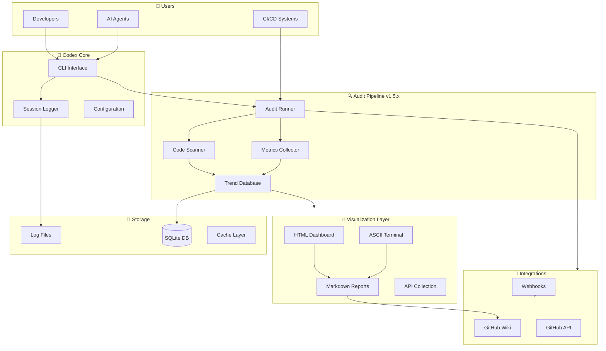

### Component Breakdown

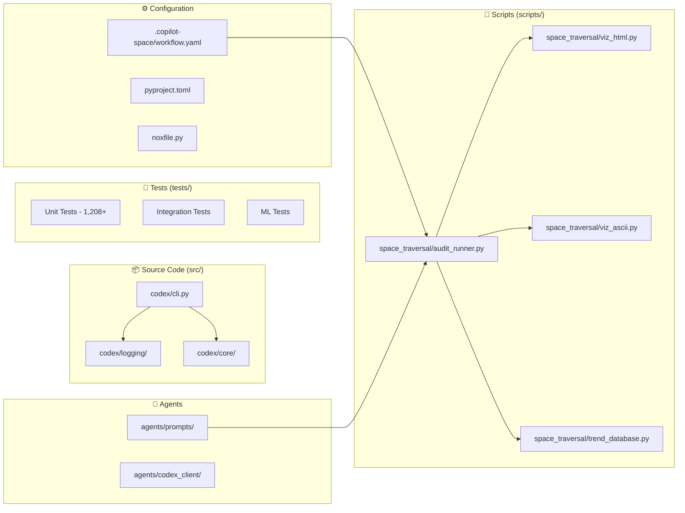

---

## Audit Pipeline Architecture

### v1.5.x Architecture

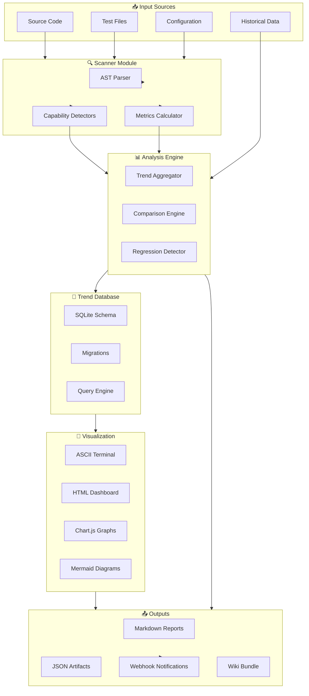

### Database Schema

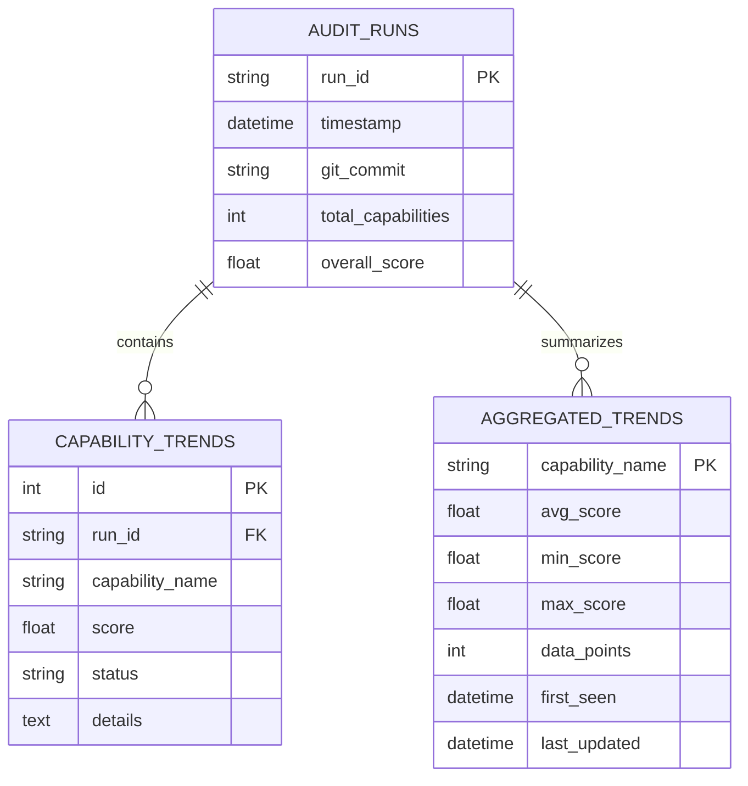

---

## AI Agent Integration

### Agent Interaction Flow

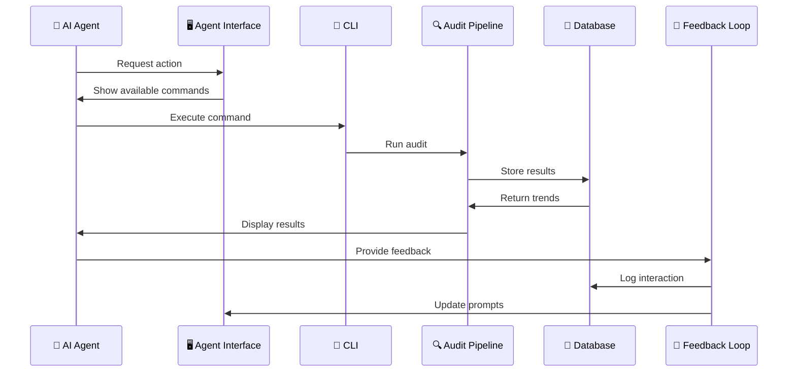

### Agent Prompt Architecture

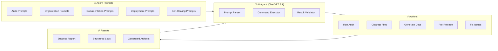

---

## Future Enhancements

### Phase 1: Enhanced AI Integration (Phase 1 (Current Cycle))

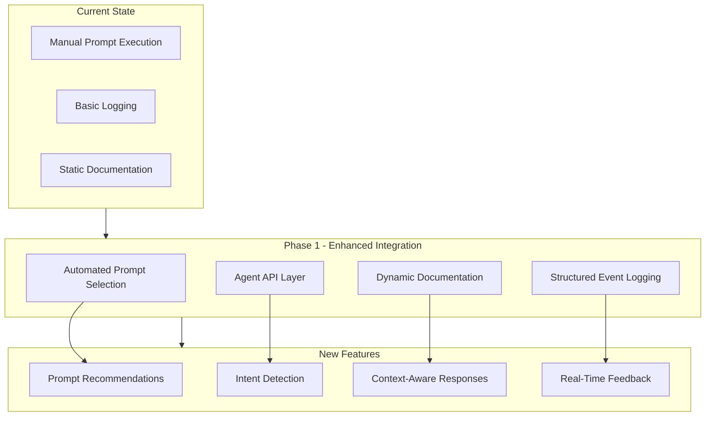

### Phase 2: Self-Healing System (Phase 2 (Current Cycle))

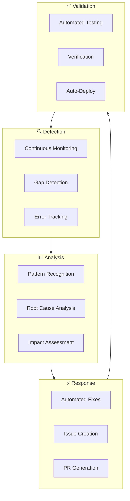

### Phase 3: Advanced Capabilities (Cycle 3-Phase 4 (2026))

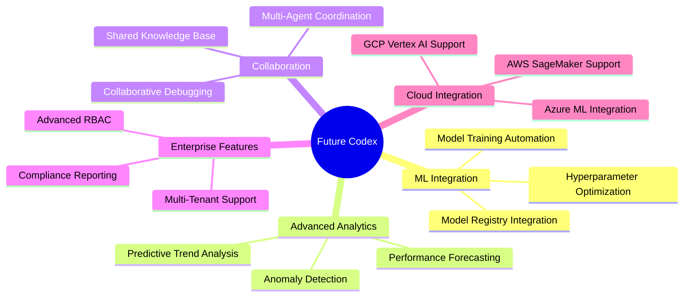

---

## Deployment Architecture

### Local Development

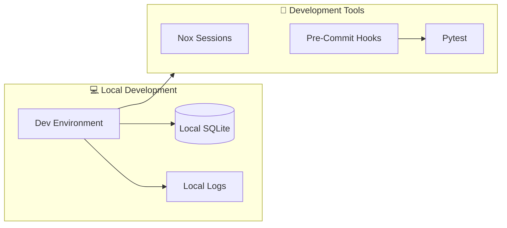

### CI/CD Pipeline

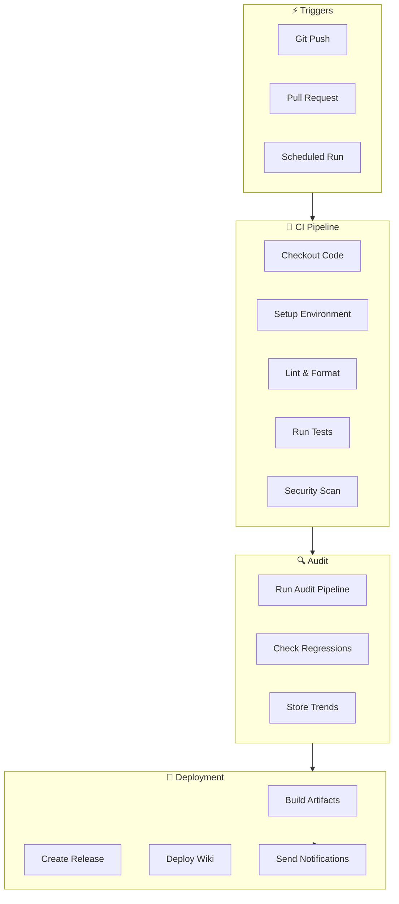

### Production Deployment

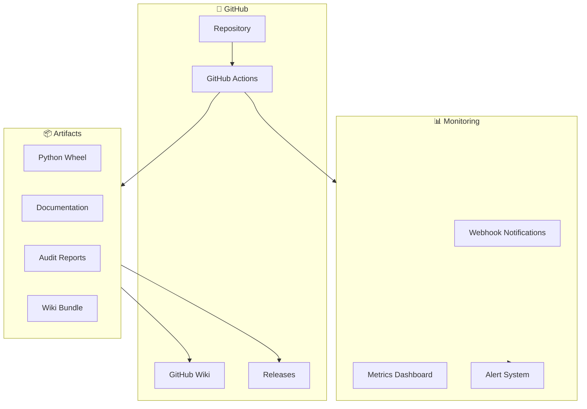

---

## Data Flow

### Audit Data Flow

```mermaid
flowchart LR
    subgraph Sources["📥 Data Sources"]
        S1[Source Code]
        S2[Test Files]
        S3[Configuration]
        S4[Git History]
    end
    
    subgraph Processing["⚙️ Processing"]
        P1[Parse & Scan]
        P2[Calculate Metrics]
        P3[Aggregate Trends]
        P4[Detect Regressions]
    end
    
    subgraph Storage["💾 Storage"]
        DB[(SQLite DB)]
        Cache[(Cache)]
        Files[File System]
    end
    
    subgraph Presentation["🎨 Presentation"]
        HTML[HTML Dashboard]
        MD[Markdown Reports]
        JSON[JSON Artifacts]
    end
    
    Sources --> Processing
    Processing --> Storage
    Storage --> Presentation
```

### Agent Feedback Loop

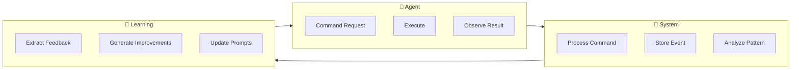

---

## Implementation Roadmap

### Near Term (Phase 1 (Current Cycle))
- ✅ Audit Pipeline v1.5.x (Complete)
- ✅ Agent Prompt Library (Complete)
- 🔄 Enhanced Visualization (In Progress)
- 📋 Self-Healing Framework (Planned)

### Medium Term (Cycle 2-Phase 3 (Current Cycle))
- 📋 Advanced Analytics
- 📋 Multi-Agent Coordination
- 📋 Predictive Trend Analysis
- 📋 Enterprise Features

### Long Term (Phase 4 (2026)+)
- 📋 Cloud Platform Integration
- 📋 Advanced ML Capabilities
- 📋 Multi-Tenant Architecture
- 📋 Compliance Automation

---

## Technology Stack

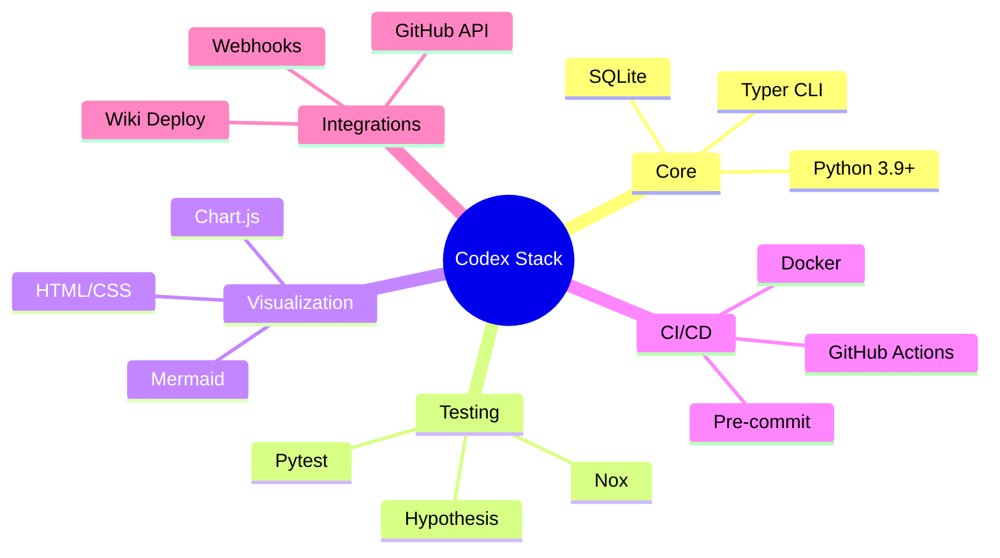

---

## Metrics and KPIs

```mermaid
graph TB
    subgraph Capability["📊 Capability Metrics"]
        Cap1[Total Capabilities: 39]
        Cap2[Critical Above Threshold: 18/18]
        Cap3[Coverage: 94%]
    end
    
    subgraph Quality["✅ Quality Metrics"]
        Cycle 1[Test Files: 1,208+]
        Cycle 2[Test Coverage: 72%]
        Cycle 3[Security Vulnerabilities: 0]
    end
    
    subgraph Performance["⚡ Performance Metrics"]
        P1[Audit Runtime: <5 min]
        P2[Dashboard Load: <2 sec]
        P3[DB Query Time: <100ms]
    end
    
    subgraph Maturity["🏆 Maturity Score"]
        M1[MLOps Level: 4]
        M2[Overall Score: 100/100]
        M3[Certification: ✅]
    end
```

---

## Getting Started

For AI Agents starting with Codex:

1. **Read AGENTS.md**: Comprehensive guide at [AGENTS.md](../../AGENTS.md)
2. **Explore Prompts**: Start with [agents/prompts/](.)
3. **Run First Audit**: Follow [run-full-audit.md](audit/run-full-audit.md)
4. **Generate Dashboard**: Use [generate-wiki.md](documentation/generate-wiki.md)
5. **Join Feedback Loop**: Enable [feedback-loop.md](self-healing/feedback-loop.md)

---

## Contributing

See [CONTRIBUTING.md](../../CONTRIBUTING.md) for guidelines on contributing to Codex architecture and features.

---

**Last Updated**: 2025-12-10  
**Version**: 1.0.0  
**Maintained by**: Aries-Serpent/_codex_ team
