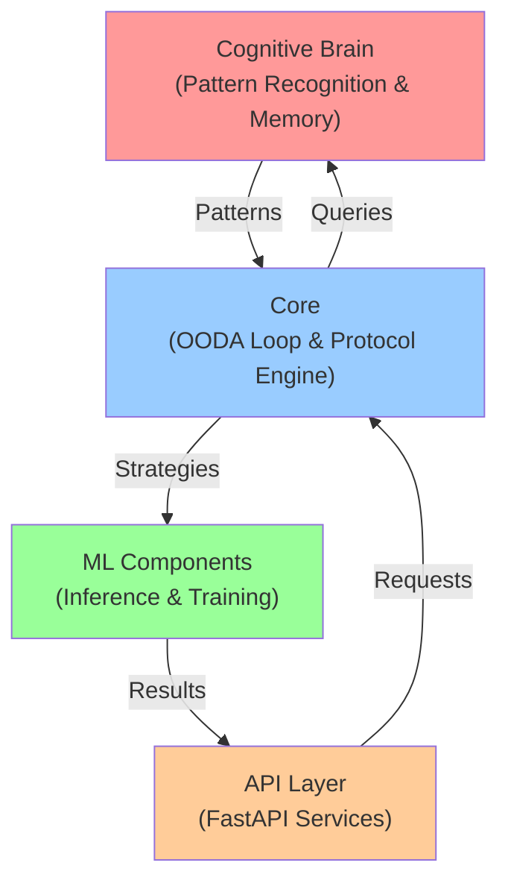
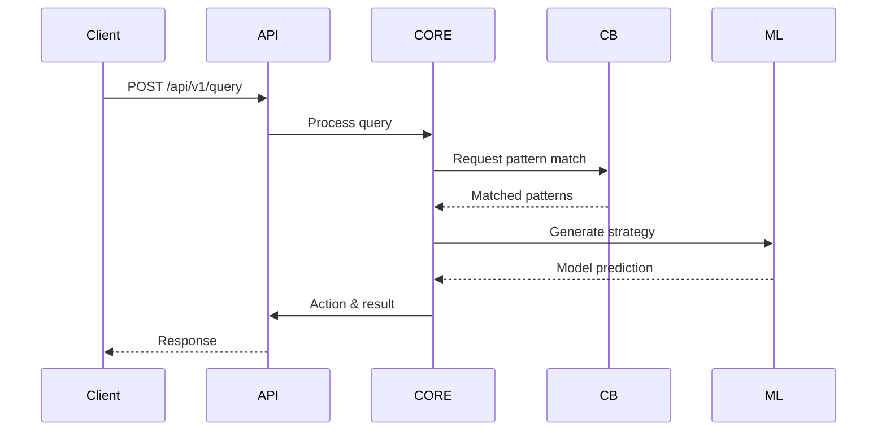
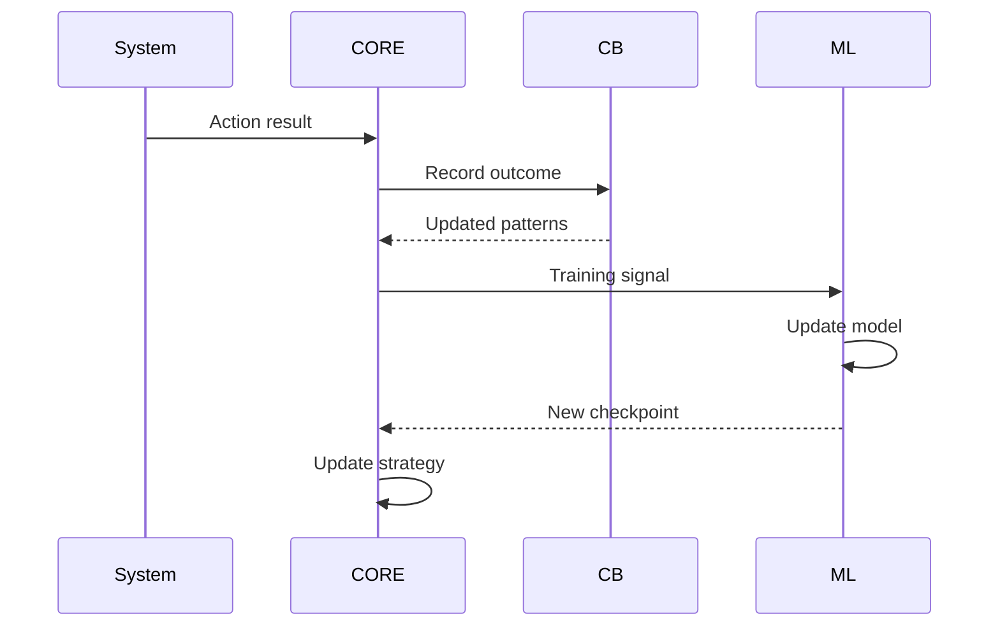
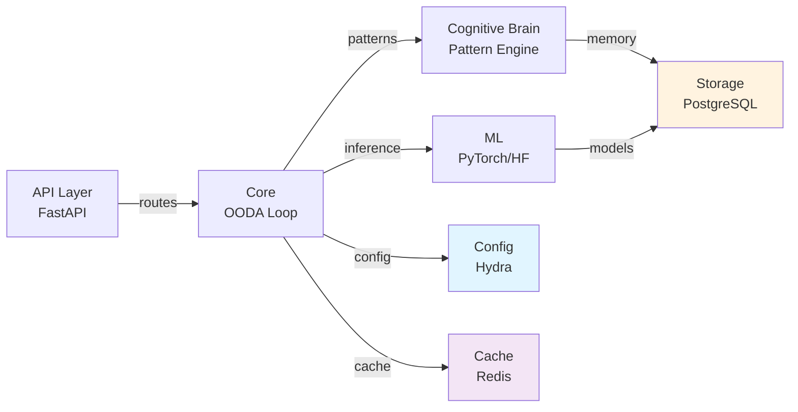

# Architecture Documentation - Aries-Serpent v0.2.1
**Last Updated:** 2026-07-11
**Version:** v0.2.1

**Document Type:** Architecture & Design Guide
**Audience:** Architects, Senior Developers, DevOps Engineers
**Last Updated: 2026-07-16

## System Overview

Aries-Serpent is a modular AI agent framework with three main components:



## Component Architecture

### 1. Cognitive Brain System

**Purpose:** Pattern recognition, memory management, and decision support

**Key Classes:**
- `CognitiveBrainAPI` - Main interface
- `PatternRecognizer` - Pattern detection engine
- `MemoryManager` - STM/LTM management
- `DecisionEngine` - Strategy selection

**Location:** `src/codex/cognitive_brain/`

**Capabilities:**
- Real-time pattern recognition
- Short-term & long-term memory
- Probabilistic decision making
- Learning from feedback

### 2. Core System (OODA Loop)

**Purpose:** Autonomous action orchestration and protocol-based integration

**Components:**
- `OODALoop` - Observe Orient Decide Act cycle
- `ProtocolEngine` - Message routing and transformation
- `ActionQueue` - Async action execution

**Location:** `src/codex/core/`

**Flow:**
```
1. Observe: Collect system state and events
2. Orient: Contextualize observations with patterns
3. Decide: Evaluate strategies from ML/Cognitive Brain
4. Act: Execute selected actions
```

### 3. ML Training & Inference

**Purpose:** Model training, inference, and optimization

**Components:**
- `TrainingPipeline` - End-to-end training orchestration
- `InferenceEngine` - Model serving and inference
- `ModelRegistry` - Version control for models

**Location:** `src/codex/ml/`

**Supported Models:**
- Transformers (HuggingFace)
- PyTorch models
- Custom neural networks

### 4. API Layer (FastAPI)

**Purpose:** RESTful API for external integration

**Endpoints:**
- `POST /api/v1/query` - Submit query
- `GET /api/v1/status` - System status
- `POST /api/v1/learn` - Feedback loop
- `GET /api/v1/patterns` - List recognized patterns

**Location:** `src/codex/api/`

## Data Flow Diagrams

### Query Processing Flow



### Learning Flow



## Module Structure

```
src/codex/
├── cognitive_brain/
│ ├── api.py # Main interface
│ ├── pattern_recognizer.py # Pattern detection
│ ├── memory_manager.py # STM/LTM management
│ └── decision_engine.py # Strategy selection
├── core/
│ ├── ooda_loop.py # OODA orchestration
│ ├── protocol_engine.py # Message routing
│ └── action_queue.py # Action execution
├── ml/
│ ├── training.py # Training pipeline
│ ├── inference.py # Model inference
│ └── registry.py # Model management
├── api/
│ ├── main.py # FastAPI app
│ ├── routes.py # API endpoints
│ └── models.py # Pydantic schemas
└── config/
 ├── hydra/ # Hydra configurations
 └── defaults.yaml # Default settings
```

## Deployment Architectures

### Single-Node Docker Deployment

```
┌─────────────────────────────┐
│ Docker Container │
├─────────────────────────────┤
│ Cognitive Brain (STM/LTM) │
│ Core (OODA Loop) │
│ ML Models (Cached) │
│ API Server (FastAPI) │
└─────────────────────────────┘
 ↓
 ┌─────────┐
 │ PostgreSQL
 └─────────┘
 ↓
 ┌─────────┐
 │ Redis │
 └─────────┘
```

### Kubernetes Multi-Pod Deployment

```
┌──────────────────────────────────────┐
│ Kubernetes Cluster │
├──────────────────────┬────────────────┤
│ API Pod(s) │ ML Pod(s) │
│ (FastAPI, 3x) │ (Inference) │
├──────────────────────┼────────────────┤
│ Cognitive Brain │ Training Pod │
│ Pod (Shared STM) │ (Batch Jobs) │
├──────────────────────┴────────────────┤
│ Stateful Services │
│ - PostgreSQL StatefulSet │
│ - Redis Deployment │
│ - Prometheus/Grafana │
└──────────────────────────────────────┘
```

## Integration Patterns

### Protocol-Based Integration

Aries-Serpent uses a protocol-based architecture for flexible integration:

```python
# Any system can integrate via protocol
class ProtocolClient:
 async def send_message(self, msg: Message) -> Response:
 """
 Send message following Aries-Serpent protocol
 
 Supported message types:
 - QUERY: Request pattern recognition
 - LEARN: Provide feedback for learning
 - ACTION: Execute system action
 """
 return await self.protocol_engine.process(msg)
```

### Webhook-Based Feedback Loop

```
External System
 ↓
 POST /webhook/feedback
 {
 "event_id": "evt_123",
 "outcome": "success|failure",
 "metrics": {...}
 }
 ↓
Cognitive Brain
 ↓
Updates patterns & models
 ↓
Improves decision quality
```

## Dependency Graph



## Technology Stack

| Layer | Technology | Purpose |
|-------|-----------|---------|
| **Language** | Python 3.12+ | Core runtime |
| **Configuration** | Hydra 1.3 | Config management |
| **Validation** | Pydantic 2.4 | Data validation |
| **API** | FastAPI | REST API server |
| **ML Framework** | PyTorch | Model training/inference |
| **LLM Integration** | HuggingFace | Pre-trained models |
| **Database** | PostgreSQL | Persistent storage |
| **Cache** | Redis | Performance optimization |
| **Container** | Docker | Containerization |
| **Orchestration** | Kubernetes | Production deployment |
| **Monitoring** | Prometheus/Grafana | Observability |
| **Testing** | pytest | Test framework |

## Performance Characteristics

### Latency

| Operation | Typical Latency |
|-----------|-----------------|
| Pattern recognition | 50-100ms |
| Decision making | 100-200ms |
| Model inference | 200-500ms |
| API response (end-to-end) | 500-1000ms |

### Throughput

| Metric | Value |
|--------|-------|
| Queries/second | 100+ |
| Learning events/hour | 10,000+ |
| Pattern updates/hour | 1,000+ |

### Resource Usage

| Component | CPU | Memory | Storage |
|-----------|-----|--------|---------|
| Cognitive Brain | 0.5 cores | 2GB | 5GB (LTM) |
| Core OODA | 0.2 cores | 0.5GB | 100MB |
| ML Inference | 1-2 cores | 4GB | 2GB (models) |
| API Server | 0.5 cores | 1GB | 100MB |

## Security Architecture

### Authentication & Authorization

- **API Authentication:** ****** (JWT)
- **Service-to-service:** mTLS
- **Database:** Encrypted credentials
- **Secrets:** Managed via Kubernetes Secrets or Vault

### Network Security

- **Ingress:** TLS 1.3 enforced
- **Service mesh:** Optional Istio for advanced policies
- **Network policies:** Pod-to-pod traffic control
- **Firewall:** Cloud provider security groups

### Data Security

- **Encryption at rest:** PostgreSQL TDE (Transparent Data Encryption)
- **Encryption in transit:** mTLS for all inter-service communication
- **Key rotation:** 90-day rotation for encryption keys
- **Audit logging:** All data access logged and monitored

## Scalability Considerations

### Horizontal Scaling

- **API Pods:** Scale independently (stateless)
- **ML Pods:** Scale based on inference load
- **Cognitive Brain:** Shared state via PostgreSQL

### Vertical Scaling

- **Memory:** Increase Redis cache size for better performance
- **CPU:** More cores improve parallel processing
- **Storage:** Larger database for pattern history

### Optimization Techniques

1. **Caching:** Redis for hot data
2. **Batching:** Process multiple queries together
3. **Model quantization:** Reduce model size
4. **Request coalescing:** Batch similar requests
5. **Async processing:** Non-blocking I/O

## Monitoring & Observability

### Metrics

- Request latency distribution
- Pattern recognition accuracy
- Model inference time
- System resource utilization
- Error rates and types

### Logging

- Structured JSON logs
- Log levels: DEBUG, INFO, WARNING, ERROR
- Centralized logging (ELK stack recommended)
- Audit trail for security events

### Tracing

- OpenTelemetry for distributed tracing
- Jaeger backend for visualization
- Trace sampling based on latency

## Future Evolution

### Phase 2 Enhancements

- [ ] Multi-model ensemble support
- [ ] Graph-based pattern storage
- [ ] Distributed cognitive state
- [ ] Enhanced federated learning

### Phase 3 Roadmap

- [ ] Real-time model retraining
- [ ] Advanced explainability features
- [ ] Privacy-preserving ML
- [ ] Multi-tenant architecture

---

**Status:** COMPLETE
**Last Updated: 2026-07-16
