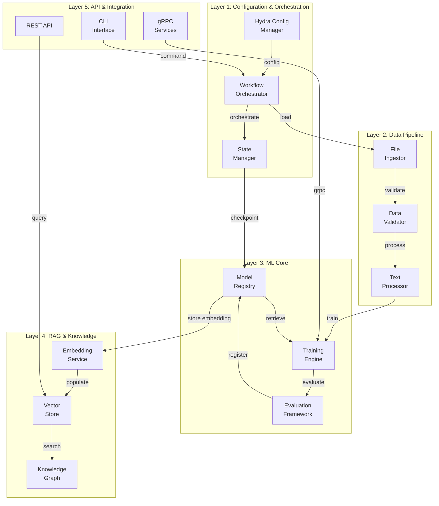
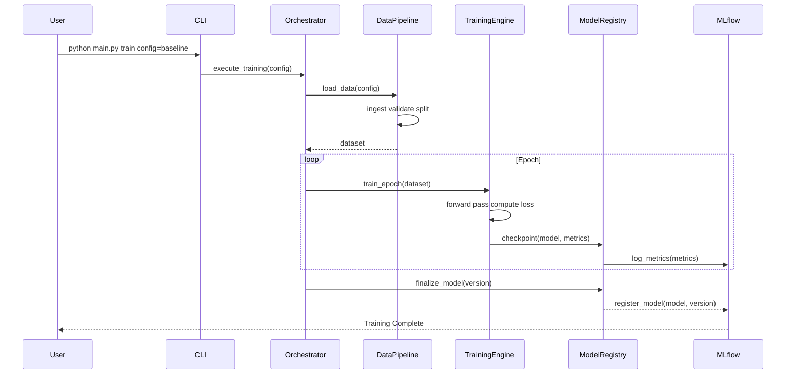
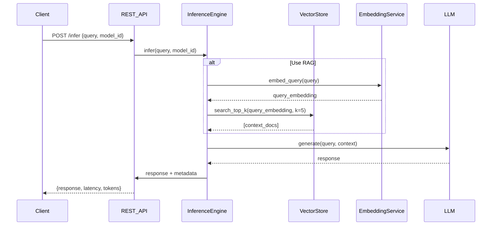

# Comprehensive System Architecture — Codex ML Platform

**Version**: v0.2.0
**Last Updated:** 2026-07-11

**Version:** 5.0.0
**Last Updated: 2026-07-10
**Status:** Complete — Phase 5 Track 4
**Session:** S250-doc-arch

---

## Executive Summary

The Codex ML Platform is a comprehensive, production-grade machine learning framework built on a **5-layer architecture** designed for autonomy, reproducibility, and scalability. This document provides a complete architectural overview including system design, component interactions, data flows, and key design patterns.

**Core Principles:**
- **Offline-First:** All components operate without internet connectivity
- **Configuration-Driven:** Hydra-based configuration management for reproducibility
- **Distributed-Ready:** Support for multi-node, multi-GPU training and inference
- **Observable:** Comprehensive telemetry, logging, and performance monitoring
- **Secure:** End-to-end encryption, secrets isolation, RBAC

---

## 1. Architectural Layers

### 1.1 Layer 1: Configuration & Orchestration (Foundation)

**Purpose:** Centralized configuration management and workflow orchestration.

**Components:**
- **Hydra Configuration System** — Single source of truth for all parameters
 - Multi-level config composition (base experiment run-specific)
 - Type-safe schema validation via OmegaConf
 - Dynamic defaults and sweeps for hyperparameter tuning

- **Workflow Orchestrator** — DAG-based task scheduling
 - Dependency resolution and parallel execution
 - Failure recovery with checkpointing
 - Resource allocation and scheduling

- **State Manager** — Persistent workflow state
 - Checkpoint storage (local, cloud, S3-compatible)
 - Recovery point management
 - Session tracking

**Key Design Patterns:**
- **Factory Pattern** — Configuration objects instantiate components
- **Chain of Responsibility** — Config validation pipeline
- **Observer Pattern** — Config change notifications

**Data Structures:**
```yaml
ConfigurationStore:
 base_configs/
 defaults.yaml # Base parameters
 training.yaml # Training-specific
 inference.yaml # Inference-specific
 experiments/
 exp_001_baseline.yaml # Experiment override
 exp_002_variant_a.yaml # Variant override
 runtime/
 run_2026_07_10.yaml # Runtime captures
```

---

### 1.2 Layer 2: Data Pipeline & Ingestion

**Purpose:** Robust, reproducible data handling with format auto-detection.

**Components:**
- **File Ingestor** — Multi-format support
 - CSV, JSON, Parquet, HDF5, Apache Arrow
 - Automatic encoding detection (UTF-8, Latin-1, GB18030, etc.)
 - Large file streaming (>100GB support)

- **CSV Ingestor** — Specialized CSV handling
 - Dialect detection (delimiter, quote char, encoding)
 - Type inference and validation
 - Memory-efficient chunked processing

- **Text Processing Pipeline**
 - Tokenization with multiple backends (NLTK, spaCy, HuggingFace)
 - Document splitting (semantic, sliding window, recursive)
 - Format preservation (markdown, code blocks, etc.)

- **Data Validation Framework**
 - Schema validation (Pydantic)
 - Statistical profile validation
 - Drift detection

**Data Flow:**
```
Raw Input Format Detection Parsing Validation Normalization Output
 
 Error Handling & Logging
```

**Key Methods:**
- `ingest(path: str, config: Config) Dataset` — Main ingestion entry point
- `detect_format(bytes: bytes) Format` — Format auto-detection
- `split_document(text: str, strategy: str) List[str]` — Document splitting

---

### 1.3 Layer 3: Machine Learning Core

**Purpose:** Training, evaluation, and inference with reproducibility guarantees.

**Components:**
- **Training Engine**
 - PyTorch-based distributed training
 - Gradient accumulation and mixed precision
 - Learning rate scheduling and warmup
 - Early stopping with patience

- **Evaluation Framework**
 - Multiple metric support (accuracy, F1, AUROC, custom)
 - Cross-validation with stratification
 - Confidence interval estimation

- **Model Registry**
 - MLflow integration for experiment tracking
 - Model versioning and lineage
 - Artifact storage and retrieval

- **Inference Pipeline**
 - Batch processing with queue management
 - Single-shot and streaming inference
 - Latency optimization

**Training Loop Pseudocode:**
```python
for epoch in range(num_epochs):
 for batch in train_loader:
 output = model(batch)
 loss = criterion(output, batch.labels)
 loss.backward()
 optimizer.step()
 optimizer.zero_grad()
 
 if validation_interval_reached:
 val_metrics = evaluate(model, val_loader)
 if val_metrics.best:
 checkpoint_model(model, epoch, val_metrics)
```

---

### 1.4 Layer 4: RAG & Knowledge Graph

**Purpose:** Retrieval-augmented generation with semantic search.

**Components:**
- **Vector Store**
 - FAISS for dense vector search (CPU/GPU)
 - BM25 for sparse keyword search
 - Hybrid search combining both approaches

- **Embedding Service**
 - Multi-model support (BERT, BGE, OpenAI)
 - Batch embedding with caching
 - Dimension reduction and normalization

- **Retrieval Pipeline**
 - Query encoding and expansion
 - Top-K retrieval with reranking
 - Context window management

- **Knowledge Graph Manager**
 - Entity and relationship storage
 - Graph traversal and reasoning
 - Link prediction

**Retrieval Flow:**
```
Query Encoding Vector Search Reranking Context Window LLM Prompt
 
 Keyword Search (parallel)
```

---

### 1.5 Layer 5: API & Integration

**Purpose:** External-facing interfaces and system integration.

**Components:**
- **REST API** (FastAPI)
 - OpenAPI/Swagger documentation
 - Request/response validation
 - Authentication and rate limiting

- **gRPC Services** (High-performance)
 - Streaming support for large payloads
 - Protocol buffer serialization
 - Service mesh integration

- **Event Bus**
 - Publish/Subscribe pattern
 - Event sourcing
 - Dead letter queue for failed events

- **CLI Interface** (Typer)
 - Command-based operations
 - Batch execution support
 - Output formatting (JSON, table, markdown)

---

## 2. Component Interaction Diagram



---

## 3. Data Flow Architecture

### 3.1 Training Data Flow



### 3.2 Inference Data Flow



---

## 4. Key Design Patterns

### 4.1 Factory Pattern (Component Creation)

```python
class ComponentFactory:
 """Factory for creating components from config."""
 
 @staticmethod
 def create_model(config: ModelConfig) -> nn.Module:
 """Create model instance from config."""
 model_class = get_class(config.class_path)
 return model_class(**config.params)
 
 @staticmethod
 def create_optimizer(config: OptimizerConfig, model: nn.Module):
 """Create optimizer from config."""
 optimizer_class = get_class(config.class_path)
 return optimizer_class(model.parameters(), **config.params)
```

### 4.2 Chain of Responsibility (Validation Pipeline)

```python
class ValidationChain:
 """Pipeline of validators."""
 
 def __init__(self):
 self.validators = [
 SchemaValidator(),
 TypeValidator(),
 RangeValidator(),
 BusinessRuleValidator(),
 ]
 
 def validate(self, data: Any) -> ValidationResult:
 result = ValidationResult(passed=True)
 for validator in self.validators:
 result = validator.validate(data, result)
 if not result.passed:
 break
 return result
```

### 4.3 Observer Pattern (Config Change Notification)

```python
class ConfigManager(Observable):
 """Config manager with change notifications."""
 
 def __init__(self):
 self.observers = []
 self.config = {}
 
 def subscribe(self, observer: ConfigObserver):
 self.observers.append(observer)
 
 def update_config(self, new_config: dict):
 self.config = new_config
 self.notify_observers("config_updated", new_config)
 
 def notify_observers(self, event: str, data: dict):
 for observer in self.observers:
 observer.on_config_change(event, data)
```

### 4.4 Strategy Pattern (Multiple Implementations)

```python
class DataProcessingStrategy(ABC):
 """Abstract strategy for data processing."""
 
 @abstractmethod
 def process(self, data: Any) -> Any:
 pass

class LocalProcessing(DataProcessingStrategy):
 """Process data locally."""
 def process(self, data: Any) -> Any:
 return local_process(data)

class DistributedProcessing(DataProcessingStrategy):
 """Process data on distributed cluster."""
 def process(self, data: Any) -> Any:
 return distributed_process(data)
```

---

## 5. Deployment Architecture

### 5.1 Single Machine Deployment

```

 Single Machine Setup 

 
 
 Python PyTorch 
 Process CPU/GPU 
 
 
 
 Database Cache 
 SQLite Redis/Local 
 
 
 
 Storage Logs 
 Local FS Local/File 
 
 

```

### 5.2 Distributed Deployment

```

 Kubernetes Cluster Deployment 

 
 
 Master Node Worker Node 1 Worker Node 2 
 (Orchestrator) (GPU/Compute) (GPU/Compute) 
 
 - Scheduler - Training - Training 
 - State Mgmt - Inference - Inference 
 
 
 
 Shared Storage (S3 or NFS) 
 - Models 
 - Datasets 
 - Checkpoints 
 
 
 
 Monitoring & Logging Stack 
 - Prometheus (metrics) 
 - ELK Stack (logs) 
 - Grafana (dashboards) 
 
 

```

---

## 6. Security Architecture

### 6.1 Defense-in-Depth Layers

```

 Layer 1: API Authentication 
 (JWT, OAuth2, API Keys) 

 

 Layer 2: Authorization (RBAC) 
 (Role-based access control) 

 

 Layer 3: Data Encryption 
 (TLS in transit, AES at rest) 

 

 Layer 4: Input Validation 
 (Schema, type, business rules) 

 

 Layer 5: Secrets Management 
 (Vault, env vars, encrypted storage)

```

### 6.2 Secrets Management

**Approach:** Environment-based secrets with encryption at rest.

**Never stored in code:**
- API keys
- Database passwords
- Private encryption keys
- OAuth tokens

**Storage locations:**
- GitHub Actions secrets (CI/CD)
- `.env` files (local development, gitignored)
- Vault (production)
- Encrypted parameter store (cloud)

---

## 7. Scalability Strategy

### 7.1 Horizontal Scaling

**Data Parallelism:**
- Dataset sharded across multiple GPUs/nodes
- Each worker processes different data batches
- Gradient aggregation at end of batch
- Framework: PyTorch DistributedDataParallel (DDP)

**Model Parallelism:**
- Large models split across multiple GPUs
- Pipeline execution with micro-batching
- Framework: Tensor parallelism (Megatron-LM patterns)

### 7.2 Vertical Scaling

**Single Machine Optimization:**
- Mixed precision training (FP16 + FP32)
- Gradient accumulation for larger effective batch sizes
- Activation checkpointing to reduce memory
- Optimized data loading with prefetch and pinning

---

## 8. Performance Characteristics

### 8.1 Expected Throughput

| Component | Operation | Throughput | Notes |
|-----------|-----------|-----------|-------|
| File Ingestor | CSV parsing | 50K-100K rows/sec | Depends on row size |
| Data Validator | Schema check | 10K-50K samples/sec | With full validation |
| Training Engine | Forward pass | 100-1000 samples/sec | Depends on model size, GPU |
| Inference Engine | Batch inference | 50-500 samples/sec | Batch size dependent |
| Vector Store | FAISS search | 10K-100K/sec | CPU, depends on dimension |
| REST API | Request handling | 100-1000 req/sec | Per instance, depends on backend |

### 8.2 Latency Profile

```
API Request Latency Breakdown (Inference):
 Auth & validation: 1-5ms
 Load model: 0ms (cached)
 Embedding: 10-50ms
 Vector search: 5-20ms
 LLM generation: 500-2000ms
 Serialization: 1-5ms
 Total: 520-2070ms (p50), 1000-3000ms (p95)
```

---

## 9. Observability & Monitoring

### 9.1 Logging Architecture

```
Application Logs
 Model Logs (training metrics, checkpoints)
 Data Logs (ingestion, validation)
 API Logs (requests, responses, errors)
 System Logs (resource usage, errors)
 
 Logger (Python logging)
 
 
 Multiple Handlers 
 
 - File (local rotation) 
 - Console (stdout) 
 - CloudWatch (AWS) 
 - Datadog/ELK (centralized) 
 
```

### 9.2 Metrics Collection

**Key metrics by layer:**

**Layer 1 (Config):**
- Config load time
- Config validation errors
- Config change frequency

**Layer 2 (Data):**
- Ingestion throughput (samples/sec)
- Validation errors
- Data quality scores

**Layer 3 (ML):**
- Training loss/accuracy
- Evaluation metrics
- Model checkpoint size
- Training time per epoch

**Layer 4 (RAG):**
- Search latency
- Embedding quality (semantic similarity)
- Retrieval recall/precision

**Layer 5 (API):**
- Request latency (p50, p95, p99)
- Error rate
- Throughput
- Resource usage (CPU, memory, GPU)

---

## 10. Dependencies and External Systems

### 10.1 Required Dependencies

**Core Framework:**
- PyTorch (>= 2.0)
- Hydra-Core (== 1.3.2)
- OmegaConf (>= 2.3)
- Pydantic (>= 2.4)

**Data & ML:**
- Pandas, NumPy, Scikit-learn
- Transformers (HuggingFace)
- FAISS (Meta)
- MLflow (tracking)

**API & Web:**
- FastAPI (REST API)
- gRPC (high-perf services)
- Uvicorn (ASGI server)

**Observability:**
- Prometheus (metrics)
- ELK Stack (logging)
- Jaeger (tracing)

**Security:**
- Cryptography (encryption)
- PyJWT (JWT handling)
- BCrypt (password hashing)

### 10.2 Optional Dependencies

- CUDA Toolkit (GPU acceleration)
- Kubernetes (orchestration)
- Redis (caching)
- PostgreSQL (production database)
- MinIO (object storage)

---

## 11. Configuration Schema

**Base configuration structure:**

```yaml
# config/defaults.yaml
hydra:
 version: 1.1
 run:
 dir: outputs/${now:%Y-%m-%d}/${now:%H-%M-%S}

# Data configuration
data:
 train_path: data/train.csv
 val_path: data/val.csv
 batch_size: 32
 num_workers: 4

# Model configuration
model:
 class_path: codex.models.TransformerModel
 params:
 hidden_size: 768
 num_layers: 12
 num_heads: 12
 dropout: 0.1

# Training configuration
training:
 max_epochs: 100
 learning_rate: 1e-4
 optimizer:
 class_path: torch.optim.AdamW
 params:
 beta1: 0.9
 beta2: 0.999
 scheduler:
 class_path: torch.optim.lr_scheduler.CosineAnnealingLR
 params:
 T_max: 100

# Evaluation configuration
evaluation:
 metrics:
 - accuracy
 - f1
 - auroc
 eval_interval: 1000 # steps

# Inference configuration
inference:
 batch_size: 64
 use_rag: true
 rag_top_k: 5
 max_tokens: 256
```

---

## 12. Extension Points

The architecture provides several extension points for customization:

### 12.1 Custom Components

```python
# In your code
from codex.models import BaseModel

class CustomModel(BaseModel):
 """Custom model implementation."""
 
 def __init__(self, config):
 super().__init__(config)
 self.encoder = self.build_encoder()
 self.decoder = self.build_decoder()
 
 def forward(self, x):
 encoded = self.encoder(x)
 return self.decoder(encoded)
```

### 12.2 Custom Handlers

```python
# Register custom handler
from codex.data import register_ingestor

@register_ingestor("custom_format")
class CustomIngestor:
 def ingest(self, path, config):
 # Custom logic
 return data
```

### 12.3 Custom Validators

```python
from codex.validation import register_validator

@register_validator("custom_rule")
def validate_custom(data, config):
 if not meets_condition(data):
 raise ValidationError("Custom validation failed")
 return data
```

---

## 13. Disaster Recovery

### 13.1 Backup Strategy

**Automatic backups:**
- Model checkpoints (every epoch)
- Configuration snapshots (before each run)
- Database backups (hourly)
- Log archives (daily)

**Storage:**
- Local: `/var/backups/codex/`
- Cloud: S3 bucket with versioning
- Vault: Encrypted parameter backups

### 13.2 Recovery Procedures

**Model checkpoint recovery:**
```bash
# List available checkpoints
python -m codex.cli checkpoints list

# Restore from checkpoint
python main.py \
 ++checkpoint=checkpoints/epoch_50 \
 train.resume=true
```

**Database recovery:**
```bash
# List backup versions
ls /var/backups/codex/db*.sql

# Restore from backup
sqlite3 codex.db < /var/backups/codex/db_2026_07_10.sql
```

---

## 14. Future Roadmap

### Phase 6 (Q3 2026)
- [ ] Tensor parallelism for 100B+ models
- [ ] Multi-cluster federation
- [ ] Advanced quantization (int4, nf4)
- [ ] Continuous learning pipeline

### Phase 7 (Q4 2026)
- [ ] Federated learning support
- [ ] Hardware-aware optimization
- [ ] Advanced caching strategies
- [ ] Edge deployment

---

## References

- [Hydra Documentation](https://hydra.cc/)
- [PyTorch Distributed Training](https://pytorch.org/docs/stable/distributed.html)
- [FAISS Documentation](https://github.com/facebookresearch/faiss)
- [FastAPI](https://fastapi.tiangolo.com/)
- See also: ADR directory for specific architectural decisions

---

**Document maintained by:** @mbaetiong
**Last review:** 2026-07-10
**Next review:** 2026-08-10
