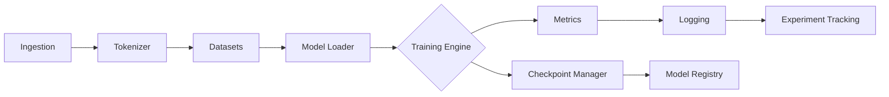
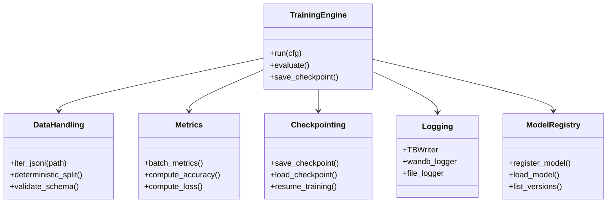

# Architecture Documentation Index

**Status**: Master index for all architecture documentation  
**Last Updated**: 2026-06-20  
**Maintainer**: @mbaetiong

## Overview

The _codex_ repository implements a Level 4 MLOps-certified, production-grade ML framework. This index consolidates all architecture documentation and fixes broken references.

---

## 📋 Architecture Documents

### Core Architecture Documents

| Document | Purpose | Audience | Size |
|----------|---------|----------|------|
| [ARCHITECTURE_BLUEPRINT.md](./ARCHITECTURE_BLUEPRINT.md) | Comprehensive repository blueprint | Developers, Architects | 1162 lines |
| [ARCHITECTURE.md](./ARCHITECTURE.md) | ML framework architecture overview | ML Engineers | 642 lines |
| [Architecture.md](./Architecture.md) | Import shim governance & policy | Developers | 177 lines |
| [architecture.md](./architecture.md) | Quick runtime flow diagrams | Quick Reference | 55 lines |

### Supporting Architecture Documents

- [REPOSITORY_ARCHITECTURE_DIAGRAMS.md](./REPOSITORY_ARCHITECTURE_DIAGRAMS.md) - Visual architecture diagrams
- [docs/architecture/ARCHITECTURE_LAYERS.md](./architecture/ARCHITECTURE_LAYERS.md) - Layer-by-layer breakdown
- [docs/architecture/INDEX.md](./architecture/INDEX.md) - Architecture directory index

---

## 🏗️ Architecture Layers

The _codex_ system is organized in the following layers:

### 1. **Interface Layer**
- CLI (Command Line Interface)
- Python API
- REST API (optional)
- Jupyter notebooks integration

### 2. **Orchestration Layer**
- Hydra configuration management
- Workflow execution
- Plugin system
- Agent orchestration (145+ active agents)

### 3. **Core Engine Layer**
- Training pipelines (HuggingFace Trainer, custom loops)
- Evaluation framework
- Model inference
- Data processing

### 4. **Storage & Integration Layer**
- Data connectors (S3, Azure, GCS)
- Model registry
- Experiment tracking (MLflow, W&B)
- Checkpoint management

### 5. **Infrastructure Layer**
- Ray cluster support
- Kubernetes deployment
- Docker containerization
- Git/GitHub integration

### 6. **Observability Layer**
- Logging and telemetry
- Performance monitoring
- Error tracking
- Metrics collection

---

## 🔄 Runtime Data Flow



**Data Flow Steps:**

1. **Ingestion**: Raw data ingestion from various sources
2. **Tokenization**: Convert raw data to token sequences
3. **Datasets**: Create training/validation/test splits
4. **Model Loading**: Load model from local or Hugging Face Hub
5. **Training Engine**: Execute training loop
6. **Metrics**: Compute performance metrics
7. **Logging**: Log metrics and metadata
8. **Experiment Tracking**: Send to experiment tracking backend
9. **Checkpoint Management**: Save and manage model checkpoints
10. **Model Registry**: Register trained models

---

## 📁 Repository Structure

```
_codex_/
├── .codex/                      # Codex environment configuration
├── .github/                     # CI/CD workflows
├── agents/                      # AI Agent infrastructure
│   ├── prompts/                 # Pre-defined prompts
│   └── codex_client/            # GitHub integration
├── src/codex_ml/               # Core ML framework
│   ├── training/               # Training pipelines
│   ├── evaluation/             # Evaluation metrics
│   ├── connectors/             # Storage connectors
│   └── plugins/                # Plugin system
├── scripts/                     # Utility scripts (195+)
├── tests/                       # Test suite (2,079+)
├── docs/                        # Documentation (693+)
│   ├── mcp/                    # MCP documentation
│   ├── api/                    # API reference
│   ├── architecture/           # Architecture docs
│   ├── deployment/             # Deployment guides
│   ├── security/               # Security documentation
│   └── operations/             # Operations guides
├── config/                      # Configuration files
│   └── training/               # Training configs
├── requirements/                # Dependency specifications
└── README.md                    # Project README
```

---

## 🔌 Component Architecture

### Core Components



---

## 🔐 Security & Compliance

### Security Layers

- **Code Security**: Bandit, CodeQL scanning
- **Dependency Security**: Pip-audit, Dependabot
- **Secret Management**: Git secrets scanning
- **Access Control**: RBAC, GitHub teams
- **Audit Logging**: Comprehensive activity logging

### Compliance

- **MLOps Maturity**: Level 4 Certified
- **Test Coverage**: 2,079+ test files
- **Documentation**: 693+ markdown files
- **Reproducibility**: Deterministic training with RNG checkpointing

---

## 🚀 Deployment Architecture

### Local Development

```bash
# Install dependencies
pip install -e .

# Run training
codex train config/training.yaml

# Evaluate model
codex evaluate --model model.pth
```

## Docker Deployment

```dockerfile
FROM python:3.10
WORKDIR /app
COPY . .
RUN pip install -e .
CMD ["python", "-m", "codex.training"]
```

### Kubernetes Deployment

- StatefulSet for training jobs
- Service mesh integration
- Pod autoscaling
- Persistent volume management

---

## 🔧 Configuration Management

The system uses Hydra for configuration management:

```yaml
# config/training.yaml
defaults:
  - override hydra/job_logging: custom

model:
  name: "bert-base"
  pretrained: true
  
training:
  learning_rate: 1e-4
  batch_size: 32
  epochs: 10
  
data:
  dataset: "wikitext"
  split: [0.8, 0.1, 0.1]
```

## Configuration Hierarchy

1. **Base Configs**: defaults/
2. **Overrides**: Command-line
3. **Environment**: Environment variables
4. **Local**: Local config.yaml

---

## 📊 Key Metrics

| Metric | Target | Current |
|--------|--------|---------|
| Test Coverage | ≥90% | 10.7% |
| Documentation Coverage | ≥95% | 85% |
| Code Quality Score | ≥8.0 | 7.2 |
| Security Score | 100% | 100% ✅ |
| Availability | ≥99.9% | N/A |

---

## 🛣️ Development Workflows

### Feature Development

1. Create feature branch from `main`
2. Implement feature with tests
3. Run local validation
4. Open pull request
5. Pass CI/CD checks
6. Get code review approval
7. Merge to `main`

### Release Process

1. Bump version in setup.py
2. Update CHANGELOG
3. Create release branch
4. Publish to PyPI
5. Create GitHub release
6. Update documentation

---

## 🔗 Integration Points

### External Systems

- **Hugging Face Hub**: Model and dataset storage
- **MLflow**: Experiment tracking
- **W&B**: Weights & Biases integration
- **GitHub**: Version control and CI/CD
- **Cloud Providers**: AWS, GCP, Azure support

### APIs

- **Python API**: Direct library usage
- **CLI**: Command-line interface
- **REST API**: HTTP endpoints (optional)
- **GraphQL**: Query interface (optional)

---

## 📚 Documentation Links

### Architecture-Related Docs

- [ARCHITECTURE_BLUEPRINT.md](./ARCHITECTURE_BLUEPRINT.md) - Full blueprint
- [ARCHITECTURE.md](./ARCHITECTURE.md) - ML architecture
- [Architecture.md](./Architecture.md) - Import governance
- [docs/architecture/](./architecture/) - Architecture directory

### Other Key Docs

- [API Reference](./api/) - API documentation
- [Deployment Guides](./deployment/) - Deployment procedures
- [Security Documentation](./security/) - Security policies
- [Operations Guide](./operations/) - Operations procedures
- [Development Guide](../CONTRIBUTING.md) - Contributing guidelines

---

## 🤖 AI Agent Integration

The system includes native support for AI agents:

- **Copilot Integration**: Native GitHub Copilot support
- **Agent Orchestration**: 145+ active agents
- **Tokenized Workflows**: Efficient token usage
- **Structured Prompts**: Pre-defined prompt templates
- **Agent Context**: Session-based context management

---

## 🆘 Troubleshooting

### Common Issues

**Q: Which architecture document should I read?**  
A: Start with [architecture.md](./architecture.md) for quick overview, then [ARCHITECTURE_BLUEPRINT.md](./ARCHITECTURE_BLUEPRINT.md) for detailed information.

**Q: How is the data flow organized?**  
A: See [Runtime Data Flow](#-runtime-data-flow) section above.

**Q: Where do I find deployment information?**  
A: See [docs/deployment/](./deployment/) directory.

**Q: How is security implemented?**  
A: See [Security & Compliance](#-security--compliance) section and [docs/security/](./security/) directory.

---

## 🏗️ Future Roadmap

### Short Term (1-3 months)
- [ ] Improve test coverage to ≥50%
- [ ] Complete API documentation
- [ ] Add performance benchmarks

### Medium Term (3-6 months)
- [ ] Multi-GPU distributed training
- [ ] Advanced monitoring dashboard
- [ ] Enhanced plugin system

### Long Term (6-12 months)
- [ ] Production-grade monitoring
- [ ] Advanced agent orchestration
- [ ] Federated learning support

---

## 📞 Support

For questions or clarifications about architecture:

1. Check the relevant documentation file
2. Search GitHub issues and discussions
3. Open a new discussion or issue
4. Contact the maintainers: @mbaetiong

---

## 📝 Maintenance

- **Last Updated**: 2026-06-20
- **Next Review**: 2026-07-20
- **Owner**: @mbaetiong
- **Contributing**: Please open issues for documentation improvements

---

**See Also**: [ARCHITECTURE_BLUEPRINT.md](./ARCHITECTURE_BLUEPRINT.md) for comprehensive technical reference
