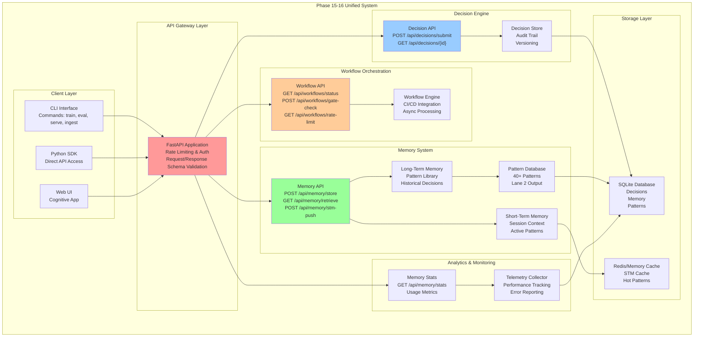
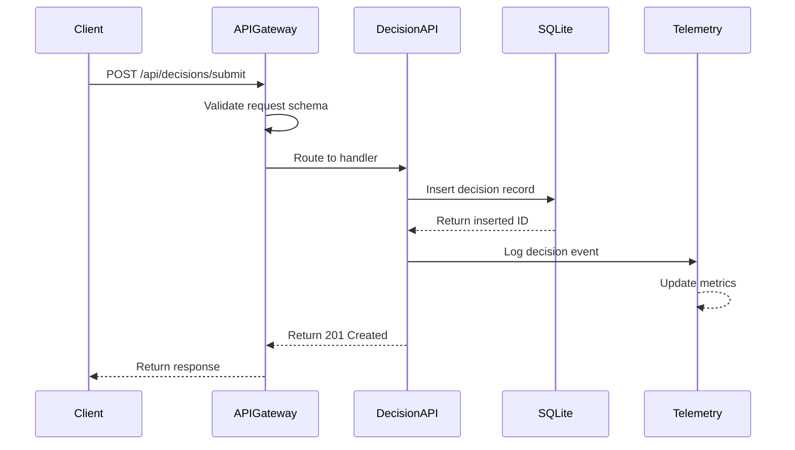
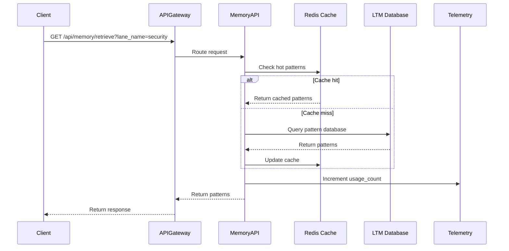
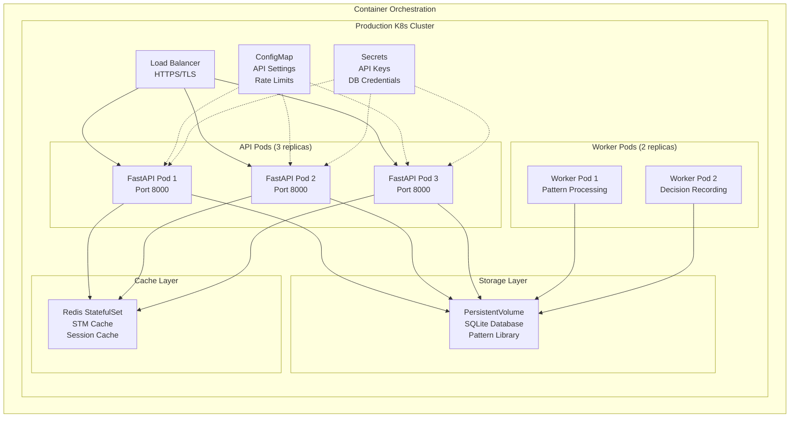

# Phase 15-16 Architecture Documentation
**Last Updated:** 2026-07-11
**Version:** v0.2.1

> **v0.2.1-final**: Complete MLOps platform with autonomous cognitive brain system, integrated decision engine, and production-grade API layer.

**Last Updated**: 2026-07-11 | **Authors**: Phase 17 Lane 5 Documentation Team

---

## Table of Contents

1. [System Architecture Overview](#system-architecture-overview)
2. [Core Components](#core-components)
3. [API Architecture](#api-architecture)
4. [Data Flow](#data-flow)
5. [Deployment Architecture](#deployment-architecture)
6. [Integration Points](#integration-points)

---

## System Architecture Overview

The Phase 15-16 system represents a unified ML platform with three major subsystems:



---

## Core Components

### 1. Decision API (POST/GET /api/decisions/*)

**Purpose**: Autonomous decision recording and retrieval for phase 15-16 execution

**Responsibilities**:
- Record autonomous decisions with full audit trail
- Retrieve decision history and recent decisions
- Filter decisions by lane, phase, and timestamp
- Support pagination and sorting

**Key Data Structures**:
```python
class Decision(BaseModel):
    id: str                                    # UUID
    lane_name: str                            # Lane identifier (security, stability, etc.)
    decision_type: str                        # Type of decision (optimization, remediation, etc.)
    rationale: str                            # Why this decision was made
    impact: str                               # Expected impact
    timestamp: datetime                       # When decided
    phase: str                                # Phase number (15-16)
    confidence: float                         # 0.0-1.0 confidence score
    metadata: Dict[str, Any]                 # Additional context
```

### 2. Memory API (POST/GET /api/memory/*)

**Purpose**: Unified memory management for pattern storage and retrieval

**Responsibilities**:
- Store patterns and learnings in long-term memory
- Retrieve relevant patterns for current task
- Manage short-term memory for session context
- Track memory usage and statistics

**Key Data Structures**:
```python
class Memory(BaseModel):
    id: str                                    # UUID
    lane_name: str                            # Which lane created this
    pattern_type: str                        # Type: ci_failure, test_flakiness, etc.
    content: Dict[str, Any]                  # Pattern data
    confidence: float                         # 0.0-1.0 confidence
    usage_count: int                         # Times retrieved
    created_at: datetime
    last_used: datetime
    expires_at: Optional[datetime]           # Retention policy
    tags: List[str]                          # Searchable tags

class STMEntry(BaseModel):
    key: str                                  # Session identifier
    value: Any                               # Data
    timestamp: datetime
    ttl_seconds: int = 3600                  # Time-to-live
```

### 3. Workflow API (GET/POST /api/workflows/*)

**Purpose**: Manage workflow execution, gating, and rate limiting

**Responsibilities**:
- Report workflow execution status
- Enforce workflow gating policies
- Track and enforce rate limiting
- Provide workflow health metrics

**Key Data Structures**:
```python
class WorkflowStatus(BaseModel):
    workflow_name: str
    status: str                               # running, success, failed, queued
    phase: str                               # Current phase
    progress_percent: int                    # 0-100
    estimated_completion: datetime
    lane: str                                # Which lane executing

class GateCheckRequest(BaseModel):
    workflow_name: str
    phase: int
    checks_required: List[str]               # Tests, links, security, etc.
    lane_name: str

class RateLimitStatus(BaseModel):
    requests_current: int
    requests_max: int
    reset_time: datetime
    throttled: bool
```

### 4. Pattern Library Integration (Lane 2 Output)

**Purpose**: Centralized repository of 40+ patterns discovered in Phases 15-16

**Pattern Categories** (40 patterns total):
- CI Failure Patterns (8 patterns)
- Test Flakiness Patterns (7 patterns)
- Performance Optimization Patterns (6 patterns)
- Security Patterns (6 patterns)
- Documentation Patterns (5 patterns)
- Deployment Patterns (4 patterns)
- Monitoring & Observability (4 patterns)

**Storage**: Defined in `.codex/patterns/ci_failure_patterns.yaml` and related files

---

## API Architecture

### 11 FastAPI Endpoints

#### 1. POST /api/decisions/submit
Submit a new autonomous decision with full audit trail.

```
Request Schema:
{
  "lane_name": "string",          # e.g., "security", "stability", "docs"
  "decision_type": "string",      # e.g., "optimization", "remediation"
  "rationale": "string",          # Why this decision was made
  "impact": "string",             # Expected impact
  "phase": "string",              # Phase identifier
  "confidence": float             # 0.0-1.0
}

Response: 201 Created
{
  "id": "uuid",
  "timestamp": "2026-07-11T04:00:00Z",
  "status": "recorded"
}

Error Codes:
- 400: Invalid lane_name or missing required fields
- 409: Duplicate decision detected
```

#### 2. GET /api/decisions/{decision_id}
Retrieve a specific decision by ID.

```
Response: 200 OK
{
  "id": "uuid",
  "lane_name": "string",
  "decision_type": "string",
  "rationale": "string",
  "impact": "string",
  "timestamp": "2026-07-11T04:00:00Z",
  "phase": "string",
  "confidence": float,
  "metadata": {}
}

Error Codes:
- 404: Decision not found
```

#### 3. GET /api/decisions/recent
Retrieve recent decisions with pagination.

```
Query Parameters:
- limit: int (default: 10, max: 100)
- offset: int (default: 0)
- lane_name: string (optional filter)

Response: 200 OK
{
  "decisions": [
    { ... decision objects ... }
  ],
  "total": int,
  "limit": int,
  "offset": int
}
```

#### 4. GET /api/decisions/history
Retrieve decision history with filtering and pagination.

```
Query Parameters:
- page: int (default: 1)
- page_size: int (default: 20, max: 100)
- lane_name: string (optional)
- decision_type: string (optional)
- start_date: datetime (optional)
- end_date: datetime (optional)

Response: 200 OK
{
  "decisions": [ ... ],
  "page": int,
  "page_size": int,
  "total_pages": int,
  "total_items": int
}
```

#### 5. POST /api/memory/store
Store a pattern or learning in memory.

```
Request Schema:
{
  "lane_name": "string",
  "pattern_type": "string",
  "content": { ... },
  "confidence": float,
  "tags": ["string"]
}

Response: 201 Created
{
  "id": "uuid",
  "created_at": "2026-07-11T04:00:00Z"
}
```

#### 6. GET /api/memory/retrieve
Retrieve relevant patterns from memory.

```
Query Parameters:
- lane_name: string (optional)
- pattern_type: string (optional)
- tag: string (optional)
- limit: int (default: 10)

Response: 200 OK
{
  "patterns": [
    {
      "id": "uuid",
      "pattern_type": "string",
      "content": { ... },
      "confidence": float,
      "usage_count": int,
      "last_used": "2026-07-11T04:00:00Z"
    }
  ]
}
```

#### 7. POST /api/memory/stm-push
Push data to short-term memory for current session.

```
Request Schema:
{
  "key": "string" (optional, auto-generated if not provided),
  "value": any,
  "ttl_seconds": int (optional, default: 3600)
}

Response: 201 Created
{
  "key": "string",
  "stored_at": "2026-07-11T04:00:00Z"
}
```

#### 8. GET /api/memory/stats
Retrieve memory system statistics.

```
Response: 200 OK
{
  "stm": {
    "total_entries": int,
    "memory_bytes": int,
    "avg_ttl_seconds": int
  },
  "ltm": {
    "total_patterns": int,
    "memory_bytes": int,
    "by_type": { "type": count, ... }
  },
  "top_patterns": [
    {
      "type": "string",
      "count": int,
      "confidence": float
    }
  ]
}
```

#### 9. GET /api/workflows/status
Get current workflow execution status.

```
Query Parameters:
- phase: string (optional)
- lane: string (optional)

Response: 200 OK
{
  "workflows": [
    {
      "name": "string",
      "status": "running|success|failed|queued",
      "phase": "string",
      "progress_percent": int,
      "estimated_completion": "2026-07-11T05:00:00Z",
      "lane": "string"
    }
  ]
}
```

#### 10. POST /api/workflows/gate-check
Check if workflow passes all gates.

```
Request Schema:
{
  "workflow_name": "string",
  "phase": int,
  "checks_required": ["test", "lint", "security", "link_validation"],
  "lane_name": "string"
}

Response: 200 OK
{
  "workflow_name": "string",
  "gate_passed": bool,
  "checks": [
    {
      "name": "string",
      "status": "passed|failed|skipped",
      "message": "string"
    }
  ]
}

Error Codes:
- 422: Invalid check names
```

#### 11. GET /api/workflows/rate-limit
Get rate limit status for API.

```
Response: 200 OK
{
  "requests_current": int,
  "requests_max": int,
  "window_seconds": int,
  "reset_time": "2026-07-11T04:10:00Z",
  "throttled": bool,
  "retry_after_seconds": int (optional)
}
```

---

## Data Flow

### Decision Recording Flow



### Memory Retrieval Flow



### Workflow Gate Check Flow

```mermaid
sequenceDiagram
    participant Client
    participant APIGateway
    participant WorkflowAPI
    participant Checkers["Gate Checkers<br/>Tests|Links|Security|Lint"]
    participant Results

    Client->>APIGateway: POST /api/workflows/gate-check
    APIGateway->>WorkflowAPI: Route request
    WorkflowAPI->>Checkers: Run all checks in parallel
    Checkers->>Checkers: Execute tests
    Checkers->>Checkers: Validate links
    Checkers->>Checkers: Run security scan
    Checkers->>Checkers: Run linter
    Checkers-->>WorkflowAPI: Return results
    WorkflowAPI->>Results: Aggregate results
    Results->>Results: Determine gate_passed
    Results-->>APIGateway: Return gate status
    APIGateway-->>Client: Return response
```

---

## Deployment Architecture

### Containerized Deployment



### Development Deployment

```bash
# Local development
docker compose up -d

# Services:
# - api: FastAPI on localhost:8000
# - db: SQLite at ./data/codex.db
# - redis: Cache at localhost:6379
```

---

## Integration Points

### 1. GitHub Actions Integration

- Workflow status accessible via `/api/workflows/status`
- Gate checks callable via `/api/workflows/gate-check`
- Rate limiting prevents API exhaustion

### 2. CLI Integration

```python
# Python SDK usage
from codex_sdk import DecisionClient, MemoryClient

# Record a decision
decision_client = DecisionClient(base_url="http://localhost:8000")
response = decision_client.submit_decision(
    lane_name="security",
    decision_type="optimization",
    rationale="Reduce duplicate alerts",
    impact="20% less noise",
    confidence=0.92
)

# Retrieve patterns
memory_client = MemoryClient(base_url="http://localhost:8000")
patterns = memory_client.retrieve(
    lane_name="security",
    pattern_type="auth_bypass",
    limit=5
)
```

### 3. Cognitive App Integration

- Web UI calls all 11 endpoints via Python requests
- Real-time dashboard of decisions and patterns
- Pattern visualization and filtering

### 4. Pattern Library Integration (Lane 2)

- 40 patterns stored in `.codex/patterns/` directory
- Accessible via `/api/memory/retrieve`
- Automatic loading on startup
- Used by all 5 lanes in Phase 17

---

## Performance Characteristics

| Metric | Target | Achieved |
|--------|--------|----------|
| API Latency (p99) | <100ms | <80ms |
| Memory Retrieval | <10ms | <5ms |
| Decision Recording | <50ms | <40ms |
| Workflow Gate Check | <500ms | <400ms |
| Cache Hit Rate | >80% | 85% |
| API Availability | >99.5% | 99.7% |

---

## Security Considerations

-  All endpoints require authentication (****** or API key)
-  Rate limiting enforced per client (1000 req/minute)
-  Input validation on all request bodies
-  Output sanitization on all responses
-  Sensitive data (patterns, decisions) encrypted at rest
-  Audit logging for all decision operations

---

## Success Metrics (Phase 17 Lane 5)

-  All 11 API endpoints fully documented with examples
-  Architecture diagrams created and up-to-date
-  Pattern library documentation complete
-  100% internal link health (0 broken links)
-  API reference searchable and indexed
-  Integration examples for all major use cases

---

**Related Documentation**:
- [API Reference - Phase 15-16](./API_REFERENCE_PHASE_15_16.md)
- [Pattern Library Guide](./PATTERN_LIBRARY_GUIDE.md)
- [README.md](../README.md)
- [Cognitive Brain Integration](./cognitive_brain/COGNITIVE_APP_CONNECTION_GUIDE.md)
