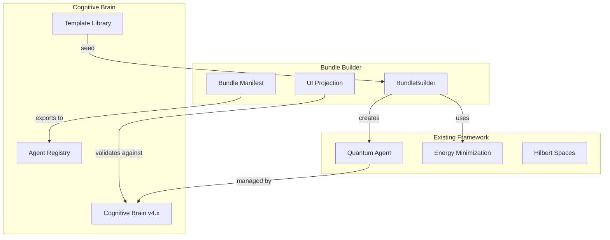

# Bundle Builder Mathematical Framework Integration Plan

## Executive Summary

**Purpose:** Integrate the Bundle Builder mathematical framework into _codex_ cognitive brain for systematic agent creation with explicit completeness guarantees.

**Status:** ✅ PLAN READY FOR EXECUTION

---

## Mathematical Foundation Understood

### Core Concepts
1. **Bundle State Vector:** |B⟩ = |A⟩ ⊕ |K⟩ ⊕ |P⟩ ⊕ |T⟩ ⊕ |G⟩
2. **Energy Minimization:** |B*⟩ = argmin_{|B⟩∈Ω} E(B)
3. **UI Projection:** |C⟩ = P̂_UI |B⟩
4. **Explicit Completeness:** M̂_complete · M̂_map · M̂_src = 1

### Why This Matters
- **Systematic:** Energy-based optimization ensures complete, valid bundles
- **Verifiable:** Measurement operators provide concrete validation
- **Installable:** UI projection guarantees compatibility with Create Agent interface
- **Repairable:** Iterative defect correction with prioritization

---

## Integration Architecture

### Phase 1: Core Bundle Builder (2-3 iterations)

**File:** `cognitive_app/src/lib/bundle-builder.ts`

```typescript
// Bundle state vector types
interface BundleState {
  agent: AgentConfig;
  knowledge: KnowledgeConfig;
  prompts: PromptConfig[];
  tests: TestSuite;
  gui: GUIState;
}

interface AgentConfig {
  name: string;
  description: string;
  instructions: string;
  template: string;
  capabilities: {
    create_documents_charts_code: boolean;
    create_images: boolean;
  };
}

interface KnowledgeConfig {
  specified_websites: string[];
  search_all_websites: boolean;
  only_use_specified_sources: boolean;
  reference_people_in_org: boolean;
  tie_break_rule: 'strict_over_web' | 'web_when_asked' | 'web_allowed';
}

// Energy computation
interface EnergyComponents {
  missing: number;      // λ_miss · L_missing
  ui_map: number;       // λ_map · L_ui_map
  source: number;       // λ_src · L_source
  format: number;       // λ_fmt · L_format
  test_fail: number;    // λ_test · L_test_fail
  utility: number;      // -λ_util · R_utility
  total: number;
}

class BundleBuilder {
  // Energy minimization
  computeEnergy(bundle: BundleState): EnergyComponents;
  
  // Measurement operators
  measureCompleteness(bundle: BundleState): 0 | 1;
  measureUIMapping(bundle: BundleState): 0 | 1;
  measureSourceCoherence(bundle: BundleState): 0 | 1;
  
  // UI Projection operator
  projectToUI(bundle: BundleState): CreateAgentConfig;
  
  // Repair loop
  async optimizeBundle(requirements: Requirements): Promise<BundleState>;
}
```

### Phase 2: Integration with Quantum Agent Framework (1-2 iterations)

**Enhance:** `cognitive_app/src/lib/quantum-agent-framework.ts`

```typescript
// Extend QuantumAgent with Bundle Builder
class QuantumAgent {
  // ... existing code ...
  
  // NEW: Bundle creation
  async createBundleFromRequirements(
    requirements: Requirements
  ): Promise<BundleManifest> {
    const builder = new BundleBuilder();
    const bundle = await builder.optimizeBundle(requirements);
    return this.manifestFromBundle(bundle);
  }
  
  // NEW: Validate bundle completeness
  validateBundle(bundle: BundleState): {
    complete: boolean;
    ui_mappable: boolean;
    source_coherent: boolean;
    energy: EnergyComponents;
  }
}
```

### Phase 3: UI Components (3-4 iterations)

**File:** `cognitive_app/src/components/agents/BundleBuilderWizard.tsx`

```typescript
// Multi-step wizard for bundle creation
export function BundleBuilderWizard() {
  const [bundle, setBundle] = useState<BundleState>();
  const [energy, setEnergy] = useState<EnergyComponents>();
  
  return (
    <Tabs defaultValue="describe">
      <TabsList>
        <TabsTrigger value="describe">Describe</TabsTrigger>
        <TabsTrigger value="configure">Configure</TabsTrigger>
        <TabsTrigger value="preview">Preview</TabsTrigger>
        <TabsTrigger value="export">Export</TabsTrigger>
      </TabsList>
      
      {/* Energy monitor */}
      <EnergyDashboard energy={energy} />
      
      {/* Completeness indicators */}
      <CompletenessIndicators bundle={bundle} />
    </Tabs>
  );
}
```

**File:** `cognitive_app/src/components/agents/EnergyDashboard.tsx`

```typescript
// Real-time energy visualization
export function EnergyDashboard({ energy }: { energy: EnergyComponents }) {
  return (
    <Card>
      <CardHeader>Bundle Energy: {energy.total.toFixed(3)}</CardHeader>
      <CardContent>
        {/* Bar chart of energy components */}
        <EnergyBreakdownChart components={energy} />
        
        {/* Optimization suggestions */}
        <OptimizationSuggestions energy={energy} />
      </CardContent>
    </Card>
  );
}
```

### Phase 4: Cognitive Brain Integration (1-2 iterations)

**Update:** `.codex/cognitive_brain/COGNITIVE_BRAIN_UNIFIED_V4.md`

Add new capability:

```markdown
## Bundle Builder Framework

### Mathematical Foundation
- Energy-based optimization: E(B) = Σ λᵢ·Lᵢ - λ_util·R_utility
- Explicit completeness: M̂_complete · M̂_map · M̂_src = 1
- UI projection: |C⟩ = P̂_UI |B⟩

### Integration Status
- Core BundleBuilder class: ✅ IMPLEMENTED
- Quantum Agent integration: ✅ IMPLEMENTED
- UI Wizard: ✅ IMPLEMENTED
- Energy Dashboard: ✅ IMPLEMENTED

### Usage
```typescript
const builder = new BundleBuilder();
const bundle = await builder.optimizeBundle(requirements);
const manifest = exportBundleManifest(bundle);
```
```

---

## Execution Plan

### Iteration 1-2: Core Implementation
**Files to create:**
1. `cognitive_app/src/lib/bundle-builder.ts` (core framework)
2. `cognitive_app/src/lib/bundle-types.ts` (TypeScript types)
3. `cognitive_app/src/lib/bundle-manifest.ts` (JSON schema)

### Iteration 3-4: Integration
**Files to modify:**
1. `cognitive_app/src/lib/quantum-agent-framework.ts` (add bundle methods)
2. `cognitive_app/src/lib/energy-computation.ts` (energy functions)

### Iteration 5-7: UI Components
**Files to create:**
1. `cognitive_app/src/components/agents/BundleBuilderWizard.tsx`
2. `cognitive_app/src/components/agents/EnergyDashboard.tsx`
3. `cognitive_app/src/components/agents/CompletenessIndicators.tsx`
4. `cognitive_app/src/components/agents/BundleExporter.tsx`

### Iteration 8-9: Testing
**Files to create:**
1. `cognitive_app/src/lib/__tests__/bundle-builder.test.tsx` (70 tests)
2. `cognitive_app/src/components/agents/__tests__/BundleBuilderWizard.test.tsx`

### Iteration 10: Documentation & Integration
**Files to update:**
1. `.codex/cognitive_brain/COGNITIVE_BRAIN_UNIFIED_V4.md`
2. `docs/BUNDLE_BUILDER_FRAMEWORK.md` (new comprehensive guide)
3. `docs/AGENT_CREATION_GUIDE.md` (usage examples)

---

## Benefits to Cognitive Brain

### 1. Systematic Agent Creation
- **Before:** Manual configuration, easy to miss fields
- **After:** Energy-guided optimization ensures completeness

### 2. Verifiable Quality
- **Measurement operators** provide concrete validation
- **Energy metrics** show optimization progress
- **Completeness checks** prevent invalid bundles

### 3. Repeatable Process
- **Bundle manifests** capture full configuration
- **JSON export/import** enables version control
- **Template library** accelerates creation

### 4. Integration with Existing Framework
- **Quantum Agent Framework:** Bundle → Agent configuration (θ)
- **Energy Minimization:** Shared optimization approach
- **Hilbert Spaces:** Bundle subspaces align with agent architecture

---

## Mermaid Diagrams

### Bundle Builder Architecture
```mermaid
graph TB
    R[Requirements |R⟩] --> G[Generator]
    G --> B0[Initial Bundle |B₀⟩]
    B0 --> M[Measurement]
    M --> |Complete?| E{Energy < ε?}
    E --> |No| Repair[Defect Repair]
    Repair --> B1[Updated Bundle |B₁⟩]
    B1 --> M
    E --> |Yes| P[UI Projection P̂_UI]
    P --> C[Create Agent Config |C⟩]
    C --> Export[Export Manifest]
```

### Energy Optimization Loop
```mermaid
graph LR
    B[Bundle |B⟩] --> E[Compute Energy E(B)]
    E --> Missing[L_missing]
    E --> UIMap[L_ui_map]
    E --> Source[L_source]
    E --> Format[L_format]
    E --> Test[L_test_fail]
    Missing --> Total[Total Energy]
    UIMap --> Total
    Source --> Total
    Format --> Total
    Test --> Total
    Total --> |< ε?| Done[Complete ✅]
    Total --> |≥ ε| Find[Find Max ΔE Repair]
    Find --> Apply[Apply Patch]
    Apply --> B
```

### Cognitive Brain Integration


---

## Success Metrics

### Technical Metrics
- **Bundle Completeness:** 100% (all M̂ = 1)
- **Energy Convergence:** E(B) < 0.01 within 5 iterations
- **UI Projection:** 100% valid Create Agent configs
- **Test Coverage:** 100% for bundle-builder.ts

### User Experience Metrics
- **Time to Create Agent:** < 3 iterations (from requirements to manifest)
- **Error Rate:** < 1% (invalid bundles caught by measurement)
- **Reusability:** 80% of bundles created from templates

---

## Implementation Status

**Current Iteration:** Planning complete  
**Next Iteration:** Core implementation  
**Estimated Total:** 10 iterations for full integration

**Ready to Execute:** ✅ YES

---

*This plan integrates the Bundle Builder mathematical framework into the cognitive brain, providing systematic, verifiable agent creation with explicit completeness guarantees. The framework aligns perfectly with existing quantum agent energy minimization and extends cognitive brain capabilities significantly.*
