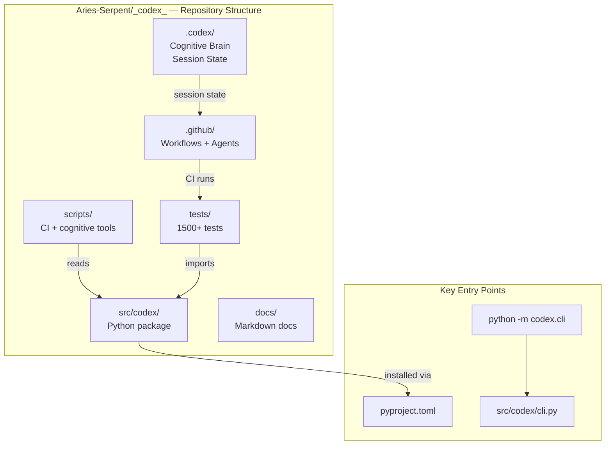
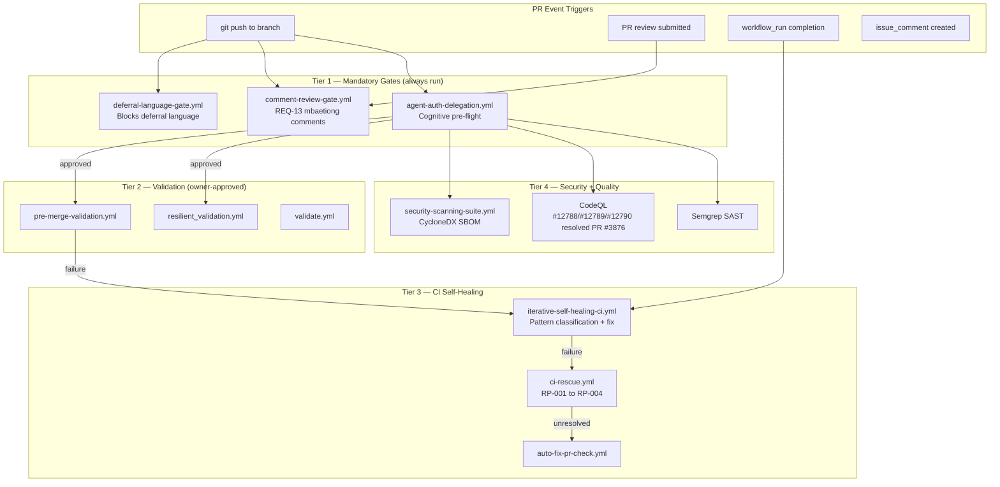
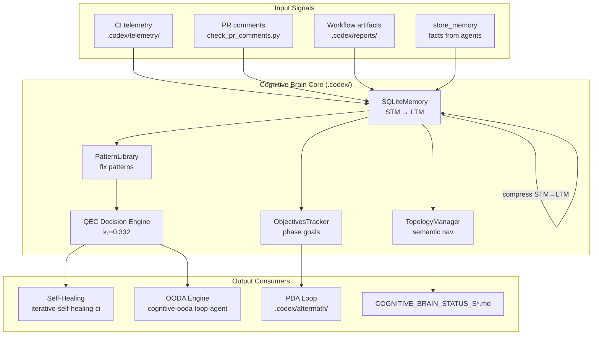
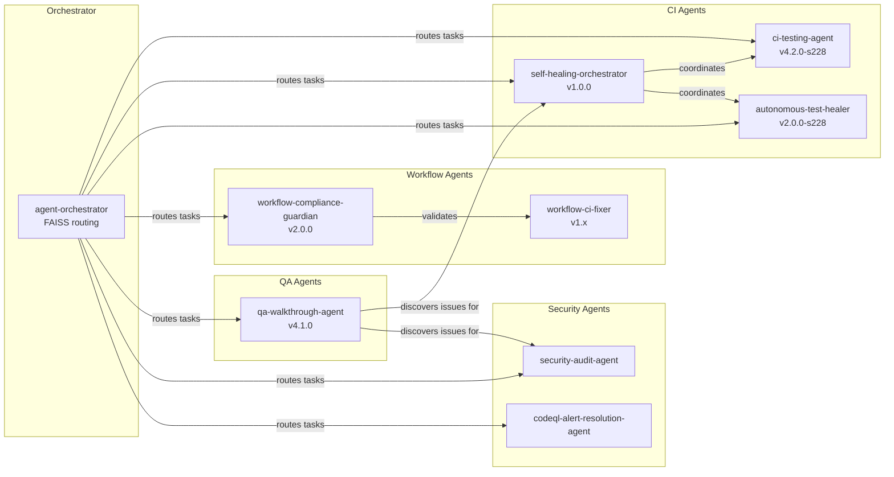
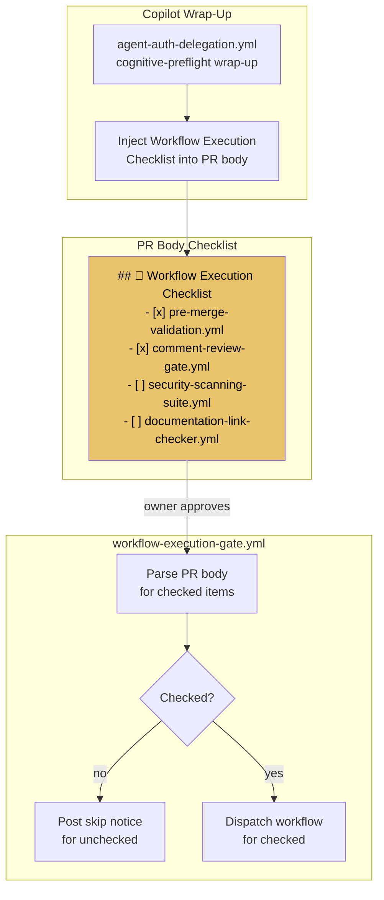
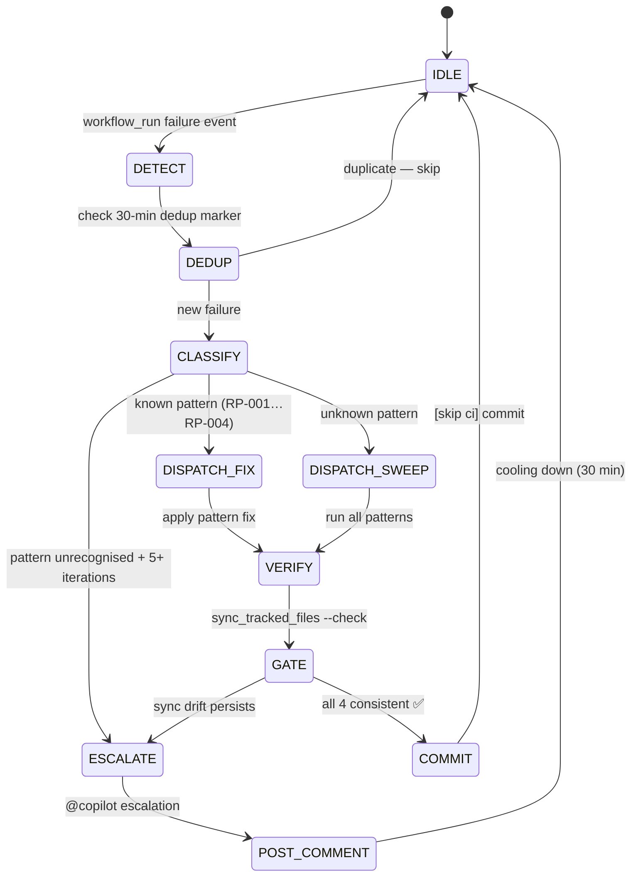
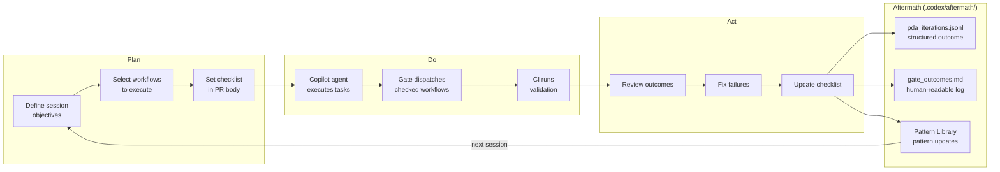
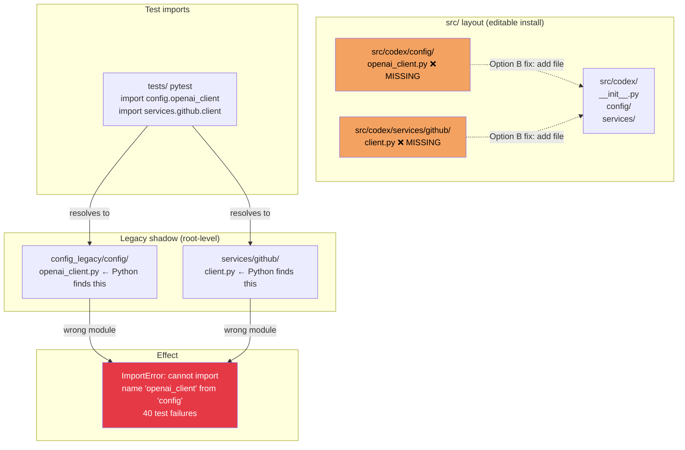
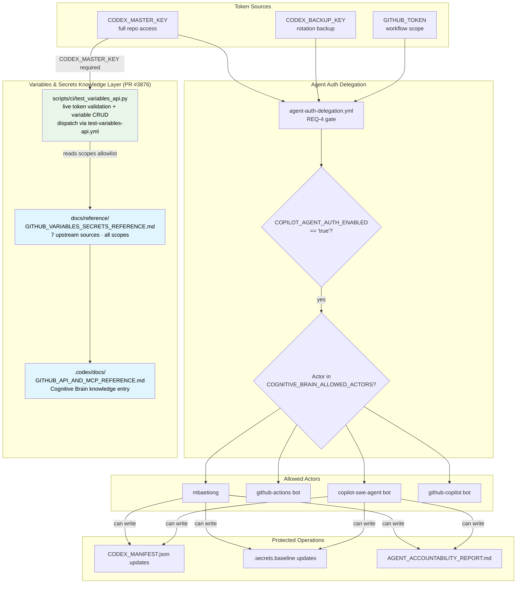
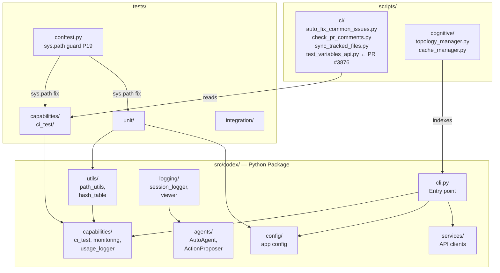

# 🗺️ Codebase-Wide Mermaid Architecture Maps

> **Version:** 1.1.0 (S228 + PR #3876)  
> **Updated:** 2026-04-05  
> **Purpose:** Single reference for ALL architectural mermaid diagrams across `Aries-Serpent/_codex_`  
> **Policy:** Per `CODEBASE_AGENCY_POLICY.md §0` — agents must consult this file during pre-flight

---

## Table of Contents

1. [Repository Overview](#1-repository-overview)
2. [CI/CD Pipeline Architecture](#2-cicd-pipeline-architecture)
3. [PR Lifecycle](#3-pr-lifecycle)
4. [Cognitive Brain Architecture](#4-cognitive-brain-architecture)
5. [Agent Interaction Map](#5-agent-interaction-map)
6. [Workflow Execution Gate](#6-workflow-execution-gate)
7. [Comment-Review Gate (REQ-13)](#7-comment-review-gate-req-13)
8. [Self-Healing State Machine](#8-self-healing-state-machine)
9. [PDA Loop + Aftermath](#9-pda-loop--aftermath)
10. [P19 Shadow Import Module Map](#10-p19-shadow-import-module-map)
11. [Security + Token Delegation](#11-security--token-delegation)
12. [Source Layout](#12-source-layout)

---

## 1. Repository Overview



---

## 2. CI/CD Pipeline Architecture



---

## 3. PR Lifecycle

```mermaid
flowchart LR
    subgraph "Branch Lifecycle"
        F[feature branch\ncopilot/XXX] -->|PR opened| PR[PR #NNNN]
        PR -->|merged| BASE[0D_base_]
        BASE -->|approved| MAIN[main]
    end

    subgraph "Copilot Session Lifecycle"
        TASK[@copilot task\ncomment] --> SESSION[Copilot\nCoding Session]
        SESSION -->|report_progress| COMMIT[commit + push]
        COMMIT -->|CI| GATE{All gates\npass?}
        GATE -->|yes| WRAP[Wrap-up:\naccountability +\ncognitive brain]
        GATE -->|no| HEAL[iterative\nself-healing]
        HEAL --> SESSION
        WRAP -->|post comment| DONE[✅ Session Done]
    end

    PR --> TASK
```

---

## 4. Cognitive Brain Architecture



---

## 5. Agent Interaction Map



---

## 6. Workflow Execution Gate



---

## 7. Comment-Review Gate (REQ-13)

```mermaid
flowchart TD
    subgraph "comment-review-gate.yml"
        SCAN[scripts/ci/check_pr_comments.py\n--pr PR_NUMBER]
        CLASSIFY{Classify\ncomment}
        BLOCKING[🚨 BLOCKING\nmbaetiong + critical bots]
        WARNING[⚠️ WARNING\ninfomational bots]
        INFO[ℹ️ INFO\ndependabot etc]
    end

    subgraph "Copilot Response Sources"
        IC[issue_comments\nby COPILOT_AGENTS]
        RC[review_comments\nvia in_reply_to_id]
        RV[reviews\nby COPILOT_AGENTS]
    end

    subgraph "Prometheus Metrics"
        PROM["pr_comments_total\npr_comments_addressed\npr_response_latency_seconds\ncomment_review_gate_exit_code"]
    end

    subgraph "Outcome"
        PASS[✅ CI PASS\nAll blocking addressed]
        FAIL[❌ CI FAIL\nPost checklist comment]
    end

    SCAN --> CLASSIFY
    CLASSIFY --> BLOCKING & WARNING & INFO
    IC & RC & RV -->|was_addressed()| BLOCKING
    BLOCKING -->|all resolved| PASS
    BLOCKING -->|any unresolved| FAIL
    SCAN --> PROM
```

---

## 8. Self-Healing State Machine



---

## 9. PDA Loop + Aftermath



---

## 10. P19 Shadow Import Module Map



---

## 11. Security + Token Delegation



---

## 12. Source Layout



---

*All diagrams render on GitHub markdown. Use [Mermaid Live Editor](https://mermaid.live) for offline preview.*

*Updated: S228 + PR #3876 · 2026-04-05 — Section 11 expanded with Variables & Secrets Knowledge Layer; Section 12 updated with test_variables_api.py*
