# 🗺️ Codebase-Wide Mermaid Architecture Maps

> **Version:** 1.4.1 (S1292a · 2026-06-03)  
> **Updated:** 2026-06-03  
> **Purpose:** Single reference for ALL architectural mermaid diagrams across `Aries-Serpent/_codex_`  
> **Policy:** Per `CODEBASE_AGENCY_POLICY.md §0` — agents must consult this file during pre-flight  
> **Previous:** v1.3.0 S1259 · 2026-05-23

---

## Table of Contents

1. [Repository Overview](#1-repository-overview)
2. [CI/CD Pipeline Architecture](#2-cicd-pipeline-architecture)
3. [PR Lifecycle](#3-pr-lifecycle)
4. [Cognitive Brain Architecture](#4-cognitive-brain-architecture)
5. [Agent Interaction Map](#5-agent-interaction-map)
6. [Workflow Execution Gate](#6-workflow-execution-gate)
7. [Comment-Review Gate (REQ-13)](#7-comment-review-gate-req-13)
8. [Self-Healing State Machine](#8-self-healing-state-machine)
9. [PDA Loop + Aftermath](#9-pda-loop--aftermath)
10. [P19 Shadow Import Module Map](#10-p19-shadow-import-module-map)
11. [Security + Token Delegation](#11-security--token-delegation)
12. [Source Layout](#12-source-layout)
13. [Autonomous Privilege Architecture](#13-autonomous-privilege-architecture)
14. [Rate-Limit Orchestration Flow](#14-rate-limit-orchestration-flow)
15. [Session Handoff State Machine](#15-session-handoff-state-machine)
16. [Phase 9 — Cognitive Brain Autonomous Ops](#16-phase-9--cognitive-brain-autonomous-ops)
17. [Phase 10 — Post-Coverage Maintenance](#17-phase-10--post-coverage-maintenance)
18. [Phase 10 Progress — Coverage Expansion ⭐ NEW](#18-phase-10-progress--coverage-expansion)

---

## 1. Repository Overview

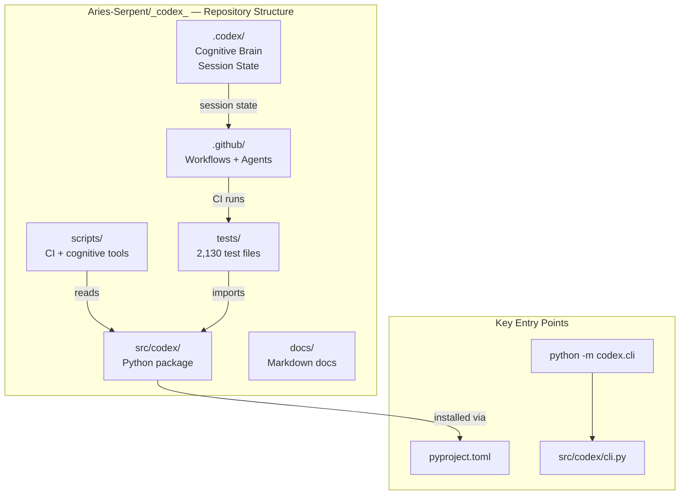

---

## 2. CI/CD Pipeline Architecture

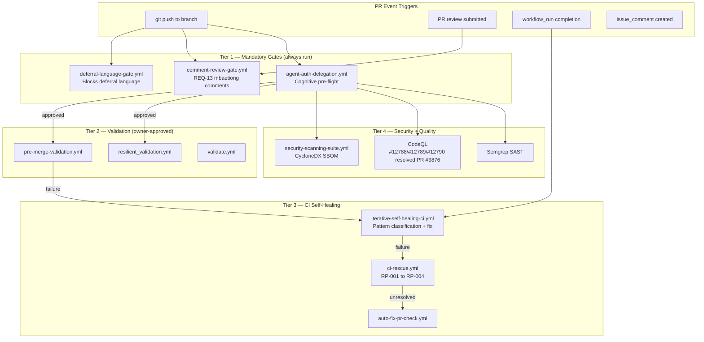

---

## 3. PR Lifecycle

```mermaid
%%{init: {'accessibility': {'title': 'Flowchart showing feature branch\ncopilot/XXX, PR #NNNN'}}%%
flowchart LR
    subgraph "Branch Lifecycle"
        F[feature branch\ncopilot/XXX] -->|PR opened| PR[PR #NNNN]
        PR -->|merged| BASE[0D_base_]
        BASE -->|approved| MAIN[main]
    end

    subgraph "Copilot Session Lifecycle"
        TASK[@copilot task\ncomment] --> SESSION[Copilot\nCoding Session]
        SESSION -->|report_progress| COMMIT[commit + push]
        COMMIT -->|CI| GATE{All gates\npass?}
        GATE -->|yes| WRAP[Wrap-up:\naccountability +\ncognitive brain]
        GATE -->|no| HEAL[iterative\nself-healing]
        HEAL --> SESSION
        WRAP -->|post comment| DONE[✅ Session Done]
    end

    PR --> TASK
```

---

## 4. Cognitive Brain Architecture

> **Updated S873 (2026-05-08)** — Phase 9 Autonomous Ops, rate-limit orchestration, session handoff, and memory-sync agent added.

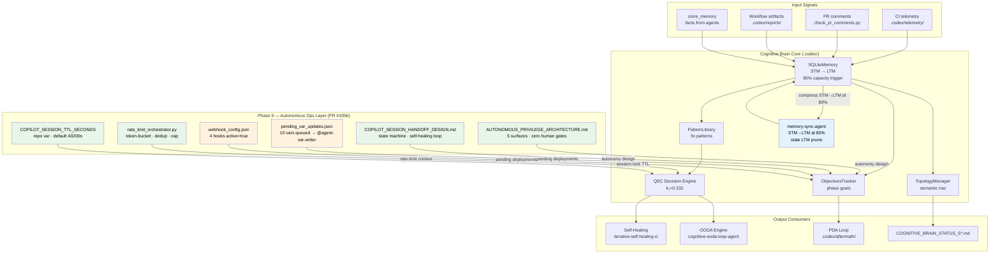

---

## 5. Agent Interaction Map

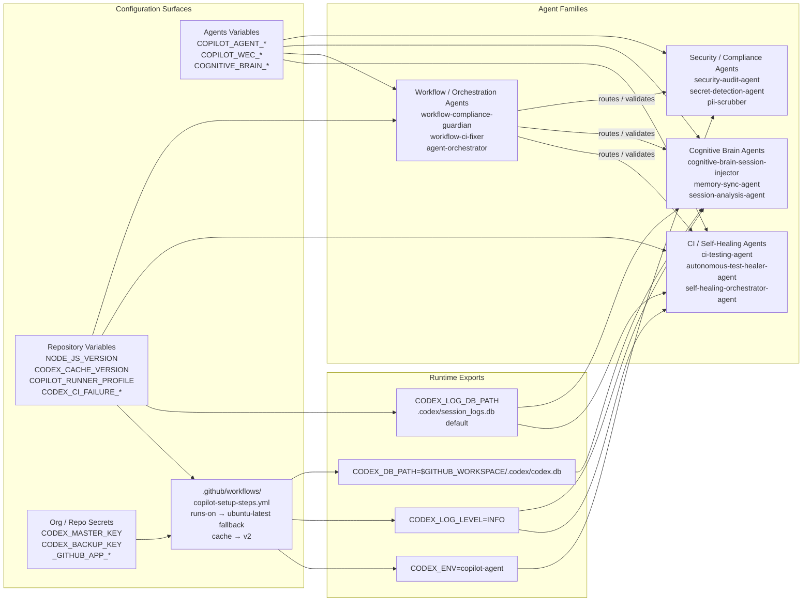

---

## 6. Workflow Execution Gate

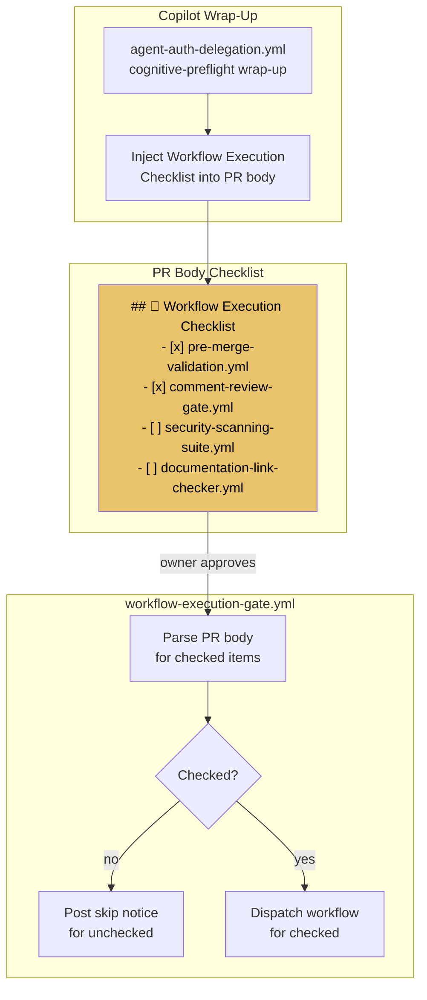

---

## 7. Comment-Review Gate (REQ-13)

```mermaid
%%{init: {'accessibility': {'title': 'Flowchart showing scripts/ci/check_pr_comments.py\n--pr PR_NUMBER, 🚨 BLOCKING\nmbaetiong + critical bots'}}%%
flowchart TD
    subgraph "comment-review-gate.yml"
        SCAN[scripts/ci/check_pr_comments.py\n--pr PR_NUMBER]
        CLASSIFY{Classify\ncomment}
        BLOCKING[🚨 BLOCKING\nmbaetiong + critical bots]
        WARNING[⚠️ WARNING\ninfomational bots]
        INFO[ℹ️ INFO\ndependabot etc]
    end

    subgraph "Copilot Response Sources"
        IC[issue_comments\nby COPILOT_AGENTS]
        RC[review_comments\nvia in_reply_to_id]
        RV[reviews\nby COPILOT_AGENTS]
    end

    subgraph "Prometheus Metrics"
        PROM["pr_comments_total\npr_comments_addressed\npr_response_latency_seconds\ncomment_review_gate_exit_code"]
    end

    subgraph "Outcome"
        PASS[✅ CI PASS\nAll blocking addressed]
        FAIL[❌ CI FAIL\nPost checklist comment]
    end

    SCAN --> CLASSIFY
    CLASSIFY --> BLOCKING & WARNING & INFO
    IC & RC & RV -->|was_addressed()| BLOCKING
    BLOCKING -->|all resolved| PASS
    BLOCKING -->|any unresolved| FAIL
    SCAN --> PROM
```

---

## 8. Self-Healing State Machine

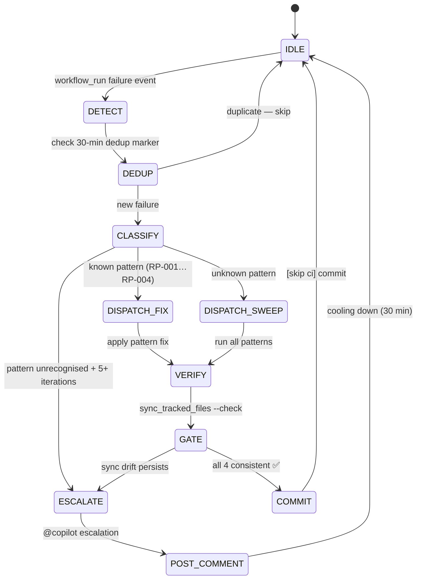

---

## 9. PDA Loop + Aftermath

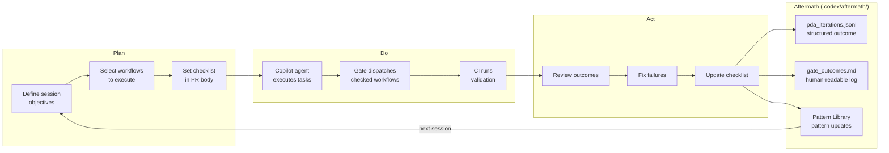

---

## 10. P19 Shadow Import Module Map

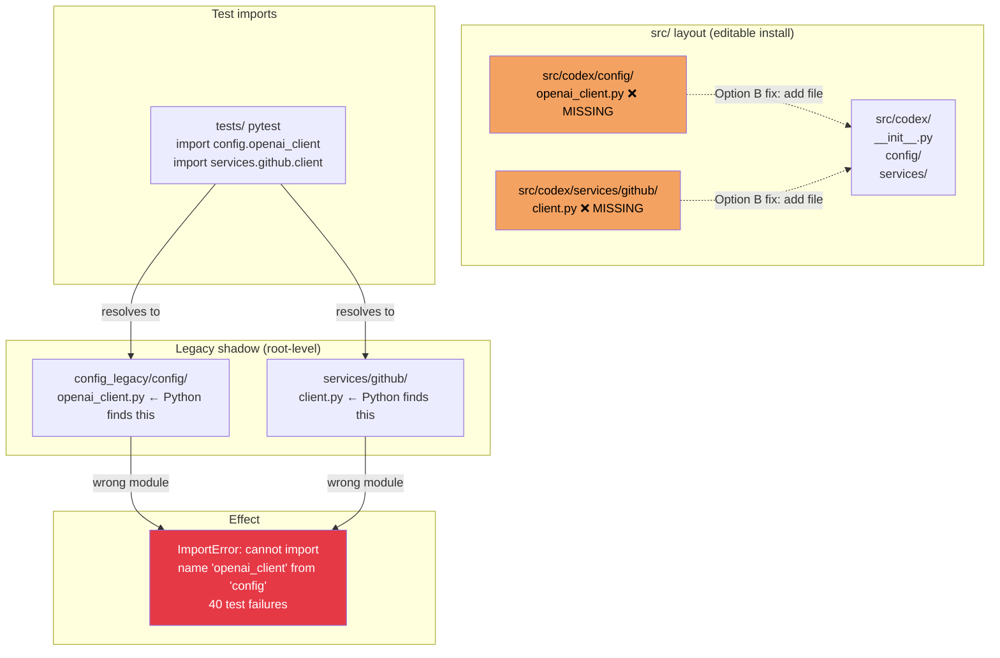

---

## 11. Security + Token Delegation

> **Updated S873 (2026-05-08)** — T-01 fix: `workflow-link-validation.yml` now uses canonical token chain. TTL read from `COPILOT_SESSION_TTL_SECONDS` repo variable (PR #4356).

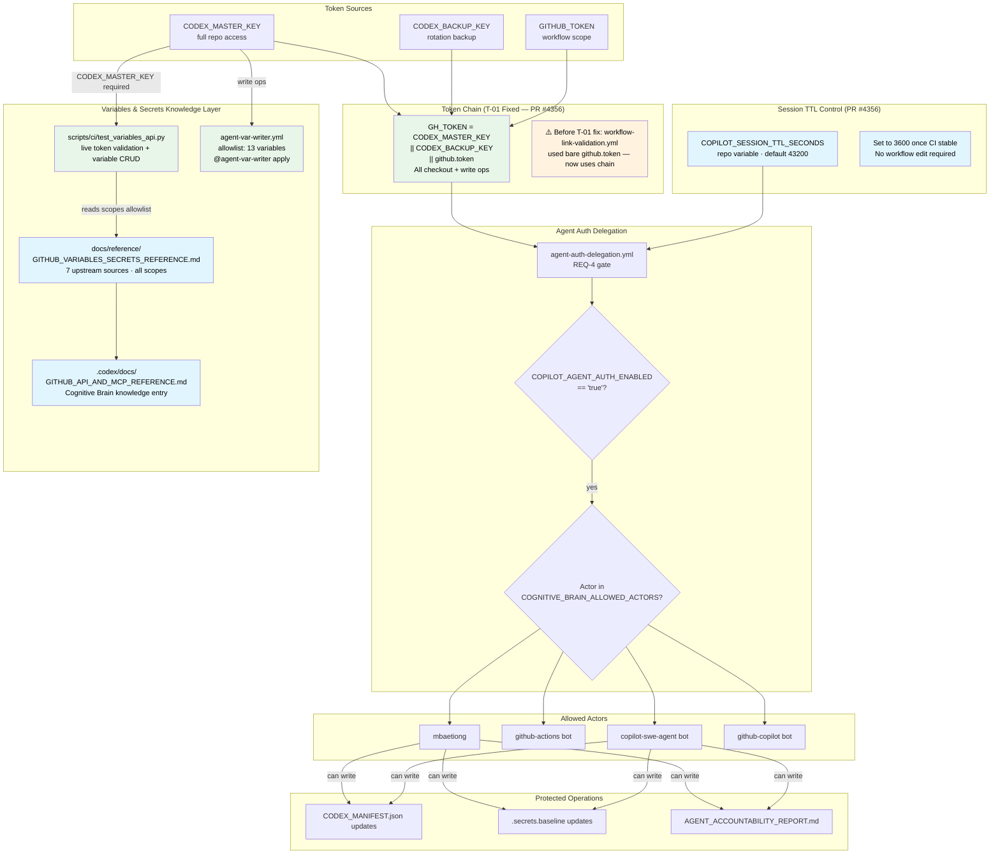

---

## 12. Source Layout

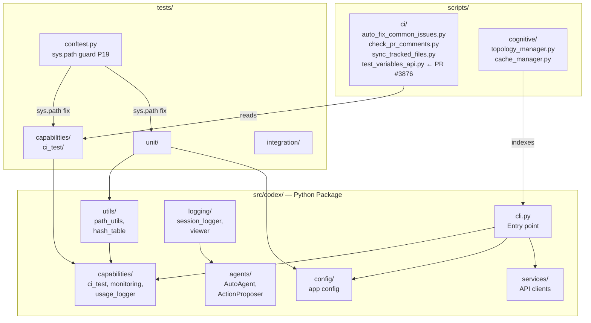

---

*All diagrams render on GitHub markdown. Use [Mermaid Live Editor](https://mermaid.live) for offline preview.*

*Previously: S228 + PR #3876 · 2026-04-05 — Section 11 expanded; Section 12 updated with test_variables_api.py*

---

## 13. Autonomous Privilege Architecture

> **Added S867 (PR #4356)** — Full reference: `docs/plans/AUTONOMOUS_PRIVILEGE_ARCHITECTURE.md`

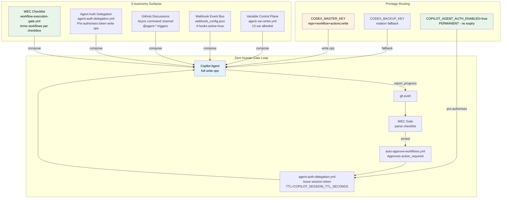

---

## 14. Rate-Limit Orchestration Flow

> **Added S867 (PR #4356)** — Script: `scripts/ci/rate_limit_orchestrator.py`

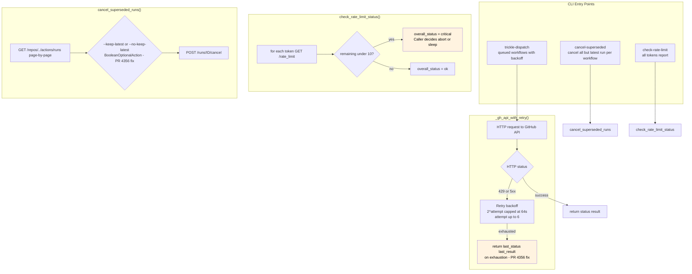

---

## 15. Session Handoff State Machine

> **Added S867 (PR #4356)** — Full doc: `docs/plans/COPILOT_SESSION_HANDOFF_DESIGN.md`

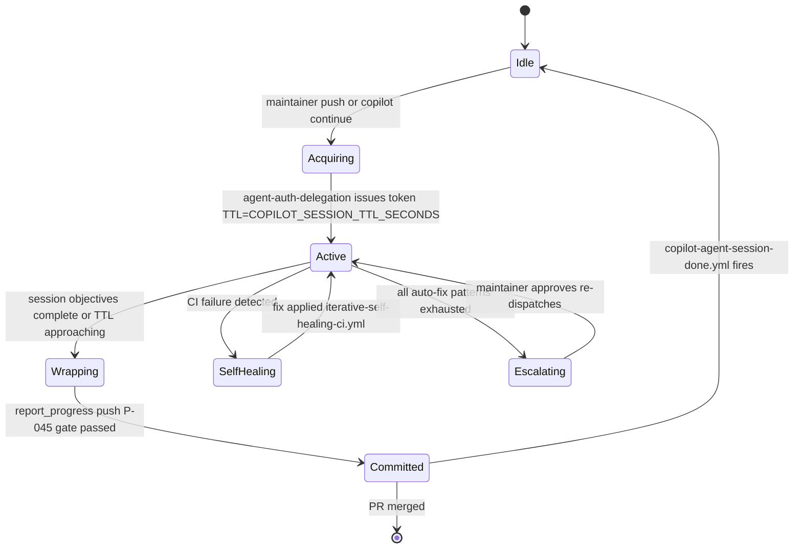

---

## 16. Phase 9 — Cognitive Brain Autonomous Ops

> **Added S867–S873 (PR #4356) · Completed S1259 (2026-05-23)**

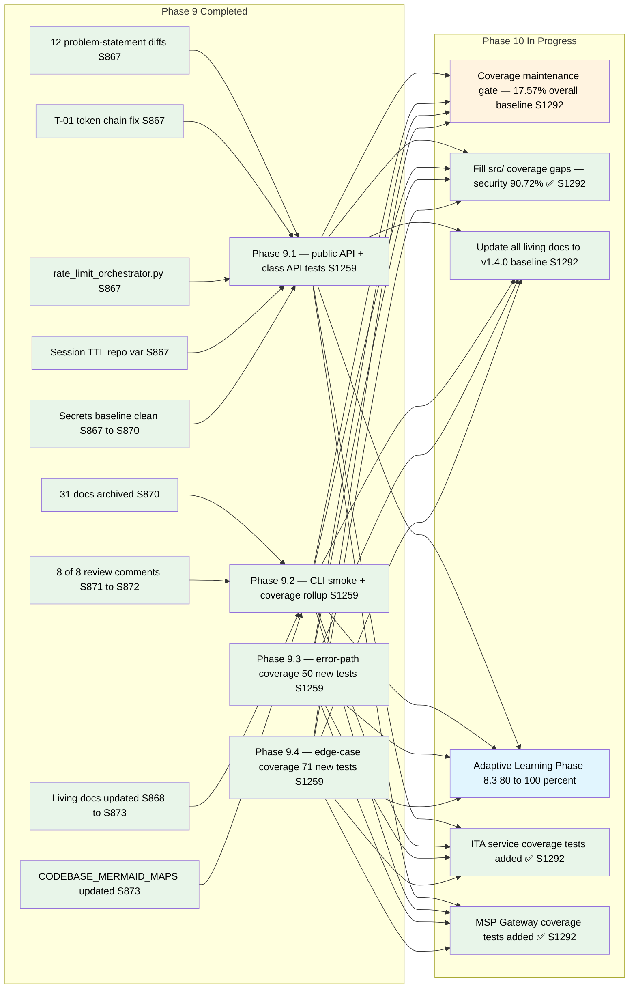

---

## 17. Phase 10 — Post-Coverage Maintenance

> **Added S1259 (2026-05-23) · Updated S1292 (2026-05-28)**

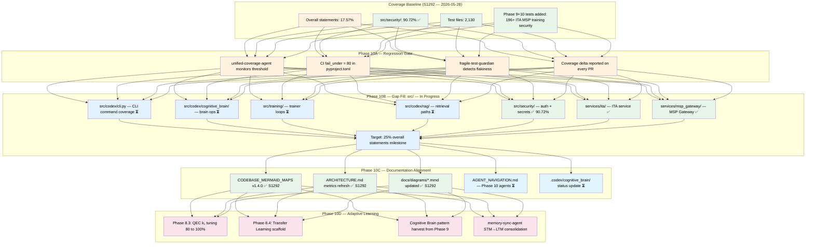

---

## 18. Phase 10 Progress — Coverage Expansion

> **Updated S1293 (2026-05-28)**

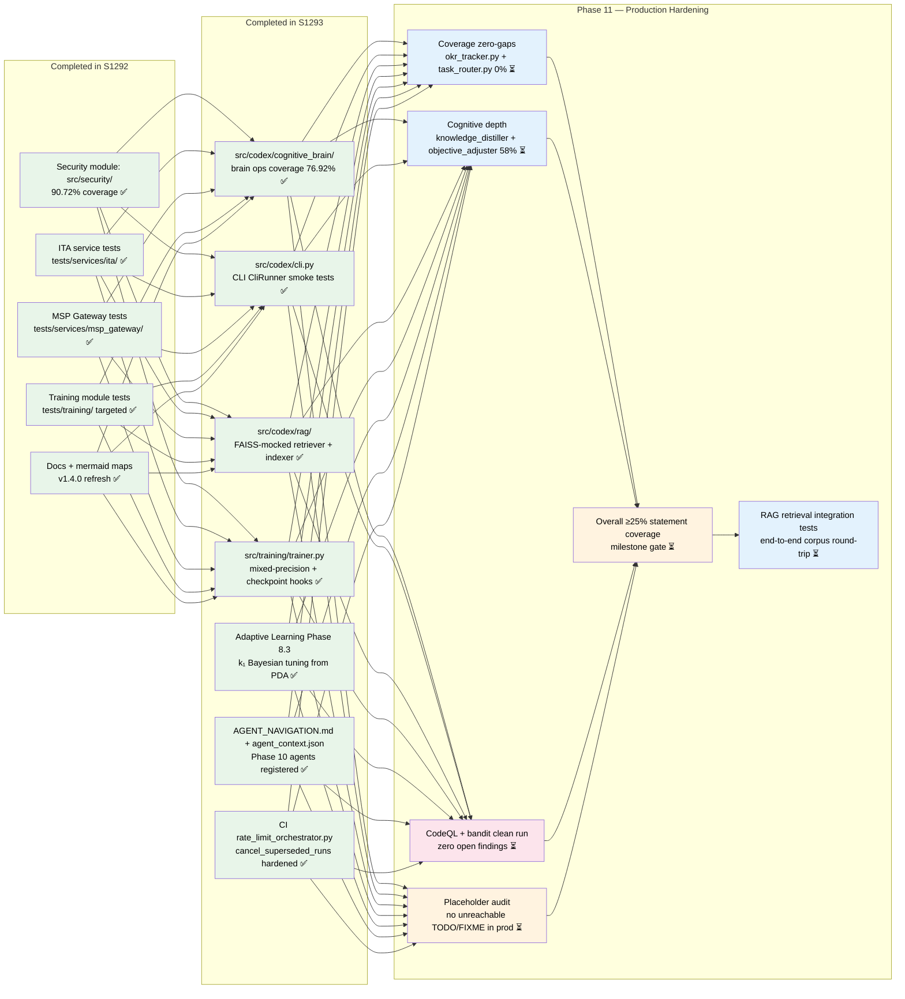

---

## Continuation Prompts

> One tailored prompt per component requiring ongoing work. Use these to resume work in a new session.
> **Phase 10 items below are COMPLETED (S1293).** Phase 11 prompts follow.

### ✅ DONE — Coverage: `src/codex/cognitive_brain/` (S1293)
> OODAOrchestrator, SharedMemory, PatternLibrary tests added. `tests/cognitive/test_ooda_meta_learning_coverage.py`

### ✅ DONE — Coverage: `src/codex/cli.py` (S1293)
> CliRunner smoke + branch tests. `tests/codex/test_cli_click_lightweight_smoke.py`

### ✅ DONE — Coverage: `src/codex/rag/` (S1293)
> FAISS-mocked indexer, retriever, embedding cache. `tests/rag/test_rag_faiss_mocked_units.py`

### ✅ DONE — Coverage: `src/training/trainer.py` (S1293)
> Mixed-precision + checkpoint hooks. `tests/unit/test_trainer_checkpoint_hooks_phase10.py`

### ✅ DONE — Adaptive Learning QEC k₁ Tuning Phase 8.3 (S1293)
> Bayesian tuning from pda_iterations.jsonl. `src/cognitive_brain/quantum/adaptive_scoring.py`

### ✅ DONE — AGENT_NAVIGATION.md + .codex status (S1293)
> Phase 10 agents registered. `.codex/AGENT_NAVIGATION.md`, `.codex/agent_context.json`

### ✅ DONE — CI superseded-run cancellation hardening (S1293)
> `cancel_superseded_runs()` wrapper with `--keep-latest` default. `scripts/ci/rate_limit_orchestrator.py`

---

## Phase 11 Continuation Prompts

> Target: ~100% production readiness — zero CodeQL/security findings, no placeholder code, overall ≥25% statement coverage.

### 🔴 P11-SEC: CodeQL + Bandit clean run
```
You are continuing Phase 11 security hardening on Aries-Serpent/_codex_.
Context: CodeQL open findings must reach zero before production gate.
Task:
1. Run bandit scan: bandit -r src/ -ll -ii -x src/codex/rag/,src/security/ --format json > reports/bandit_phase11.json
2. Review open CodeQL alerts via GitHub MCP (list_code_scanning_alerts)
3. Fix any CWE-078 (os.system), CWE-089 (SQLi), CWE-601 (open redirect) in src/
4. Re-run bandit; assert exit code 0
5. Run: python -m pytest tests/security/ --cov=src/security --cov-report=term-missing -q
6. Update docs/CODEBASE_MERMAID_MAPS.md Section 18 N3 node to ✅
Constraints: No suppression comments unless a true false-positive with justification.
```

### 🔴 P11-PLACEHOLDER: Audit TODO/FIXME/placeholder in production code
```
You are continuing Phase 11 code hardening on Aries-Serpent/_codex_.
Context: Production code must contain no unintentional TODO/FIXME stubs or NotImplementedError raises.
Task:
1. grep -r "TODO\|FIXME\|raise NotImplementedError\|pass  # placeholder" src/ > reports/placeholder_audit.txt
2. For each hit: either implement the stub, convert to a logged warning, or add an explicit @pytest.mark.skip
3. Verify no new test failures: python -m pytest tests/ -q --tb=no -x
4. Update docs/CODEBASE_MERMAID_MAPS.md Section 18 N4 node to ✅
Constraints: Do NOT delete test stubs — only production src/ paths.
```

### 🔵 P11-COV-ZERO: Close 0%-coverage modules
```
You are continuing Phase 11 coverage work on Aries-Serpent/_codex_.
Context: Two modules remain at 0% coverage from the S1293 cognitive run.
Files: src/codex/cognitive/okr_tracker.py (141 stmts, 0%), src/codex/cognitive/task_router.py (104 stmts, 0%)
Task: Add targeted tests to reach ≥60% on each file.
Constraints:
- Use tests/cognitive/ directory
- Mock all external I/O (DB, HTTP)
- Do NOT alter existing tests
- Run: python -m pytest tests/cognitive/ --cov=src/codex/cognitive --cov-report=term-missing -q
- Update docs/CODEBASE_MERMAID_MAPS.md Section 18 N1 node to ✅
```

### 🔵 P11-COV-DEPTH: Raise low-coverage cognitive modules to ≥75%
```
You are continuing Phase 11 coverage depth work on Aries-Serpent/_codex_.
Context: Several cognitive modules are at 58–69% coverage after S1293.
Files (current → target):
  src/codex/cognitive/knowledge_distiller.py     58% → 75%
  src/codex/cognitive/objective_adjuster.py      58% → 75%
  src/codex/cognitive/session_hook.py            69% → 80%
  src/codex/cognitive/retrieval_optimizer.py     69% → 80%
Task: Add gap-filling tests for each module.
Constraints:
- Use tests/cognitive/ directory
- Run: python -m pytest tests/cognitive/ --cov=src/codex/cognitive --cov-report=term-missing -q
- Update docs/CODEBASE_MERMAID_MAPS.md Section 18 N2 node to ✅
```

### 🔵 P11-COV-MILESTONE: Reach overall ≥25% statement coverage
```
You are driving the Phase 11 overall coverage milestone on Aries-Serpent/_codex_.
Context: Current overall coverage baseline is 17.57% (S1292). Target: 25%.
Task:
1. Run: python -m pytest tests/ --cov=src --cov-report=term-missing -q > reports/coverage_phase11.txt
2. Identify top-10 uncovered modules by statement count
3. Add targeted tests for the top-3 modules not already in the P11 backlog
4. Re-run coverage; assert ≥25%
5. Update docs/CODEBASE_MERMAID_MAPS.md Section 18 N5 node to ✅
```

### 🟡 P11-RAG-E2E: RAG end-to-end corpus round-trip test
```
You are continuing Phase 11 RAG integration work on Aries-Serpent/_codex_.
Context: Unit tests with FAISS mocks exist (S1293). Full corpus round-trip is not yet tested.
Task:
1. Read src/codex/rag/indexer.py and src/codex/rag/retriever.py
2. Write an integration test that indexes a 5-document corpus and queries it
3. Use pytest tmp_path for index persistence; skip if faiss not installed
4. Run: python -m pytest tests/rag/ --cov=src/codex/rag --cov-report=term-missing -q
5. Update docs/CODEBASE_MERMAID_MAPS.md Section 18 N6 node to ✅
```

---

*All diagrams render on GitHub markdown. Use [Mermaid Live Editor](https://mermaid.live) for offline preview.*

*Updated: S1293 · 2026-05-28 — v1.5.0: Phase 10 items fully completed (cognitive brain 76.92%, CLI, RAG, trainer, k₁ tuning, agent nav, CI dedup); Phase 11 hardening prompts added (CodeQL clean, placeholder audit, 0%-coverage modules, ≥25% overall milestone, RAG E2E).*
