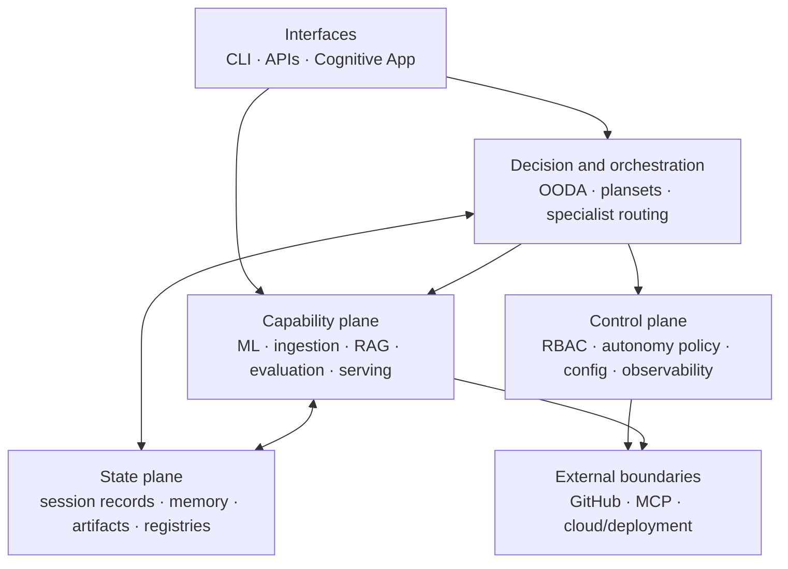
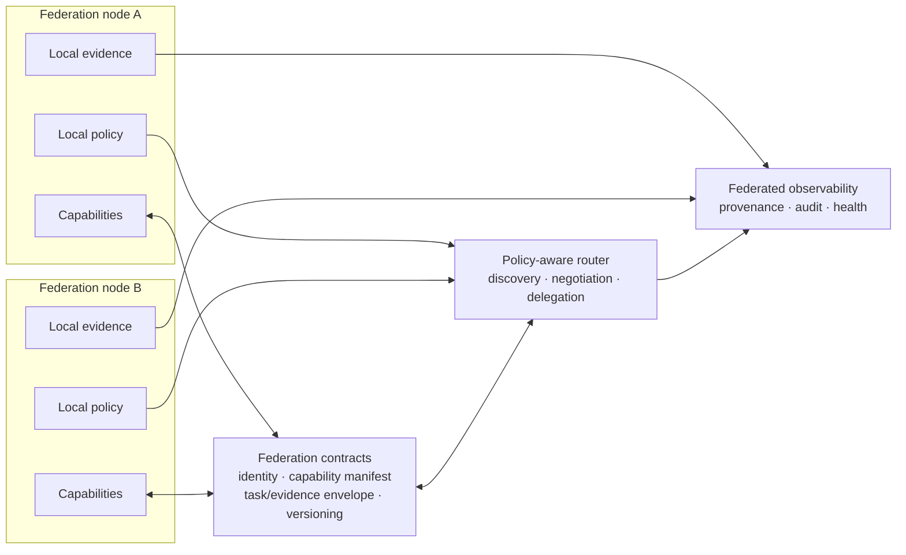

# Codex Ecosystem Index

> **As of:** 2026-09-12  
> **Package version:** 0.3.0  
> **Scope:** evidence-based current repository architecture and a proposed federated target

This index separates what exists in this checkout from the ecosystem the roadmap proposes.
“Implemented” means a source or configuration surface exists; it does not imply deployment,
live connectivity, or permission to actuate.

## Current repository architecture

The five-layer interpretation is documented in
[`REPOSITORY_EXPLANATION.md`](REPOSITORY_EXPLANATION.md#4-canonical-five-layer-architecture).
The diagram above emphasizes execution planes without replacing those canonical layers.

## Current-state evidence matrix

| Surface | Current evidence | Evidence-based status |
|---|---|---|
| Distribution and runtime | [`pyproject.toml`](../pyproject.toml) declares `codex-ml` 0.3.0, Python 3.12, dependencies, extras, and package mappings. | Implemented package contract |
| ML and retrieval | [`src/codex_ml/`](../src/codex_ml/) and [`src/rag/`](../src/rag/) contain training, evaluation, inference, serving, indexing, and retrieval implementations. | Implemented; features vary by dependency profile |
| Cognitive orchestration | [`src/aries_serpent_core/cognitive/planset_orchestrator.py`](../src/aries_serpent_core/cognitive/planset_orchestrator.py) maps repository plans to ranked prompt sets. | Repository-local planning engine |
| Ecosystem observation | [`src/aries_serpent_core/brain/ooda_observer.py`](../src/aries_serpent_core/brain/ooda_observer.py) returns explicitly labelled representative agent data. | Scaffold/sample, not live federation telemetry |
| Authorization | [`src/aries_serpent_core/governance/rbac.py`](../src/aries_serpent_core/governance/rbac.py) defines roles and an action/resource permission matrix. | Implemented local policy surface |
| Autonomy enforcement | [`src/aries_serpent_core/autonomy/registry.py`](../src/aries_serpent_core/autonomy/registry.py) applies kill-switch, surface, mode, approval, and dry-run checks. | Guarded, policy-scoped actuation |
| Checked-in agent mode | [`.codex/autonomous_agent.yaml`](../.codex/autonomous_agent.yaml) enables selected operations while retaining approval and escalation categories. | Enabled configuration, not proof of live authority |
| Agent inventory | [`CODEX_MANIFEST.json`](../CODEX_MANIFEST.json) records per-agent role, enforcement tier, and autonomy model. | Generated repository inventory |
| Delivery boundaries | [`docker/`](../docker/), [`k8s/`](../k8s/), and [`infrastructure/`](../infrastructure/) contain deployment declarations. | Multiple deployment options; environment-specific |

## Federated target ecosystem

The target is a set of independently governed repository or service nodes that exchange
versioned capability, evidence, and policy envelopes. It is **not the current runtime**.
The roadmap names multi-repository support, distributed agents, knowledge sharing, and
unified orchestration as future work
([`ROADMAP.md`](ROADMAP.md#phase-3-current-cycle-objectives)).

### Required transition contracts

1. **Identity and trust:** stable node and agent identities, authentication, revocation,
   and least-privilege delegation.
2. **Capability discovery:** versioned manifests with inputs, outputs, constraints, and
   compatibility rules.
3. **Task and evidence envelopes:** correlation IDs, provenance, idempotency, result
   status, and audit references.
4. **Policy negotiation:** local policy always constrains delegated authority; no remote
   node may raise its own autonomy ceiling.
5. **Observability:** distinguish sampled, simulated, cached, and live health data.
6. **Failure semantics:** bounded retries, cancellation, partial-failure reporting, and
   deterministic handoff recovery.

These are target requirements, not claims of implementation. Existing local primitives
provide starting points: RBAC in
[`src/aries_serpent_core/governance/rbac.py`](../src/aries_serpent_core/governance/rbac.py),
autonomy checks in
[`src/aries_serpent_core/autonomy/registry.py`](../src/aries_serpent_core/autonomy/registry.py),
and planset routing in
[`src/aries_serpent_core/cognitive/planset_orchestrator.py`](../src/aries_serpent_core/cognitive/planset_orchestrator.py).

## Navigation

- [Architecture overview](architecture.md)
- [Evidence-based repository explanation](REPOSITORY_EXPLANATION.md)
- [Repository map](REPOSITORY_MAP.md)
- [Workflow and governance map](WORKFLOW_MAP.md)
- [Next-session architecture plan](plans/ARCHITECTURE_NEXT_SESSION.md)
