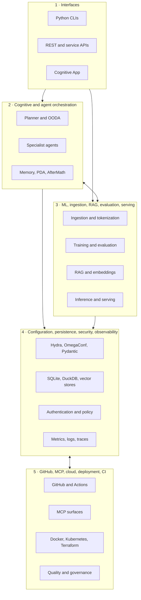
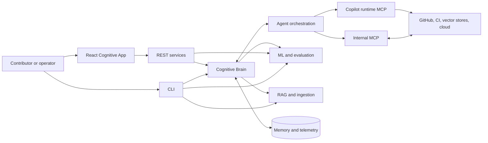
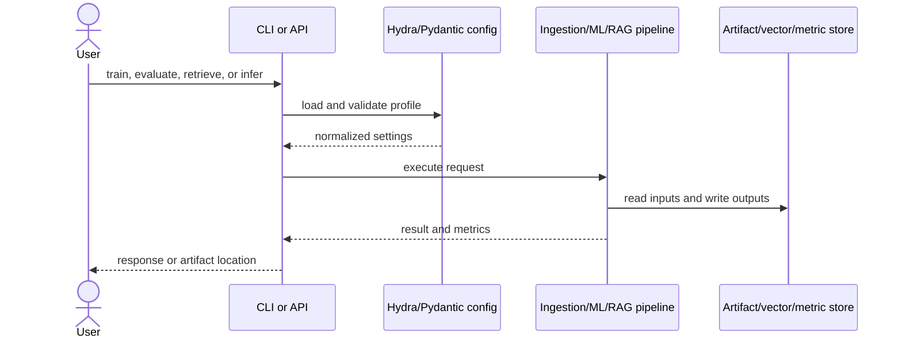
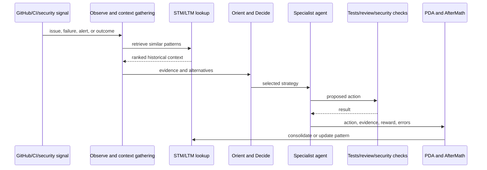

# `_codex_` Repository Briefing

> **Package:** `codex-ml` 0.3.0  
> **Python:** 3.12 or newer  
> **Last source audit:** 2026-08-01  
> **Document owner:** `unified-doc-agent`  
> **Authority:** current manifests and source code, not historical status reports

This is the canonical orientation document for `Aries-Serpent/_codex_`. Counts that
change at runtime are dated. A component marked **implemented** exists in the
repository; that label alone does not prove that it is deployed or enabled.

## 1. Status vocabulary

| Label | Meaning |
|---|---|
| **Implemented** | Source, configuration, or a runnable entry point exists. |
| **Optional** | Implemented behind an extra dependency, service, or explicit configuration. |
| **Experimental** | A prototype, scaffold, experiment, or non-default integration. |
| **Compatibility** | Retained to support an older import, layout, or configuration path. |
| **Historical** | Evidence about an earlier state; not a current contract. |
| **Aspirational** | A design or roadmap statement without a complete implementation contract. |

Authoritative package facts come from [`pyproject.toml`](../pyproject.toml), frontend
facts from [`cognitive_app/package.json`](../cognitive_app/package.json), Rust facts
from [`Cargo.toml`](../Cargo.toml), and test discovery from
[`pytest.ini`](../pytest.ini).

## 2. What the repository is for

`_codex_` combines an ML platform with repository automation and a persistent
decision-and-learning layer. Its implemented surfaces support these journeys:

| Journey | Principal path | Status |
|---|---|---|
| Train or evaluate a model | CLI → Hydra/OmegaConf config → ingestion/tokenization → `codex_ml` training/evaluation | Implemented; heavy ML packages are optional |
| Run inference or serve a model | `codex_ml` inference → FastAPI or Ray Serve integration | Optional runtime profile |
| Ingest and retrieve knowledge | ingestion → chunking/embedding → `rag` retrieval and evaluation | Implemented; vector backends vary by profile |
| Process repository signals | GitHub/CI/security observation → logging, recommendation, or specialist tooling | Partly operational; there is no unified autonomous OODA runtime |
| Preserve operational learning | CI failure/fix records, session records, and several independent memory engines | Fragmented; JSONL logging is operational, adaptive policy learning is experimental |
| Expose repository tools | internal `src/mcp` JSON-RPC/HTTP server or Copilot runtime MCP aggregator | Two distinct implemented surfaces |
| Operate the dashboard | React/Vite Cognitive App → API and telemetry surfaces | Implemented frontend; deployment is environment-specific |
| Govern delivery | pytest/nox/pre-commit/Ruff/mypy plus GitHub Actions and CodeQL declarations | Implemented tooling and workflow definitions |

The repository is therefore both a Python distribution and an agent-operated
engineering workspace. It is not one monolithic service.

## 3. Canonical five-layer architecture

This model organizes ownership and navigation. Arrows show intended or composable
dependencies; they do not assert that every component is connected in one deployed
runtime.



| Layer | Primary owner(s) | Main evidence |
|---|---|---|
| Interfaces | `cognitive-brain-cli-agent`, `github-pages-manager` | `src/codex_ml/cli/`, `src/codex_cli/`, `services/`, `cognitive_app/` |
| Cognitive/orchestration | `cognitive-brain-session-injector`, `orchestrator-agent` | `src/cognitive_brain/`, `src/aries_serpent_core/brain/`, `agents/` |
| ML/RAG | `ml-validation-suite-agent`, `rag-module-management-agent` | `src/codex_ml/`, `src/rag/`, `src/training/` |
| Platform controls | `config-validator`, `bridge-security-monitor`, `performance-monitor-agent` | `configs/`, memory backends, `src/security/`, observability modules |
| Integrations/delivery | `github-guru-agent`, `workflow-management-agent`, `INFRA_LINTER_AGENT_PROMPT` | `src/mcp/`, `.github/workflows/`, `docker/`, `k8s/`, `infrastructure/` |

## 4. Repository map

### Canonical and primary locations

| Path | Responsibility |
|---|---|
| `src/codex_ml/` | Main ML distribution: CLI, data, training, evaluation, plugins, inference, and serving. |
| `src/cognitive_brain/` | Shared cognitive contracts plus standalone analytics, uncertainty, learning, memory, and coordination experiments. |
| `src/aries_serpent_core/brain/` | Optional OODA demonstration, pattern/checkpoint utilities, session resume, and independent STM→LTM engines. |
| `src/aries_serpent_core/skills/` | Active Cognitive Brain skill manifests and handlers. |
| `src/mcp/` | Repository-owned MCP implementation and supporting adapters/workers. |
| `src/rag/` | Retrieval, embedding, indexing, evaluation, and experimental retrieval pipelines. |
| `agents/` | Root-packaged orchestration primitives and autonomous agent logic. |
| `services/` | Root-packaged API and service applications, including optional FastAPI surfaces. |
| `cognitive_app/` | React 19/TypeScript/Vite dashboard. |
| `configs/` | Primary configuration profiles, schemas, and development configuration. |
| `scripts/` | Validation, CI, packaging, audit, maintenance, and operational commands. |
| `tests/` | Default pytest discovery root and cross-subsystem regression suites. |
| `docs/` | Human-facing architecture, operations, API, and contributor guidance. |
| `.codex/` | Agent runtime state, policy, dated analyses, and Cognitive Brain artifacts. |
| `docker/`, `k8s/`, `deploy/`, `infrastructure/` | Deployment declarations for containers, Kubernetes/Helm, and cloud infrastructure. |

### Compatibility, split, and experimental locations

| Path | Classification | Current interpretation |
|---|---|---|
| `conf/` | Compatibility/split | Some minimal loaders still read it; `configs/` is the primary profile tree. |
| `training/`, `tokenization/` | Root-package compatibility | Explicit setuptools mappings coexist with `src/` implementations. New imports should use installed package names, never `src.*`. |
| `codex_utils/`, `src/codex_utils/` | Compatibility | The `src` package proxies the root implementation. |
| `config_legacy/`, `yaml_legacy/`, `src/hydra_extra/` | Compatibility | Legacy or placeholder configuration surfaces. |
| `cli/` | Historical | Excluded from package discovery; packaged CLIs live under `src/codex_ml/cli/` and `src/codex_cli/`. |
| `src/quantum/` and `src/cognitive_brain/quantum/` | Experimental/implemented mix | Classical uncertainty and alternative-scoring code; not quantum hardware integration. |
| Root `Cargo.toml` and Rust sources | Experimental companion runtime | PyO3-based swarm engine built separately with Maturin. |

## 5. The `src/` import boundary

Installed code imports top-level packages such as `codex_ml`, `codex`, `mcp`, `rag`,
or `cognitive_brain`; it does **not** import them through `src.*`.

`pytest.ini` deliberately sets:

```ini
pythonpath = src
```

The repository root was removed from pytest's explicit Python path so root
compatibility packages cannot silently shadow packages under `src/`, especially
`training` and `tokenization`. Setuptools still has explicit root mappings for a
small compatibility set, so packaging and test isolation are related but not
identical contracts. Contributors should:

1. put new Python implementation code under the appropriate `src/` package;
2. import by installed package name;
3. treat root mirrors as compatibility surfaces unless the package manifest says
   otherwise; and
4. run tests under the configured `src` boundary rather than adding the repository
   root to `PYTHONPATH`.

## 6. Where to start by task

| Contributor task | Start here | Deeper guide | Owner |
|---|---|---|---|
| Training/evaluation | `src/codex_ml/training/`, `src/codex_ml/eval/`, `configs/` | [Training workflow](training/TRAINING_WORKFLOW.md) | `ml-validation-suite-agent` |
| Inference/serving | `src/codex_ml/inference/`, `src/codex_ml/serving/`, `services/` | [Inference serving guide](INFERENCE_SERVING_GUIDE.md) | `performance-monitor-agent` |
| RAG and ingestion | `src/rag/`, ingestion modules, embedding registries | [RAG quickstart](rag/RAG_QUICKSTART.md) | `rag-module-management-agent` |
| Cognitive Brain | `src/cognitive_brain/`, `src/aries_serpent_core/brain/` | [Cognitive architecture](cognitive_brain/architecture/COGNITIVE_BRAIN_ARCHITECTURE_PHASE_11.md) | `cognitive-brain-session-injector` |
| Internal MCP | `src/mcp/` | [MCP capability reference](mcp/MCP_CAPABILITIES_REFERENCE.md) | `skills-master-agent` |
| Copilot MCP runtime | `.codex/docs/COPILOT_MCP_TOOL_REFERENCE.md` | [Exact GitHub inventory](../.codex/docs/MCP_GITHUB_CAPABILITIES.md) | `github-guru-agent` |
| Custom agents | profile registry, schemas, `scripts/validate_agent_specs.py` | [Custom-agent index](agent/CUSTOM_AGENT_DOCUMENTATION_INDEX.md) | `skills-master-agent` |
| Cognitive App | `cognitive_app/src/`, `cognitive_app/package.json` | [Connection guide](agent/COGNITIVE_APP_CONNECTION_GUIDE.md) | `github-pages-manager` |
| CI/security/governance | `.github/workflows/`, `scripts/ci/`, `src/security/` | [Copilot Agent API reference](ci/GITHUB_API_COPILOT_AGENT_REFERENCE.md) | `workflow-compliance-guardian` |

## 7. Packaged entry points and dependency profiles

`pyproject.toml` declares five console scripts:

| Command | Target |
|---|---|
| `codex` | `codex_ml.cli.main:cli` |
| `codex-ml` | `codex_ml.cli.main:cli` |
| `codex-ml-cli` | `codex_ml.cli.main:cli` |
| `codex-cli` | `codex_ml.cli.simple_cli:main` |
| `codex-smoke` | `codex_cli.app:app` |

The supported install model is:

| Profile | Meaning |
|---|---|
| Base | Configuration, validation, CLI, code analysis, security, and utilities. |
| `core` | Lightweight offline-oriented feature set; overlaps intentionally with base. |
| `runtime` | Numeric/ML inference, FastAPI/Litestar, Ray Serve, telemetry, DuckDB, and RAG dependencies. |
| `full` | Runtime plus training, evaluation, tracking, data validation, testing, and developer tools. |
| `all`, `dev`, `ml`, `train`, `test-core` | Compatibility aliases declared for older installers. |

Heavy technologies should not be described as base requirements merely because
their integrations exist in source.

## 8. Component boundaries and primary flows



### Model/data request



### Repository-signal objective

This is the desired end-to-end loop. Current source implements its stages across
separate loggers, libraries, workflows, and simulated adapters; it does not provide
one production-wired execution path.



## 9. Cognitive Brain: objective and current implementation

The architectural objective is a continuous Observe/Perceive → Decide → Act →
AfterMath loop. Static call-site inspection shows several useful but mostly
independent systems, not one unified production Cognitive Brain.

### Contracts, OODA, PDA, and AfterMath

- **`Planner`** in `src/cognitive_brain/base.py` is an abstract contract for
  `observe`, `orient`, `decide`, and `act`; its concrete `ooda_loop()` composes those
  methods.
- **`MemoryInterface`** is also abstract and specifies storage, retrieval, search,
  deletion, clearing, and history. No concrete production subclass of either base
  contract was found.
- **`PhysicsOfThought`** composes a planner and memory interface, but is not a
  runnable planner by itself.
- **Aries OODA** in `src/aries_serpent_core/brain/` is an executable optional
  demonstration. Repository observation is real, while agent inventory, precedent
  retrieval, candidate actions, and dispatch include fixed or synthetic behavior.
- **PDA is overloaded:** source uses Plan–Do–Assess, Plan–Do–Act, and
  Perception–Decision–Action for different components. These are not one uniform
  protocol.
- **The strongest operational PDA/AfterMath surface** is CI failure, fix, and session
  persistence in `scripts/ci/pda_failure_logger.py`. The separate
  `scripts/cognitive/cognitive_brain_core.py` has real sensing and SQLite storage but
  placeholder decisions, stubbed GitHub action execution, and fixed learning output.

### Memory, retrieval, consolidation, and retention

There is no canonical memory backend:

| Implementation | What is real | Boundary |
|---|---|---|
| Cognitive App SQLite memory | STM/LTM routes, access-count promotion, low-confidence age pruning, SQL search | Search is SQL `LIKE`; some routes use a separate table; it does not fully implement `MemoryInterface` |
| `QuantumMemoryManager` | In-process cosine retrieval, temporal decay, duplicate rejection, promotion and capacity pruning | Process memory; principal integration appears only in experiments/tests |
| `codex_ml.memory` | STM, dictionary-backed LTM, and consolidation classes | In-process implementations without an operational application caller found |
| Aries memory sync/consolidation | Frequency/confidence scoring, fuzzy duplicate matching, improvement tags, promotion, retention, pruning, archival, and metrics | Defaults to `:memory:`, expects tables it does not initialize, uses a schema incompatible with the app, and has no runtime construction site found |

The intended flow—context lookup, alternative scoring, execution, outcome capture,
STM promotion, duplicate merge, and retention—is therefore an architectural
composition of these capabilities rather than a verified end-to-end runtime.

### Outcome analysis and reinforcement learning

`OutcomeAnalyzer` performs bounded reward calculation and heuristic temporal,
contextual, sequential, causal-labelled, and efficiency pattern extraction. Its
state is in memory and no operational caller was found.

`src/cognitive_brain/learning/rl_algorithms.py` contains:

- genuine tabular **Q-learning** with Bellman updates, epsilon-greedy selection, and
  replay;
- a class named **DQN** that hashes state into a scalar feature and learns scalar
  action weights, without a neural network; and
- a class named **PPO** that uses scalar hash features, scalar actor weights, and a
  dictionary critic.

`StrategyOptimizer` consumes these classes and replays fixed historical rewards. The
code is executable experimental learning code, not a deployed adaptive policy or
evidence that agent decisions train online.

### Physics-inspired terminology

The repository's “quantum” vocabulary describes classical software:

| Term | Implementation-grounded meaning |
|---|---|
| Superposition | Evaluate several candidate strategies concurrently or sequentially, then rank them. |
| Entanglement | Model statistical correlations and dependencies between agents or decisions. |
| Uncertainty | Carry confidence ranges and incomplete evidence through scoring. |
| Bayesian analysis | Update probabilities as new evidence arrives. |
| Fuzzy logic | Represent graded membership and boundary conditions rather than only booleans. |
| Coherence/GHZ/topology | Classical matrices, hashes, voting, and consistency abstractions for multi-agent experiments. |

No claim in this document implies qubits, a quantum circuit backend, quantum
hardware, or quantum computational speedup; the NumPy simulations are classical.

### Coordination, session injection, telemetry, and dashboard

- `PlansetOrchestrator` and `AgentBrainAPI` rank steps, retrieve patterns, persist
  planset state, and generate prompts naming specialists. They do not launch,
  supervise, or verify those specialists.
- `SessionContextInjector` implements API/cache lookup, allowlisting, recency ranking,
  reconstruction, and token budgeting as a callable library. Static inspection did
  not establish automatic runtime registration, and one reconstruction path calls a
  missing `AgentBrainAPI.store_memory()` method.
- Telemetry primitives exist for OpenTelemetry, SQLite, and Prometheus, but their
  construction and data contracts are fragmented. The WebSocket channel filter and
  `CognitiveAppMain.get_metrics()` return different shapes.
- Cognitive App quantum and agent hooks silently use a mock client when expected API
  routes are absent. Memory routes are the main live integration, though memory
  search response shapes also differ between frontend and backend.

| Maturity class | Current examples |
|---|---|
| Operational | CI JSONL failure/fix/session logging; Cognitive App SQLite memory routes |
| Implemented but optional/disconnected | Aries OODA, memory managers, outcome analysis, RL, Bayesian/fuzzy engines, session injector, Prometheus collectors |
| Simulated/mock-backed | Agent dispatch, multi-agent votes, standalone PDA action/learning, frontend quantum and agent views |
| Architectural objective | One autonomous brain that observes, invokes specialists, validates actions, and learns a durable policy end to end |

## 10. Technology and runtime matrix

| Area | Technologies | Profile/status | Evidence |
|---|---|---|---|
| Language/package | Python 3.12+, setuptools, wheel | Base | `pyproject.toml` |
| Configuration | Hydra 1.3, OmegaConf, Pydantic, Pydantic Settings, PyYAML, Marshmallow | Base/core | `pyproject.toml`, `configs/` |
| ML/training | PyTorch, Transformers, Datasets, Accelerate, PEFT, scikit-learn | Runtime/full optional | `pyproject.toml`, `src/codex_ml/` |
| Serving | FastAPI, Litestar, Ray Serve, HTTPX | Runtime/full optional | `pyproject.toml`, `services/`, serving modules |
| Tracking/metrics | MLflow, W&B, TensorBoard, Prometheus, Evidently | Full or runtime optional | `pyproject.toml`, tracking/telemetry modules |
| Data quality/versioning | Great Expectations, DVC | Full optional; DVC stages are configured and Great Expectations backs a tested clean-checkpoint path | `pyproject.toml`, `dvc.yaml`, `src/common/validate.py` |
| Relational/analytic data | SQLite, DuckDB | SQLite in stdlib; DuckDB runtime/full | memory/logging source, `pyproject.toml` |
| Retrieval | sentence-transformers, ChromaDB, FAISS; Pinecone/Weaviate-compatible surfaces | Runtime/full; FAISS is implemented, while Pinecone/Weaviate stores are stubs | `pyproject.toml`, `src/rag/`, `src/mcp/adapters/` |
| Frontend | React 19, TypeScript, Vite, Tailwind CSS, Radix primitives, shadcn-style components | Separate Node 22+ app | `cognitive_app/package.json` |
| Frontend tests | Vitest, Testing Library, Playwright | Cognitive App development | `cognitive_app/package.json` |
| Rust companions | PyO3/Maturin, root-swarm threads/Crossbeam/gzip, and `codex_core` Tokio interop are wired; Rayon/DashMap/LZ4/Zstandard remain in alternate unwired modules | Separate experimental builds with placeholder and unwired paths | `Cargo.toml`, `rust_swarm/`, `src/codex_core/` |
| Delivery | Docker, Kubernetes, Helm, AWS/GCP/Azure Terraform | Declarations are environment-specific and divergent; no single image-to-Kubernetes service chain is verified | `docker/`, `k8s/`, `deploy/`, `infrastructure/` |
| Quality/security | pytest, nox, pre-commit, Ruff, Black, isort, mypy, CodeQL | Development and CI | `pyproject.toml`, `noxfile.py`, workflow definitions |

Version labels embedded in deployment manifests may differ from the Python package
version. Use `pyproject.toml` for the distribution version and validate deployed
images independently. As of 2026-08-01, `uv.lock` still records project version
0.2.2, and several container/CI declarations select Python versions below or above
the package's declared 3.12+ support boundary.

## 11. MCP capabilities and boundaries

There are three separate MCP-related surfaces.

### A. Copilot runtime aggregator

As observed on **2026-08-01**, the local runtime exposed **57 research/browser
capabilities**: 56 from two MCP servers and one companion search tool.

| Server | Mode | Tools | Capability groups |
|---|---|---:|---|
| `github-mcp-server` | Read-only remote endpoint | 35 | Actions, code/commits, discussions, issues/labels, PRs, releases/tags, search/users, security |
| `playwright` | Local browser process | 21 | Navigation, snapshots, interaction, forms, upload, tabs, screenshots, console, network |
| `web_search` | Standalone runtime companion | 1 | AI-assisted current-web research with citations |

The exact supplied 36-name research inventory is maintained in
[`MCP_GITHUB_CAPABILITIES.md`](../.codex/docs/MCP_GITHUB_CAPABILITIES.md). It contains
35 `github-mcp-server/<tool>` registrations plus the supplied
`github-mcp-server/web_search` alias; the callable API exposes that last capability
as top-level `web_search`. A static contract test validates the dated
[machine-readable inventory](../.codex/mcp/runtime_inventory_2026-08-01.json).

#### GitHub MCP category matrix

| Category | Count | Included capabilities |
|---|---:|---|
| Actions/CI | 3 | Get/list workflows, runs, jobs, artifacts, usage, logs URLs; fetch job logs |
| Code/commits | 6 | Read files/commits, list branches/commits, search code/commits |
| Discussions | 4 | Get discussions/comments and list discussions/categories |
| Issues/labels | 7 | Read/list/search issues, list types/fields, get/list labels |
| Pull requests | 3 | Read PR details/diffs/files/reviews/checks and list/search PRs |
| Releases/tags | 5 | Latest/by-tag/list releases and get/list tags |
| Security | 4 | Get/list code-scanning and secret-scanning alerts |
| Discovery/users | 3 | List collaborators and search repositories/users |
| Companion search | 1 | Web search |

This GitHub MCP surface is **read-only**. It cannot create, update, or delete
repository variables or secrets. Those operations require an authorized REST/CLI
write path. A general upstream GitHub MCP server may support other toolsets; that
does not change the runtime endpoint exposed in this repository session.

#### Playwright MCP category matrix

| Category | Count | Included capabilities |
|---|---:|---|
| Navigation/state | 4 | Navigate, back, accessibility snapshot, screenshot |
| Interaction/evaluation | 8 | Click, type, fill, select, hover, drag, key press, JavaScript evaluation |
| Waiting/input | 3 | Wait, handle dialog, upload file |
| Observation | 2 | Console messages, network requests |
| Browser environment | 4 | Resize, tabs, close, install |

### B. Repository-owned `src/mcp`

This is application code, not the Copilot aggregator.

| Capability | Implementation surface |
|---|---|
| Lifecycle and health | `lifecycle.py`, server health routes |
| Protocols | stdio, JSON-RPC, JSON-RPC adapter, HTTP/FastAPI facade |
| Tool discovery/registration | `registry.py`, tool modules |
| Authentication/authorization | `auth.py`, auth middleware, safety checks |
| Validation and schemas | API and server schema modules |
| Throttling | token-bucket rate limiter and middleware |
| Adapters/backends | base, mock, Zendesk, and Pinecone-compatible adapters |
| Embeddings | interfaces, batching, chunking, deduplication, HF/OpenAI/mock embedders |
| Workers | embedding and checkpoint workers |
| Reliability | typed errors, retry helpers, lifecycle cleanup |
| Observability | metrics, tracing, and observability facades |
| Versioning/packaging | protocol versioning and package generator/CLI |

Some HTTP/server modules identify themselves as prototypes. Consult
[`docs/mcp/MCP_CAPABILITIES_REFERENCE.md`](mcp/MCP_CAPABILITIES_REFERENCE.md) before
assuming production deployment.

### C. Agent and registry totals

The number of runtime-available custom agents and the number of registry entries are
different metrics. Both are volatile and may include disabled, archived, or
non-selectable records. This briefing intentionally publishes no undated agent total;
derive one from the active runtime and one from the validated registry, timestamp
both, and label the populations.

## 12. Custom-agent configuration contract

GitHub Markdown profiles and repository registry entries now have separate schemas:

- `configs/schemas/github_agent_frontmatter.schema.json` requires a nonblank
  `description` while allowing GitHub to derive a display name from the filename.
- `configs/schemas/agent_spec.schema.json` describes registry entries and requires
  nonblank `id`, `name`, and `description` plus lifecycle fields.

`scripts/validate_agent_specs.py` recursively discovers registered and conventionally
named root/nested Markdown profiles, reports missing or malformed frontmatter,
rejects blank descriptions and prompts, checks duplicate identifiers/names, compares
registry identity/selectability with profiles, and resolves profile, handler,
entrypoint, and manifest references. Parse failures are validation failures rather
than skipped files.

The intended descriptions for the two regression profiles are:

- **Pattern Discovery Skill:** pattern extraction, classification, confidence
  scoring, improvement tagging, and promotion.
- **Memory Sync Consolidation Skill:** STM→LTM consolidation, duplicate detection,
  fuzzy matching, retention, and pattern promotion.

Run:

```bash
python scripts/validate_agent_specs.py --strict
```

Use `--report --report-path <path>` for a machine-readable result.

## 13. Chronicle: dated usage evidence

The machine-readable refresh is
[`chronicle_snapshot_2026-08-01.json`](../.codex/chronicle_analysis/chronicle_snapshot_2026-08-01.json).
It queries the authoritative session store over the exact half-open UTC window
`2026-07-02T22:33:49.495Z` through `2026-08-01T22:33:49.495Z`.

| Metric | Value |
|---|---:|
| Sessions | 753 |
| Coding Agent / Code Review | 693 (92.0%) / 60 (8.0%) |
| Tool starts | 158,481 across 752 sessions |
| Calls per session | 210.7 average; 74 median; 2,813 maximum |
| Session duration | 9.04 min average; 4.98 median; 57.62 maximum |
| Busiest hours | 22:00 and 21:00 UTC; activity also strong 18:00–23:00 |
| Missing metadata | repository, branch, and summary missing in 753/753; task ID present in 753/753 |
| Tool success rate | unavailable: retained events have starts but no completion events |

The July 7 artifact is a historical rolling snapshot: 100 sessions, 95% Coding
Agent, 5% Code Review. Its “1,600+ calls in one day” and 18:00–22:00 peak statements
survive only as narrative; its 14-minute/878-call outlier has a retained detailed
record but no raw events. The dated JSON labels confidence accordingly.

Evidence-based operating guidance:

1. batch related CI/security work into fewer checkpointed sessions;
2. use checkpoint/resume boundaries between independently verifiable workstreams;
3. front-load WEC, comment-gate, CI, and deployment preflight checks;
4. increase specialist-agent and Code Review usage;
5. split extreme tool-call sessions into verifiable lanes;
6. verify deployed artifacts and live asset hashes, not only build status;
7. populate repository, branch, task, and summary metadata; and
8. when collaboration timing matters, prefer the observed 18:00–23:00 UTC activity
   band while treating it as a dated behavioral signal.

## 14. Verification and dynamic facts

Before publishing a new architecture or status claim:

1. read the current package/frontend/Rust manifests;
2. classify optional and experimental integrations explicitly;
3. re-run strict custom-agent validation;
4. re-query Chronicle with exact timestamps and provenance;
5. read the MCP startup inventory and recount both servers;
6. validate documentation links and Mermaid blocks;
7. report tests, coverage, agents, and workflows only with a timestamp and population
   definition; and
8. verify deployed endpoints and assets independently of workflow success.

Do not infer current test totals, coverage, workflow health, deployment health, or
agent availability from archived reports.

## 15. Deeper references

| Topic | Reference |
|---|---|
| Package and profiles | [`pyproject.toml`](../pyproject.toml) |
| CLI | [`src/codex_ml/cli/main.py`](../src/codex_ml/cli/main.py) |
| Cognitive map | [`docs/system/CODEBASE_COGNITIVE_MAP.md`](system/CODEBASE_COGNITIVE_MAP.md) |
| RAG | [`docs/rag/RAG_QUICKSTART.md`](rag/RAG_QUICKSTART.md) |
| Serving | [`docs/INFERENCE_SERVING_GUIDE.md`](INFERENCE_SERVING_GUIDE.md) |
| Internal MCP | [`docs/mcp/MCP_CAPABILITIES_REFERENCE.md`](mcp/MCP_CAPABILITIES_REFERENCE.md) |
| Runtime MCP tools | [`.codex/docs/COPILOT_MCP_TOOL_REFERENCE.md`](../.codex/docs/COPILOT_MCP_TOOL_REFERENCE.md) |
| Exact 36-name research inventory | [`.codex/docs/MCP_GITHUB_CAPABILITIES.md`](../.codex/docs/MCP_GITHUB_CAPABILITIES.md) |
| Machine-readable runtime tools | [`.codex/mcp/runtime_inventory_2026-08-01.json`](../.codex/mcp/runtime_inventory_2026-08-01.json) |
| GitHub variable/secret boundary | [`docs/reference/GITHUB_VARIABLES_SECRETS_REFERENCE.md`](reference/GITHUB_VARIABLES_SECRETS_REFERENCE.md) |
| Custom agents | [`docs/agent/CUSTOM_AGENT_DOCUMENTATION_INDEX.md`](agent/CUSTOM_AGENT_DOCUMENTATION_INDEX.md) |
| Chronicle snapshot | [`.codex/chronicle_analysis/chronicle_snapshot_2026-08-01.json`](../.codex/chronicle_analysis/chronicle_snapshot_2026-08-01.json) |
