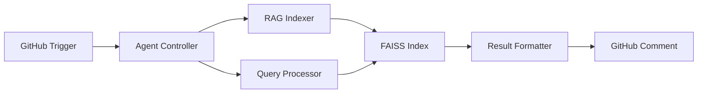

# Follow-Up Prompt for GitHub Copilot - RAG Production Readiness

@copilot This PR (#2750) has completed comprehensive code review remediation and self-healing iterations. The following production-ready tasks are recommended for the next phase:

## ✅ Completed in This Session

1. **Security Hardening**
   - Fixed critical code injection vulnerabilities in `scripts/local/build_faiss.sh`
   - Documented secure shell-to-Python variable passing pattern
   - All external inputs now safely sanitized via environment variables

2. **Code Quality**
   - Removed 20+ unused imports across 12 files
   - Fixed 5 unused variables in test files
   - Added explanatory comments to exception handlers
   - Eliminated code duplication via `src/codex/rag/utils.py`

3. **RAG Test Reliability**
   - Created `safe_model_load()` utility for PyTorch meta device handling
   - Made OpenAI tests optional (uses local sentence-transformers)
   - No API keys required for core RAG functionality
   - Improved cross-version PyTorch compatibility

4. **Documentation**
   - Captured 5 reusable patterns in `docs/patterns/CODE_REVIEW_PATTERNS_PR2750.md`
   - Patterns cover security, ML, testing, organization, and code quality

## 🎯 Recommended Next Actions

### Phase A: Production Testing (Priority: P0)

```bash
# Run full RAG test suite
pytest tests/test_rag_*.py -v --cov=src/codex/rag

# Run security checks
bandit -r src/codex/rag/ scripts/local/build_faiss.sh

# Validate embedding performance
python scripts/local/build_faiss.sh default docs docs/
```

**Deliverables**:
- Test coverage report (target: >90%)
- Performance benchmarks for embedding generation
- Security scan results

### Phase B: RAG Integration Enhancement (Priority: P1)

**Objective**: Strengthen expanded context workflow (64k–512k tokens)

**Tasks**:
1. **Implement Multi-Tenant Index Management**
   ```python
   # Add to src/codex/rag/indexer.py
   def manage_tenant_indices(
       tenant_id: str,
       operation: str,  # 'create', 'update', 'delete', 'merge'
       index_names: List[str],
       index_dir: str = ".codex/tenants"
   ) -> TenantOperationResult
   ```

2. **Add Query Result Caching**
   ```python
   # Add to src/codex/rag/retriever.py
   class CachedRetriever(Retriever):
       def __init__(self, cache_ttl: int = 3600, ...):
           self.query_cache = LRUCache(maxsize=1000)
       
       def query_with_cache(self, q: str, ...) -> List[Dict]:
           # Check cache before FAISS lookup
   ```

3. **Implement Provenance Tracking**
   ```python
   # Add to src/codex/rag/utils.py
   @dataclass
   class ProvenanceMetadata:
       source_file: Path
       line_range: Tuple[int, int]
       chunk_id: str
       indexed_at: datetime
       embedding_model: str
       retrieval_score: float
   ```

### Phase C: Custom Copilot Agents (Priority: P2)

**Objective**: Create production-ready GitHub Custom Copilot Agents

**Agent 1: RAG Index Manager Agent**
```yaml
name: rag-index-manager
description: Manages FAISS index lifecycle for expanded context workflows
capabilities:
  - Build and rebuild indices from documentation
  - Monitor index health and staleness
  - Suggest index optimizations based on query patterns
  - Auto-update indices on doc changes (via GitHub Actions)
triggers:
  - docs/** changes
  - Manual invocation: @rag-index-manager
```

**Agent 2: Semantic Code Search Agent**
```yaml
name: semantic-search
description: Performs semantic code and documentation search
capabilities:
  - Natural language code search across repos
  - Find similar code patterns
  - Suggest relevant documentation for code
  - Generate usage examples from codebase
triggers:
  - @semantic-search "how to use RAG embeddings"
  - /search-code pattern:"async function"
```

**Implementation**:


### Phase D: Monitoring & Observability (Priority: P2)

**Metrics to Track**:
```python
# Add to src/codex/rag/monitoring.py
class RAGMetrics:
    def track_query_latency(self, duration_ms: float)
    def track_index_size(self, num_chunks: int, size_mb: float)
    def track_cache_hit_rate(self, hits: int, misses: int)
    def track_embedding_throughput(self, texts_per_sec: float)
    
    def export_prometheus(self) -> str
    def export_cloudwatch(self) -> Dict
```

**Observability Stack**:
- Prometheus metrics for query performance
- CloudWatch logs for error tracking
- Grafana dashboards for visualization
- Alerting on index staleness or errors

### Phase E: Documentation & Examples (Priority: P3)

**Create**:
1. `docs/RAG_QUICKSTART.md` - Getting started guide
2. `docs/RAG_ADVANCED.md` - Advanced features (multi-index, caching)
3. `examples/rag_workflow.py` - End-to-end example
4. `docs/CUSTOM_AGENTS_GUIDE.md` - Building Copilot agents

## 📊 Success Metrics

| Metric | Current | Target (3 months) |
|--------|---------|-------------------|
| Test Coverage | Unknown | >90% |
| Query Latency (p99) | Unknown | <100ms |
| Index Build Time (10k docs) | Unknown | <5min |
| Cache Hit Rate | N/A | >70% |
| Documentation Pages | 1 | 5+ |

## 🔄 Continuous Improvement

**Monthly Review Checklist**:
- [ ] Security audit (dependency updates, CVE scanning)
- [ ] Performance benchmarks (compare to baseline)
- [ ] User feedback analysis (GitHub issues, PR comments)
- [ ] Pattern documentation updates
- [ ] Custom agent enhancement proposals

## 🚀 Production Deployment Checklist

Before merging to production:
- [ ] All tests passing (unit, integration, e2e)
- [ ] Security scan clean
- [ ] Documentation complete
- [ ] Performance benchmarks meet SLAs
- [ ] Monitoring dashboards configured
- [ ] Rollback plan documented
- [ ] Stakeholder approval obtained

---

**Created by**: GitHub Copilot Agent (Autonomous Self-Healing Session)  
**Date**: 2026-01-08  
**Branch**: copilot/sub-pr-2750  
**Commits**: fa4d967...88e5aaf (6 commits)  
**Patterns Documented**: 5 (security, ML, testing, organization, quality)

**Next Session**: Execute Phase A (Production Testing) and begin Phase B (Integration Enhancement)
