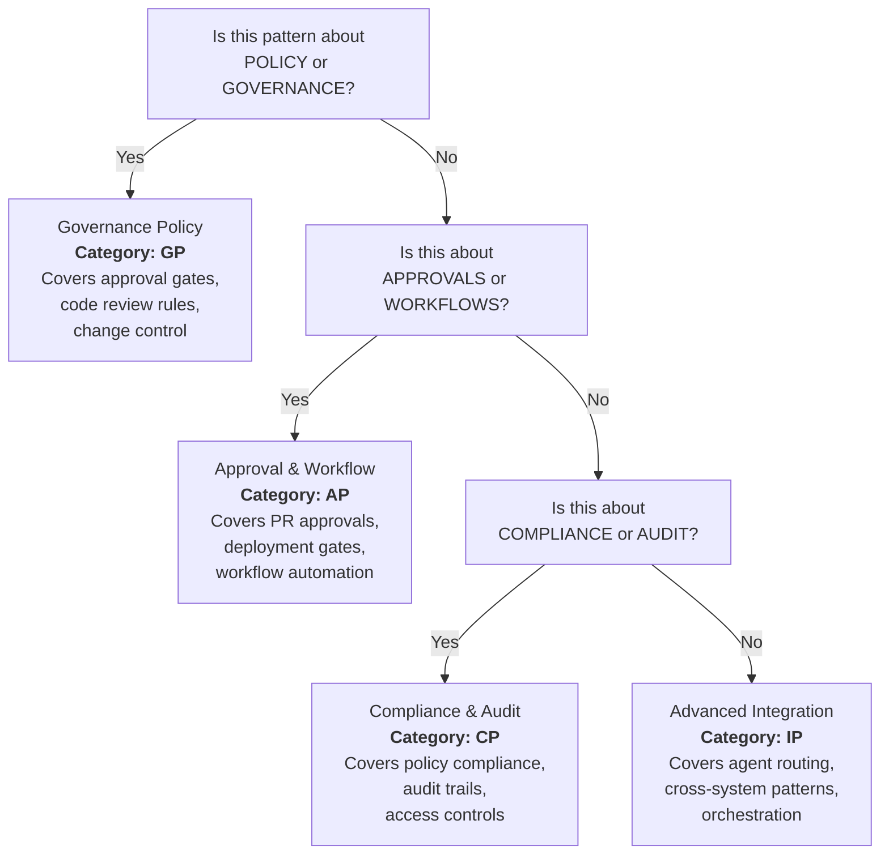

# Governance Patterns Contributor Guide
**Last Updated:** 2026-07-11
**Version:** v0.2.1

> **Purpose**: Enable contributors, custom agents, and governance teams to extend and customize governance patterns.  
> **Authority**: Phase D Tier 2 operational guidance (autonomous execution)  
> **Version**: 1.0  
> **Last Updated**: 2026-07-02

---

## Table of Contents

1. [Quick Start](#quick-start)
2. [Pattern Creation Template](#pattern-creation-template)
3. [Categorization Guide](#categorization-guide)
4. [Contribution Workflow](#contribution-workflow)
5. [Review Criteria](#review-criteria)
6. [Integration Checklist](#integration-checklist)
7. [Testing Requirements](#testing-requirements)
8. [Documentation Requirements](#documentation-requirements)
9. [Common Pitfalls](#common-pitfalls)
10. [Pattern Versioning](#pattern-versioning)

---

## Quick Start

### For Code Contributors

1. **Identify the Gap**: Review `.codex/GOVERNANCE_PATTERNS_REFERENCE.md` to see existing patterns
2. **Draft Your Pattern**: Use the [Pattern Creation Template](#pattern-creation-template) below
3. **Validate Category**: Check [Categorization Guide](#categorization-guide) to assign the correct prefix (GP/AP/CP/IP)
4. **Create a Pull Request**: Follow [Contribution Workflow](#contribution-workflow)
5. **Submit for Review**: Governance team reviews against [Review Criteria](#review-criteria)
6. **Integrate**: Once approved, integrate via [Integration Checklist](#integration-checklist)

### For Custom Agents

1. **Register Your Pattern**: Add an entry to `.codex/AGENT_REGISTRY.yaml` under `governance_patterns`
2. **Document Behavior**: Explain how your agent enforces or implements this pattern
3. **Link to Implementation**: Point to relevant agent code or configuration files
4. **Request Governance Review**: Route through governance team for approval

### For Governance Teams

1. **Audit Proposals**: Use [Review Criteria](#review-criteria) to evaluate new patterns
2. **Score Pattern Quality**: Apply the [Quality Rubric](#quality-rubric) from `GOVERNANCE_PATTERNS_REFERENCE.md`
3. **Approve or Iterate**: Provide feedback following [Common Pitfalls](#common-pitfalls) guidelines
4. **Merge to Registry**: Integrate approved patterns into operational governance

---

## Pattern Creation Template

Use this template to propose a new governance pattern:

### Markdown Template

```markdown
# Pattern: [Full Pattern Name]

**ID**: [Category]-[Sequence]  
**Category**: [Governance Policy | Approval & Workflow | Compliance & Audit | Advanced Integration]  
**Status**: [Draft | Approved | Deprecated]  
**Version**: 1.0  
**Author(s)**: [Name(s), Organization]  
**Created**: [YYYY-MM-DD]  
**Last Modified**: [YYYY-MM-DD]  

## 1. Problem Statement

### Context
[Describe the operational context where this pattern is needed. What situation triggers its use?]

### Pain Points
- [Pain point 1]
- [Pain point 2]
- [Pain point 3]

### Impact Without Pattern
[Describe the failure mode or undesirable outcome if this pattern is not applied]

## 2. Solution Summary

[2-3 sentence executive summary of the pattern]

### Design Principles
- [Principle 1]
- [Principle 2]
- [Principle 3]

## 3. Implementation Details

### Prerequisites
- [Required condition 1]
- [Required condition 2]

### Steps
1. [Step 1 with explicit action]
2. [Step 2 with explicit action]
3. [Step 3 with explicit action]

### Enforcement Mechanism
- **Type**: [Hard Block | Soft Block | Audit Only]
- **Trigger**: [What condition activates enforcement?]
- **Action**: [What happens when triggered?]
- **Override**: [Can it be overridden? If yes, by whom?]

### Configuration
[Code example showing how to configure this pattern in YAML or code]

```yaml
governance:
  pattern: [CATEGORY]-[SEQUENCE]
  enabled: true
  enforcement: [hard_block | soft_block | audit]
  # Pattern-specific config
```

## 4. Dependencies

### Prerequisites (Must Complete First)
- Pattern: [Predecessor ID]
- Reason: [Why is this pattern required first?]

### Dependents (Patterns That Depend on This)
- Pattern: [Dependent ID]
- Reason: [How does that pattern build on this?]

## 5. Examples

### Example 1: [Scenario]
[Code example showing this pattern in action]

### Example 2: [Alternative Scenario]
[Alternative code example]

## 6. Validation Checklist

- [ ] Implementation follows defined steps
- [ ] Enforcement mechanism is activated
- [ ] Configuration is correct
- [ ] Logging captures all relevant events
- [ ] Rollback procedure documented
- [ ] No manual secrets in configuration

## 7. Metrics & Observability

### Key Metrics
- **Metric 1**: [Definition and calculation]
- **Metric 2**: [Definition and calculation]

### Logging
- **Event Type**: [Log event name]
- **Fields**: [List of logged fields]
- **Sample Log Entry**: [Example]

## 8. Related Patterns

- [Related Pattern ID]: [Relationship type - extends/complements/conflicts-with]
- [Related Pattern ID]: [Relationship type]

## 9. Common Variations

### Variation A: [Name]
[Description and when to use]

### Variation B: [Name]
[Description and when to use]

## 10. Troubleshooting

### Issue: [Problem]
**Symptoms**: [What goes wrong]  
**Root Cause**: [Why it happens]  
**Resolution**: [How to fix]

### Issue: [Problem]
**Symptoms**: [What goes wrong]  
**Root Cause**: [Why it happens]  
**Resolution**: [How to fix]

## 11. Operational Runbook

### Activation
[Steps to activate this pattern in production]

### Monitoring
[How to monitor this pattern's behavior]

### Deactivation
[Steps to safely deactivate this pattern]

### Emergency Procedures
[What to do if this pattern breaks production]

## 12. References

- [Reference 1]
- [Reference 2]
- [Reference 3]
```

### Template Completion Guidance

| Section | Guidance | Example |
|---------|----------|---------|
| **ID** | Use format [CATEGORY]-[SEQUENCE]. IDs in range: GP (001-041), AP (001-030), CP (001-032), IP (001-026) | `GP-042` (if proposing new Governance Policy) |
| **Problem Statement** | Be specific. Reference actual failures or near-misses in operations. | "Three times this month, agents bypassed code review gates because the enforcement check was missing." |
| **Implementation Details** | Code must be copy-paste ready. Use actual syntax from project. | YAML with proper indentation; Python with correct imports |
| **Dependencies** | Critical for sequencing. If a pattern depends on another, document it explicitly. | AP-001 depends on GP-001 (pre-condition) |
| **Validation Checklist** | Customize to your pattern. These are test cases, not suggestions. | Each checkbox is a passing test condition |
| **Enforcement Mechanism** | Be explicit. Hard block stops execution; soft block warns; audit only logs. | Hard Block: Reject PR if approval missing |

---

## Categorization Guide

Use this decision tree to assign the correct category and sequence ID:



### Category Definitions

| Category | Prefix | Scope | Example Patterns |
|----------|--------|-------|------------------|
| **Governance Policy** | GP | Rules, gates, enforcement | GP-001: Issue Resolution, GP-002: Deferral Prevention |
| **Approval & Workflow** | AP | Approval chains, workflows | AP-001: Code Review Gate, AP-002: Deployment Approval |
| **Compliance & Audit** | CP | Compliance, auditing, logging | CP-001: Policy Compliance, CP-002: Audit Trail |
| **Advanced Integration** | IP | Agent routing, orchestration | IP-001: Agent Routing, IP-002: Cross-System Sync |

### Assigning Sequence Numbers

1. **Find the highest existing ID** in your category (e.g., GP-041 is the highest in Governance Policy)
2. **Increment by 1** (e.g., your new pattern is GP-042)
3. **Reserve sequential blocks** for related patterns (e.g., if creating a family of patterns, use consecutive IDs like AP-031, AP-032, AP-033)

---

## Contribution Workflow

This 6-step workflow ensures governance patterns are properly vetted before integration:

### Phase 1: Proposal (Days 1-2)

**Action**: Create a GitHub Discussion in the `Governance Patterns` category

**Deliverables**:
- Discussion title: `[DRAFT] Pattern Proposal: [Pattern Name]`
- Discussion body: Complete pattern proposal using the [Pattern Creation Template](#pattern-creation-template)
- Tagging: Label with `governance-pattern-proposal` and target category label (e.g., `category:governance-policy`)

**Success Criteria**:
- [ ] Pattern proposal is complete and uses template
- [ ] Problem statement is concrete (references actual failures or risks)
- [ ] No implementation details are missing
- [ ] At least 2 reviewers have been notified

**Next Step**: Proceed to Phase 2 once proposal receives initial feedback

---

### Phase 2: Initial Review (Days 2-3)

**Action**: Governance team reviews proposal against [Review Criteria](#review-criteria)

**Deliverables**:
- Feedback on clarity, completeness, and alignment with existing patterns
- Request for revisions if needed (return to Phase 1)
- Tentative approval to proceed with implementation

**Success Criteria**:
- [ ] All sections of pattern template are complete
- [ ] No conflicts with existing patterns identified (or conflicts documented)
- [ ] Team consensus on category assignment
- [ ] Implementation approach is feasible

**Next Step**: Proceed to Phase 3 if approved; return to Phase 1 if revisions needed

---

### Phase 3: Implementation (Days 3-5)

**Action**: Create branch and implement the pattern

**Deliverables**:
- Branch: `feature/governance-pattern-[ID]-[name]`
- Files modified:
  - `.codex/GOVERNANCE_PATTERNS_REFERENCE.md` (add pattern entry)
  - `.codex/GOVERNANCE_PATTERN_EXAMPLES.md` (add implementation example)
  - Code implementation files (if agent-specific)
  - Tests (unit + integration as per [Testing Requirements](#testing-requirements))

**Success Criteria**:
- [ ] Pattern documented in reference guide
- [ ] At least one code example provided
- [ ] All tests pass
- [ ] No linting errors
- [ ] Code review passes

**Next Step**: Proceed to Phase 4 once all checks pass

---

### Phase 4: Testing (Days 5-6)

**Action**: Run full test suite and validate integration

**Deliverables**:
- Test results: All unit, integration, and E2E tests pass
- Integration validation: Pattern works in real operational context
- Performance assessment: No performance regressions

**Success Criteria**:
- [ ] Unit tests pass (100% code coverage for new pattern logic)
- [ ] Integration tests pass
- [ ] E2E tests pass (pattern works with dependent patterns)
- [ ] No performance regressions
- [ ] Logging is correct and observable

**Next Step**: Proceed to Phase 5 once testing complete

---

### Phase 5: Governance Approval (Days 6-7)

**Action**: Submit for final governance team approval

**Deliverables**:
- Pull request with complete pattern implementation
- Link to original discussion from Phase 1
- Summary of changes and testing results
- Sign-off from code reviewers

**Success Criteria**:
- [ ] All tests passing in CI/CD
- [ ] Governance team approves pattern
- [ ] At least 2 domain expert sign-offs
- [ ] No security concerns raised

**Next Step**: Proceed to Phase 6 once approved

---

### Phase 6: Integration & Release (Day 7+)

**Action**: Merge to main branch and release

**Deliverables**:
- Merged pull request
- Updated `GOVERNANCE_PATTERNS_REFERENCE.md` in main branch
- Updated `GOVERNANCE_PATTERNS_CONTRIBUTOR_GUIDE.md` (if adding new categories)
- Release notes documenting new pattern
- Announcement in governance team channels

**Success Criteria**:
- [ ] PR merged to main branch
- [ ] Pattern accessible in production governance system
- [ ] Documentation updated
- [ ] Team notified and training scheduled if needed

---

## Review Criteria

Use this checklist when reviewing proposed governance patterns:

### Structural Review

| Criterion | Passes? | Notes |
|-----------|---------|-------|
| **Complete Template** | [ ] | All 12 sections filled out |
| **Clear Problem Statement** | [ ] | References specific operational failure or risk |
| **Concrete Solution** | [ ] | Solution is implementable and testable |
| **Explicit Dependencies** | [ ] | Prerequisites and dependents listed |
| **Validation Checklist** | [ ] | Includes measurable test conditions |

### Quality Review

| Criterion | Passes? | Notes |
|-----------|---------|-------|
| **Accuracy** | [ ] | Pattern correctly solves stated problem |
| **Completeness** | [ ] | Pattern covers all relevant scenarios |
| **Clarity** | [ ] | Technical and non-technical readers understand it |
| **Feasibility** | [ ] | Pattern is implementable with existing tools/skills |
| **Traceability** | [ ] | References point to supporting evidence |

### Governance Review

| Criterion | Passes? | Notes |
|-----------|---------|-------|
| **Alignment** | [ ] | Pattern aligns with governance philosophy |
| **Conflict Check** | [ ] | No conflicts with existing patterns (or conflicts documented) |
| **Risk Assessment** | [ ] | Implementation risks identified and mitigated |
| **Enforcement Clarity** | [ ] | Enforcement mechanism is explicit and testable |
| **Auditability** | [ ] | Pattern supports audit trail and compliance logging |

### Operational Review

| Criterion | Passes? | Notes |
|-----------|---------|-------|
| **Observability** | [ ] | Metrics and logging defined |
| **Runbook Complete** | [ ] | Activation, monitoring, deactivation documented |
| **Troubleshooting Guide** | [ ] | Common issues and resolutions documented |
| **Performance Impact** | [ ] | No unacceptable performance regressions |
| **Rollback Procedure** | [ ] | Safe deactivation procedure documented |

### Recommendation

- **APPROVE**: All checks pass. Pattern ready for integration.
- **APPROVE WITH CONDITIONS**: Pattern approved contingent on minor revisions (list them).
- **REQUEST REVISIONS**: Pattern needs significant work. Return to Phase 1 with feedback.
- **REJECT**: Pattern conflicts with governance philosophy or existing patterns. Recommend alternative approach.

---

## Integration Checklist

Once a pattern is approved, use this checklist to integrate it into the operational governance system:

### Documentation Integration

- [ ] Add pattern entry to `.codex/GOVERNANCE_PATTERNS_REFERENCE.md` (correct section by category)
- [ ] Add implementation example to `.codex/GOVERNANCE_PATTERN_EXAMPLES.md`
- [ ] Update pattern index in reference guide (maintain alphabetical order within category)
- [ ] Update "Related Patterns" sections in affected existing patterns
- [ ] Update interaction matrix if pattern has new dependencies

### Code Integration

- [ ] Merge feature branch to `main` (fast-forward or squash as appropriate)
- [ ] Code deployed to production governance system
- [ ] Version tag created: `governance-pattern-[ID]-v[VERSION]` (e.g., `governance-pattern-GP-042-v1.0`)
- [ ] Release notes published documenting pattern addition

### Agent Registration

- [ ] Add pattern to `.codex/AGENT_REGISTRY.yaml` under `governance_patterns` section
- [ ] Link to relevant custom agents that implement or enforce this pattern
- [ ] Update agent documentation to reference new pattern (if agent-specific)

### Monitoring Setup

- [ ] Metrics collection enabled for this pattern
- [ ] Alerting configured (if enforcement-critical)
- [ ] Dashboard created (if pattern is heavily used)
- [ ] Log aggregation configured for audit trail

### Team Communication

- [ ] Notification sent to governance team with link to pattern documentation
- [ ] Training scheduled if pattern requires team awareness
- [ ] FAQ documentation created (if pattern is complex)
- [ ] Runbook added to internal governance playbooks

### Validation Post-Integration

- [ ] Pattern works correctly in production
- [ ] No unexpected side effects on other patterns or systems
- [ ] Performance metrics within acceptable range
- [ ] Logging and observability working as expected

---

## Testing Requirements

Governance patterns must have comprehensive test coverage. Use this matrix to plan tests:

### Unit Tests

**Purpose**: Verify individual pattern logic in isolation

**Requirements**:
- Test each validation condition in the pattern
- Test enforcement mechanism (hard block, soft block, audit)
- Test configuration parsing and validation
- Aim for 100% code coverage of pattern logic

**Example**:
```python
import pytest
from governance import GovernancePattern, EnforcementLevel

def test_pattern_gp_042_validation():
    """Unit test: Validate pattern GP-042 enforces rule correctly"""
    pattern = GovernancePattern(id="GP-042", name="Example Pattern")
    
    # Test valid case
    assert pattern.validate({"rule": "enforced"}) == True
    
    # Test invalid case (should trigger hard block)
    with pytest.raises(GovernanceViolationError):
        pattern.validate({"rule": "disabled"})

def test_pattern_gp_042_enforcement():
    """Unit test: Verify enforcement mechanism"""
    pattern = GovernancePattern(id="GP-042", enforcement=EnforcementLevel.HARD_BLOCK)
    
    # Should raise exception for violations
    with pytest.raises(PatternViolationException):
        pattern.enforce({"status": "violation"})
```

### Integration Tests

**Purpose**: Verify pattern works with dependent patterns and system components

**Requirements**:
- Test pattern interaction with prerequisites (patterns it depends on)
- Test pattern behavior with dependents (patterns depending on it)
- Test integration with governance enforcement system
- Test logging and audit trail generation

**Example**:
```python
import pytest
from governance import GovernanceSystem, PatternGP042, PatternGP001

def test_pattern_gp_042_with_prerequisites():
    """Integration test: GP-042 works with prerequisite GP-001"""
    system = GovernanceSystem()
    
    # Enable prerequisite pattern
    gp_001 = PatternGP001()
    system.register_pattern(gp_001)
    
    # Enable pattern under test
    gp_042 = PatternGP042()
    system.register_pattern(gp_042)
    
    # Verify both patterns work together
    result = system.evaluate_governance({"test": "data"})
    assert result.pattern_gp_001_passed
    assert result.pattern_gp_042_passed

def test_pattern_gp_042_audit_logging():
    """Integration test: Pattern generates correct audit logs"""
    system = GovernanceSystem()
    pattern = PatternGP042()
    system.register_pattern(pattern)
    
    # Execute pattern logic
    system.evaluate_governance({"test": "data"})
    
    # Verify audit log contains expected entries
    logs = system.get_audit_logs(pattern_id="GP-042")
    assert len(logs) > 0
    assert "enforcement_decision" in logs[0]
```

### End-to-End (E2E) Tests

**Purpose**: Verify pattern works in full operational context

**Requirements**:
- Test pattern in realistic governance scenario
- Test with other patterns enabled
- Test with mock agents and systems
- Test complete enforcement flow from trigger to logging

**Example**:
```python
import pytest
from governance import FullGovernanceSystem
from mock_agents import MockCodeReviewAgent

def test_pattern_gp_042_e2e():
    """E2E test: GP-042 works in full governance context"""
    system = FullGovernanceSystem()
    agent = MockCodeReviewAgent()
    
    # Setup realistic scenario
    pr = MockPullRequest(id="PR-123", status="needs_review")
    
    # Execute governance flow with pattern enabled
    result = system.process_pull_request(pr, agent)
    
    # Verify pattern enforcement
    assert result.pattern_enforcements["GP-042"]["status"] == "passed"
    assert pr.comment_count > 0  # Pattern should add enforcement comments
    
    # Verify audit trail
    audit = system.get_audit_trail(pr_id="PR-123")
    assert "GP-042" in str(audit)
```

### Test Execution

Run tests before submitting PR:

```bash
# Unit tests
pytest tests/governance/patterns/test_gp_042.py -v --cov

# Integration tests
pytest tests/governance/integration/test_pattern_integration.py -v --cov

# E2E tests
pytest tests/governance/e2e/test_full_flow.py -v

# All tests with coverage report
pytest tests/governance/ --cov --cov-report=html
```

---

## Documentation Requirements

Governance patterns must be thoroughly documented. Use this checklist:

### Reference Guide Entry

Required for `.codex/GOVERNANCE_PATTERNS_REFERENCE.md`:
- [ ] Pattern ID and name
- [ ] Category (GP/AP/CP/IP)
- [ ] One-sentence description
- [ ] Link to examples
- [ ] Relationships to other patterns
- [ ] Enforcement level (Hard Block / Soft Block / Audit Only)

### Implementation Example

Required for `.codex/GOVERNANCE_PATTERN_EXAMPLES.md`:
- [ ] Clear scenario/use case
- [ ] Complete, runnable code example
- [ ] Step-by-step walkthrough with annotations
- [ ] Validation checklist
- [ ] Expected output/behavior

### Operational Runbook

Required for team awareness:
- [ ] Activation steps (how to enable in production)
- [ ] Monitoring and alerting (what to watch)
- [ ] Troubleshooting guide (common issues and fixes)
- [ ] Deactivation steps (how to safely disable)
- [ ] Emergency procedures (what to do if pattern breaks)

### Comments and Docstrings

Required for code implementation:
- [ ] Docstring on pattern class/function
- [ ] Inline comments on complex logic
- [ ] References to pattern ID and documentation
- [ ] Examples in docstrings (if code-based)

**Example Docstring**:
```python
class PatternGP042:
    """
    Governance Pattern GP-042: [Pattern Name]
    
    Enforces: [What this pattern enforces]
    
    References:
    - Pattern ID: GP-042
    - Documentation: .codex/GOVERNANCE_PATTERNS_REFERENCE.md (section GP-042)
    - Example: .codex/GOVERNANCE_PATTERN_EXAMPLES.md (Example N)
    
    Enforcement Level: Hard Block
    
    Prerequisites:
    - GP-001: [Prerequisite pattern]
    
    Usage:
        pattern = PatternGP042()
        result = pattern.evaluate(governance_context)
        if result.violation:
            # Handle violation
    """
```

---

## Common Pitfalls

Avoid these mistakes when creating governance patterns:

### Pitfall 1: Vague Problem Statements

**Problem**: Pattern addresses a general concern but doesn't tie to specific failures.

**Example of Pitfall**: "We should improve code quality"  
**Example of Fix**: "Three code reviews this month missed security vulnerabilities because reviewers didn't check for hardcoded credentials. This pattern requires automated scanning before approval."

**Prevention**:
- Reference specific failures or near-misses
- Include metrics (# of incidents, cost, risk assessment)
- Link to related issues or incident reports

---

### Pitfall 2: Vague Enforcement Mechanism

**Problem**: Pattern doesn't specify what happens when rule is violated.

**Example of Pitfall**: "Code review should happen"  
**Example of Fix**: "Code review is a Hard Block. If PR lacks approval from authorized reviewer, reject PR automatically and notify submitter with link to review runbook."

**Prevention**:
- Always specify: Hard Block / Soft Block / Audit Only
- Define the exact action taken (reject, warn, log)
- Specify who can override (if applicable)
- Include error message shown to user

---

### Pitfall 3: Missing Dependencies

**Problem**: Pattern depends on another pattern but doesn't document it.

**Example of Pitfall**: AP-001 (Code Review Approval) references review process without noting it depends on GP-001 (Issue Resolution).  
**Example of Fix**: AP-001 section clearly states "Prerequisites: GP-001. Code review gate requires issue context from GP-001."

**Prevention**:
- Map all upstream dependencies (what must be true first)
- Map all downstream dependents (what builds on this)
- Test with prerequisites disabled to verify dependency is real

---

### Pitfall 4: Implementation Assumes One Context

**Problem**: Pattern only works in one scenario but should be more general.

**Example of Pitfall**: Pattern documents GitHub Actions workflow but should apply to all CI/CD systems.  
**Example of Fix**: Pattern documents generic governance principle with examples for GitHub Actions, GitLab CI, and local execution.

**Prevention**:
- Separate "principle" from "implementation"
- Provide examples for multiple contexts
- Use abstract configuration that works with different systems

---

### Pitfall 5: No Validation Checklist

**Problem**: Pattern is vague about how to verify it's working.

**Example of Pitfall**: Pattern says "Monitor code review quality" without saying how.  
**Example of Fix**: Pattern includes checklist: "Verify enforcement: [ ] Review comments present, [ ] Violations logged, [ ] Metrics populated"

**Prevention**:
- Add validation checklist to pattern template
- Each item must be objectively verifiable (not subjective)
- Include concrete metrics, not fuzzy indicators

---

### Pitfall 6: Hardcoded Secrets or Credentials

**Problem**: Pattern examples include real secrets (API keys, passwords, tokens).

**Example of Pitfall**: Example shows `api_key: sk-1234567890abcdef`  
**Example of Fix**: Example shows `api_key: ${API_KEY_PLACEHOLDER}` with note "Replace with your actual API key from secure store"

**Prevention**:
- Use placeholder values (${PLACEHOLDER})
- Never include production credentials in examples
- Use clear comments pointing to secure credential management
- Run secret scanning on all documentation before merge

---

## Pattern Versioning

Governance patterns use semantic versioning to track changes:

### Version Format

`MAJOR.MINOR.PATCH`

- **MAJOR**: Breaking changes (enforcement logic changes, prerequisite changes)
- **MINOR**: Non-breaking additions (new examples, additional configuration options)
- **PATCH**: Bug fixes and clarifications (typos, clarified documentation)

### Versioning Rules

| Change Type | Example | Version |
|-------------|---------|---------|
| Initial release | Pattern created and approved | 1.0 |
| Add example | Include new implementation example | 1.1 |
| Clarify documentation | Reword confusing section | 1.0.1 |
| Add configuration option | New config parameter (optional) | 1.1 |
| Change enforcement | Hard Block → Soft Block | 2.0 |
| Add prerequisite | Pattern now depends on new pattern | 2.0 |
| Bug fix | Enforcement logic corrected | 1.0.1 |

### Release Process

1. **Version Bump**: Update version in pattern documentation
2. **Changelog Entry**: Add entry to pattern changelog: "Pattern GP-042 v1.1: Added example for multi-repo scenario"
3. **Git Tag**: Create tag: `governance-pattern-GP-042-v1.1`
4. **Release Notes**: Document changes in release notes
5. **Notification**: Notify governance team of breaking changes (MAJOR versions)

### Backward Compatibility

- **MINOR and PATCH** versions must be backward compatible
- **MAJOR** versions may introduce breaking changes (document impact on dependent patterns)
- Deprecation period: 30 days notice before removing pattern

---

## Appendix: Pattern Template Quick Reference

Save this for quick access:

```markdown
# Pattern: [NAME]

**ID**: [CATEGORY]-[SEQUENCE]  
**Category**: [GP|AP|CP|IP]  
**Status**: [Draft|Approved|Deprecated]  
**Version**: 1.0  

## Problem Statement
[Context + Pain Points + Impact]

## Solution Summary
[2-3 sentence summary]

## Implementation Details
[Prerequisites, Steps, Enforcement, Configuration]

## Dependencies
[Prerequisites + Dependents]

## Examples
[At least 2 examples with code]

## Validation Checklist
[Measurable test conditions]

## Metrics & Observability
[Key metrics + Logging]

## Troubleshooting
[Common issues + Solutions]

## Operational Runbook
[Activation + Monitoring + Deactivation]
```

---

## Getting Help

### Questions About Pattern Creation?

- **Process Questions**: Review [Contribution Workflow](#contribution-workflow)
- **Template Questions**: See [Pattern Creation Template](#pattern-creation-template)
- **Category Questions**: Check [Categorization Guide](#categorization-guide)

### Questions About Existing Patterns?

- **Pattern List**: See `.codex/GOVERNANCE_PATTERNS_REFERENCE.md`
- **Examples**: See `.codex/GOVERNANCE_PATTERN_EXAMPLES.md`
- **Pattern Interactions**: See interaction matrix in Reference Guide

### Get in Touch

- **Governance Team**: Reach out on `#governance` Slack channel
- **GitHub Discussions**: Post questions in Governance Patterns category
- **Issues**: Create issue with label `governance-patterns` if you find bugs or documentation gaps

---

## Document History

| Version | Date | Author | Changes |
|---------|------|--------|---------|
| 1.0 | 2026-07-02 | Phase D Tier 2 | Initial creation; comprehensive contributor guidance for 133+ governance patterns |

---

**Last Updated**: 2026-07-02 | **Status**: Active | **Maintained By**: Governance Team
